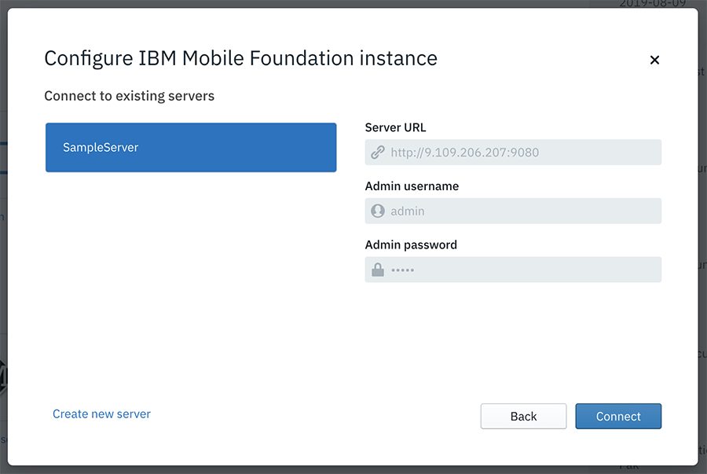
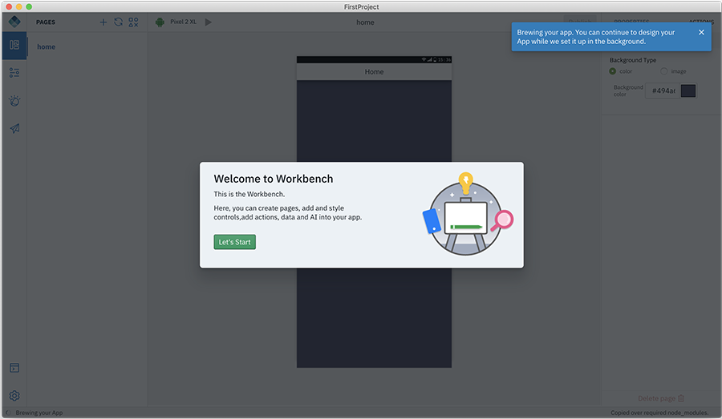

<!-- NLS_CHARSET=UTF-8 -->
## Présentation
{: #getting-started }

Lancez Digital App Builder comme suit :

* Sous **MacOS**, cliquez deux fois sur l'**icône IBM Digital App Builder** pour ouvrir Digital App Builder.
* Sous **Windows**, lancez Digital App Builder en sélectionnant **Démarrer > Programmes > IBM Digital App Builder**.

>**Remarque** : Si vous ouvrez Digital App Builder pour la première fois, cliquez sur **Accepter** pour accepter la **Licence d'utilisation d'IBM Digital App Builder** dans l'écran clignotant pour continuer. Une fois que vous avez accepté le contrat de licence, la **Vérification des prérequis** s'exécute automatiquement pour la première fois. En l'absence d'erreurs, cliquez sur **OK** pour continuer ; sinon, corrigez les erreurs et redémarrez Digital App Builder.

Vous pouvez **Créer une application**, **Ouvrir une application** ou utiliser les modèles disponibles pour générer votre application.
>**Remarque** : Les applications récemment créées s'affichent sous la section **Récent**. Dans le cas d'une nouvelle installation, la section **Récent** n'apparaît pas.

## Créer une application
{: #create-new-app }

>**Remarque** : Deux modes sont à votre disposition pour la création d'une nouvelle application : le mode **Conception** vous aide à concevoir l'application grâce à une méthode de glisser-déposer et le mode **Code** vous permet de concevoir l'application dans un éditeur de code.

La création d'une nouvelle application prend en charge deux infrastructures : Ionic/Angular et React Native.

Procédez comme suit pour créer une nouvelle application.

1. Choisissez l'infrastructure pour votre application.

   

   Quelle que soit l'infrastructure prise en charge, vous pouvez choisir les plateformes cible à l'étape suivante. Des plateformes supplémentaires peuvent être ajoutées au projet ultérieurement à partir des paramètres.

   >**Remarque **: Les projets construits à l'aide de l'infrastructure Ionic peuvent être choisis pour fonctionner dans le mode **Conception** ou le mode **Code**. Cependant, les projets construits à l'aide de l'infrastructure React Native ne fonctionneront qu'en mode **Code**.

2. Cliquez sur l'icône **Créer une application** dans le tableau de bord de Builder. La fenêtre **Sélectionnez un canal** s'affiche.

    

3. Sélectionnez le canal pour lequel vous souhaitez développer l'application en cliquant sur l'icône associée. Vous pourrez ajouter d'autres canaux à la même application ultérieurement.

    * **Android** : sélectionnez cette option si vous créez une application Android.
    * **iOS** : sélectionnez cette option si vous créez une application iOS.
        >**Remarque** : Vous pouvez générer et exécuter les applications iOS uniquement sur MacOS.
    * **Web** : sélectionnez cette option si vous créez une application pour le Web.
    * **PWA** : sélectionnez cette option si vous créez une application Progressive Web App.

4. Lorsque le serveur de développement intégré a démarré et fonctionne, les détails du serveur sont extraits automatiquement. Dans le cas où le serveur de développement ne fonctionnerait pas, vous pouvez vous connecter à votre propre instance de serveur IBM Mobile Foundation créée sur IBM Cloud ou en local.

    La fenêtre **Configurer l'instance IBM Mobile Foundation** vous permet de sélectionner un serveur existant ou d'en créer un nouveau.

    >**Remarque** : Pour obtenir facilement une instance Mobile Foundation Server, vous pouvez la mettre à disposition sur IBM Cloud. Pour savoir comment mettre à disposition et utiliser Mobile Foundation Server sur IBM Cloud, consultez la documentation [ici](https://cloud.ibm.com/docs/services/mobilefoundation?topic=mobilefoundation-getting-started).

    

    La fenêtre **Configurer l'instance IBM Mobile Foundation** affiche la liste des instances de serveur Mobile Foundation que vous avez définies précédemment. Lors de la sélection du serveur, les options **URL du serveur**, **Nom d'utilisateur de l'administrateur** et **Mot de passe de l'administrateur** s'affichent. Pour définir un nouveau serveur, vous pouvez cliquer sur le lien **Créer un serveur**. La nouvelle fenêtre **Configurer l'instance IBM Mobile Foundation** s'ouvre.

    

    * Entrez les détails de la nouvelle instance IBM Mobile Foundation : **Nom du serveur**, **URL du serveur**, **Nom d'utilisateur de l'administrateur** et **Mot de passe de l'administrateur**.
        >**Remarque** : Vous pouvez obtenir l'URL et les données d'identification de connexion du serveur dans le tableau de bord Mobile Foundation de l'instance de serveur sélectionnée.
    * Si vous le souhaitez, indiquez un **Nom d'utilisateur** (nom d'utilisateur du client confidentiel) et un **Mot de passe de l'administrateur** pour prévisualiser les données dans le visualiseur de données.
    * Cliquez sur **Se connecter**.

5. Une fois la connexion établie, la fenêtre **Créer une application** s'ouvre et vous permet de sélectionner une définition d'application existante que vous avez créée ou d'en créer une nouvelle en indiquant les détails appropriés.
    * Dans le cas d'une nouvelle application :
        * Indiquez le **Nom** de l'application, l'**Emplacement** de stockage des fichiers de projet, le **Projet/ID de bundle** et la **Version** de l'application.

            

        * Cliquez sur **Créer** pour créer l'application. Les fenêtres **Sélectionner le mode** s'affichent.

            

        * Sélectionnez le mode Conception ou Code et cliquez sur **Commencer**.
            * Mode Conception : vous permet de créer l'application en faisant glisser et en déposant des contrôles sur un canevas.
            * Mode Code : vous permet de créer l'application en rédigeant du code ou en utilisant des fragments de code.
        * Si vous avez sélectionné le mode Conception, cliquez sur **Commencer** pour afficher l'écran contextuel **Bienvenue dans le plan de travail**.
                  
        * Cliquez sur **C'est parti !** pour ouvrir l'espace de travail de Digital App Builder et créer une application en mode Conception.

            

        * Si vous avez sélectionné le mode Code, cliquez sur **Commencer** pour afficher l'espace de travail de Digital App Builder et créer une application en mode Code.

            

## Ouvrir une application existante
{: #open-an-existing-app }

>**Remarque** : Vous ne pouvez ouvrir qu'une application existante développée avec Digital App Builder. Par défaut, l'application s'ouvre en mode Conception.

Vous pouvez ouvrir une application existante en procédant de l'une des manières suivantes :

* Cliquez sur **Ouvrir une application** dans la page d'accueil pour ouvrir l'explorateur de fichiers. Accédez au dossier de projet de l'application et cliquez sur **OK** pour ouvrir l'application et continuer à la modifier.
* Si vous le souhaitez, vous pouvez ouvrir l'application à partir de la liste des applications récentes, le cas échéant, en cliquant deux fois sur son nom.

    >**Remarque** : Si vous avez sélectionné un projet existant développé en mode Conception, il s'ouvre en mode Conception. Si vous avez sélectionné un projet développé en mode Code, il s'ouvre en mode Code.

* Sélectionnez une application existante et indiquez l'**Emplacement** de stockage des fichiers de projet, le **Projet/ID de bundle** et la **Version** de l'application.
* Cliquez sur **Ouvrir**. Les fenêtres **Sélectionner le mode** s'affichent.

    

* Sélectionnez le mode Conception ou le mode Code et cliquez sur **Commencer**.
    * Mode Conception : vous permet de créer l'application en faisant glisser et en déposant des contrôles sur un canevas.
    * Mode Code : vous permet de créer l'application en rédigeant du code ou en utilisant des fragments de code.
* Si vous avez sélectionné le mode Conception, cliquez sur **Commencer** pour afficher l'espace de travail de Digital App Builder et mettre à jour une application existante.

    

* Si vous avez sélectionné le mode Code, cliquez sur **Commencer** pour afficher l'espace de travail de Digital App Builder et mettre à jour une application existante.

    
