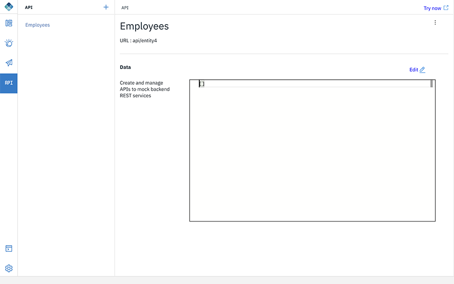

<!-- NLS_CHARSET=UTF-8 -->

## API fictive
{: #dab-mock-api }

Lorsque vous développez une application mobile, le système de back end réel à partir duquel les données doivent être extraites n'est pas facilement disponible pour les développeurs d'applications mobiles. Dans ce cas, il est utile de disposer d'un serveur fictif qui renvoie les mêmes données que le système de back end réel. La fonction d'API fictive de Digital App Builder vous y aide. Le développeur d'applications mobiles peut facilement simuler le serveur en ne fournissant que des données JSON.

>**Remarque** : Cette fonction est disponible uniquement en mode Code.

Pour créer et gérer des API afin de simuler des services REST de back end, procédez comme suit :

1. Ouvrez votre projet d'application en mode Code. 
2. Sélectionnez **API**. Cliquez sur **Ajouter une API**.
    

3. Dans la fenêtre qui s'affiche, entrez un nom pour l'API et cliquez sur **Ajouter**. 

4. L'API créée s'affiche, avec l'URL générée automatiquement.
    

5. Cliquez sur **Editer**. Indiquez les données à renvoyer lors de l'appel de cette API et cliquez sur **Sauvegarder**. Par exemple : 

    ```
    [
      {
        "firstName": "John",
        "lastName": "Doe",
        "title": "Director of Marketing",
        "office": "D531"
      },
      {
        "firstName": "Don",
        "lastName": "Joe",
        "title": "Vice President,Sales",
        "office": "B2600"
      }
    ]
    ```

    

>**Remarque** : Si vous voulez tester rapidement l'API, cliquez sur **Essayer maintenant**. La documentation Swagger s'ouvre dans le navigateur par défaut et vous permet de tester les API.

### Utilisation des API fictives dans l'application
{: #dab-mock-api-consuming }

1. En mode Code, faites glisser et déposez le fragment de code **Appel d'API** à partir de la section **COEUR MOBILE**.
2. Editez le code pour modifier l'URL et pointez vers le noeud final de l'API fictive. Par exemple :

    ```
     var resourceRequest = new WLResourceRequest(
         "/adapters/APIProject/api/entity4",
         WLResourceRequest.GET,
         { "useAPIProxy": false }
     );
     resourceRequest.send().then(
         function(response) {
             alert("Success: " + response.responseText);
         },
         function(response) {
             alert("Failure: " + JSON.stringify(response));
         }
     );
    ```
 
