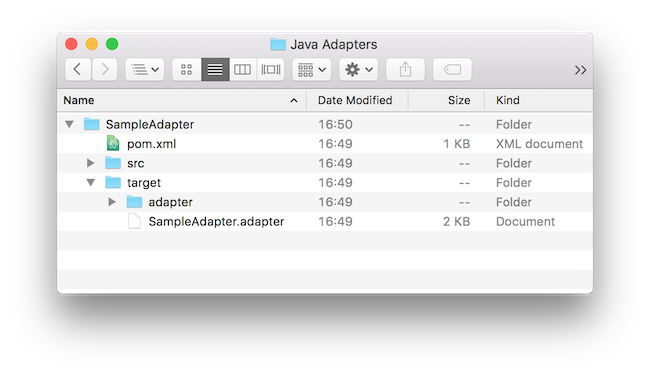

<!-- NLS_CHARSET=UTF-8 -->
## 概説
{: #overview }
アダプターを作成するには、Maven コマンドまたは {{ site.data.keys.mf_cli }} を使用できます (Maven がインストールされ、構成されているかどうかによって異なります)。 その後、任意の IDE (Eclipse や IntelliJ など) を使用して、アダプター・コードを編集し、ビルドすることができます。 このチュートリアルでは、Maven および {{ site.data.keys.mf_cli }} を使用して **Java アダプターまたは JavaScript アダプター**を作成、ビルド、およびデプロイする方法について説明します。 Eclipse IDE または IntelliJ IDE を使用してアダプターの作成およびビルドを行う方法については、[Eclipse でのアダプターの開発](../developing-adapters)チュートリアルを参照してください。

**前提条件:** 最初に必ず、[アダプターの概説](../)をお読みください。

#### ジャンプ先
{: #jump-to }
* [Maven のインストール](#install-maven)
* [{{ site.data.keys.mf_cli }} を使用したアダプターの作成](#creating-adapters-using-mobilefirst-cli)
* [{{ site.data.keys.mf_cli }} のインストール](#install-mobilefirst-cli)
* [アダプターの作成](#creating-an-adapter)
* [Maven アーキタイプを使用したアダプターの作成](#creating-adapters-using-maven-archetype-adapter-maven-archetype)
* [ファイル構造](#file-structure)
* [アダプターのビルドとデプロイ](#build-and-deploy-adapters)
* [依存関係](#dependencies)
* [単一の Maven プロジェクトへのアダプターのグループ化](#grouping-adapters-in-a-single-maven-project)
* [{{ site.data.keys.mf_console }}を使用したアダプターのダウンロードまたはデプロイ](#downloading-or-deploying-adapters-using-mobilefirst-operations-console)
* [アダプター Maven プロジェクトの更新](#updating-the-adapter-maven-project)
* [オフライン作業](#working-offline)
* [次に使用するチュートリアル](#tutorials-to-follow-next)

## Maven のインストール
{: #install-maven }
アダプターを作成するには、まず Maven をダウンロードしてインストールする必要があります。 [Apache Maven Web サイト](https://maven.apache.org/)に移動し、Maven のダウンロードおよびインストール方法の手順に従ってください。

## {{ site.data.keys.mf_cli }}を使用したアダプターの作成
{: #creating-adapters-using-mobilefirst-cli }

### {{ site.data.keys.mf_cli }} のインストール
{: #install-mobilefirst-cli }
[ダウンロード]({{site.baseurl}}/downloads/)ページのインストール手順に従って {{ site.data.keys.mf_cli }} をインストールします。  
**前提条件:** Developer CLI を使用してアダプターを作成するには、Maven がインストールされている必要があります。

### アダプターの作成
{: #creating-an-adapter }
Maven アダプター・プロジェクトを作成するには、`mfpdev adapter create` コマンドを使用します。
コマンドを対話式で実行するか直接実行するかを選択することができます。

#### 対話モード
{: #interactive-mode }
1. **コマンド・ライン**・ウィンドウを開いて、以下のコマンドを実行します。

   ```bash
   mfpdev adapter create
   ```

2. アダプター名を入力してください。 以下に例を示します。

   ```bash
   ? Enter Adapter Name: SampleAdapter
   ```

3. 矢印キーと Enter キーを使用して、アダプター・タイプを選択します。

   ```bash
   ? Select Adapter Type:
      HTTP
      SQL
   ❯ Java
   ```
  * JavaScript HTTP アダプターを作成するには、`HTTP` を選択します。
  * JavaScript SQL アダプターを作成するには、`SQL` を選択します。  
  * Java アダプターを作成するには、`Java` を選択します。

4. アダプター・パッケージを入力します (このオプションは Java アダプターの場合にのみ有効です)。 以下に例を示します。

   ```bash
   ? Enter Package: com.mypackage
   ```

5. ビルドする Maven プロジェクトの[グループ ID](https://maven.apache.org/guides/mini/guide-naming-conventions.html) を入力します。 以下に例を示します。

   ```bash
   ? Enter Group ID: com.mycompany
   ```

#### 直接モード
{: #direct-mode }
プレースホルダーを実際の値で置き換えて、コマンドを実行します。

```bash
mfpdev adapter create <adapter_name> -t <adapter_type> -p <adapter_package_name> -g <maven_project_groupid>
```

## Maven アーキタイプ「adapter-maven-archetype」を使用したアダプターの作成
{: #creating-adapters-using-maven-archetype-adapter-maven-archetype }

「adapter-maven-archetype」は、{{ site.data.keys.product }} 提供のアーキタイプで、[Maven アーキタイプ・ツールキット](https://maven.apache.org/guides/introduction/introduction-to-archetypes.html)に基づいていて、Maven でアダプター Maven プロジェクトを作成するために使用されます。

Maven アダプター・プロジェクトを作成するには、`archetype:generate` Mavenコマンドを使用します。 このコマンドを実行すると、Maven は、アダプター Maven プロジェクトを生成するために必要なファイルをダウンロードします (または前に説明したローカル・リポジトリーを使用します)。

コマンドを対話式で実行するか直接実行するかを選択することができます。

#### 対話モード
{: #interactive-mode-archetype }

1. **コマンド・ライン**・ウィンドウから、選択した場所にナビゲートします。  
   これは、Maven プロジェクトが生成される場所でもあります。

2. **DarchetypeArtifactId** プレースホルダーを実際の値で置き換えて、実行します。

   ```bash
   mvn archetype:generate -DarchetypeGroupId=com.ibm.mfp -DarchetypeArtifactId=replace-with-the-adapter-type-artifact-ID
   ```
   
  * `アーキタイプ・グループ ID` およびアーキタイプ・バージョンは、アーキタイプを識別するための必須パラメーターです。
  * `アーキタイプ成果物 ID` は、アダプター・タイプを識別するための必須パラメーターです。
     * Java アダプターを作成するには、`adapter-maven-archetype-java` を使用します。
     * JavaScript HTTP アダプターを作成するには、`adapter-maven-archetype-http` を使用します。
     * JavaScript SQL アダプターを作成するには、`adapter-maven-archetype-sql` を使用します。  

3. ビルドする Maven プロジェクトの[グループ ID](https://maven.apache.org/guides/mini/guide-naming-conventions.html) を入力します。 以下に例を示します。

   ```bash
   Define value for property 'groupId': : com.mycompany
   ```

4. Maven プロジェクトの成果物 ID を入力します。**この ID は、後でアダプター名としても使用されます**。 以下に例を示します。

   ```bash
   Define value for property 'artifactId': : SampleAdapter
   ```

5. Maven プロジェクトのバージョンを入力します (デフォルトは `1.0-SNAPSHOT` です)。 以下に例を示します。

   ```bash
   Define value for property 'version':  1.0-SNAPSHOT: : 1.0
   ```

6. アダプターのパッケージ名を入力します (デフォルトは `groupId` です)。 以下に例を示します。

   ```bash
   Define value for property 'package':  com.mycompany: : com.mypackage
   ```

7. `y` を入力して確認します。

   ```bash
   Confirm properties configuration:
   groupId: com.mycompany
   artifactId: SampleAdapter
   version: 1.0
   package: com.mypackage
   archetypeVersion: 8.0.0
   Y: : y
   ```

#### 直接モード
{: #direct-mode-archetype }
プレースホルダーを実際の値で置き換えて、コマンドを実行します。

```bash
mvn archetype:generate -DarchetypeGroupId=com.ibm.mfp -DarchetypeArtifactId=<adapter type artifact ID> -DgroupId=<maven_project_groupid> -DartifactId=<maven_project_artifactid>  -Dpackage=<adapter_package_name>
```

> `archetype:generate` コマンドについて詳しくは、[Maven の資料](http://maven.apache.org/)を参照してください。

## ファイル構造
{: #file-structure }
アダプターを作成すると、結果は **src** フォルダーおよび **pom.xml** ファイルが含まれた Mavenプロジェクトになります。


## アダプターのビルドとデプロイ
{: #build-and-deploy-adapters }

### ビルド
{: #build }

* **{{ site.data.keys.mf_cli }} を使用する場合** - プロジェクトのルート・フォルダーから `adapter build` コマンドを実行します。
    
  ```bash
  mfpdev adapter build
  ```
    
* **Maven を使用する場合** - `install` コマンドを実行して Maven プロジェクトをビルドするたびに、アダプターがビルドされます。

  ```bash
  mvn install
  ```

### すべてビルド
{: #build-all }
ファイル・システム・フォルダー内に複数のアダプターがあり、それらをすべてビルドするには、以下を使用します。

```bash
mfpdev adapter build all
```

結果は **.adapter** アーカイブ・ファイルになります。このファイルは、各アダプターの**ターゲット**・フォルダーに入っています。



### デプロイ
{: #deploy }

1. **pom.xml** ファイルには以下の `properties` が含まれます。

   ```xml
   <properties>
    	<!-- parameters for deploy mfpf adapter -->
    	<mfpfUrl>http://localhost:9080/mfpadmin</mfpfUrl>
    	<mfpfUser>admin</mfpfUser>
    	<mfpfPassword>admin</mfpfPassword>
    	<mfpfRuntime>mfp</mfpfRuntime>
   </properties>
   ```
   
   * **localhost:9080** を、{{ site.data.keys.mf_server }} IP アドレスおよびポート番号で置き換えます。
   * **オプション**。 **mfpfUser** および **mfpfPassword** のデフォルト値を、管理ユーザー名およびパスワードで置き換えます。
   * **オプション**。 **mfpfRuntime** のデフォルト値をランタイム名で置き換えます。
2. プロジェクトのルート・フォルダーから deploy コマンドを実行します。
 * **{{ site.data.keys.mf_cli }} を使用する場合**:

   ```bash
   mfpdev adapter deploy -x
   ```
   
   `-x` オプションを指定した場合、アダプターは、アダプターの **pom.xml** ファイルで指定された {{ site.data.keys.mf_server }} にデプロイされます。  
   このオプションを使用しない場合、CLI は CLI 設定で指定されたデフォルトのサーバーを使用します。
    
   > 他の CLI デプロイメント・オプションについては、コマンド `mfpdev help adapter deploy` を実行してください。
   
 * **Maven を使用する場合**:

   ```bash
   mvn adapter:deploy
   ```

### すべてデプロイ
{:# deploy-all }
ファイル・システム・フォルダー内に複数のアダプターがあり、それらをすべてデプロイするには、以下を使用します。

```bash
mfpdev adapter deploy all
```

> <span class="glyphicon glyphicon-info-sign" aria-hidden="true"></span> **ヒント:** 単一コマンド `mvn install adapter:deploy` を使用して、アダプターを作成してデプロイすることもできます。

### 別のランタイムへのデプロイ
{: #deploying-to-different-runtimes }
複数のランタイムを実行する場合、[別のランタイムへのアプリケーションの登録とアダプターのデプロイ](../../installation-configuration/production/server-configuration/#registering-applications-and-deploying-adapters-to-different-runtimes)を参照してください。

## 依存関係
{: #dependencies }
外部ライブラリーをアダプターで使用するには、次のいずれかの推奨手順に従ってください。

#### ローカル依存関係の追加
{: #adding-a-local-dependency }

1. ルートの Maven プロジェクト・フォルダーの下に **lib** フォルダーを追加し、その中に外部ライブラリーを入れます。
2. Maven プロジェクトの **pom.xml** ファイル内の `dependencies` エレメントの下に、ライブラリー・パスを追加します。  

以下に例を示します。

```xml
<dependency>
<groupId>sample</groupId>
<artifactId>com.sample</artifactId>
<version>1.0</version>
<scope>system</scope>
<systemPath>${project.basedir}/lib/</systemPath>
</dependency>
```

#### 外部依存関係の追加
{: #adding-an-external-dependency }

1. [中央リポジトリー](http://search.maven.org/)などのオンライン・リポジトリーで依存関係を検索します。
2. POM 依存関係情報をコピーし、Maven プロジェクトの **pom.xml** ファイルの `dependencies` エレメントの下に貼り付けます。

以下の例では、`cloudant-client artifactId` を使用しています。

```xml
<dependency>
  <groupId>com.cloudant</groupId>
  <artifactId>cloudant-client</artifactId>
  <version>1.2.3</version>
</dependency>
```

> 依存関係について詳しくは、Maven の資料を参照してください。

## 単一の Maven プロジェクトへのアダプターのグループ化
{: #grouping-adapters-in-a-single-maven-project }

プロジェクト内に複数のアダプターがある場合、それらを単一の Maven プロジェクトの下に配置できます。 アダプターをグループ化すると、すべてビルドしたり、すべてデプロイしたり、依存関係を共有したりできるという利点が得られます。 アダプターが単一の Maven プロジェクトにグループ化されていない場合でも、`mfpdev adapter build all` CLI コマンドおよび `mfpdev adapter deploy all` CLI コマンドを使用して、すべてのアダプターのビルドやデプロイを行うこともできます。

アダプターをグループ化するには、以下のことを行う必要があります。

1. ルート・フォルダーを作成し、それに、例えば「GroupAdapters」などの名前を付けます。
2. Maven アダプター・プロジェクトをその中に入れます。
3. **pom.xml** ファイルを作成します。

   ```xml
   <project xmlns="http://maven.apache.org/POM/4.0.0" xmlns:xsi="http://www.w3.org/2001/XMLSchema-instance"
    	xsi:schemaLocation="http://maven.apache.org/POM/4.0.0 http://maven.apache.org/xsd/maven-4.0.0.xsd">

    	<modelVersion>4.0.0</modelVersion>
    	<groupId>com.sample</groupId>
    	<artifactId>GroupAdapters</artifactId>
    	<version>1.0-SNAPSHOT</version>
    	<packaging>pom</packaging>

    	<modules>
				<module>Adapter1</module>
				<module>Adapter2</module>
    	</modules>

    	<properties>
    		<!-- parameters for deploy mfpf adapter -->
    		<mfpfUrl>http://localhost:9080/mfpadmin</mfpfUrl>
    		<mfpfUser>admin</mfpfUser>
    		<mfpfPassword>admin</mfpfPassword>
        <mfpfRuntime>mfp</mfpfRuntime>
    	</properties>

   <build>
        <plugins>
			<plugin>
				<groupId>com.ibm.mfp</groupId>
				<artifactId>adapter-maven-plugin</artifactId>
				<extensions>true</extensions>
			</plugin>
		</plugins>
   </build>

   </project>
   ```
   
  1. 任意の **`groupId`** エレメントを定義します。
  2. **`artifactId`** エレメント (ルート・フォルダーの名前) を追加します。
  3. 各アダプターの **`module`** エレメントを追加します。
  4. **`build`** エレメントを追加します。
  5. **オプション**。 **localhost:9080** を特定の {{ site.data.keys.mf_server }} IP アドレスおよびポート番号で置き換えます。
  6. **オプション**。 **`mfpfUser`** および **`mfpfPassword`** のデフォルト値を、管理ユーザー名およびパスワードで置き換えます。
  7. **オプション**。 **`mfpfRuntime`** のデフォルト値をランタイム名で置き換えます。

4. すべてのアダプターを[ビルドまたはデプロイ](#build-and-deploy-adapters)するには、ルートの「GroupAdapters」プロジェクトから Maven コマンドを実行します。

## {{ site.data.keys.mf_console }}を使用したアダプターのダウンロードまたはデプロイ
{: #downloading-or-deploying-adapters-using-mobilefirst-operations-console}

1. 任意のブラウザーを開き、アドレス `http://<IP>:<PORT>/mfpconsole/` を使用して {{ site.data.keys.mf_console }} をロードします。  
2. 「アダプター」の横にある「新規」ボタンをクリックします。 アダプターを作成するには以下の 2 つのオプションがあります。
 * 前に説明したように、Maven または {{ site.data.keys.mf_cli }} を使用する。
 * テンプレート・アダプター・プロジェクトをダウンロードする (ステップ 2)。
3. Maven または {{ site.data.keys.mf_cli }} を使用してアダプターをビルドします。
4. 以下のいずれかの方法を選択して、生成された **.adapter** ファイルをアップロードします。このファイルはアダプター・プロジェクトのターゲット・フォルダーに入っています。
 * 「アダプターのデプロイ」ボタンをクリックします (ステップ 5)。
 * ファイルを「新規作成」アダプターの画面にドラッグ・アンド・ドロップします。

    

5. アダプターが正常にデプロイされたら、以下のタブが含まれた詳細ページが表示されます。
 * 「構成」 - アダプター XML ファイルで定義されたプロパティー。 ここで、構成を変更できます。再度デプロイする必要はありません。
 * 「リソース」 - アダプター・リソースのリスト。
 * 「構成ファイル」 - DevOps 環境で使用するためのアダプター構成データ。

## アダプター Maven プロジェクトの更新
{: #updating-the-adapter-maven-project }

アダプター Maven プロジェクトを最新リリースで更新するには、[Maven の中央リポジトリー](http://search.maven.org/#search%7Cga%7C1%7Cibmmobilefirstplatformfoundation) で「IBM MobileFirst Platform」を検索して API およびプラグイン成果物の**バージョン番号**を見付け、アダプター Maven プロジェクトの **pom.xml** ファイル内で以下のプロパティーを更新します。

1. `adapter-maven-api` バージョンの場合:

   ```xml
   <dependency>
      <groupId>com.ibm.mfp</groupId>
      <artifactId>adapter-maven-api</artifactId>
      <scope>provided</scope>
      <version>{{ site.data.keys.prod_maven_adapter_version }}</version>
   </dependency>
   ```
   
2. `adapter-maven-plugin` バージョンの場合:

   ```xml
   <plugin>
      <groupId>com.ibm.mfp</groupId>
      <artifactId>adapter-maven-plugin</artifactId>
      <version>{{ site.data.keys.prod_maven_adapter_version }}</version>
      <extensions>true</extensions>
   </plugin>
   ```

## オフライン作業
{: #working-offline }

Maven 中央リポジトリーにオンラインでアクセスできない場合、組織の内部リポジトリーで {{ site.data.keys.product }} Maven 成果物を共有できます。

1. [ダウンロード・ページにアクセス]({{site.baseurl}}/downloads/)し、{{ site.data.keys.mf_dev_kit_full }} インストーラーをダウンロードします。
2. {{ site.data.keys.mf_server }} を始動し、ブラウザーで、URL: `http://<your-server-host:server-port>/mfpconsole` から {{ site.data.keys.mf_console }} をロードします。
3. **「ダウンロード・センター」**をクリックします。 **「ツール」→「アダプターのアーキタイプ」**の**「ダウンロード」**をクリックします。 **mfp-maven-central-artifacts-adapter.zip** アーカイブがダウンロードされます。
4. **install.sh** スクリプト (Linux および Mac の場合) または **install.bat** スクリプト (Windows の場合) を実行して、アダプター・アーキタイプおよびセキュリティー検査を内部 Maven リポジトリーに追加します。
5. adapter-maven-api には、以下の JAR ファイルが必要です。 これらが、開発者のローカル **.m2** フォルダーまたは組織の Maven リポジトリーのいずれかに配置されていることを確認してください。 これらは、中央リポジトリーからダウンロードできます。
    * javax.ws.rs:javax.ws.rs-api:2.0
    * javax:javaee-web-api:6.0
    * org.apache.httpcomponents:httpclient:4.3.4
    * org.apache.httpcomponents:httpcore:4.3.2
    * commons-logging:commons-logging:1.1.3
    * javax.xml:jaxp-api:1.4.2
    * org.mozilla:rhino:1.7.7
    * io.swagger:swagger-annotations:1.5.6
    * com.ibm.websphere.appserver.api:com.ibm.websphere.appserver.api.json:1.0
    * javax.servlet:javax.servlet-api:3.0.1

## 次に使用するチュートリアル
{: #tutorials-to-follow-next }

* [Java アダプターについてもっとよく知る](../java-adapters/)
* [JavaScript アダプターについてもっとよく知る](../javascript-adapters/)
* [IDE でアダプターを開発する](../developing-adapters/)
* [アダプターのテストおよびデバッグ](../testing-and-debugging-adapters/)
* [すべてのアダプターのチュートリアルを確認する](../#tutorials-to-follow-next)
