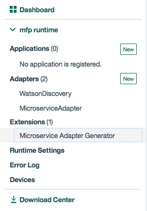

<!-- NLS_CHARSET=UTF-8 -->
## 概説
{: #overview }

{{ site.data.keys.product }} アダプターを使用して、すべての必要なサーバー・サイド・ロジックを実行し、バックエンド・システムから情報を取得して、クライアント・アプリケーションおよびクラウド・サービスに転送します。

##  アダプターをその OpenAPI 仕様から生成
{: #generate-adapter-openapi-spec}

アダプターをその OpenAPI 仕様 (Swagger 仕様) から自動生成することで、アプリケーション開発を促進することができます。これで、{{ site.data.keys.product }} ユーザーは、{{ site.data.keys.product }} アダプターの作成ではなく、アプリケーションを目的のバックエンド・サービスに接続するアプリケーション・ロジックに焦点を当てることができようになります。

>**注:** この機能は、DevKit でのみ使用できます。

この機能を使用するには、マイクロサービス (または目的のバックエンド・サービス) の OpenAPI 仕様 (.json または .yaml) を使用できる必要があります。アダプターの生成機能は、{{ site.data.keys.product }} コンソールの**ダウンロード・センター**からダウンロード可能な**マイクロサービス・コネクター** (**マイクロサービス・アダプター生成プログラム**とも呼ばれます) という拡張アダプターによって使用可能になります。

>**注:** 前提条件として、インストール済みの JDK フォルダーを指すように JAVA_HOME 変数を構成してください。

  

**マイクロサービス・アダプター生成プログラム**・アダプターをダウンロードして、{{ site.data.keys.product }} サーバーにデプロイします。デプロイされたアダプターが、ナビゲーション・ペインの**「拡張機能 (Extensions)」**の下にリストされるようになります。

  

**「マイクロサービス・アダプター生成プログラム」**をクリックすると、ユーザーが OpenAPI 仕様 (.json または .yaml) ファイルを指定して、提供した OpenAPI 仕様からアダプターを生成することを選択できるページが起動します。

  

アダプターは生成後に、ブラウザーに自動的にダウンロードされます。その後、ユーザーは、生成されたアダプターをアプリケーションで使用するためにデプロイする必要があります。**「アダプター・ソースを含める (Include adapter source)」**オプションを選択すると、アダプターのソース・コードと生成されたアダプターが zip ファイルとしてダウンロードされます。ユーザーは、生成されたアダプターのソース・コードを変更し、アダプターを再ビルドしてデプロイできます。

アダプター生成プログラムは、OpenAPI 仕様 JSON の正確度に依存しています。仕様が不完全であったり正しくなかったりした場合、生成が失敗するか、バックエンド・マイクロサービスの API と一致しないアダプター API が生成されることがあります。

>詳細については、「[Auto Generate Adapters for Microservices and backend systems from its OpenAPI Specification](https://mobilefirstplatform.ibmcloud.com/blog/2017/08/10/autogenerate-adapter-from-openapi-specification/)」のブログ投稿を参照してください。

