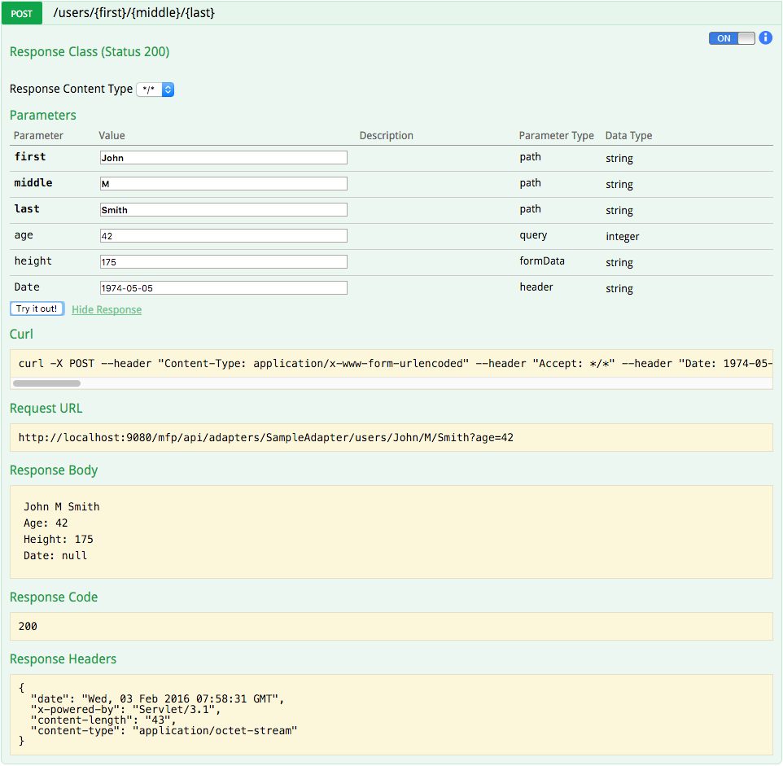

<!-- NLS_CHARSET=UTF-8 -->
## 概説
{: #overview }

IDE (Eclipse、IntelliJ、またはそれに相当するもの) を使用して、Java アダプターおよび JavaScript アダプターのテストや、Java アダプターまたは JavaScript アダプターで使用するために実装された Java コードのデバッグを行うことができます。  

このチュートリアルでは、{{site.data.keys.mf_cli }} または Postman を使用してアダプターをテストする方法、および Eclipse IDE を使用して Java アダプターをデバッグする方法について説明します。

#### ジャンプ先
{: #jump-to }

* [アダプターのテスト](#testing-adapters)
 * [Postman の使用](#using-postman)
 * [Swagger の使用](#using-swagger)
* [アダプターのデバッグ](#debugging-adapters)
 * [JavaScript アダプター](#debugging-javascript-adapters)
 * [Java アダプター](#debugging-java-adapters)

## アダプターのテスト
{: #testing-adapters }

アダプターは REST インターフェースを介して使用可能です。つまり、リソースの URL が分かっていれば、Postman などの HTTP ツールを使用して要求をテストし、適宜 `URL` パラメーター、`path` パラメーター、`body` パラメーター、または `headers` を渡すことができるということです。

アダプター・リソースへのアクセスに使用する URL の構造は次のとおりです。

* JavaScript アダプターの場合 - `http://hostname-or-ip-address:port-number/mfp/api/adapters/{adapter-name}/{procedure-name}`
* Java アダプターの場合 - `http://hostname-or-ip-address:port-number/mfp/api/adapters/{adapter-name}/{path}`

### パラメーターの受け渡し
{: #passing-parameters }

* Java アダプターを使用しているときは、アダプターをどのように構成したかに応じて、パラメーターを URL、本文、フォームなどで渡すことができます。
* JavaScript アダプターを使用しているときは、パラメーターは `params=["param1", "param2"]` として渡されます。つまり、JavaScript プロシージャーは、**順に並べられた、名前のない値の配列**でなければならない `params` というただ 1 つのパラメーターしか受け取りません。このパラメーターは、`Content-Type: application/x-www-form-urlencoded` を使用して、URL (`GET`) または body (`POST`) のいずれかに置くことができます。

### セキュリティーの取り扱い
{: #handling-security }

{{site.data.keys.product }} のセキュリティー・フレームワークでは、リソースに明示的にスコープが割り当てられていない場合でも、アダプター・リソース用のアクセス・トークンが必要です。そのため、セキュリティーを明示的に使用不可にした場合を除き、エンドポイントは常に保護されます。

Java アダプターでセキュリティーを使用不可にするには、`OAuthSecurity` アノテーションをメソッド/クラスに付加します。

```java
@OAuthSecurity(enabled=false)
```

JavaScript アダプターでセキュリティーを使用不可にするには、プロシージャーに `secured` 属性を追加します。

```js
<procedure name="adapter-procedure-name" secured="false"/>
```

別の方法として、{{site.data.keys.mf_server }} の開発バージョンには、セキュリティー・チャレンジをバイパスするためのテスト・トークン・エンドポイントが組み込まれています。

### Postman の使用
{: #using-postman }

#### テスト・トークン
{: #test-token }

テスト・トークンを受け取るには、下部にある「Postman で実行 (Run in Postman)」ボタンをクリックして、準備完了要求が含まれた Postman アプリケーションにコレクションをインポートするか、次のステップに従って、ご自身で要求を作成してください。

<a href="https://app.getpostman.com/run-collection/d614827491450d43c10e"></a>


1. 「{{site.data.keys.mf_console }}」→**「設定」**→**「機密クライアント」**タブで、機密クライアントを作成するか、デフォルトの機密クライアントを使用します。  
テスト目的の場合は、**「許可されるスコープ」**を `**` に設定します。

   

1. `Content-Type: application/x-www-form-urlencoded` を使用して以下のパラメーターを持つ `http://<IP>:<PORT>/mfp/api/az/v1/token` への HTTP `POST` 要求を作成するには、HTTP クライアント (Postman) を使用します。

* `grant_type` : `client_credentials`
* `scope` : リソースを保護するスコープを使用してください。  
リソースを保護するためにスコープを使用しない場合は、空ストリングを使用してください。


  
2. `Basic authentication` を使用し、機密クライアント ID ("test") と秘密鍵 ("test") を指定して、`authorization header` を追加します。
> 機密クライアントの詳細については、[機密クライアント](../../authentication-and-security/confidential-clients)チュートリアルを参照してください。
  


結果は、一時的に有効なアクセス・トークンを持つ JSON オブジェクトになります。

```json
{
  "access_token": "eyJhbGciOiJSUzI1NiIsImp3ayI6eyJlIjoiQVFBQiIsIm4iOiJBTTBEZDd4QWR2NkgteWdMN3I4cUNMZEUtM0kya2s0NXpnWnREZF9xczhmdm5ZZmRpcVRTVjRfMnQ2T0dHOENWNUNlNDFQTXBJd21MNDEwWDlJWm52aHhvWWlGY01TYU9lSXFvZS1ySkEwdVp1dzJySGhYWjNXVkNlS2V6UlZjQ09Zc1FOLW1RSzBtZno1XzNvLWV2MFVZd1hrU093QkJsMUVocUl3VkR3T2llZzJKTUdsMEVYc1BaZmtOWkktSFU0b01paS1Uck5MelJXa01tTHZtMDloTDV6b3NVTkExNXZlQ0twaDJXcG1TbTJTNjFuRGhIN2dMRW95bURuVEVqUFk1QW9oMmluSS0zNlJHWVZNVVViTzQ2Q3JOVVl1SW9iT2lYbEx6QklodUlDcGZWZHhUX3g3c3RLWDVDOUJmTVRCNEdrT0hQNWNVdjdOejFkRGhJUHU4Iiwia3R5IjoiUlNBIiwia2lkIjoidGVzdCJ9fQ.eyJpc3MiOiJjb20uaWJtLm1mcCIsInN1YiI6InRlc3QiLCJhdWQiOiJjb20uaWJtLm1mcCIsImV4cCI6MTQ1MjUxNjczODAwNSwic2NvcGUiOiJ4eCJ9.vhjSkv5GShCpcDSu1XCp1FlgSpMHZa-fcJd3iB4JR-xr_3HOK54c36ed_U5s3rvXViao5E4HQUZ7PlEOl23bR0RGT2bMGJHiU7c0lyrMV5YE9FdMxqZ5MKHvRnSOeWlt2Vc2izh0pMMTZd-oL-0w1T8e-F968vycyXeMs4UAbp5Dr2C3DcXCzG_h9jujsNNxgXL5mKJem8EpZPolQ9Rgy2bqt45D06QTW7J9Q9GXKt1XrkZ9bGpL-HgE2ihYeHBygFll80M8O56By5KHwfSvGDJ8BMdasHFfGDRZUtC_yz64mH1lVxz5o0vWqPwEuyfslTNCN-M8c3W9-6fQRjO4bw",
  "token_type": "Bearer",
  "expires_in": 3599,
  "scope": "**"
}
```
<br/><br/>
#### 要求の送信
{: #sending-request }

アダプター・エンドポイントに対する以後の要求では、`Authorization` という名前の HTTP ヘッダーと、前に受け取った値 (Bearer で始まる) を追加します。セキュリティー・フレームワークは、リソースを保護しているセキュリティー・チャレンジをスキップします。

  

### Swagger の使用
{: #using-swagger }

Swagger 文書の UI は、アダプターの REST エンドポイントのビジュアル表示です。  
Swagger を使用すると、開発者は、アダプター・エンドポイントがクライアント・アプリケーションに取り込まれる前に、アダプター・エンドポイントをテストすることができます。

Swagger にアクセスするには、次のようにします。

1. {{site.data.keys.mf_console }} を開いて、アダプター・リストからアダプターを選択します。
2. **「リソース」**タブをクリックします。
3. **「Swagger 文書の表示」**ボタンをクリックします。  
4. **「表示/非表示」**ボタンをクリックします。

  


#### テスト・トークン
{: #test-token }

要求にテスト・トークンを追加して、リソースを保護しているセキュリティー・チャレンジをセキュリティー・フレームワークがスキップできるようにするには、エンドポイントの操作部の右隅にある**「オン/オフ・スイッチ」**ボタンをクリックします。

Swagger UI に対して認可するスコープを選択するように求められます (テスト目的の場合、すべて選択することができます)。初めて Swagger UI を使用する場合は、機密クライアント ID と秘密鍵を指定してログインするように要求されることがあります。その場合は、**「許可されるスコープ」**に `*` を指定した新規機密クライアントを作成する必要があります。

> 機密クライアントの詳細については、[機密クライアント](../../authentication-and-security/confidential-clients)チュートリアルを参照してください。
<br/><br/>

#### 要求の送信
{: #sending-request-swagger }

エンドポイントの操作を展開し、必須パラメーター (必要な場合) を入力して**「試用」**ボタンをクリックします。

  

#### Swagger アノテーション
{: #swagger-annotations }
Java アダプターでのみ使用可能です。

Java アダプター用の Swagger 文書を生成するには、Java 実装環境で Swagger 提供のアノテーションを使用します。
> Swagger アノテーションについて詳しくは、[Swagger の資料](https://github.com/swagger-api/swagger-core/wiki/Annotations-1.5.X)を参照してください。

```java
@ApiOperation(value = "Multiple Parameter Types Example", notes = "Example of passing parameters by using 3 different methods: path parameters, headers, and form parameters. A JSON object containing all the received parameters is returned.")
@ApiResponses(value = { @ApiResponse(code = 200, message = "A JSON object containing all the received parameters returned.") })
@POST
@Produces(MediaType.APPLICATION_JSON)
@Path("/{path}")
public Map<String, String> enterInfo(
    @ApiParam(value = "The value to be passed as a path parameter", required = true) @PathParam("path") String path,
    @ApiParam(value = "The value to be passed as a header", required = true) @HeaderParam("Header") String header,
    @ApiParam(value = "The value to be passed as a form parameter", required = true) @FormParam("form") String form) {
  Map<String, String> result = new HashMap<String, String>();

  result.put("path", path);
  result.put("header", header);
  result.put("form", form);

  return result;
}
```



### {{site.data.keys.mf_cli }} の使用
{: #using-mobilefirst-cli }

アダプターの機能をテストするために、`mfpdev adapter call` コマンドを使用して、コマンド・ラインから Java アダプターまたは JavaScript アダプターを呼び出します。
コマンドを対話式で実行するか直接実行するかを選択することができます。以下は、直接モードを使用した例です。

#### Java アダプター
{: #java-adapters-adapters-cli }

**コマンド・ライン**・ウィンドウを開いて、以下のコマンドを実行します。

```bash
mfpdev adapter call adapterName/path
```
例えば、以下のようにします。
```bash
mfpdev adapter call SampleAdapter/users/World

Calling GET '/mfp/api/adapters/SampleAdapter/users/World'
Response:
Hello World
```

#### JavaScript アダプター
{: #javascript-adapters-cli }

**コマンド・ライン**・ウィンドウを開いて、以下のコマンドを実行します。

```bash
mfpdev adapter call adapterName/procedureName
```
例えば、以下のようにします。
```bash
mfpdev adapter call SampleAdapter/getFeed

Calling GET '/mfp/api/adapters/SampleAdapter/users/World'
Response:
Hello World
```



## アダプターのデバッグ
{: #debugging-adapters }

### JavaScript アダプター
{: #debugging-javascript-adapters }
`MFP.Logger` API を使用して、JavaScript アダプターの JavaScript コードをデバッグすることができます。  
使用可能なロギング・レベルは、詳細度の低い方から順に、`MFP.Logger.error`、`MFP.Logger.warn`、`MFP.Logger.info`、`MFP.Logger.debug` です。

その後、ログがアプリケーション・サーバーのログ・ファイルに出力されます。  
必ず、サーバー詳細度レベルを適切に設定してください。そうしないと、ログ・ファイル内のログが表示されません。

### Java アダプター
{: #debugging-java-adapters }

アダプターの Java コードをデバッグするには、その前に、Eclipse を以下のように構成する必要があります。

1. **Maven の組み込み** - Eclipse Kepler (v4.3) からは、Maven サポートが Eclipse に組み込まれています。  
ご使用の Eclipse インスタンスで Maven がサポートされていない場合は、[m2e の説明に従って](http://www.eclipse.org/m2e/) Maven サポートを追加してください。

2. Maven が Eclipse で使用可能になったら、次のようにしてアダプター Maven プロジェクトをインポートします。

    

3. 次のようにして、デバッグ・パラメーターを指定します。
    - **「実行」**→**「デバッグ構成」**をクリックします。
    - **「リモート Java アプリケーション」**をダブルクリックします。
    - この構成の**名前**を入力します。
    - **ホスト**の値を設定します。ローカル・サーバーを実行している場合は「localhost」を使用します。そうでない場合は、リモート・サーバー・ホスト名を入力します。
    - **ポート**の値を「10777」に設定します。
    - **「参照」**をクリックして、Maven プロジェクトを選択します。
    - **「デバッグ」**をクリックします。

    

4. **「ウィンドウ」→「ビューの表示」→「デバッグ」**をクリックして、*デバッグ・モード* を入力します。これで、標準 Java アプリケーションの場合と同様に、Java コードを正常にデバッグすることができます。アダプターのコードを実行して設定されたブレークポイントがヒットするようにするには、アダプターに対して要求を発行する必要があります。[アダプターのテスト・セクション](#testing-adapters)に記載されたアダプター・リソースの呼び出し方法の説明に従うことで、これを実行できます。

    

> IntelliJ を使用した Java アダプターのデバッグ方法の手順については、ブログ投稿の [IntelliJ を使用した MobileFirst Java アダプターの開発]({{site.baseurl}}/blog/2016/03/31/using-intellij-to-develop-adapters)を参照してください。
