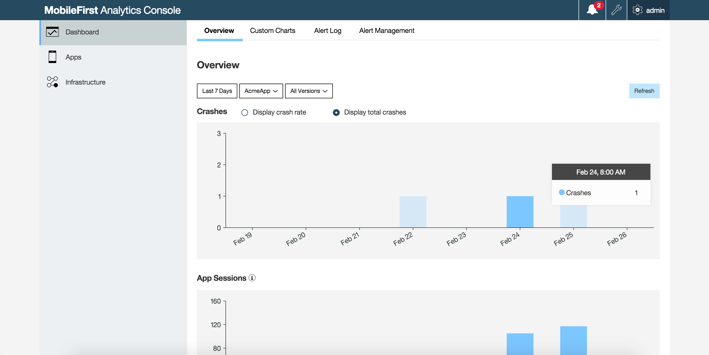

<!-- NLS_CHARSET=UTF-8 -->

## 概説
クライアントが {{ site.data.keys.mf_analytics_server }}と連携する方法を構成し、Operations Console および Analytics コンソールを使用してさまざまなレポートを構成して表示します。

## {{ site.data.keys.mf_analytics_console_full }}
{{ site.data.keys.mf_analytics_console }}で、Analytics レポートを表示および構成します。 アラートを管理し、クライアント・ログを表示します。

{{ site.data.keys.mf_console }} から {{ site.data.keys.mf_analytics_console_short }}を開くには、右上のナビゲーション・バーで**「Analytics コンソール」**リンクをクリックします。

{{ site.data.keys.mf_analytics_console_short }}にナビゲートすると、デフォルトの**「ダッシュボード」**パネルが表示されます。 クライアント・アプリケーションが既にログおよび分析データをサーバーに送信している場合は、関連レポートにデータが取り込まれます。 **「アプリケーション」**および**「インフラストラクチャー」**はナビゲーション・バーから選択できます。

### ダッシュボード
**「ダッシュボード」**パネルでは、アプリケーションの異常終了、アプリケーション・セッション、およびサーバー処理時間に関連した、収集された分析データを検討することができます。 また、カスタム・グラフの作成やアラートの管理も行うことができます。

### アプリケーション
**「アプリケーション」**パネルでは、使用状況およびデバイスに関連した詳細な分析データ (合計デバイス数およびアプリケーション・セッション、アクティブ・ユーザー、アプリケーションの使用状況、新規デバイス、モデルの使用状況、およびオペレーティング・システムなど) に加え、異常終了に関連したデータも検討できます。 特定のアプリケーションおよびデバイスのクライアント・ログを検索します (**「アプリケーション」→「クライアント・ログの検索」**)。

### インフラストラクチャー
**「インフラストラクチャー」**パネルでは、セッション処理時間、平均要求サイズ、サーバー要求、ネットワーク要求、アダプター応答時間、プロシージャー応答時間、およびサイズおよびアダプターの使用状況に関連した分析データに加え、通知要求およびメディエーターごとの通知などのプッシュ通知データも検討できます。 サーバー・ログを検索することもできます。

> [『Analytics ワークフロー』](../workflows/)チュートリアルで詳細を参照してください。

> **注:** クライアント/サーバー・ログのデータの**検索**および**エクスポート**の機能は、Chrome ブラウザーの最近のバージョンで見られるように、日付フィルターが変更されたときにマウス・クリック・イベントでアクションを呼び出すことはありません。この動作は、Chrome ブラウザーに問題があるため、また、既知の制限が原因で発生します。この問題は、他のブラウザーや Chrome ブラウザーの *v54.0.2840.71* より前のバージョンでは発生しません。Chrome ブラウザーの最新バージョンで、この問題を回避するには、必要な日付を設定した後、ページをリフレッシュしてから「検索/エクスポート」ボタンをクリックするか、「Enter」キーまたは「Return」キーを押して選択したアクションを実行することができます。

## 分析フィーチャー

### アプリケーション分析
**「アプリケーション」→「使用状況とデバイス」**タブから「アプリケーション・セッション」グラフと「アプリケーションの使用」グラフを表示すると、ユーザーによってどのアプリケーションが最も使用されているかが分かります。

### 組み込み分析
{{ site.data.keys.product_adj }} クライアント SDK を {{ site.data.keys.mf_server }} と一緒に使用すると、アプリケーションで {{ site.data.keys.mf_server }} に行う要求について分析データが自動的に収集されます。 **「ダッシュボード」→「概要」**で、収集されて {{ site.data.keys.mf_analytics_server }} にレポートされる基本のデバイス・メタデータを表示します。

### カスタム分析
アプリケーションにカスタム・データを送信させて、カスタム・データのカスタム・グラフを作成することができます。

> [『Analytics API』](../analytics-api/)チュートリアルでカスタム分析の送信方法を参照してください。

### カスタム・グラフ
カスタム・グラフを使用すると、分析データ・ストア内の収集した分析データを、{{ site.data.keys.mf_analytics_console_short }}でデフォルトでは使用できないグラフで視覚化できます (**「ダッシュボード」→「カスタム・グラフ」**)。 この視覚化フィーチャーは、ビジネスに不可欠なデータを分析するためのパワフルな手段です。

> [『カスタム・グラフの作成』](custom-charts/)チュートリアルでカスタム・グラフの作成方法を参照してください。

### アラートの管理
アラートにより、{{ site.data.keys.mf_analytics_console }} を定期的にチェックせずに、モバイル・アプリケーションの正常性をモニターするための事前対応手段が提供されます。

**「ダッシュボード」→「アラートの管理」**タブで、しきい値を構成できます。この値を超えると、アラートが起動されて管理者に通知されます。 起動されたアラートをコンソール上で視覚化することも、カスタム Web フックを使用してそれらを処理することもできます。 カスタム Web フックを使用すると、アラートが起動されたときに誰がどのように通知を受けるかを制御できます。

> [『アラートの管理』](alerts/)チュートリアルでアラートの管理方法を参照してください。

### アプリケーション異常終了のモニター
アプリケーション異常終了は、{{ site.data.keys.mf_analytics_console_short }}上 (**「アプリケーション」→「異常終了」**) で視覚化されます。したがって、コンソールで、素早く異常終了を確認し、状況に応じて措置を取ることができます。 異常終了ログは、デフォルトではデバイス上に収集され、*再度アプリケーションが実行されると*、サーバーに送信されます。 異常終了ログが Analytics サーバーに送信されると、そのデータが自動的に異常終了グラフに取り込まれます。

### サーバー・データおよびネットワーク・データのモニター
{{ site.data.keys.mf_analytics_console_short }} は、ネットワーク・データが Analytics サーバーに送信されるときにデータをモニターします。コンソールを使用して、この情報をさまざまな方法で照会できます (**「インフラストラクチャー」→「サーバーおよびネットワーク」**)。

### クライアント・ログの収集、検索、およびレポート作成
クライアント・ログをサーバーに送信して、分析レポートに含めることができます。

ロギング情報をレポートに含めるには、以下のようにします。

1. {{ site.data.keys.mf_analytics_console_short }}で、**「ダッシュボード」→「カスタム・グラフ」**タブを選択します。

2. **「イベント・タイプ」**プルダウン・メニューから**「クライアント・ログ」**を選択します。

**カスタム・グラフ**について詳しくは、[『カスタム・グラフの作成』](custom-charts/)を参照してください。

ロギング・データはフィルタリングできます。 ログ・フィルターを構成して Analytics サーバーに保存できます。そうすると、クライアント・アプリケーションがそれを取得できるようになります。

ログ・フィルターの構成については、[『クライアント・ログの検索』](log-filters/)チュートリアルを参照してください。

クライアントからのログの送信について詳しくは、[『クライアント・ログの収集』](../../application-development/client-side-log-collection/)を参照してください。

## {{ site.data.keys.mf_console_full }}
{{ site.data.keys.mf_console }}で、Analytics サーバーを構成し管理します。

{{ site.data.keys.mf_analytics_console_short }}を使用している場合は、上部ナビゲーション・バーで**「オペレーション・コンソール」**ボタンをクリックして {{ site.data.keys.mf_console }} にアクセスします。

### 追加のロガー・パッケージからの分析データの収集
デフォルトでは、パッケージ `com.worklight` からのロギングのみが Analytics に送信されます。 追加パッケージからロギングを追加するには、[『Analytics サーバーへのログの転送』](../../adapters/server-side-log-collection/java-adapter/#forwarding-logs-to-the-analytics-server)を参照してください。

### Analytics サポートの有効化/無効化
{: #enabledisable-analytics-support}

デフォルトでは、Analytics サーバーによる分析用のデータの収集が有効になっています。 これは、処理時間の節約などのために無効にすることができます。

1. ナビゲーション・サイドバーで**「ランタイム設定」**をクリックします。 意図しない変更を防ぐために、ランタイム・プロパティーは読み取り専用モードで表示されます。
2. 設定を編集可能にするには、**「編集」**ボタンをクリックします。 *管理者* および*デプロイヤー* 以外のロールでログインすると、ランタイム・プロパティーの変更が許可されないため、**「編集」**ボタンは表示されません。
3. **「データ収集の有効化」**のドロップダウン・メニューから**「いいえ (false)」**を選択してデータ収集を無効にします。
4. **「保存 (Save)」**をクリックします。
5. **「読み取り専用」**ボタンをクリックして、プロパティーを再度ロックします。

### ロール・ベースのアクセス制御
{{ site.data.keys.mf_analytics_console_short }} のコンテンツは、事前定義のセキュリティー・ロールによって制限されます。  
{{ site.data.keys.mf_analytics_console_short }} は、ログイン・ユーザーのセキュリティー・ロールに基づいて異なるコンテンツを表示します。 以下の表では、 {{ site.data.keys.mf_analytics_console_short }}でのセキュリティー・ロールおよびアクセス権限について示します。

| ロール           | ロール名                | 表示アクセス権限                                                     | 編集アクセス権限  |
|----------------|--------------------------|--------------------------------------------------------------------|-----------------|
| 管理者  | analytics_administrator  | すべて	                                                     | すべて     |
| インフラストラクチャー | analytics_infrastructure	| すべて	                                                     | すべて     |
| デベロッパー      | analytics_developer	    | 「管理」ページ以外のすべて		             | すべて     |
| サポート        | analytics_support        | 「管理」ページ以外のすべて		             | すべて     |
| ビジネス       | analytics_business       | 「管理」ページおよび「インフラストラクチャー」ページ以外のすべて | すべて     |

> ロールのセットアップについては、[{{ site.data.keys.mf_server }} 管理用のユーザー認証の構成](../../installation-configuration/production/server-configuration#configuring-user-authentication-for-mobilefirst-server-administration)を参照してください。

## 関連のブログの投稿
* [カスタム分析の計測についての追加情報]({{site.baseurl}}/blog/2016/01/22/howto-custom-in-app-behavior-analytics/)
* [Web フックの計測についての追加情報]({{site.baseurl}}/blog/2015/10/19/using-mfp-adapters-endpoint-analytics-alerts-webhooks/)
