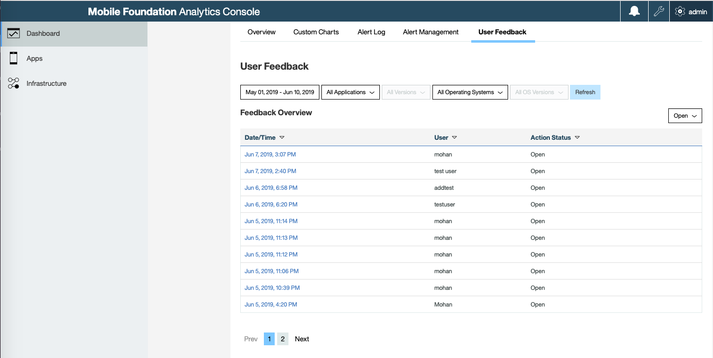

<!-- NLS_CHARSET=UTF-8 -->
## 概説
{: #overview }

アプリケーションのアプリ内ユーザー・フィードバック機能を使用すると、アプリケーションのユーザーは、アプリケーションのスクリーン・ショットを撮り、それに、マーカーや、アプリケーションに関するフィードバックや意見を説明するコメントで、注釈を付けることができます。   

最初に、モバイル・アプリケーションがアプリ内ユーザー・フィードバックをキャプチャーして送信できることを確認します。  [アプリ内ユーザー・フィードバックのキャプチャーおよび送信](../../analytics-api#sending-userfeedback-data)を参照

モバイル・デバイスからキャプチャーして送信されるユーザー・フィードバックは、Mobile Foundation Analytics サービスによって集計され、Analytics コンソールに表示されます。これを使用して、アプリケーション所有者と開発者は、検討、洞察の収集を行い、必要に応じてアクションを実行します。  

## アプリ内ユーザー・フィードバック・リストの表示

Mobile Foundation Analytics コンソールで、左側のナビゲーション・パネルから**「ダッシュボード」**オプションを選択します。   次に、右側のパネルから上部のメニュー・オプションを表示して、**「ユーザー・フィードバック (User Feedback)」**を選択します。    

選択すると、Analytics コンソールの右側のパネルに、アプリケーションのユーザーから受信したユーザー・フィードバックをリストするテーブルが表示されます。   テーブルの内容は、期間、アプリケーション、デバイス OS、およびバージョンによってフィルタリングできます。  また、実行された問題解決のアクションによって、フィードバックをフィルタリングすることもできます。

## アプリ内ユーザー・フィードバックの詳細の表示

詳細なフィードバックを表示するには、詳細に調べる必要があるフィードバックをクリックします。 これにより、次が含まれたモーダル・ビューが開きます。 

* ユーザーの注釈が付けられた、モバイル・アプリケーションのスクリーン・ショットのカルーセル。    
* 各スクリーン・ショットには、ユーザーによって注釈を付けられたテキスト・コメントのリストがあります。
* フィードバック全体 (スクリーン・ショットを含む) については、アプリケーション所有者またはレビューアーは、全部または部分的に受け入れられたフィードバックや拒否されたフィードバックなどの実行されたアクションにマークを付けることができます。また、アプリケーション所有者またはフィードバックのレビューアーによるレビュー・コメントを入力できるテキスト域もあります。   

フィードバックとそのすべての詳細 (注釈付きのスクリーン・ショット) をダウンロードするオプションもあります。   例えば、アプリケーション所有者は、フィードバックの詳細をダウンロードし、それを GiT または JIRA の問題にアップロードしたりアタッチしたりできます。  

> **注**: フィードバックのアクション設定は、現時点では、フィードバックのレビュー状況をマーキングするのに役立つマーカーのみです。  すべてのフィードバック情報をコピーした JIRA または GiT の問題の作成などの組み込みのカスケード・アクションはありません。    

