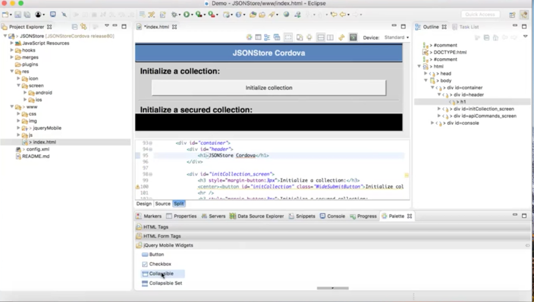

<!-- NLS_CHARSET=UTF-8 -->
## 概説
{: #overview }
アプリケーションの UI を設計および実装する作業は、開発プロセスの重要な部分です。 {{ site.data.keys.product_adj }} Eclipse プラグインは Thym プラグインと共に、Cordova アプリケーションの開発を支援します。
各コンポーネントのカスタム CSS スタイルをゼロから作成することで高度なカスタマイズを実現できますが、それには大量のリソースが必要です。
既存の JavaScript UI フレームワークを使用する方が適している場合もあります。
このトピックでは、2 つの UI フレームワーク jQuery Mobile と、{{ site.data.keys.product_adj }} Studio の Eclipse で提供される WYSIWYG エディターを使用して、{{ site.data.keys.product_adj }} アプリケーションを開発する方法を説明します。

MobileFirst Eclipse プラグインを使用して Cordova アプリケーションの UI を開発するには、次の操作を行います。

1. Eclipse をダウンロードします。
2. Eclipse マーケットプレイスから [Thym](http://marketplace.eclipse.org/content/eclipse-thym) プラグインをインストールします。
3. Eclipse マーケットプレイスから [MobileFirst プラットフォーム・プラグイン](http://marketplace.eclipse.org/content/ibm-mobilefirst-foundation-studio)をインストールします。


## WYSIWYG エディター
{: #wysiwyg-editor }
WYSIWYG エディターは、開発者に便利なように、HTML UI ウィジェットの MobileFirst プラットフォーム Eclipse プラグインで提供されています。
このエディターは、ユーザーがボタンやテキスト・ボックスなどの UI ウィジェットとその他の HTML ウィジェットをドラッグ・アンド・ドロップするための基本的なパレットを提供します。これは、ユーザーが Cordova アプリケーションを素早く開発できるようにする迅速なモバイル・アプリケーション開発ツールです。


## jQuery Mobile
{: #jquery-mobile }
jQuery は高速かつ簡潔な JavaScript フレームワークです。これにより、HTML ドキュメント・フロー、イベント処理、アニメーション、および Ajax による対話が簡易化され、迅速な Web 開発が可能となります。 jQuery Mobile は、スマートフォンおよびタブレット向けの、タッチに最適化した Web フレームワークです。 jQuery Mobile を実行するには jQuery が必要です。

jQuery Mobile をアプリケーションに追加するには、次の操作を行います。

1. **「ファイル」 -> 「新規」 -> 「新規 Hybrid Mobile (Cordova) アプリケーション・プロジェクト (new Hybrid Mobile (Cordova) application project)」**をクリックして、Eclipse で Thym プロジェクトを作成します。
2. [jQuery Mobile パッケージをダウンロード](http://jquerymobile.com/download/)します。
3. ダウンロードした jQuery Mobile パッケージを、ハイブリッド・アプリケーションの `www` ディレクトリー (次の図に示す) にコピーします。
  
4. スクリーン・ショットに示すように、メインの `index.html` を開き、プロジェクトに jQuery 参照 (スニペットに示す) を追加します。
    

    ```html
      <!DOCTYPE HTML>
      <html>
          	<head>
          		<meta charset="UTF-8">
          		<title>appName</title>
          		<meta name="viewport" content="width=device-width, initial-scale=1.0, maximum-scale=1.0, minimum-scale=1.0, user-scalable=0">
          		<!--
          			<link rel="shortcut icon" href="images/favicon.png">
          			<link rel="apple-touch-icon" href="images/apple-touch-icon.png">
          		-->
          		<link href="jqueryMobile/jquery.mobile.structure-1.4.5.min.css" rel="stylesheet">
          		<link href="jqueryMobile/demos/css/jquery.mobile.structure-1.4.5.min.css" rel="stylesheet">
          		<link href="jqueryMobile/jquery.mobile-1.4.5.min.css" rel="stylesheet">
          		<link href="jqueryMobile/jquery.mobile.theme-1.4.5.css" rel="stylesheet">
          		<link href="jqueryMobile/jquery.mobile.theme-1.4.5.min.css" rel="stylesheet">
          		<link href="jqueryMobile/jquery.mobile.external-png-1.4.5.min.css" rel="stylesheet">
          		<link href="jqueryMobile/jquery.mobile.inline-png-1.4.5.css" rel="stylesheet">
          		<link href="jqueryMobile/demos/css/jquery.mobile.inline-svg-1.4.5.min.css" rel="stylesheet">
          		<link href="jqueryMobile/jquery.mobile-1.4.5.css" rel="stylesheet">
          		<link href="jqueryMobile/jquery.mobile.inline-png-1.4.5.min.css" rel="stylesheet">
          		<link href="jqueryMobile/jquery.mobile.external-png-1.4.5.css" rel="stylesheet">
          		<link href="jqueryMobile/demos/css/jquery.mobile.inline-png-1.4.5.min.css" rel="stylesheet">
          		<link href="jqueryMobile/demos/theme-classic.css" rel="stylesheet">
          		<link href="jqueryMobile/jquery.mobile.inline-svg-1.4.5.css" rel="stylesheet">
          		<link href="jqueryMobile/jquery.mobile.structure-1.4.5.css" rel="stylesheet">
          		<link href="jqueryMobile/demos/css/jquery.mobile-1.4.5.min.css" rel="stylesheet">
          		<link href="jqueryMobile/jquery.mobile.inline-svg-1.4.5.min.css" rel="stylesheet">
          		<link href="jqueryMobile/demos/css/jquery.mobile.theme-1.4.5.min.css" rel="stylesheet">
          		<link href="jqueryMobile/demos/css/jquery.mobile.external-png-1.4.5.min.css" rel="stylesheet">
          		<link rel="stylesheet" href="css/main.css">
          		<script>window.$ = window.jQuery = WLJQ;</script>
          		<script src="jqueryMobile/demos/jquery.js"></script>
          		<script src="jqueryMobile/demos/jquery.mobile-1.4.5.js"></script>
          	</head>
          	<body style="display: none;">
          		<div data-role="page" id="page">
          			<div data-role="content" style="padding: 15px">
          				<!--application UI goes here-->
          				Hello MobileFirst
          			</div>
          		</div>
          		<script src="js/initOptions.js"></script>
          		<script src="js/main.js"></script>
          		<script src="js/messages.js"></script>
          	</body>
      </html>
    ```
HTML ファイルで jQuery Mobile への参照を追加したら、ファイルを閉じて Eclipse で開き直します。これで、HTML キャンバスにドラッグ・アンド・ドロップできる jQuery Mobile ウィジェットがパレット・ビューに表示されます。
