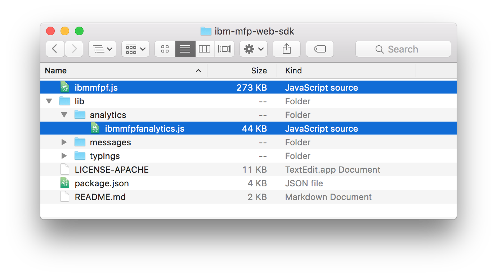

<!-- NLS_CHARSET=UTF-8 -->
## 概説
{: #overview }
任意の開発環境およびツールを使用して、モバイルまたはデスクトップの {{ site.data.keys.product_adj }} Web アプリケーションを開発することができます。  
このチュートリアルでは、{{ site.data.keys.product_adj }} Web SDK を Web アプリケーションに追加する方法と、その Web アプリケーションを {{ site.data.keys.mf_server }} に登録する方法について学習します。

{{ site.data.keys.product_adj }} Web SDK は、JavaScript ファイルのセットとして提供されており、[ NPM で入手できます](https://www.npmjs.com/package/ibm-mfp-web-sdk)。  
この SDK には、次のファイルが含まれています。

- **ibmmfpf.js**: SDK のコアです。
- **ibmmfpfanalytics.js**: {{ site.data.keys.mf_analytics }} がサポートされるようにします。

#### ジャンプ先
{: #jump-to }
- [前提条件](#prerequisites)
- [{{ site.data.keys.product_adj }} Web SDK の追加](#adding-the-mobilefirst-web-sdk)
- [{{ site.data.keys.product_adj }} Web SDK の初期化](#initializing-the-mobilefirst-web-sdk)
- [Web アプリケーションの登録](#registering-the-web-application)
- [{{ site.data.keys.product_adj }}Web SDK の更新](#updating-the-mobilefirst-web-sdk)
- [同一生成元ポリシー](#same-origin-policy)
- [セキュア・オリジン・ポリシー ](#secure-origins-policy)
- [次に使用するチュートリアル](#tutorials-to-follow-next)

## 前提条件
{: #prerequisites }
-   Web 開発環境をセットアップするための、[サポートされる Web ブラウザー](../../../installation-configuration/development/web/#web-app-supported-browsers)の前提条件を参照してください。

-   NPM コマンドを実行するには、[Node.js](https://nodejs.org) をインストールする必要があります。

## {{ site.data.keys.product_adj }} Web SDK の追加
{: #adding-the-mobilefirst-web-sdk }
SDK を新規または既存の Web アプリケーションに追加するには、まず最初に SDK をご使用のワークステーションにダウンロードした後、SDK を Web アプリケーションに追加します。

### SDK のダウンロード
{: #downloading-the-sdk }
1. **コマンド・ライン**・ウィンドウで、Web アプリケーションのルート・フォルダーに移動します。
2. 次のコマンドを実行します。`npm install ibm-mfp-web-sdk`。

このコマンドにより、次のようなディレクトリー構造が作成されます。



### SDK の追加
{: #adding-the-sdk }
{{ site.data.keys.product }} Web SDK を追加するには、Web アプリケーション内で標準の方法で SDK を参照します。  
また、この SDK は [AMD もサポート](https://en.wikipedia.org/wiki/Asynchronous_module_definition)しているので、[RequireJS](http://requirejs.org/) などのモジュール・ローダーを使用して SDK をロードすることができます。

#### 標準
`HEAD` エレメント内で **ibmmfpf.js** ファイルを参照します。  

```html
<head>
    ...
    ...
    <script type="text/javascript" src="node_modules/ibm-mfp-web-sdk/ibmmfpf.js"></script>
</head>
```

#### RequireJS の使用

**HTML**  

```html
<script type="text/javascript" src="node_modules/requirejs/require.js" data-main="index"></script>
```

**JavaScript**

```javascript
require.config({
	'paths': {
		'mfp': 'node_modules/ibm-mfp-web-sdk/ibmmfpf'
	}
});

require(['mfp'], function(WL) {
    // application logic.
});
```

> <span class="glyphicon glyphicon-exclamation-sign" aria-hidden="true"></span> **重要:** Analytics サポートを追加する場合は、**ibmmfpfanalytics.js** ファイル参照を、**ibmmfpf.js** ファイル参照の**前に**配置します。

## {{ site.data.keys.product_adj }} Web SDK の初期化
{: #initializing-the-mobilefirst-web-sdk }
**コンテキスト・ルート**と**アプリケーション ID** の値を、Web アプリケーションのメインの JavaScript ファイル内に指定することによって、{{ site.data.keys.product }} Web SDK を初期化します。

```javascript
var wlInitOptions = {
    mfpContextRoot : '/mfp', // "mfp" is the default context root in the {{ site.data.keys.product }}
    applicationId : 'com.sample.mywebapp' // Replace with your own value.
};

WL.Client.init(wlInitOptions).then (
    function() {
        // Application logic.
});
```

- **mfpContextRoot:** {{ site.data.keys.mf_server }} が使用するコンテキスト・ルート。
- **applicationId:** [アプリケーションの登録](#registering-the-web-application)時に定義したアプリケーション・パッケージ名。

### Web アプリケーションの登録
{: #registering-the-web-application }
アプリケーションの登録は、{{ site.data.keys.mf_console }} から、または {{ site.data.keys.mf_cli }} から行えます。

#### {{ site.data.keys.mf_console }} から
{: #from-mobilefirst-operations-console }
1. 好みのブラウザーを開き、`http://localhost:9080/mfpconsole/` という URL を入力することで {{ site.data.keys.mf_console }} をロードします。
2. **「アプリケーション」**の横の**「新規」**ボタンをクリックして、新規アプリケーションを作成します。
3. プラットフォームとして**「Web」**を選択し、任意の名前と ID を指定します。
4. **「アプリケーションの登録」**をクリックします。


#### {{ site.data.keys.mf_cli }} から
{: #from-mobilefirst-cli }
**コマンド・ライン**・ウィンドウで、Web アプリケーションのルート・フォルダーに移動し、コマンド `mfpdev app register` を実行します。

## {{ site.data.keys.product_adj }} Web SDK の更新
{: #updating-the-mobilefirst-web-sdk }
SDK のリリースは、SDK の [NPM リポジトリー](https://www.npmjs.com/package/ibm-mfp-web-sdk)で調べることができます。  
{{ site.data.keys.product_adj }} Web SDK を最新リリースで更新するには、次のようにします。

1. 当該 Web アプリケーションのルート・フォルダーに移動します。
2. 次のコマンドを実行します。`npm update ibm-mfp-web-sdk`。

## 同一生成元ポリシー
{: #same-origin-policy }
{{ site.data.keys.mf_server }} がインストールされているサーバー・マシンとは異なるサーバー・マシンで Web リソースがホストされていると、[同一生成元ポリシー](https://developer.mozilla.org/en-US/docs/Web/Security/Same-origin_policy)違反がトリガーされます。「同一生成元ポリシー」セキュリティー・モデルは、未検証のソースによる潜在的なセキュリティー脅威から保護することを目的としています。このポリシーに従って、ブラウザーは、Web リソース (スクリプトなど) が、同じ生成元 (URI スキーム、ホスト名、およびポート番号の組み合わせとして定義される) から生じているリソースのみと対話するようにします。 同一生成元ポリシーについて詳しくは、[The Web Origin Concept](https://tools.ietf.org/html/rfc6454) の仕様、特に [3. Principles of the Same-Origin Policy](https://tools.ietf.org/html/rfc6454#section-3) を参照してください。

{{ site.data.keys.product_adj }} Web SDK を使用した Web アプリケーションは、サポートするトポロジー内で処理される必要があります。例えば、同じ単一の生成元を維持しながら、要求を適切なサーバーに内部的にリダイレクトするには、リバース・プロキシーを使用します。

### 代替方法
{: #alternatives }
次のいずれかの方法を使用することで、ポリシー要件を満たせます。

- 例えば、{{ site.data.keys.mf_dev_kit_full }} で使用されているのと同じ WebSphere Application Server の Liberty プロファイル・アプリケーション・サーバーから、Web アプリケーション・リソースを提供する。
- リバース・プロキシーとして Node.js を使用して、アプリケーション要求を {{ site.data.keys.mf_server }} にリダイレクトする。

> 詳しくは、[Web 開発環境のセットアップ](../../../installation-configuration/development/web)・チュートリアルを参照してください。

## セキュア・オリジン・ポリシー
{: #secure-origins-policy }
開発中に Chrome を使用すると、`localhost` では**ない**ホストと HTTP の両方を使用するアプリケーションのロードを、この ブラウザーが許可しない場合があります。原因は、このブラウザーに実装され、デフォルトで使用される、セキュア・オリジン・ポリシーです。

これに対処するため、次のフラグを付けて Chrome ブラウザーを開始することができます。

```bash
--unsafely-treat-insecure-origin-as-secure="http://replace-with-ip-address-or-host:port-number" --user-data-dir=/test-to-new-user-profile/myprofile
```

- 「test-to-new-user-profile/myprofile」は、フラグが機能するよう、新しい Chrome ユーザー・プロファイルとしての役目を果たすフォルダーの場所に置き換えます。

セキュア・オリジンについて詳しくは、[この Chormium 開発者向け資料](https://www.chromium.org/Home/chromium-security/prefer-secure-origins-for-powerful-new-features)をお読みください。

## 次に使用するチュートリアル
{: #tutorials-to-follow-next }
これで {{ site.data.keys.product_adj }} Web SDK が組み込まれたので、以下の作業を行うことができます。

- [{{ site.data.keys.product }} SDK の使用に関するチュートリアル](../)を検討する
- [アダプター開発に関するチュートリアル](../../../adapters/)を検討する
- [認証とセキュリティーに関するチュートリアル](../../../authentication-and-security/)を検討する
- [すべてのチュートリアル](../../../all-tutorials)を検討する
