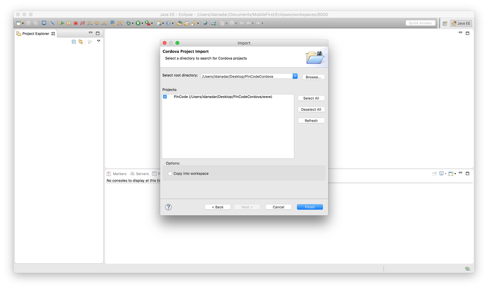
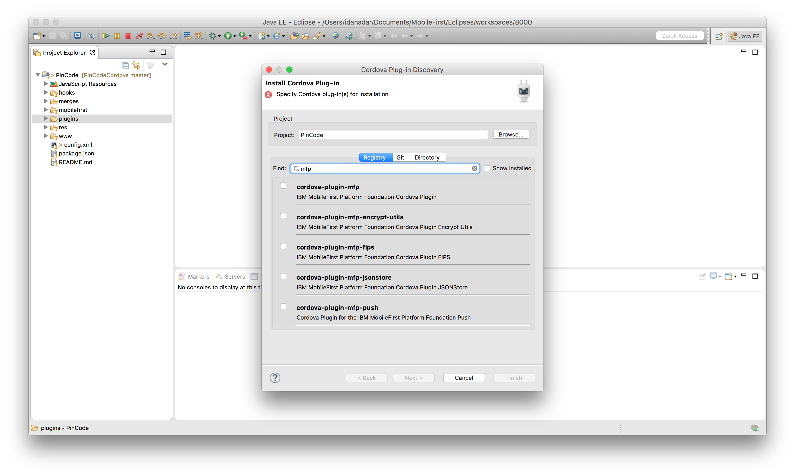

<!-- NLS_CHARSET=UTF-8 -->
## 概説
{: #overview }
Cordova CLI を使用することで Cordova アプリケーションを作成および管理できます。 [THyM](https://www.eclipse.org/thym/) プラグインをすると、Eclipse IDE でも同じことが行えます。

THyM は、Eclipse 内での Cordova プロジェクトのインポートおよび管理のサポートを提供します。 新規 Cordova プロジェクトを作成できるほか、既存の Cordova プロジェクトをインポートできます。 また、このプラグインを通じて、プロジェクトに Cordova プラグインをインストールすることもできます。

THyM について詳しくは、[公式 Web サイト](https://www.eclipse.org/thym/)を参照してください。

Eclipse 向け {{ site.data.keys.mf_studio }} プラグインは、Eclipse IDE にさまざまな {{ site.data.keys.product_adj }} コマンドを公開します。
具体的には、Open Server Console、Preview App、Register App、Encrypt App、Pull App、Push App、Update App といったコマンドが提供されます。

このチュートリアルでは、THyM プラグインおよび MobileFirst Eclipse プラグインのインストールについて、順を追って説明します。

**前提条件:**

* {{ site.data.keys.mf_server }} をローカルで稼働させるか、またはリモートで稼働する {{ site.data.keys.mf_server }} がある。
* {{ site.data.keys.mf_cli }} が開発者のワークステーションにインストールされている。

#### ジャンプ先:
{: #jump-to }
* [{{ site.data.keys.mf_studio }} プラグインのインストール](#installing-the-mobilefirst-studio-plug-in)
* [THyM プラグインのインストール](#installing-the-thym-plug-in)
* [Cordova プロジェクトの作成](#creating-a-cordova-project)
* [既存の Cordova プロジェクトのインポート](#importing-an-existing-cordova-project)
* [Cordova プロジェクトへの {{ site.data.keys.product_adj }} SDK の追加](#adding-the-mobilefirst-sdk-to-cordova-project)
* [{{ site.data.keys.product_adj }} コマンド](#mobilefirst-commands)
* [ヒント](#tips-and-tricks)

## {{ site.data.keys.mf_studio }} プラグインのインストール
{: #installing-the-mobilefirst-studio-plug-in}
1. Eclipse 内で、**「ヘルプ」→「Eclipse マーケットプレイス...」**をクリックします。
2. 「検索」フィールドで「{{ site.data.keys.product_adj }}」を検索して、「実行」をクリックします。
3. 「インストール」をクリックします。

	

4. インストール・プロセスを完了します。
5. Eclipse を再始動してインストールを有効にします。

## THyM プラグインのインストール
{: #installing-the-thym-plug-in }
**注:** THyM を実行するには、Eclipse Mars 以降を稼働させる必要があります。

1. Eclipse 内で、**「ヘルプ」→「Eclipse マーケットプレイス...」**をクリックします。
2. 「検索」フィールドで「thym」を検索して、「実行」をクリックします。
3. Eclipse Thym に対応する「インストール」をクリックします。

	

4. インストール・プロセスを完了します。
5. Eclipse を再始動してインストールを有効にします。

## Cordova プロジェクトの作成
{: #creating-a-cordova-project }
このセクションでは、THyM を使用して新規 Cordova プロジェクトを作成する方法を説明します。

1. Eclipse 内で、**「ファイル」→「新規」→「その他...」**をクリックします。
2. 「Cordova」を検索してオプションを絞り込み、**「Mobile」**ディレクトリー内の**「Hybrid Mobile (Cordova) Application Project」**を選択して、**「次へ」**をクリックします。

	

3. プロジェクトに名前を付け、**「次へ (Next)」**をクリックします。

	

4. プロジェクト用に必要なプラットフォームを追加し、**「完了」**をクリックします。

**注**: 作成後に追加のプラットフォームが必要になった場合は、[プラットフォームの追加](#adding-platforms)を参照してください。

## 既存の Cordova プロジェクトのインポート
{: #importing-an-existing-cordova-project }
このセクションでは、既に Cordova CLI を使用して作成済みの既存の Cordova プロジェクトをインポートする方法を説明します。

1. Eclipse 内で、**「ファイル」→「インポート...」**をクリックします。
2. **Mobile** ディレクトリー内の**「Import Cordova Project」**を選択して、**「次へ」>**をクリックします。
3. **「参照...」**をクリックし、既存の Cordova プロジェクトのルート・ディレクトリーを選択します。
4. 「プロジェクト」セクションでプロジェクトにチェックが付いていることを確認し、**「完了」**をクリックします。

いかなるプラットフォームも持たないプロジェクトをインポートすると、次のエラーが表示されます。このエラーの解決方法については、 [プラットフォームの追加](#adding-platforms)セクションを参照してください。

**注**: インポート後に追加のプラットフォームが必要になった場合は、[プラットフォームの追加](#adding-platforms)を参照してください。

## Cordova プロジェクトへの {{ site.data.keys.product_adj }} SDK の追加
{: #adding-the-mobilefirst-sdk-to-cordova-project }
Eclipse に [THyM をインストール](#installing-the-thym-plug-in)し [{{ site.data.keys.mf_cli }} プラグイン](#installing-the-mobilefirst-studio-plug-in)をインストールした後、[Cordova プロジェクトを作成](#creating-a-cordova-project)、または [Cordova プロジェクトをインポート](#importing-an-existing-cordova-project)したら、以下の手順に従って Cordova プラグイン経由で {{ site.data.keys.product_adj }} SDK をインストールできます。

1. プロジェクト・エクスプローラーで、**plugins** ディレクトリーを右クリックし、**「Install Cordova Plug-in」**を選択します。
2. 表示されたダイアログ・ボックスの「Registry」タブで**「mfp」**を検索し、**「cordova-plugin-mfp」**を選択して、**「完了」**をクリックします。

	

## {{ site.data.keys.product_adj }} コマンド
{: #mobilefirst-commands }
{{ site.data.keys.product }} ショートカットにアクセスするには、プロジェクトのルート・ディレクトリーを右クリックして**「IBM MobileFirst Foundation」**に移動します。

ここでは、以下のコマンドから選択できます。

| メニュー・オプション         | アクション                                                                                                                                       | MobileFirst コマンド・ライン・インターフェースで同等のコマンド |
|---------------------|----------------------------------------------------------------------------------------------------------------------------------------------|-----------------------------------------------|
| サーバー・コンソールを開く | サーバー定義が存在する場合は、コンソールを開くと、指定したサーバーのアクションを表示できます。                                    | mfpdev server console                         |
| アプリケーションのプレビュー         | ブラウザーのプレビュー・モードでアプリケーションを開きます。                                                                                                   | ブラウザーのプレビュー・モードでアプリケーションを開きます。    |
| アプリケーションの登録        | サーバー定義で指定されているサーバーにアプリケーションを登録します。                                                              | mfpdev app register                           |
| アプリケーションの暗号化         | アプリケーションに Web リソース暗号化ツールを実行します。                                                                                           | mfpdev app webencrypt                         |
| アプリケーションのプル            | サーバー定義で指定されているサーバーから既存のアプリケーション構成を取得します。                                         | mfpdev app pull                               |
| アプリケーションのプッシュ            | 別のアプリケーションで再使用できるように、ビルド定義に指定されているサーバーに、現在のアプリケーションのアプリケーション構成を送信します。 | mfpdev app push                               |
| 更新されたアプリケーション         | www フォルダーの内容を .zip ファイルにパッケージし、サーバー上のバージョンをこのパッケージで置き換えます。                             | mfpdev app webupdate                          |

## ヒント
{: #tips-and-tricks }

### 外部 IDE 関連
{: #external-ides }
外部 IDE (Android Studio や Xcode) を使用してデバイスのテストやデバイスへのデプロイを行う必要がある場合、これらをコンテキスト・メニューを使用して行うことができます。

**注**: プロジェクトを手動で Android Studio にインポートして Gradle 構成をセットアップしてから、Eclipse から起動してください。  そうしないと、不要な手順やエラーが発生する可能性があります。  Android Studio のインポートで、**「Import project (Eclipse, ADT, Gradle, etc.)」**を選択し、プロジェクトに移動して、**platforms** ディレクトリー内にある **android** ディレクトリーを選択します。

Eclipse のプロジェクト・エクスプローラーで目的のプラットフォームを右クリックし (つまり **platforms** ディレクトリーの **android** または **ios**)、コンテキスト・メニューの**「実行」**にカーソルを置き、適切な外部 IDE を選択します。

### プラットフォームの追加
{: #adding-platforms }

追加のプラットフォームは、単純なプロセスであり、THyM プラグインで直感的になることはありません。 この同じタスクを実行するには、次の 2 とおりの方法があります。

1. プロパティーを使用する方法
	1. プロジェクトを右クリックして、コンテキスト・メニューから**「プロパティー」**を選択します。
	1. 表示されたダイアログで、左側のメニューから**「Hybrid Mobile Engine」**を選択します。
	1. このペインで、目的のプラットフォームを選択またはダウンロードできます。

1. ターミナルを使用する方法
	1. プロジェクトを右クリックして**「表示」**にカーソルを置き、コンテキスト・メニューから**「ターミナル」**を選択します。
	1. これで Eclipse の「コンソール」の横にタブが追加されるはずです。
	1. ここで、Cordova CLI コマンドを使用してプラットフォームを手動で追加できるようになります。
		*  `cordova platform ls` を実行すると、インストールされて使用可能になっているプラットフォームがリストされます。
		*  `cordova platform add <platform>` (ここで、*<platform>* は目的のプラットフォーム) を実行すると、指定したプラットフォームがプロジェクトに追加されます。
		*  Cordova プラットフォーム固有のコマンドについて詳しくは、<a href="https://cordova.apache.org/docs/en/latest/reference/cordova-cli/#cordova-platform-command" target="blank">Cordova プラットフォーム・コマンド資料</a>を参照してください。

### デバッグ・モード
{: #debug-mode }
デバッグ・モードを使用可能にすると、アプリケーションをブラウザーでプレビューしながら、デバッグ・レベルのログを Eclipse コンソールで確認できます。  デバッグ・モードを使用可能にするには、次のようにします。

1. Eclipse の「設定」を開きます。
2. **「MobileFirst Studio Plugins」**を選択して、このプラグインの設定ページを表示します。
3. **「デバッグ・モードを使用可能にする」**チェック・ボックスが選択されていることを確認した後、**「適用」→「OK」**をクリックします。

### ライブ・アップデート
{: #live-update }
アプリケーションをプレビューしながら、ライブ・アップデートを使用できます。 アップデートを実行して変更を保存すると、プレビューで変更の内容が自動リフレッシュされることを確認できます。

### {{ site.data.keys.mf_server }} の Eclipse への統合
{: #integrating-mobilefirst-server-into-eclipse }
{{ site.data.keys.mf_dev_kit }} を使用すると、[{{ site.data.keys.mf_server }} を Eclipse](../../installation-configuration/development/mobilefirst/using-mobilefirst-server-in-eclipse) で実行し、上記機能を結合することで、より統合された開発環境を形成することができます。

### デモ・ビデオ
{: #demo-video }

	

   		<iframe title="デモ・ビデオ" src="https://www.youtube.com/embed/yRe2AprnUeg"></iframe>
	

