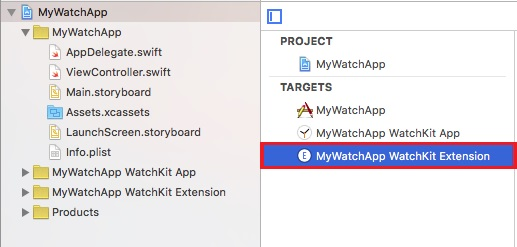

<!-- NLS_CHARSET=UTF-8 -->
## 概説
{: #overview }
この例では、{{ site.data.keys.product_adj }} フレームワークを使用して watchOS 2 以降用の開発環境をセットアップする方法を学習します。 この例は、watchOS 2 を使用して作成され記述されていますが、watchOS 3 でも正常に動作します。

>**注:** アプリケーション認証性フィーチャーは、*8.0.0.0-MFPF-IF201903190949-CDUpdate-05* 以降 watchOS SDK でサポートされます。

## セットアップ
{: #setup }
watchOS 用の開発環境をセットアップするには、Xcode プロジェクトを作成し、watchOS フレームワークを追加し、必要なターゲットをセットアップします。

1. Xcode で watchOS 2 アプリケーションを作成します。
    * **「ファイル (File)」 → 「新規 (New)」 → 「プロジェクト (Project)」**オプションを選択します。 **「新規プロジェクト用のテンプレートの選択 (Choose a template for your new project)」**ダイアログが表示されます。
    * **「watchOS2/Application」**オプションを選択し、**「次へ (Next)」**をクリックします。
    * プロジェクトに名前を付け、**「次へ (Next)」**をクリックします。
    * ナビゲーション・ダイアログからプロジェクト・フォルダーを選択します。

    プロジェクト・ナビゲーション・ツリーに、メイン・アプリケーション・フォルダーと **[project name] WatchKit Extension** フォルダー、およびターゲットが含まれるようになります。

    

2. {{ site.data.keys.product_adj }} watchOS フレームワークを追加します。
    * CocoaPods を使用して必要なフレームワークをインストールするには、[{{ site.data.keys.product_adj }} ネイティブ SDK の追加](../../application-development/sdk/ios/#adding-support-for-apple-watchos)チュートリアルを参照してください。
    * 必要なフレームワークを手動でインストールするには、次のようにします。
        * {{ site.data.keys.mf_console }} のダウンロード・センターから watchOS フレームワークを取得します。
        * 左側のナビゲーション・ペインで **[project name] WatchKit Extension** フォルダーを選択します。
        * **「ファイル (File)」**メニューから**「ファイルの追加 (Add Files)」**を選択します。
        * **「オプション (Options)」**ボタンをクリックし、以下を選択します。
            * **「必要な場合は項目をコピー (Copy items if needed)」**オプションおよび**「グループを作成 (Create groups)」**オプション
            * **「ターゲットに追加 (Add to targets)」**セクションの **[project name] WatchKit Extension**。
        * **「追加」**をクリックします。

        これで、**「ターゲット (Targets)」**セクションで **[project name] WatchKit Extension** を選択すると、次のようになります。
            * **「ビルド設定 (Build Settings)」**タブの**「検索パス (Search Paths)」**セクションで、**「フレームワーク検索パス (Framework Search Paths)」**設定にフレームワーク・パスが表示されます。
            * **「ビルド・フェーズ (Build Phases)」**タブの**「バイナリーとライブラリーのリンク (Link Binary With Libraries)」**セクションに、次のように **IBMMobileFirstPlatformFoundationWatchOS.framework** ファイルがリストされます。
            

        > **注:** WatchOS 2 にはビットコードが必要です。 Xcode 7 以降、**「ビルド・オプション (Build Options)」**は**「ビットコードを有効にする - はい (Enable Bitcode Yes)」**に設定されます (**「ビルド設定 (Build Settings)」**タブの**「ビルド・オプション (Build Options)」**セクション)。

3. メイン・アプリケーションと WatchKit Extension の両方をサーバーに登録します。 次のような各バンドル ID に対して、`mfpdev app register` を実行します (または {{ site.data.keys.mf_console }} から登録します)。
    * com.worklight.[project_name]
    * com.worklight.[project_name].watchkitextension

4. Xcode で、「ファイル (File)」->「ファイルの追加 (Add File)」メニューから、mfpdev コマンドで作成された mfpclient.plist ファイルにナビゲートし、それをプロジェクトに追加します。
    * ファイルを選択して **「ターゲット・メンバーシップ (Target Membership)」**ボックスを表示します。 **WatchOSDemoApp** に加えて、**WatchOSDemoApp WatchKit Extension** ターゲットを選択します。

これで、Xcode プロジェクトには、それぞれ別々に開発できるメイン・アプリケーションと watchOS 2 アプリケーションが含まれるようになります。 Swift の場合、watchOS 2 アプリケーションのエントリー・ポイントは、**[project name] watchKit Extension** フォルダー内の **InterfaceController.swift** ファイルです。 Objective-C の場合、エントリー・ポイントは、**ViewController.m** ファイルです。

## iPhone アプリケーションおよび watchOS アプリケーション向けの {{ site.data.keys.product_adj }} セキュリティーのセットアップ
{: #setting-up-mobilefirst-security-for-the-iphone-app-and-the-watchos-app }
Apple Watch デバイスと iPhone デバイスは物理的に異なります。 したがって、それぞれのセキュリティー検査は、使用可能な入力デバイスに適したものでなければなりません。 例えば、Apple Watch では数字パッドに限定されていて、通常のユーザー名/パスワードのセキュリティー検査は許可されません。 したがって、サーバー上の保護リソースへのアクセスは PIN コードを使用して有効にできます。 これらの相違点や似たような相違点のため、ターゲットごとに異なるセキュリティー検査を適用することが必要です。

以下に、iPhone と Apple Watch の両方をターゲットとするアプリケーションの作成例を示します。 このアーキテクチャーでは、それぞれが独自のセキュリティー検査を保有することができます。 これらの異なるセキュリティー検査は、各ターゲット用の機能をどのように設計するのかを示す例に過ぎません。 追加のセキュリティー検査が可能な場合もあります。

1. 保護リソースによって定義されたスコープおよびセキュリティー検査を判別します。
2. {{ site.data.keys.mf_console }} で、次のようにします。
    * サーバーで以下の両方のアプリケーションが登録済みであることを確認します。
        * com.worklight.[project_name]
        * com.worklight.[project_name].watchkitextension
    * scopeName を、定義されたセキュリティー検査にマップします。
        * com.worklight.[project_name] はユーザー名/パスワードの検査にマップします。
        * com.worklight.[project_name].watchkitapp.watchkitextension は PIN コードのセキュリティー検査にマップします。

## watchOS の制限事項
{: #watchos-limitation }
{{ site.data.keys.product_adj }} アプリケーションにフィーチャーを追加するオプション・フレームワークは、watchOS 開発用には提供されていません。 他の一部のフィーチャーも、watchOS デバイスまたは Apple Watch デバイスによる制約によって制限を受けます。

| 機能 | 制限事項 |
|---------|------------|
| openSSL | サポートされない |
| JSONStore| サポートされない |
| 通知 | サポートされない |
| {{ site.data.keys.product_adj }} コードによって表示されるメッセージ・アラート | サポートされない |
| リモートでの無効化/通知	| カスタマイズが必要 (下記参照) |
| ユーザー名/パスワードでのセキュリティー検査 | CredentialsValidation セキュリティー検査を使用します |

### リモートでの無効化/通知
{: #remote-disablenotify }
{{ site.data.keys.mf_console }} を使用して、実行しているバージョンに基づいてクライアント・アプリケーションへのアクセスを無効化する (そしてメッセージを返す) ように {{ site.data.keys.mf_server }} を構成できます ([保護リソースへのアプリケーション・アクセスのリモートでの無効化 (Remotely disabling application access to protected resources)](../../administering-apps/using-console/#remotely-disabling-application-access-to-protected-resources)を参照)。 デフォルト UI アラートを提供する 2 つのオプションがあります。

* アプリケーションはアクティブだが、メッセージが送信される場合: **アクティブ、通知**
* アプリケーションが期限切れであり、アクセスが拒否される場合: **アクセス拒否**

watchOS の場合:

* アプリケーションが**「アクティブ、通知」**に設定されているメッセージを表示するには、カスタムのリモート無効化チャレンジ・ハンドラーが実装され、登録される必要があります。 このカスタム・チャレンジ・ハンドラーは、セキュリティー検査 `wl_remoteDisableRealm` で初期化される必要があります。
* アクセスが無効化されている (**「アクセス拒否」**) 場合、クライアント・アプリケーションは、失敗したコールバックまたは要求代行ハンドラーでエラー・メッセージを受け取ります。 開発者は、このエラーをどのように処理するのか (UI を介してユーザーに通知するか、ログに書き込むかのいずれか) を決定できます。 カスタム・チャレンジ・ハンドラーの作成には、上記以外の方法も使用できます。
