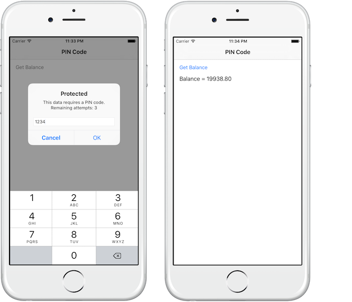

<!-- NLS_CHARSET=UTF-8 -->
## 概説
{: #overview }
保護リソースへのアクセスを試みると、クライアントにはサーバー (セキュリティー検査) から、クライアントが対処する必要がある 1 つ以上の**チャレンジ**を含んだリストが返信されます。  
このリストは、`JSON` オブジェクトとして届けられ、セキュリティー検査名とともにオプションで追加データの `JSON` がリストされています。

```json
{
  "challenges": {
    "SomeSecurityCheck1":null,
    "SomeSecurityCheck2":{
      "some property": "some value"
    }
  }
}
```

その後、クライアントは、セキュリティー検査ごとに**チャレンジ・ハンドラー**を登録しなければなりません。  
チャレンジ・ハンドラーによって、そのセキュリティー検査特定のクライアント・サイドの動作が定義されます。

## チャレンジ・ハンドラーの作成
{: #creating-the-challenge-handler }
チャレンジ・ハンドラーは、{{ site.data.keys.mf_server }} によって送信されるチャレンジを処理するクラスです。例えば、ログイン画面を表示したり、資格情報を収集したり、それらを元のセキュリティー検査に送信したりします。

この例の場合、セキュリティー検査は `PinCodeAttempts` であり、これは [CredentialsValidationSecurityCheck の実装](../security-check)で定義したものです。 このセキュリティー検査によって送信されるチャレンジには、ログインを試行できる残りの回数 (`remainingAttempts`) と、オプションで `errorMsg` が含まれます。

`SecurityCheckChallengeHandler` を継承する Swift クラスを作成します。

```swift
open class PinCodeChallengeHandler : SecurityCheckChallengeHandlerSwift {

}
```

## チャレンジの処理
{: #handling-the-challenge }
`SecurityCheckChallengeHandler` プロトコルが求める最小要件は、`handleChallenge` メソッドを実装することです。このメソッドは、ユーザーに対して資格情報を求めるプロンプトを出します。 `handleChallenge` メソッドは、チャレンジ `JSON` を `Dictionary` として受け取ります。

この例では、PIN コードの入力をユーザーに要求するアラートが出されます。

```swift
override open func handleChallenge(challengeResponse: [AnyHashable: Any]!) {
  var errorMsg : String
  if challengeResponse!["errorMsg"] is NSNull {
      errorMsg = "This data requires a PIN code."
    }
  else{
      errorMsg = challengeResponse!["errorMsg"] as! String
  }
  let remainingAttempts = challengeResponse!["remainingAttempts"] as! Int + 2;

  showPopup(errorMsg,remainingAttempts: remainingAttempts);
}
```

> `showPopup` の実装がサンプル・アプリケーションに組み込まれています。

資格情報が正しくない場合、フレームワークによって再度 `handleChallenge` が呼び出されます。

## チャレンジ応答の送信
{: #submitting-the-challenges-answer }
UI から資格情報が収集された後は、`WLChallengeHandler` の `submitChallengeAnswer(answer: [NSObject : AnyObject]!)` メソッドを使用して、セキュリティー検査に応答を返信します。 この例の場合、`PinCodeAttempts` は、提供された PIN コードを含んでいる `pin` というプロパティーを必要とします。

```swift
self.submitChallengeAnswer(["pin": pinTextField.text!])
```

## チャレンジのキャンセル
{: #cancelling-the-challenge }
UI で**「キャンセル」**ボタンがクリックされたときなど、フレームワークに対して、このチャレンジを完全に破棄するように指示する必要が生じる場合があります。

これを実現するには、以下を呼び出します。

```swift
self.cancel()
```

## 失敗の処理
{: #handling-failures }
一部のシナリオでは、失敗がトリガーされる可能性があります (例えば、最大試行回数に達したときなど)。 これらを処理するには、`SecurityCheckChallengeHandler` の `handleFailure` メソッドを実装します。
パラメーターとして渡される `Dictionary` の構造は、失敗の性質に大きく依存します。

```swift
override open func handleFailure(failureResponse: [AnyHashable: Any]!) {
    if let errorMsg = failureResponse["failure"] as? String {
        showError(errorMsg)
    }
    else{
        showError("Unknown error")
    }
}
```

> `showError` の実装がサンプル・アプリケーションに組み込まれています。

## 成功の処理
{: #handling-successes }

オプションで、SecurityCheckChallengeHandler の `handleSuccess(successResponse: [AnyHashable: Any]!)` メソッドを実装すると、フレームワークがチャレンジ・ハンドラー・フローを閉じる前に、何かの処理を行うようにできます。この場合も、success Dictionary のコンテンツおよび構造は、セキュリティー検査が送信する内容に依存します。

## チャレンジ・ハンドラーの登録
{: #registering-the-challenge-handler }
チャレンジ・ハンドラーが正しいチャレンジを listen するためには、フレームワークに対して、チャレンジ・ハンドラーと特定のセキュリティー検査名を関連付けるように指示する必要があります。

そのためには、以下のようにセキュリティー検査を指定してチャレンジ・ハンドラーを初期設定します。

```swift
var someChallengeHandler = SomeChallengeHandler(securityCheck: "securityCheckName”);
```

次に、チャレンジ・ハンドラー・インスタンスを**登録**する必要があります。

```swift
WLClientSwift.sharedInstance().registerChallengeHandler(challengeHandler: someChallengeHandler);
```

以下は、1 行にまとめた例です。

```swift
WLClientSwift.sharedInstance().registerChallengeHandler(challengeHandler: PinCodeChallengeHandler(securityCheck: securityCheck));
```

**注:** チャレンジ・ハンドラーの登録は、アプリケーション・ライフサイクル全体の中で 1 回のみ実行します。 iOS AppDelegate クラスを使用してこれを行うことをお勧めします。

## サンプル・アプリケーション
{: #sample-application }
サンプルの **PinCodeSwift** は、`WLResourceRequest` を使用して銀行の残高を照会する iOS Swift アプリケーションです。  
このメソッドは、PIN コードと、最大 3 回までの試行によって保護されています。

[ここをクリック](https://github.com/MobileFirst-Platform-Developer-Center/SecurityCheckAdapters/tree/release80) して SecurityAdapters Maven プロジェクトをダウンロードします。  
[ここをクリック](https://github.com/MobileFirst-Platform-Developer-Center/PinCodeSwift/tree/release80) して iOS Swift ネイティブ・プロジェクトをダウンロードします。

### サンプルの使用法
{: #sample-usage }
サンプルの README.md ファイルの指示に従ってください。


