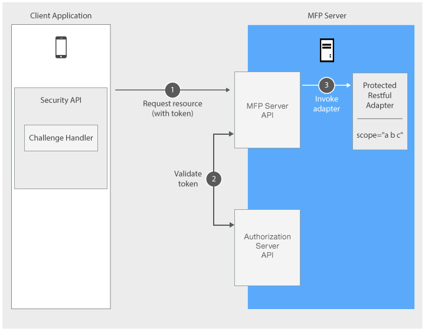

<!-- NLS_CHARSET=UTF-8 -->
## 概説
{: #overview }
{{ site.data.keys.product_adj }} セキュリティー・フレームワークは、[OAuth 2.0](http://oauth.net/) プロトコルに基づいています。このプロトコルに従って、リソースは、そのリソースにアクセスするために必要な許可を定義する**スコープ**によって保護されます。保護リソースにアクセスするために、クライアントは一致する**アクセス・トークン**を提供する必要があります。アクセス・トークンは、クライアントに付与される許可のスコープをカプセル化したものです。

OAuth プロトコルは、許可サーバーのロールと、リソースがホストされているリソース・サーバーのロールを分離します。

* 許可サーバーは、クライアント許可およびトークン生成を管理します。
* リソース・サーバーは、許可サーバーを使用して、クライアントから提供されたアクセス・トークンを検証し、要求されたリソースの保護スコープに一致しているか確認します。

セキュリティー・フレームワークは、OAuth プロトコルを実装する許可サーバーに基づいて構築され、クライアントがアクセス・トークンを取得するために対話する OAuth エンドポイントを公開します。セキュリティー・フレームワークは、許可サーバーと基礎となる OAuth プロトコルをベースとしたカスタム許可ロジックを実装するためのビルディング・ブロックを提供します。  
デフォルトでは、{{ site.data.keys.mf_server }} が**許可サーバー**としても機能します。しかし、IBM WebSphere DataPower アプライアンスを許可サーバーとして機能するように構成し、{{ site.data.keys.mf_server }} と対話するように構成することもできます。

クライアント・アプリケーションは、その後、これらのトークンを使用して**リソース・サーバー**上のリソースにアクセスできます。リソース・サーバーには、{{ site.data.keys.mf_server }} 自体または外部サーバーを使用できます。リソース・サーバーはトークンの妥当性をチェックし、要求されたリソースへのアクセスをクライアントに認可していいかを検査します。リソース・サーバーと許可サーバーを分離することで、{{ site.data.keys.mf_server }} の外部で稼働するリソースに対してセキュリティーを適用することが可能になります。

アプリケーション開発者は、各保護リソースに必要なスコープを定義し、**セキュリティー検査**および**チャレンジ・ハンドラー**を実装することで、リソースへのアクセスを保護します。サーバー・サイドのセキュリティー・フレームワークとクライアント・サイド API は、OAuth メッセージ交換と許可サーバーとの対話を透過的に処理し、開発者が許可ロジックにのみ焦点を当てることができるようにします。

#### ジャンプ先:
{: #jump-to }
* [許可エンティティー](#authorization-entities)
* [リソースの保護](#protecting-resources)
* [許可フロー](#authorization-flow)
* [次に使用するチュートリアル](#tutorials-to-follow-next)

## 許可エンティティー
{: #authorization-entities }
### アクセス・トークン
{: #access-token }
{{ site.data.keys.product_adj }} アクセス・トークンは、クライアントの許可アクセス権を記述したデジタル署名済みエンティティーです。特定のスコープについてクライアントの認証要求が許可され、クライアントが認証されると、許可サーバーのトークン・エンドポイントは、要求されたアクセス・トークンを含む HTTP 応答をクライアントに送信します。

#### 構造
{: #structure }
{{ site.data.keys.product_adj }} アクセス・トークンには、以下の情報が含まれます。

* **クライアント ID**: クライアントの固有 ID。
* **スコープ**: トークンが適用される有効範囲 (OAuth スコープを参照)。このスコープには、[必須アプリケーション・スコープ](#mandatory-application-scope)は含まれません。
* **トークンの有効期限**: トークンが無効 (期限切れ) になる時間 (秒数)。

#### トークンの有効期限
{: #token-expiration }
付与されたアクセス・トークンは、有効期限時刻が経過するまで有効になります。アクセス・トークンの有効期限時刻は、スコープ内のすべてのセキュリティー検査の有効期限時刻の中で最短の有効期限時刻に設定されます。ただし、最短の有効期限時刻までの期間が、アプリケーションの最大トークン有効期限期間よりも長い場合、トークンの有効期限時刻は現在時刻に最大有効期限期間を加算したものに設定されます。デフォルトのトークンの最大有効期間は 3,600 秒 (1 時間) ですが、`maxTokenExpiration` プロパティーの値を設定することで、期間を構成できます。『アクセス・トークンの最大有効期間の構成』を参照してください。

<div class="panel-group accordion" id="configuration-explanation" role="tablist" aria-multiselectable="false">
    <div class="panel panel-default">
        <div class="panel-heading" role="tab" id="access-token-expiration">
            <h4 class="panel-title">
                <a class="preventScroll" role="button" data-toggle="collapse" data-parent="#access-token-expiration" data-target="#collapse-access-token-expiration" aria-expanded="false" aria-controls="collapse-access-token-expiration"><b>アクセス・トークンの最大有効期間の構成</b></a>
            </h4>
        </div>

        <div id="collapse-access-token-expiration" class="panel-collapse collapse" role="tabpanel" aria-labelledby="access-token-expiration">
            <div class="panel-body">
            <p>以下のいずれかの選択肢の方法により、アプリケーションのアクセス・トークンの最大有効期間を構成します。</p>
            <ul>
                <li>{{ site.data.keys.mf_console }} の使用
                    <ul>
                        <li><b>「 [ご使用のアプリケーション] 」→「セキュリティー」</b>タブを選択します。</li>
                        <li><b>「トークン構成」</b>セクションで、<b>「トークンの最大有効期間 (秒)」</b>フィールドの値を希望の値に設定し、**「保存」**をクリックします。いつでもこの手順を繰り返してトークンの最大有効期間を変更することや、<b>「デフォルトに戻す」</b>を選択してデフォルト値に戻すことが可能です。</li>
                    </ul>
                </li>
                <li>アプリケーションの構成ファイルの編集
                    <ol>
                        <li><b>コマンド・ライン・ウィンドウ</b>で、プロジェクトのルート・フォルダーにナビゲートし、<code>mfpdev app pull</code> を実行します。</li>
                        <li><b>[project-folder]\mobilefirst</b> フォルダーにある構成ファイルを開きます。</li>
                        <li><code>maxTokenExpiration</code> プロパティーを定義し、その値をアクセス・トークンの最大有効期間 (秒数) に設定して、ファイルを編集します。


{
    ...
    "maxTokenExpiration": 7200
}
</li>
                        <li>コマンド <code>mfpdev app push</code> を実行することで、更新済み構成 JSON ファイルをデプロイします。</li>
                    </ol>
                </li>
            </ul>
                
            <br/>
            <a class="preventScroll" role="button" data-toggle="collapse" data-parent="#access-token-expiration" data-target="#collapse-access-token-expiration" aria-expanded="false" aria-controls="collapse-access-token-expiration"><b>セクションを閉じる</b></a>
            </div>
        </div>
    </div>
</div>

<div class="panel-group accordion" id="response-access-token" role="tablist" aria-multiselectable="false">
    <div class="panel panel-default">
        <div class="panel-heading" role="tab" id="response-structure">
            <h4 class="panel-title">
                <a class="preventScroll" role="button" data-toggle="collapse" data-parent="#response-structure" data-target="#collapse-response-structure" aria-expanded="false" aria-controls="collapseresponse-structure"><b>アクセス・トークン応答構造</b></a>
            </h4>
        </div>

        <div id="collapse-response-structure" class="panel-collapse collapse" role="tabpanel" aria-labelledby="response-structure">
            <div class="panel-body">
                <p>アクセス・トークン要求に対する成功時の HTTP 応答には、アクセス・トークンおよび追加データが入っている JSON オブジェクトが含まれます。以下に、許可サーバーからの有効なトークンの応答の例を示します。</p>


HTTP/1.1 200 OK
Content-Type: application/json
Cache-Control: no-store
Pragma: no-cache
{
    "token_type": "Bearer",
    "expires_in": 3600,
    "access_token": "yI6ICJodHRwOi8vc2VydmVyLmV4YW1",
    "scope": "scopeElement1 scopeElement2"
}


<p>トークン応答 JSON オブジェクトには、以下のプロパティー・オブジェクトが含まれます。</p>
<ul>
    <li><b>token_type</b>: トークン・タイプは常に <i>"Bearer"</i> (<a href="https://tools.ietf.org/html/rfc6750">OAuth 2.0 Bearer Token Usage 仕様</a>に準拠)。</li>
    <li><b>expires_in</b>: アクセス・トークンの有効期限を表す時間 (秒数)。</li>
    <li><b>access_token</b>: 生成されたアクセス・トークン (実際のアクセス・トークンは、例で示されているものよりも長くなります)。</li>
    <li><b>scope</b>: 要求されたスコープ。</li>
</ul>

<p><b>expires_in</b> および <b>scope</b> の情報は、トークン自体 (<b>access_token</b>) にも含まれています。</p>

<blockquote><b>注:</b> 有効なアクセス・トークン応答の構造を把握しておく必要があるのは、ユーザー自身が下位の <code>WLAuthorizationManager</code> クラスを使用してクライアントと許可サーバーおよびリソース・サーバーとの間の OAuth 対話を管理する場合、または機密クライアントを使用する場合です。保護リソースにアクセスするための OAuth フローをカプセル化する、上位 <code>WLResourceRequest</code> クラスを使用している場合は、セキュリティー・フレームワークが、ユーザーに代わって、アクセス・トークン応答の処理を行います。<a href="http://www.ibm.com/support/knowledgecenter/en/SSHS8R_8.0.0/com.ibm.worklight.dev.doc/dev/c_oauth_client_apis.html?view=kc#c_oauth_client_apis">クライアント・セキュリティー API</a> および<a href="confidential-clients">機密クライアント</a>を参照してください。</blockquote>

                <br/>
                <a class="preventScroll" role="button" data-toggle="collapse" data-parent="#response-structure" data-target="#collapse-response-structure" aria-expanded="false" aria-controls="collapse-response-structure"><b>セクションを閉じる</b></a>
            </div>
        </div>
    </div>
</div>

### セキュリティー検査
{: #security-check }
セキュリティー検査は、サーバー・サイドのアプリケーション・リソースを保護するためのセキュリティー・ロジックを実装するサーバー・サイド・エンティティーです。セキュリティー検査の簡単な例として、ユーザーの資格情報を受け取り、ユーザー・レジストリーに照らして資格情報を検査する、ユーザー・ログイン・セキュリティー検査があります。別の例として、事前定義されている {{ site.data.keys.product_adj }} アプリケーション認証性セキュリティー検査があります。これは、モバイル・アプリケーションの認証性を検査することで、アプリケーションのリソースへの不正なアクセスから保護します。同じセキュリティー検査を使用して、複数のリソースを保護することもできます。

セキュリティー検査は通常、クライアントが検査に合格するために特定の方法で応答する必要がある、セキュリティー・チャレンジを発行します。このハンドシェークは、OAuth アクセス・トークン獲得フローの一部として発生します。クライアントは**チャレンジ・ハンドラー**を使用して、セキュリティー検査のチャレンジを処理します。

#### 組み込みセキュリティー検査
{: #built-in-security-checks }
以下の事前定義セキュリティー検査を使用できます。

- [アプリケーション認証性](application-authenticity/)
- [LTPA ベースのシングル・サインオン (SSO)](ltpa-security-check/)
- [ダイレクト・アップデート](../application-development/direct-update)

### チャレンジ・ハンドラー
{: #challenge-handler }
クライアントは、保護リソースにアクセスしようとするとき、チャレンジを提示されることがあります。チャレンジは、クライアントがそのリソースへのアクセスを許可されていることを検査するためにサーバーが出す質問、セキュリティー・テスト、またはプロンプトです。一般的に、このチャレンジは、ユーザー名とパスワードなどの資格情報を要求することです。

チャレンジ・ハンドラーは、クライアント・サイド・セキュリティー・ロジックおよびそれに関連したユーザーとの対話を実装する、クライアント・サイド・エンティティーです。  
**重要**: チャレンジを受け取ると、それを無視することはできません。応答するか、あるいはキャンセルしなければなりません。チャレンジを無視すると、予期しない動作が発生するおそれがあります。

> セキュリティー検査について詳しくは、[セキュリティー検査の作成](creating-a-security-check/)チュートリアルを参照してください。また、チャレンジ・ハンドラーについては、[資格情報の検証](credentials-validation)チュートリアルを参照してください。

### 有効範囲
{: #scope }
**スコープ**を指定することにより、アダプターなどのリソースを無許可アクセスから保護できます。  

スコープは、ゼロ個以上の**スコープ・エレメント**をスペースで区切ったリストです。例えば、`element1 element2 element3` です。
{{ site.data.keys.product_adj }} セキュリティー・フレームワークでは、リソースに明示的にスコープが割り当てられていない場合でも、あらゆるアダプター・リソースにアクセス・トークンが要求されます。

#### スコープ・エレメント
{: #scope-element }
スコープ・エレメントには、以下のいずれかを指定できます。

* セキュリティー検査の名前。
* そのリソースで必要とされるセキュリティーのレベルを定義した任意のキーワード (`access-restricted`、`deletePrivilege` など)。このキーワードが後でセキュリティー検査にマップされます。

#### スコープ・マッピング
{: #scope-mapping }
デフォルトで、**スコープ**内に記述する**スコープ・エレメント**は、**同じ名前を持つセキュリティー検査**にマップされます。  
例えば、`PinCodeAttempts` というセキュリティー検査を作成した場合、同じ名前のスコープ・エレメントをスコープ内に使用できます。

スコープ・マッピングは、スコープ・エレメントからセキュリティー検査へのマップを可能にします。クライアントがスコープ・エレメントを要求すると、この構成によって、適用されるセキュリティー検査が定義されます。例えば、スコープ・エレメント `access-restricted` を `PinCodeAttempts` セキュリティー検査にマップできます。

どのアプリケーションがリソースにアクセスしようとしているかに応じてリソースを保護する方法を変える必要がある場合、スコープ・マッピングが便利です。  
同じスコープをゼロ個以上のセキュリティー検査のリストにマップすることもできます。

例えば、次のとおりです。  
scope = `access-restricted deletePrivilege`

* アプリケーション A
  * `access-restricted` は `PinCodeAttempts` にマップされます。
  * `deletePrivilege` は空ストリングにマップされます。
* アプリケーション B
  * `access-restricted` は `PinCodeAttempts` にマップされます。
  * `deletePrivilege` は `UserLogin` にマップされます。

> スコープ・エレメントを空ストリングにマップするには、**「新しいスコープ・エレメント・マッピングの追加」**ポップアップ・メニューでセキュリティー検査を何も選択しないでください。


必要な構成を指定してアプリケーションの構成 JSON ファイルを手動で編集し、変更を {{ site.data.keys.mf_server }} にプッシュして戻すこともできます。

1. **コマンド・ライン・ウィンドウ**から、プロジェクトのルート・フォルダーにナビゲートし、`mfpdev app pull` を実行します。
2. **[project-folder]\mobilefirst** フォルダーにある構成ファイルを開きます。
3. ファイルを編集して、`scopeElementMapping` プロパティーを定義します。このプロパティーには、データ・ペアを定義します。各ペアは、選択したスコープ・エレメントの名前と、そのエレメントのマップ先となるゼロ個以上のセキュリティー検査をスペースで区切ったストリングとで構成されます。例えば、次のとおりです。 

    ```xml
    "scopeElementMapping": {
        "UserAuth": "UserAuthentication",
        "SSOUserValidation": "LtpaBasedSSO CredentialsValidation"
    }
    ```
4. コマンド `mfpdev app push` を実行することで、更新済み構成 JSON ファイルをデプロイします。

> 更新済み構成をリモート・サーバーにプッシュすることもできます。[{{ site.data.keys.mf_cli }} を使用した {{ site.data.keys.product_adj }} 成果物の管理](../application-development/using-mobilefirst-cli-to-manage-mobilefirst-artifacts)チュートリアルを確認してください。

## リソースの保護
{: #protecting-resources }
OAuth モデルでは、保護リソースは、アクセス・トークンを必要とするリソースです。{{ site.data.keys.product_adj }} セキュリティー・フレームワークを使用して、{{ site.data.keys.mf_server }} のインスタンス上にホストされたリソースと外部サーバー上のリソースの両方を保護できます。リソースを保護するには、リソースのアクセス・トークンを取得するために必要な許可を定義するスコープをリソースに割り当てます。 

リソースはいろいろな方法で保護できます。

### 必須アプリケーション・スコープ
{: #mandatory-application-scope }
アプリケーション・レベルでは、アプリケーションによって使用されるすべてのリソースに適用されるスコープを定義できます。セキュリティー・フレームワークは、要求されたリソース・スコープのセキュリティー検査に加えて、これらの検査 (存在する場合) を実行します。

**注:**

* 必須アプリケーション・スコープは、[無保護リソース](#unprotected-resources)にアクセスする場合は適用されません。
* リソース・スコープに対して許可されたアクセス・トークンに、必須アプリケーション・スコープは含まれません。

<br/>
{{ site.data.keys.mf_console }} で、**「 [ご使用のアプリケーション] 」→「セキュリティー」タブ**を選択します。**「必須アプリケーション・スコープ」**の下で、**「スコープに追加」**をクリックします。


必要な構成を指定してアプリケーションの構成 JSON ファイルを手動で編集し、変更を {{ site.data.keys.mf_server }} にプッシュして戻すこともできます。

1. **コマンド・ライン・ウィンドウ**から、プロジェクトのルート・フォルダーにナビゲートし、`mfpdev app pull` を実行します。
2. **project-folder\mobilefirst** フォルダーにある構成ファイルを開きます。
3. `mandatoryScope` プロパティーを定義し、選択したスコープ・エレメントのスペース区切りリストが入ったスコープ・ストリングをプロパティー値に設定することで、ファイルを編集します。例えば、次のとおりです。 

   ```xml
   "mandatoryScope": "appAuthenticity PincodeValidation"
   ```
   
4. コマンド `mfpdev app push` を実行することで、更新済み構成 JSON ファイルをデプロイします。

> 更新済み構成をリモート・サーバーにプッシュすることもできます。[{{ site.data.keys.mf_cli }} を使用した {{ site.data.keys.product_adj }} 成果物の管理](../application-development/using-mobilefirst-cli-to-manage-mobilefirst-artifacts)チュートリアルを確認してください。

### リソース・レベル
{: #resource-level }
#### Java アダプター
{: #java-adapters }
`@OAuthSecurity` アノテーションを使用してリソース・メソッドのスコープを指定できます。

```java
@DELETE
@Path("/{userId}")
@OAuthSecurity(scope="deletePrivilege")
//This will serve: DELETE /users/{userId}
public void deleteUser(@PathParam("userId") String userId){
    ...
}
```

上記の例で、`deleteUser` メソッドはアノテーション `@OAuthSecurity(scope="deletePrivilege")` を使用しています。これは、このメソッドがスコープ・エレメント `deletePrivilege` を含んでいるスコープによって保護されていることを意味します。

* スコープは、スペースで区切られた複数のスコープ・エレメント (`@OAuthSecurity(scope="element1 element2 element3")`) で構成できます。
* `@OAuthSecurity` アノテーションを指定しない場合、また、スコープを空ストリングに設定した場合でも、{{ site.data.keys.product_adj }} セキュリティー・フレームワークは、あらゆる着信要求に対して引き続きアクセス・トークンを要求します。
* リソースのクラス・レベルで `@OAuthSecurity` アノテーションを使用して、Java クラス全体のスコープを定義することもできます。

#### JavaScript アダプター
{: #javascript-adapters }
アダプター XML ファイル内でスコープをプロシージャー定義に割り当てることで、JavaScript アダプター・プロシージャーを保護できます。

```xml
<procedure name="deleteUser" scope="deletePrivilege">
```

* スコープは、スペースで区切られた複数のスコープ・エレメント (`scope="element1 element2 element3"`) で構成できます。
* スコープをいっさい指定しない場合、または空ストリングを使用する場合でも、{{ site.data.keys.product_adj }} セキュリティー・フレームワークは、あらゆる着信要求に対して引き続きアクセス・トークンを要求します。

### 保護の無効化
{: #disabling-protection }
アノテーションの `enabled` エレメントのデフォルト値は `true` です。`enabled` エレメントが `false` に設定されている場合、`scope` エレメントは無視され、リソースおよびリソース・クラスは保護されません。  
**保護を無効化**すると、任意のクライアントがリソースにアクセスできます。すなわち、{{ site.data.keys.product_adj }} セキュリティー・フレームワークは、アクセス・トークンを要求**しません**。

**注:** 無保護クラスに含まれているリソース・メソッドにスコープを割り当てた場合、リソースのアノテーションでも enabled エレメントを false に設定していなければ、クラスのアノテーションに関係なく、そのメソッドは保護されます。

#### Java アダプター
{: #java-adapters-protection }
保護を無効にするには、`@OAuthSecurity(enabled=false)` を使用できます。

#### JavaScript アダプター
{: #javascript-adapters-protection }
保護を無効にするには、`secured="false"` を使用できます。

```xml
<procedure name="deleteUser" secured="false">
```

### 無保護リソース
{: #unprotected-resources }
無保護リソースは、アクセス・トークンを必要としないリソースです。{{ site.data.keys.product_adj }} セキュリティー・フレームワークは、無保護リソースへのアクセスを管理せず、また該当するリソースにアクセスするクライアントの ID を検証および検査しません。そのため、無保護リソースでは、ダイレクト・アップデート、デバイス・アクセスのブロック、リモート側でのアプリケーションの無効化などの機能はサポートされません。

### 外部リソース
{: external-resources }
外部リソースを保護するには、アクセス・トークン検証モジュールとともにリソース・フィルターを外部リソース・サーバーに追加します。トークン検証モジュールは、セキュリティー・フレームワークの許可サーバーのイントロスペクション・エンドポイントを使用して、リソースに対するアクセス権限を OAuth クライアントに付与する前に、{{ site.data.keys.product_adj }} アクセス・トークンを検証します。[{{ site.data.keys.product_adj }} ランタイム用の {{ site.data.keys.product_adj }} REST API](http://www.ibm.com/support/knowledgecenter/en/SSHS8R_8.0.0/com.ibm.worklight.apiref.doc/apiref/c_restapi_runtime_overview.html?view=kc#rest_runtime_api) を使用して、任意の外部サーバー用のアクセス・トークン検証モジュールを独自に作成できます。あるいは、[外部リソースの保護](protecting-external-resources)チュートリアルで概要を示しているように、外部 Java リソースを保護するために提供されているいずれかの {{ site.data.keys.product_adj }} 拡張機能を使用します。

## 許可フロー
{: #authorization-flow }
許可フローには、以下の 2 つのフェーズが含まれます。

1. クライアントがアクセス・トークンを取得する。
2. クライアントがトークンを使用して、保護リソースにアクセスする。

### アクセス・トークンの取得
{: #obtaining-an-access-token }
このフェーズで、クライアントはアクセス・トークンを受け取るために**セキュリティー検査**を受けます。

アクセス・トークンを要求する前に、クライアントは、自身を {{ site.data.keys.mf_server }} に登録します。登録の一部として、クライアントは、その ID 認証に使用される公開鍵を提供します。このフェーズは、モバイル・アプリケーション・インスタンスの存続期間で 1 回実行されます。アプリケーション認証性セキュリティー検査が有効である場合、アプリケーションの登録時にアプリケーションの認証性が検証されます。


1. クライアント・アプリケーションが、指定したスコープのアクセス・トークン取得要求を送信します。

    > クライアントは、特定のスコープを持つアクセス・トークンを要求します。要求するスコープは、クライアントがアクセスを希望する保護リソースのスコープと同じセキュリティー検査にマップされる必要があり、オプションで追加のセキュリティー検査にマップされる場合もあります。クライアントに保護リソースのスコープに関する予備知識がない場合、クライアントはまず空のスコープを持つアクセス・トークンを要求し、取得したトークンでリソースにアクセスすることができます。クライアントは、エラー 403 (禁止) の応答を受け取り、要求したリソースに必要なスコープを受け取ります。

2. クライアント・アプリケーションが、要求したスコープに従ってセキュリティー検査を受けます。

    > {{ site.data.keys.mf_server }} は、クライアントの要求のスコープがマップされた先のセキュリティー検査を実行します。許可サーバーは、そのような検査の結果に基づいて、クライアントの要求を許可または拒否します。必須アプリケーション・スコープが定義されている場合、要求されているスコープの検査に加えて、そのスコープのセキュリティー検査が実行されます。

3. チャレンジ・プロセスが正常に完了した後、クライアント・アプリケーションが、要求を許可サーバーに転送します。

    > 正常に許可された後、クライアントは、許可サーバーのトークン・エンドポイントにリダイレクトされ、クライアント登録の一部として提供された公開鍵を使用して認証されます。認証が成功すると、許可サーバーは、クライアントの ID、要求されたスコープ、およびトークンの有効期限時刻をカプセル化したデジタル署名済みアクセス・トークンをクライアントに発行します。

4. クライアント・アプリケーションがアクセス・トークンを受け取ります。

### トークンを使用した保護リソースへのアクセス
{: #using-a-token-to-access-a-protected-resource }
以下のダイアグラムに示すような、{{ site.data.keys.mf_server }} 上で実行されるリソースと、[{{ site.data.keys.mf_server }} を使用した外部リソースの認証](protecting-external-resources/)チュートリアルで説明しているような、外部リソース・サーバー上で実行されるリソースの両方にセキュリティーを適用できます。

クライアントは、アクセス・トークンを取得した後に、取得したトークンを後続の要求にアタッチして保護リソースにアクセスします。リソース・サーバーは許可サーバーのイントロスペクション・エンドポイントを試用して、トークンを検証します。この検証では、トークンのデジタル署名を使用したクライアントの ID の検査、スコープが許可されている要求スコープに一致していることの検査、およびトークンの有効期限が切れていないことの確認が行われます。トークンが検証されると、クライアントに対してリソースへのアクセスが許可されます。



1. クライアント・アプリケーションが、受け取ったトークンを付けて要求を送信します。
2. 検証モジュールがトークンを検証します。
3. {{ site.data.keys.mf_server }} が、アダプター呼び出しに進みます。

## 次に使用するチュートリアル
{: #tutorials-to-follow-next }
サイドバー・ナビゲーションにあるチュートリアルを順に追いながら、{{ site.data.keys.product_adj }} Foundation での認証について、引き続きお読みください。  
