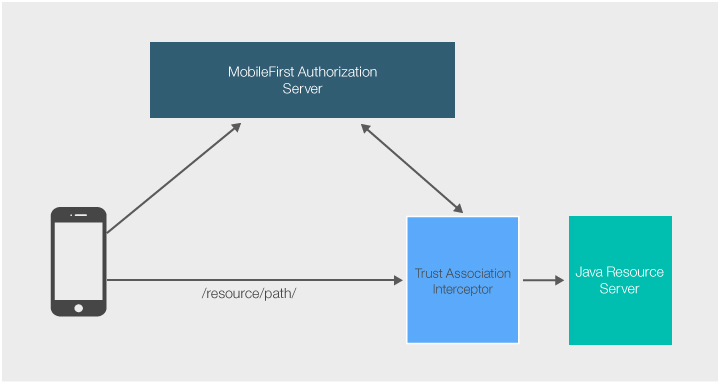

<!-- NLS_CHARSET=UTF-8 -->
## 概説
{: #overview }
{{ site.data.keys.product_full }} は、[IBM WebSphere のトラスト・アソシエーション・インターセプター](https://www.ibm.com/support/knowledgecenter/SSHRKX_8.5.0/mp/security/sec_ws_tai.dita)経由で行われる外部リソースの認証を容易にするための Java ライブラリーを提供します。

Java ライブラリーは、JAR ファイル (**com.ibm.mfp.oauth.tai-8.0.0.jar**) として提供されます。

このチュートリアルでは、スコープ (`accessRestricted`) を使用して、単純な Java サーブレット `TAI/GetBalance` を保護する方法を示します。

**前提条件:**

* [{{ site.data.keys.mf_server }} を使用した外部リソースの認証](../)チュートリアルをお読みください。
* [{{ site.data.keys.product }} セキュリティー・フレームワーク](../../)について理解しておく必要があります。



## サーバーのセットアップ
{: #server-setup }
1. セキュリティー・ツールの .zip を **{{ site.data.keys.mf_console }} →「ダウンロード・センター」→「ツール」**タブからダウンロードします。 そこに、`mfp-oauth-tai.zip` アーカイブが含まれています。 この zip を解凍します。
2. `com.ibm.mfp.oauth.tai.jar` ファイルを WebSphere Application Server インスタンスの **usr/extension/lib** 内に追加します。
3. `OAuthTai.mf` ファイルを WebSphere Application Server インスタンスの **usr/extension/lib/features** 内に追加します。

### web.xml のセットアップ
{: #webxml-setup }
セキュリティー制約とセキュリティー・ロールを WebSphere Application Server インスタンスの `web.xml` ファイルに追加します。

```xml
<security-constraint>
   <web-resource-collection>
      <web-resource-name>TrustAssociationInterceptor</web-resource-name>
      <url-pattern>/TAI/GetBalance</url-pattern>
   </web-resource-collection>
   <auth-constraint>
      <role-name>TAIUserRole</role-name>
   </auth-constraint>
</security-constraint>

<security-role id="SecurityRole_TAIUserRole">
   <description>This is the role that {{ site.data.keys.product }} OAuthTAI uses to protect the resource, and it is mandatory to map it to 'All Authenticated in Application' in WebSphere Application Server full profile and to 'ALL_AUTHENTICATED_USERS' in WebSphere Application Server Liberty.</description>
   <role-name>TAIUserRole</role-name>
</security-role>
```

### server.xml
{: #serverxml }
外部リソースについて WebSphere Application Server `server.xml` ファイルを変更します。

* 以下の機能を組み込むように、機能マネージャーを構成します。

  ```xml
  <featureManager>
           <feature>jsp-2.2</feature>
           <feature>appSecurity-2.0</feature>
           <feature>usr:OAuthTai-8.0</feature>
           <feature>servlet-3.0</feature>
           <feature>jndi-1.0</feature>
  </featureManager>
  ```

* セキュリティー・ロールをクラス・アノテーションとして Java サーブレットに追加します。

```java
@ServletSecurity(@HttpConstraint(rolesAllowed = "TAIUserRole"))
```

servlet-2.x を使用する場合は、セキュリティー・ロールを web.xml ファイル内に定義する必要があります。

```xml
<application contextRoot="TAI" id="TrustAssociationInterceptor" location="TAI.war" name="TrustAssociationInterceptor"/>
   <application-bnd>
      <security-role name="TAIUserRole">
         <special-subject type="ALL_AUTHENTICATED_USERS"/>
      </security-role>
   </application-bnd>
</application>
```

* OAuthTAI を構成します。 ここで、URL を保護対象として設定します。

  ```xml
  <usr_OAuthTAI id="myOAuthTAI" authorizationURL="http://localhost:9080/mfp/api" clientId="ExternalResourceId" clientSecret="ExternalResourcePass" cacheSize="500">
            <securityConstraint httpMethods="GET POST" scope="accessRestricted" securedURLs="/GetBalance"></securityConstraint>
  </usr_OAuthTAI>
  ```
    - **authorizationURL**: {{ site.data.keys.mf_server }} (`http(s):/your-hostname:port/runtime-name/api`) または外部 AZ サーバー (IBM DataPower など) のいずれかです。

    - **clientID**: リソース・サーバーは、登録済みの機密クライアントでなければなりません。 機密クライアントを登録する方法については、[機密クライアント](../../confidential-clients/)のチュートリアルを参照してください。 トークンを検証できるようにするために、*機密クライアントには*、許可されるスコープとして `authorization.introspect` が*必須* です。

    - **clientSecret**: リソース・サーバーは、登録済みの機密クライアントでなければなりません。 機密クライアントを登録する方法については、[機密クライアント](../../confidential-clients/)のチュートリアルを参照してください。
    - **cacheSize (オプション)**: TAI は、Java-Token-Validator キャッシュを使用して、トークンおよびイントロスペクション・データの値をキャッシュに入れることで、短い時間内であれば、クライアントから要求内で渡されるトークンを再度イントロスペクトせずに済むようにします。

        デフォルト・サイズは 50,000 個分のトークンです。  

        すべての要求でトークンがイントロスペクトされることを保証する必要がある場合、キャッシュの値を 0 に設定してください。  

    - **scope**: リソース・サーバーは 1 つ以上のスコープを基準にして認証します。 スコープは、セキュリティー検査にすることも、セキュリティー検査にマップされるスコープ・エレメントにすることもできます。

## TAI から入手するトークン・イントロスペクション・データの使用
{: #using-the-token-introspection-data-from-the-tai }
TAI によってインターセプトされ、検証されたトークン情報にリソースからアクセスできます。 トークンに関して検出できるデータのリストについては、[API リファレンス](../../../api/java-token-validator)を参照してください。 このデータを取得するには、[WSSubject API](http://www.ibm.com/support/knowledgecenter/SSEQTP_8.5.5/com.ibm.websphere.wlp.doc/ae/rwlp_sec_apis.html) を使用します。

```java
Map<String, String> credentials = WSSubject.getCallerSubject().getPublicCredentials(Hashtable.class).iterator().next();
JSONObject securityContext = new JSONObject(credentials.get("securityContext"));
...
securityContext.get('mfp-device')
```

## サンプル・アプリケーション
{: #sample-application }
サポートされるアプリケーション・サーバー (WebSphere Application Server フル・プロファイルおよび WebSphere Application Server Liberty プロファイル) にプロジェクトをデプロイできます。  
[単純な Java サーブレットをダウンロード](https://github.com/MobileFirst-Platform-Developer-Center/TrustAssociationInterceptor/tree/release80)します。

### サンプルの使用法
{: #sample-usage }
1. {{ site.data.keys.mf_console }} で、必ず[機密クライアントと秘密鍵の値を更新](../#confidential-client)してください。
2. **[UserLogin](../../user-authentication/security-check/)** または **[PinCodeAttempts](../../credentials-validation/security-check/)** のいずれかのセキュリティー検査をデプロイします。
3. 一致するアプリケーションを登録します。
4. `accessRestricted` スコープをセキュリティー検査にマップします。
5. クライアント・アプリケーションを更新して、サーブレット URL に `WLResourceRequest` を発行します。
6. securityConstraint スコープを、クライアントが認証を受けるときに基準として必要なセキュリティー検査になるように設定します。
