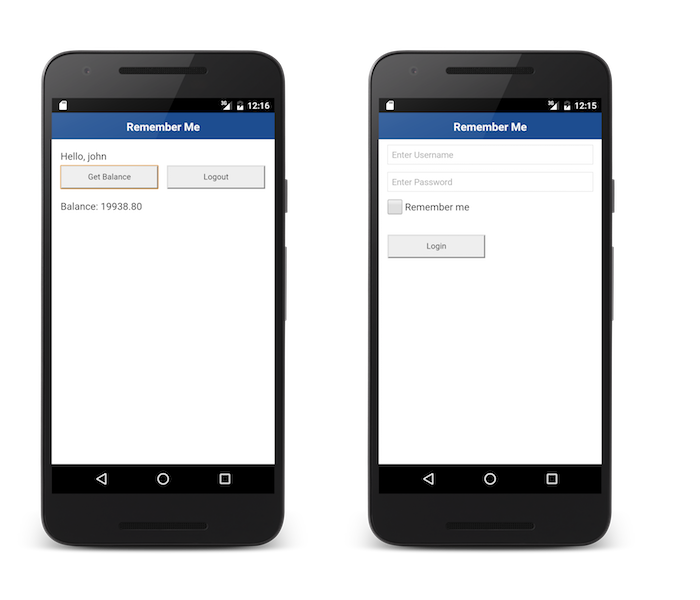

<!-- NLS_CHARSET=UTF-8 -->
## 概説
{: #overview }
**前提条件:** **CredentialsValidationSecurityCheck** の[チャレンジ・ハンドラー実装](../../credentials-validation/javascript)のチュートリアルをお読みください。

このチャレンジ・ハンドラーのチュートリアルでは、プリエンプティブ `login`、`logout`、および `obtainAccessToken` など、いくつかの追加機能 (API) を例示します。

## ログイン
{: #login }
この例では、`UserLogin` は `username` と `password` という *key:value* を必要とします。オプションで、ブール型の `rememberMe` キーも受け入れます。これは、このユーザーを長期間記憶しておくようにセキュリティー検査に指示するためのものです。サンプル・アプリケーションの場合、この情報はログイン・フォームのチェック・ボックスからブール値を使用して収集されます。

```js
userLoginChallengeHandler.submitChallengeAnswer({'username':username, 'password':password, rememberMe: rememberMeState});
```

チャレンジを何も受け取っていない場合でもユーザーのログインを可能にする必要がある場合があります。例えば、アプリケーションの最初の画面としてログイン画面を表示したり、ログアウト後やログイン失敗後にログイン画面を表示したりする場合です。そのようなシナリオを**プリエンプティブ・ログイン**と呼びます。

応答すべきチャレンジが存在しない場合、`submitChallengeAnswer` API を呼び出すことはできません。そのようなシナリオ用に、{{site.data.keys.product }} SDK には `login` API が組み込まれています。

```js
WLAuthorizationManager.login(securityCheckName,{'username':username, 'password':password, rememberMe: rememberMeState}).then(
    function () {
        WL.Logger.debug("login onSuccess");
    },
    function (response) {
        WL.Logger.debug("login onFailure: " + JSON.stringify(response));
    });
```

資格情報に問題がある場合、セキュリティー検査は**チャレンジ**を返信します。

アプリケーションのニーズに応じて、どのような場合に `submitChallengeAnswer` でなく `login` を使用するかを判断することは開発者の責任です。これを実現する方法の 1 つとして、ブール値のフラグ (例えば、`isChallenged`) を定義し、`handleChallenge` に到達したときにフラグを `true` に設定し、それ以外のケース (失敗、成功、初期設定時など) では `false` に設定する方法があります。

ユーザーが**「ログイン」**ボタンをクリックした時点で、使用すべき API が動的に選択されます。

```js
if (isChallenged){
    userLoginChallengeHandler.submitChallengeAnswer({'username':username, 'password':password, rememberMe: rememberMeState});
} else {
WLAuthorizationManager.login(securityCheckName,{'username':username, 'password':password, rememberMe: rememberMeState}).then(
//...
    );
}
```

> **注:
**
>`WLAuthorizationManager` `login()` API には、独自の `onSuccess` メソッドと `onFailure` メソッドがあり、関連するチャレンジ・ハンドラーの `handleSuccess` メソッドまたは `handleFailure` メソッド**も**呼び出されます。

## アクセス・トークンの取得
{: #obtaining-an-access-token }
このセキュリティー検査は **RememberMe** 機能 (`rememberMe` ブール・キー) をサポートしているため、アプリケーションの開始時に、クライアントがログインしているかどうかをチェックすると役立ちます。

{{site.data.keys.product }} SDK は、サーバーに有効なトークンを尋ねるための `obtainAccessToken` API を提供しています。

```js
WLAuthorizationManager.obtainAccessToken(userLoginChallengeHandler.securityCheckName).then(
    function (accessToken) {
        WL.Logger.debug("obtainAccessToken onSuccess");
        showProtectedDiv();
    },
    function (response) {
        WL.Logger.debug("obtainAccessToken onFailure: " + JSON.stringify(response));
        showLoginDiv();
});
```
> **注:**
> `WLAuthorizationManager` `obtainAccessToken()` API には、独自の `onSuccess` メソッドと `onFailure` メソッドがあり、関連するチャレンジ・ハンドラーの `handleSuccess` メソッドまたは `handleFailure` メソッド**も**呼び出されます。

クライアントが既にログインしているか、*記憶されている* 状態である場合、API は成功をトリガーします。クライアントがログインしていない場合、セキュリティー検査はチャレンジを返信します。

`obtainAccessToken` API は、**スコープ**を受け入れます。スコープは、**セキュリティー検査**の名前にできます。

> **スコープ**について詳しくは、[許可の概念](../../)チュートリアルを参照してください。

## 認証済みユーザーの取得
{: #retrieving-the-authenticated-user }
チャレンジ・ハンドラー `handleSuccess` メソッドは `data` をパラメーターとして受け取ります。
セキュリティー検査が `AuthenticatedUser` を設定した場合、このオブジェクトにはユーザーのプロパティーが含まれます。現行ユーザーを保存するには、`handleSuccess` を使用できます。

```js
userLoginChallengeHandler.handleSuccess = function(data) {
    WL.Logger.debug("handleSuccess");
    isChallenged = false;
    document.getElementById ("rememberMe").checked = false;
    document.getElementById('username').value = "";
    document.getElementById('password').value = "";
    document.getElementById("helloUser").innerHTML = "Hello, " + data.user.displayName;
    showProtectedDiv();
}
```

ここで、`data` には `user` というキーがあり、これ自身も `AuthenticatedUser` を表す `JSONObject` を含んでいます。

```json
{
  "user": {
    "id": "john",
    "displayName": "john",
    "authenticatedAt": 1455803338008,
    "authenticatedBy": "UserLogin"
  }
}
```

## ログアウト
{: #logout }
{{site.data.keys.product }} SDK は、特定のセキュリティー検査からログアウトするための `logout` API も提供しています。

```js
WLAuthorizationManager.logout(securityCheckName).then(
    function () {
        WL.Logger.debug("logout onSuccess");
        location.reload();
    },
    function (response) {
        WL.Logger.debug("logout onFailure: " + JSON.stringify(response));
    });
```

## サンプル・アプリケーション
{: #sample-applications }
このチュートリアルには、以下の 2 つのサンプルが関連付けられています。

- **PreemptiveLogin**: プリエンプティブ `login` API を使用して、常にログイン画面から開始するアプリケーション。
- **RememberMe**: *「ユーザーを記憶する (Remember Me)」*チェック・ボックスがあるアプリケーション。ユーザーは、次にアプリケーションを開くとき、ログイン画面をバイパスできます。

両方のサンプルが、**SecurityCheckAdapters** アダプター Maven プロジェクトに含まれる同じ `UserLogin` セキュリティー検査を使用します。

- [ここをクリック](https://github.com/MobileFirst-Platform-Developer-Center/SecurityCheckAdapters/tree/release80) して SecurityCheckAdapters Maven プロジェクトをダウンロードします。  
- [ここをクリック](https://github.com/MobileFirst-Platform-Developer-Center/RememberMeCordova/tree/release80) して RememberMe Cordova プロジェクトをダウンロードします。  
- [ここをクリック](https://github.com/MobileFirst-Platform-Developer-Center/PreemptiveLoginCordova/tree/release80) して PreemptiveLogin Cordova プロジェクトをダウンロードします。
- [ここをクリック](https://github.com/MobileFirst-Platform-Developer-Center/RememberMeWeb/tree/release80) して RememberMe Web プロジェクトをダウンロードします。
- [ここをクリック](https://github.com/MobileFirst-Platform-Developer-Center/PreemptiveLoginWeb/tree/release80) して PreemptiveLogin Web プロジェクトをダウンロードします。

### サンプルの使用法
{: #sample-usage }
サンプルの README.md ファイルの指示に従ってください。
アプリケーションのユーザー名/パスワードは一致しなければなりません (すなわち、"john"/"john")。


