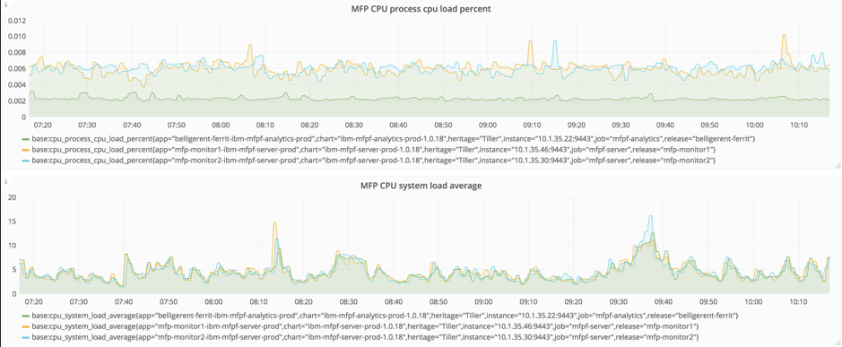

<!-- NLS_CHARSET=UTF-8 -->
## 概説
{: #overview }

このチュートリアルでは、IBM Cloud Private 上で実行される Mobile Foundation をモニターするために **Prometheus** を統合する方法について概要を示します。

IBM Mobile Foundation は、*MicroProfile メトリック* API によって計測される Mobile Foundation サーバー、Analytics、および Application Center をモニターする `mpMetrics-1.0` フィーチャーを有効にすることで、モニタリング機能を提供します。 これは、ICP にデプロイされる Mobile Foundation コンテナーの JVM やシステム・レベルのメトリックをモニターするのに役立ちます。

`/metrics` API 要求に対するデフォルトの応答フォーマットはテキスト・フォーマットで、これは **Prometheus** と互換性があります。


## 手順
{: #procedure}

以下のステップを実行して、{{ site.data.keys.prod_icp }} 上の Mobile Foundation のモニタリングをセットアップします。

### ステップ 1: IBM Monitoring サービスのデプロイ
a.  {{ site.data.keys.prod_icp }} カタログから Monitoring サービスをデプロイします。<br/>
b.  **「カタログ」**に移動し、**ibm-icpmonitoring** Helm チャートを選択してインストールします。 Helm チャートは、{{ site.data.keys.prod_icp }} にインストールされます。<br/>
    

### ステップ 2: **Prometheus** *configmap* 構成の更新

適切なソース・ターミナル (ICP クラスターのコンテキスト構成情報が設定された CLI インスタンス) から、以下のコマンドを実行します。<br/>
```bash
kubectl get svc | grep prometheus
```
<br/>
`ibm-icpmonitoring` チャートによってデプロイされる多数のサービスが表示されます。 このチュートリアルでは、以下のスクリーン・ショットに示すように、`<name used for the helm release>-promethues` (mfp-prometheus-prometheus) という名前のサービスにフォーカスを当て、使用します。<br/>


<br/>
これらのサービスには、それぞれ *configmap* オブジェクトが関連付けられます。 Mobile Foundation ポッドのメトリック・データを取得するには、**mfp-prometheus-prometheus** サービスに関連付けられている *configmap* を変更する必要があります。変更内容は、Mobile Foundation サーバー用の `mfpfserver` アノテーション、Analytics 用の `mfpfanalytics` アノテーション、および Application Center 用の `mfpfappcenter` アノテーションを、その他いくつかの属性とともにサービス・デプロイメントに追加することです。<br/>
これを達成するための最も簡単な方法は、以下のコマンドを使用して、ソース・ターミナルから目的の *configmap* オブジェクトを編集することです。<br/>
```bash
  kubectl edit configmap mfp-prometheus-prometheus
  ```
<br/>
このコマンドは、要求された YAML ファイルを vi エディターで開きます。  ファイルの最後までスクロールダウンし、行 `kind: ConfigMap` の直前に下記のテキストを挿入します。

以下は、Mobile Foundation サーバーのメトリック構成、YAML のスニペットです。<br/>

```yaml
# Configuration for MFP Server Monitoring
- job_name: 'mfpf-server'
scheme: 'https'
basic_auth:
  username: 'mfpRESTUser'
  password: 'mfpadmin'
tls_config:
  insecure_skip_verify: true
kubernetes_sd_configs:
  - role: endpoints
relabel_configs:
  - source_labels: [__meta_kubernetes_service_annotation_mfpfserver]
    action: keep
    regex: true
  - source_labels: [__address__, __meta_kubernetes_service_annotation_prometheus_io_port]
    action: replace
    target_label: __address__
    regex: (.+)(?::\d+);(\d+)
    replacement: $1:$2
  - action: labelmap
    regex: __meta_kubernetes_service_label_(.+)
```    
<br/>

以下は、Mobile Foundation サーバーのヘルス・チェック・モニタリングの構成、YAML のスニペットです。<br/>

```yaml
# Configuration for MFP Health check  Monitoring<br/>
- job_name: 'mfp-healthcheck'
metrics_path: /mfpadmin/management-apis/2.0/diagnostic/healthCheck
scheme: 'https'
basic_auth:
  username: 'admin'
  password: 'admin'
tls_config:
  insecure_skip_verify: true
kubernetes_sd_configs:
  - role: endpoints
relabel_configs:
  - source_labels: [__meta_kubernetes_service_annotation_mfpfserver]
    action: keep
    regex: true
  - source_labels: [__address__, __meta_kubernetes_service_annotation_prometheus_io_port]
    action: replace
    target_label: __address__
    regex: (.+)(?::\d+);(\d+)
    replacement: $1:$2
  - action: labelmap
    regex: __meta_kubernetes_service_label_(.+)
```
<br/>
> **注:** Mobile Foundation の Analytics と Application Center のデプロイメントも、同様のメトリック構成に従います。

*job_name* と *source_labels* の値が、前述のとおり変更されます。
  
### ステップ 3: ジョブ更新後の **Prometheus** 構成の再ロード
以下の curl コマンドを実行します。<br/>
```cURL
curl -s -XPOST http://<ip address of the proxy node>:31271/-/reload
```
<br/>


### ステップ 4: Mobile Foundation 統計のモニター

a. 以下の URL を使用して、ブラウザーで **Prometheus** コンソールをブラウズします。 <br/>
```
http://<ip address of the Proxy Node>:31271
```
b. **Prometheus** コンソールで、下のスクリーン・ショットに示すように、まず**「Status」**をクリックし、次に、ドロップダウンから**「Targets」**を選択します。<br/>
  
c. Prometheus によって統計が取得されているすべての**ターゲット**が表示されます。<br/>
  <br/>
  
<br/>
  上のスクリーン・ショットには、Mobile Foundation サーバー、Analytics、および Application Center が**ターゲット**として明確に示されています。 ステップ 2 で示した *configmap* YAML ファイルの *job_name* 属性の値を参照してください。<br/>
  以前、デプロイメント・サンプルを 2 つのレプリカに拡大しました。**Prometheus** が、サーバーに関して 2 つのエンドポイントをスクラップしているのはこのためです。<br/>

  **Prometheus** コンソールおよびそれ以降のパネルにある**「Graph」**をクリックした場合、下のスクリーン・ショットに示すように**「insert metric at cursor」**をクリックします。<br/>
  

  現在の **Prometheus** 構成でモニター可能な複数のメトリックが表示されます。 長いメトリックのリストのうち、**base:** で始まるメトリック名が、`mpMetrics-1.0` フィーチャーによって提供される Mobile Foundation コンテナーからのものです。<br/>
  

  任意の Liberty メトリック (例: **base:thread_count**) を選択すると、下のスクリーン・ショットに示すように、Mobile Foundation サーバーのポッドからの値を Prometheus グラフで表示できます。<br/>
  

  その他の関連メトリックを **Prometheus** でグラフィカルに探索したり、**「Console」**をクリックすることで、数値フォームでも探索したりできます。<br/>
  デプロイメントを拡大することもできます。 Prometheus コンソール内のエンドポイント数は、短期間でレプリカの数に一致するようになります。  <br/>

  >**注:** ここでは、Prometheus の *configmap* ファイル内でパスワードに平文を使用しましたが、Prometheus は、Prometheus パネルで構成が表示されるとき、パスワードは表示しません。

### ステップ 5: **Grafana** ダッシュボードでのメトリックの表示
Mobile Foundation Helm チャートには、サンプル Grafana ダッシュボードの Json ファイルが含まれており、ステップ 1 でデプロイしたモニター・サービスにも Grafana が備わっています。<br/>

JSON ファイルから Grafana ダッシュボードをインポートするには、以下のようにします。<br/>

* デプロイ済みモニター・サービスから Grafana を起動します。<br/>
  <b>「ワークロード」->「Helm リリース」->「`<name used for the helm release>`」 (例: mfp-prometheus) ->「起動」</b>

* [GitHub](https://github.ibm.com/IBMPrivateCloud/charts/tree/master/stable/ibm-mfpf-server-prod/additionalFiles/ibm-mfpf-server-prod-grafanadashboard.json) からローカル・ワークステーションに JSON ダッシュボード・ファイルをダウンロードします。   <br/>

* Grafana インターフェースの*「ホーム」*ボタンをクリックし、次に**「ダッシュボードのインポート」**をクリックします。<br/>

* **「.json ファイルのアップロード (Upload .json file)」**ボタンをクリックし、ローカル・ファイル・システムから Grafana ダッシュボード JSON ファイルを選択します。<br/>

* **「データ・ソースの選択 (Select a data source)」**メニューから**「prometheus」**を選択します (まだ選択されていない場合)。<br/>

* **「インポート」**をクリックします。<br/>

以下のスクリーン・ショットに、Mobile Foundation サーバー用のサンプル・モニター・ダッシュボードを示します。<br/>



