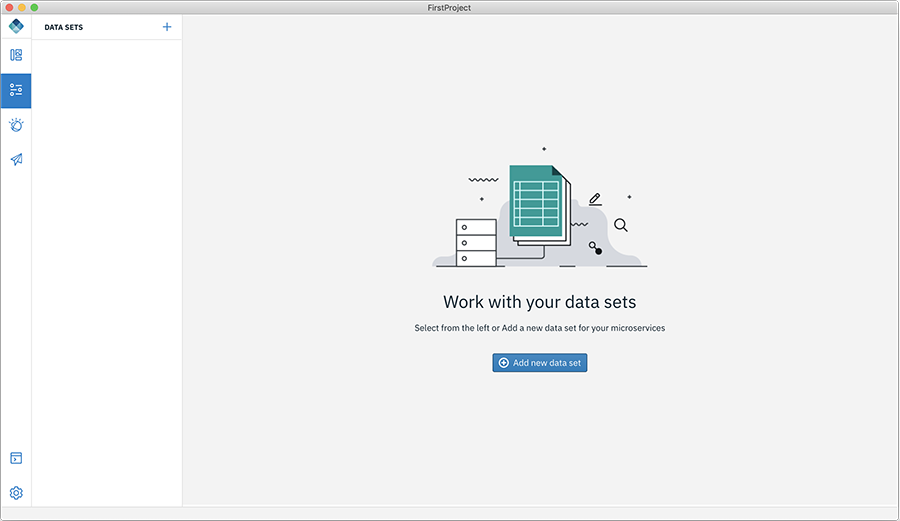

<!-- NLS_CHARSET=UTF-8 -->
## データ・セットの追加
{: #dab-login-form }

### 設計 (Design) モードでの新規データ・セットの作成
{: #data-set-design-mode }

1. Digital App Builder のランディング・ページで、既存のアプリケーションを開くか、設計 (Design) モードでアプリケーションを作成します。
2. 左側のパネルにある**「データ (Data)」**をクリックします。

    

3. **「新規データ・セットの追加」**をクリックします。 これにより、「データ・セットの追加」ウィンドウが表示されます。

    

4. データ・セットを作成します。 既存のソースから作成する (デフォルト) か、OpenAPI 文書を使用してマイクロサービスのデータ・ソースを作成できます。
    * **既存のデータ・ソースから作成します** (デフォルト) - これを使用すると、構成されている Mobile Foundation サーバー・インスタンスからのすべてのデータ・ソース (アダプター) がドロップダウンに取り込まれます。 
    * **OpenAPI 文書を使用してマイクロサービスのデータ・ソースを作成します** - このオプションを使用すると、Open API 仕様文書 (Swagger json/yml) ファイルからデータ・ソースを作成し、そこからデータ・セットを作成できます。

#### 既存のデータ・ソースからのデータ・セットの作成

1. データ・セットを作成するデータ・ソースを選択します。
2. これにより、データ・ソース内の使用可能なエンティティーが取り込まれます。 作成するエンティティーを選択します。
3. データ・セットに名前を付け、**「追加」**ボタンをクリックします。 これによりデータ・セットが追加され、そのデータ・セットに関連付けられている属性およびアクションを確認できるようになります。

    

4. データ・セットで行う内容に基づいて、一部の属性およびアクションを非表示にすることができます。
5. 属性の**「表示ラベル (Display Labels)」**を編集することもできます。
6. また、必要な属性を指定し、アクションの一部である**「このアクションを実行」**をクリックすることで、任意の GET アクションをテストすることもできます。 これが機能するには、**「設定」**タブで機密クライアント名およびパスワードを指定しておく必要があることに注意してください。

#### swagger ファイルを使用したマイクロサービスのデータ・ソースの作成

1. データ・ソースを作成する **json/yml** ファイルを選択し、**「生成 (Generate)」**をクリックします。
2. これにより、アダプターが生成されます。アダプターは、再使用して Mobile Foundation サーバー・インスタンスにデプロイできる、MF サーバー上の構成アーティファクトです。
3. データ・ソースの定義対象となるエンティティーを選択します。
4. データ・セットに名前を付け、**「追加」**ボタンをクリックします。
5. これによりデータ・セットが追加され、そのデータ・セットに関連付けられている属性およびアクションを確認できるようになります。

これで、このデータ・セットを任意のデータ・バインドされたコントロールにバインドできるようになりました。

#### アプリケーション内でのデータ・セットのバインディング

1. 設計モードのアプリケーションから、リストを追加するページにアクセスします。
2. **「コントロールの表示 (Show Controls)」**をクリックして**「データ・バインド (DATABOUND)」**を表示します。
3. **「データ・バインド (DATABOUND)」**をクリックして展開し、キャンバスに**「リスト」**をドラッグ・アンド・ドロップします。
4. 必要に応じて**値**を更新します。 
5. **「リスト・タイトル (List Title)」**を追加します。
6. 処理する**「リスト・タイプ」**を選択します。
7. リスト項目にコンテンツを追加します。
8. 使用するデータ・セットに接続します。 

### コード・モードでの新規データ・セットの作成
{: #data-set-code-mode }

1. Digital App Builder のランディング・ページで、既存のアプリケーションを開くか、コード・モードでアプリケーションを作成します。
2. **「</>」** (**「コード・スニペットの表示 (Show Code Snippets)」**) をクリックします。
3. **「IONIC」**にナビゲートし、必要なコード・スニペット (「シンプル・リスト (Simple List)」、「カード・リスト (Card List)」、「ヘッダー・ボタン (Header Button)」) を追加し、必要に応じてコードを変更します。

