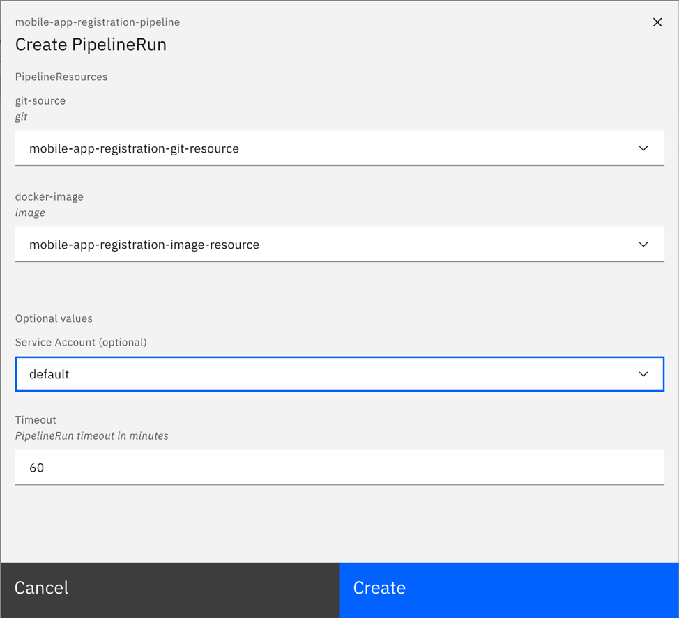
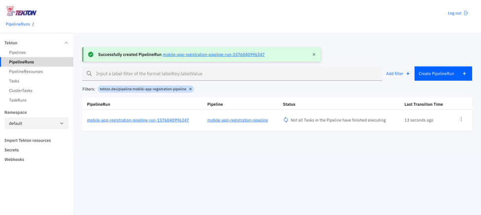
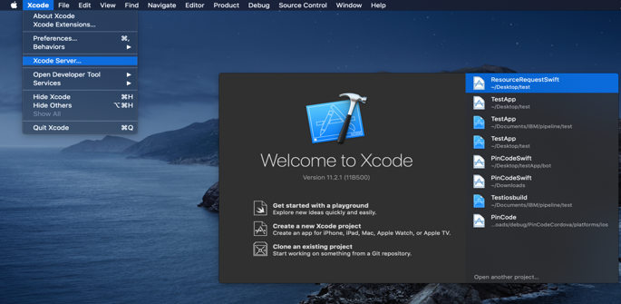
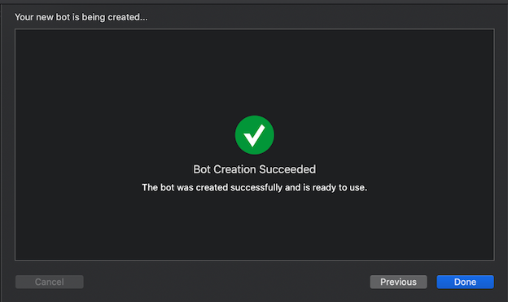

<!-- NLS_CHARSET=UTF-8 -->

Cloud Pak for Apps 内の Mobile Foundation は、Mobile Foundation に関連する共通の DevOps タスクを自動化するための Tekton パイプラインにバンドルされています。

>OpenShift Container Platform (OCP) に Mobile Foundation をデプロイする手順は、OCP の使用権を取得した方法にかかわらず同じです。

## 前提条件
{: #prereqs}

以下は、Mobile Foundation Operator を使用して Mobile Foundation インスタンスをインストールするプロセスを開始する前に満たす必要がある前提条件です。

- Mobile Foundation がインストールされた [Cloud Pak For Apps](https://cloud.ibm.com/catalog/content/ibm-cp-applications) インスタンス
- [OpenShift CLI](https://docs.openshift.com/enterprise/3.1/cli_reference/get_started_cli.html#installing-the-cli) (`oc`)
- Tekton (Cloud Pak for Apps の一部として使用可能)


## Tekton パイプライン
{: #tekton-pipelines}

Cloud Pak for Apps 上の Mobile Foundation で以下の Tekton パイプラインが使用可能です。

1.	モバイル・アプリケーション構成パイプライン (*mobile-app-registration-pipeline*)
2.	Android 用モバイル・アプリケーション・ビルド・パイプライン (*mobile-app-build-android-pipeline*)
3.	iOS 用モバイル・アプリケーション・ビルド・パイプライン (*mobile-app-build-ios-pipeline*)
4.	モバイル・アプリケーション配布パイプライン (*application-center-deploy*)


### パイプライン実行のステップ
{: #steps-for-running-the-pipelines}

* Mobile Foundation の PPA を[ダウンロード](https://www.ibm.com/software/passportadvantage/pao_customer.html)します。
* `IBM-MobileFoundation-Openshift-Pak-<version>.tar.gz` ファイルを解凍します。
* 解凍されたフォルダーの場所に `cd` します。
* 以下のコマンドを使用して、Cloud Pak For Apps インスタンスにログインします。
  ```bash
  oc login --token=<access_token> --server=<server_instance>
  ```


#### モバイル・アプリケーション構成パイプライン
{: #mobile-app-configuration-pipeline}

次のコマンドを実行します。
```bash
oc apply -f pipeline/mobile-app-registration -n <projectname>
```

以下に生成された出力を示します。

```text
pipelineresource.tekton.dev/mobile-app-registration-git-resource created
pipelineresource.tekton.dev/mobile-app-registration-image-resource created
pipeline.tekton.dev/mobile-app-registration-pipeline created
task.tekton.dev/mobile-app-registration-task created
```

#### Android 用モバイル・アプリケーション・ビルド・パイプライン
{: #mobile-app-build-pipeline-android}

**前提条件**
Android ビルド用のパイプラインを使用する前に、*github-token* をビルド・タスクに追加する必要があります。`pipeline/mobile-app-build-android/buildandroidapptask.yaml` ファイルに移動し、ステップ **create-release** で、*{GITHUB_TOKEN}* のプレースホルダーを有効な *github-token* を使用して編集します。

```yaml
  - name: create-release
    image: jimdo/github-release
    env:
      - name: "GITHUB_TOKEN"
        value: "{GITHUB_TOKEN}"
    command: ['/bin/bash']
```

前提条件を満たした後、次のコマンドを実行します。
```bash
oc apply -f pipeline/mobile-app-build-android -n <projectname>
```

以下に生成された出力を示します。

```text
pipelineresource.tekton.dev/mobile-app-build-android-git-sresource created
pipeline.tekton.dev/mobile-app-build-android-pipeline created
task.tekton.dev/mobile-app-build-android-task created
pipelineresource.tekton.dev/mobile-app-build-android-image-resource created
```

#### iOS 用モバイル・アプリケーション・ビルド・パイプライン
{: #mobile-app-build-pipeline-ios}

**前提条件**
1. Android と同様に、ファイル `pipeline/mobile-app-build-ios/buildiosapptask.yaml` のステップ *create-release* に GitHubトークンを追加する必要があります。
2. 一般にアクセス可能な Mac マシンに Xcode サーバーをセットアップする必要があります。『*iOS アプリケーションをビルドするための Xcode サーバーのセットアップ*』セクションを確認してください。

前提条件を満たした後、次のコマンドを実行します。
```bash
oc apply -f pipeline/mobile-app-build-ios -n <projectname>
```

以下に生成された出力を示します。

```text
pipeline.tekton.dev/mobile-app-build-ios-pipeline created
task.tekton.dev/mobile-app-build-ios-task created
pipelineresource.tekton.dev/mobile-app-build-ios-git-resource created
pipelineresource.tekton.dev/mobile-app-build-ios-image-resource created
```

#### モバイル・アプリケーション配布パイプライン
{: #mobile-app-dist-pipeline}

次のコマンドを実行します。
```bash
oc apply -f pipeline/mobile-app-publish -n <projectname>
```

以下に生成された出力を示します。

```text
pipelineresource.tekton.dev/appcenter-git-resource created
pipelineresource.tekton.dev/appcenter-image-resource created
pipeline.tekton.dev/application-center-deploy created
task.tekton.dev/application-center-upload created
```

上記のコマンドは、タスク、パイプライン、およびリソースを作成します。
タスク、リソース、パイプラインは、Tekton ダッシュボードで確認できます。


### Tekton ダッシュボードから適切なリソースを使用してパイプラインを実行する
{: #running-tekton-pipelines}

アプリケーションの適切な Git リポジトリー URL を使用してリソース・ファイルを編集します。

```text
pipeline/mobile-app-registration/appregistrationgitresource.yaml
pipeline/mobile-app-build-android/ buildandoridgitresource.yaml
pipeline/mobile-app-build-ios/ buildiosgitresource.yaml
pipeline/mobile-app-publish/mobileapppublishgitresource.yaml
```

コマンドを実行して、Tekton パイプラインのリソースを更新します。

```bash
oc apply -f pipeline/mobile-app-registration/appregistrationgitresource.yaml -n <projectname>
```
以下に生成された出力を示します。

```text
pipelineresource.tekton.dev/mobile-app-registration-git-resource configured
```

コマンドを実行して、Tekton パイプラインのリソースを更新します。

```bash
oc apply -f pipeline/mobile-app-build-andorid/buildandoridgitresource -n <projectname>
```
以下に生成された出力を示します。

```text
pipelineresource.tekton.dev/mobile-app-build-android-git-resource configured
```

コマンドを実行して、Tekton パイプラインのリソースを更新します。

```bash
oc apply -f pipleline/mobile-app-build-ios/buildiosgitresource -n <projectname>
```
以下に生成された出力を示します。

```text
pipelineresource.tekton.dev/mobile-app-build-ios-git-resource configured
```

コマンドを実行して、Tekton パイプラインのリソースを更新します。

```bash
oc apply -f pipeline/mobile-app-publish/mobileapppublishgitresource.yaml -n <projectname>
```

以下に生成された出力を示します。

```text
pipelineresource.tekton.dev/appcenter-git-resource configured
```

### PipelineRun を使用して、パイプラインを実行する
{: #running-pipelines-pipelinerun}

アプリケーション Git リポジトリーに移動し、パイプライン構成ファイル (プロジェクトのルート・フォルダーにある `pipelineconfig.json` ファイル) を編集します。存在しない場合は、ホスト名、ポート、環境の選択、XCode サーバーの詳細、および GitHub の詳細を含む json ファイル `pipelineconfig.json` (GitHub リポジトリーのルート・ディレクトリー内) を作成します。

パイプライン構成ファイルは次のようなものになります。

```json
{
	  "env_choice": "default",
	  "development": {
	    "hostname": "184.173.5.44",
	    "port": "30989",
	    "servercred": "admin:admin"
	  },
	  "production": {
	    "hostname": "184.173.5.44",
	    "port": "30989",
	    "servercred": "admin:admin"
	  },
	  "default": {
	    "hostname": "184.173.5.44",
	    "port": "30989",
	    "servercred": "admin:admin"
	  },
	  "userName":"github_user_name",
	  "repoName": "github_repo_name",
	  "ios": {
	     "host": "9.109.199.108",
	     "botId": "1f4a17d56578a822a49567af88000ead"
	  }
	}
```

Tekton ダッシュボードを開き、**「Pipelines」**セクションをクリックします。

1. 実行するパイプラインをクリックします。
   

2. **「PipelineRun の作成 (Create PipelineRun)」**をクリックします。
   

3. 上記で作成した **PipelineResources** git-source を選択します。
4. 上記で作成した **PipelineResources** docker-image を選択します。
5. **「PipelineRun の作成 (Create PipelineRun)」**をクリックします。
   
6. PipelineRun のログと状況を表示するには、Tekton ダッシュボードに移動して、**「PipelineRuns」**を選択します。
   

### Webhook を使用してパイプラインをトリガーする
{: #trigger-pipelines-webhook}

アプリケーション Git リポジトリーに変更があるときは、いつでも Webhook を使用して *PipelineRun* を自動的にトリガーしてパイプラインを実行します。

#### Webhook の作成
{: #creation-of-webhooks}

1. Tekton ダッシュボードに移動し、左方のナビゲーションから**「Webhook」**をクリックします。
2. **「Webhook の追加 (Add Webhook)」**をクリックします。
  
3. Webhook の**名前**と、Tekton ダッシュボードに表示する適当な名前を入力します。
4. アプリケーションの**リポジトリー URL** を入力します。
5. Git リポジトリーの**アクセス・トークン**を指定します。
6. すべてのパイプラインが作成される**名前空間**を選択します。
7. トリガーする**パイプライン**を選択します。
8. 他を使用していない場合は、デフォルトとして**サービス・アカウント**を選択します。
9. クラスターの **Docker レジストリー**の詳細を指定します。
  
10. **「作成」**をクリックします。

Git リポジトリーへのプル要求は、登録されたパイプラインの PipelineRun の作成をトリガーする必要があります。
PipelineRun のログと状況を表示するには、Tekton ダッシュボードに移動して、**「PipelineRuns」**を選択します。

### iOS アプリケーションをビルドするための Xcode サーバーのセットアップ
{: #xcode-setup-ios-apps}

1. Mac マシンで Xcode をセットアップします。
2. Xcode を開きます。
3. メニューから、**「Xcode サーバー」**を選択します。

4.  Xcode サーバーをオンにして、統合を実行します。

5. サーバーがオンになった後は、**「Permissions」**セクションに移動し、**「ボットの作成と表示 (Create and View Bots)」**オプションを`「すべてのユーザー (all users)」`に変更します。

6. **「アカウント (Accounts)」**セクションに移動し、アカウント・タイプが`「Xcode サーバー」`の新しいアカウントを追加し、使用可能なサーバーを選択します。
  
  
7.  Xcode サーバーをセットアップした後、統合を実行して `ipa` を生成するようにボットを構成する必要があります。Xcode でビルドする iOS プロジェクトを開きます。
8. プロジェクトのビルド・ログに移動し、**「グループ別 (By Group)」**オプションを選択します。構成されたサーバーが表示されます。

9. サーバーを右クリックし、**「ボットの作成 (Create Bot)」**をクリックします。

10. ボットの名前を指定して、**「次へ」**をクリックします。ボット名にスペースが含まれないようにしてください。ボットのソース管理を構成して、**「次へ」**をクリックします。

11. **「アクション (Actions)」**セクションのビルド構成で、**「アーカイブ (Archive)」**オプションが選択されていることを確認します。**「エクスポート (Export)」**オプションの下で、*「カスタム・エクスポート・オプション plist を使用する (Use Custom Export Options Plist)」*を選択します。次の形式の `plist` ファイルがあることを確認してください。

12. **「ボット統合のスケジュール (Schedule bot integrations)」**セクションで、*手動* で実行する統合を選択し、**「次へ」**をクリックします。

13. プロジェクトの関連するビルド・オプションを選択し、**「次へ」**をクリックします。
14. **「証明書とプロファイル (Certificates and Profiles)」**セクションで、`ipa` の生成に必要な関連する証明書とプロファイルがサーバーに追加されていることを確認して、**「次へ」**をクリックします。
15. **「引数と環境変数 (Arguments and Environment Variables)」**セクションで、**「次へ」**をクリックします。**「トリガー (Triggers)」**セクションで、**「追加」**をクリックし、*「統合前スクリプト (Pre-Integration script)」*を選択し、名前を付けて、アプリケーションの CocoaPod 依存関係 (存在する場合) をダウンロードするスクリプト・セクションに次のスクリプトを追加して、**「作成」**をクリックします。
    ```bash
    #!/bin/sh
    cd $XCS_PRIMARY_REPO_DIR
    PATH="/usr/local/bin:/usr/bin:/bin:/usr/sbin:/sbin:/opt/X11/bin:/Library/Frameworks/Mono.framework/Versions/Current/Commands"
    . ~/.bash_profile
    bundle install
    pod install --repo-update
    ```

16. ボットが正常に作成された後、統合が実行されるのを待ちます。統合が成功したら、統合に移動して**「ログ (Logs)」**に移動します。ログの中に *botId* があります。*botId* は、Tekton パイプラインから統合を実行するために必要です。


   
17. これで、Xcode サーバーのセットアップが正常に完了しました。*botId* と、json 構造の iOS 部分の Xcode サーバー・*ホスト* を使用して、アプリケーションのパイプライン構成ファイル `pipelineconfig.json` を更新します。これで、Tekton パイプラインから `ipa` を生成できるようになります。  
    ```json
    "ios": {
      "host": "9.109.199.108",
      "botId": "1f4a17d56578a822a49567af88000ead"
    }
    ```
