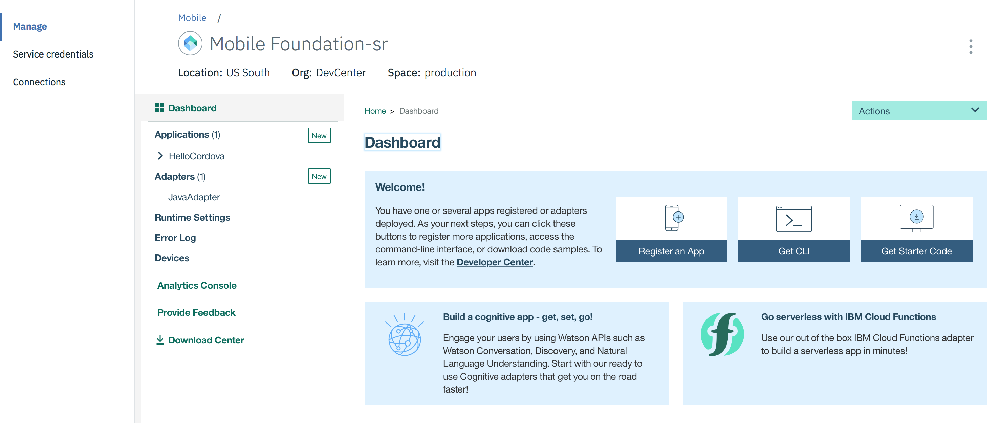
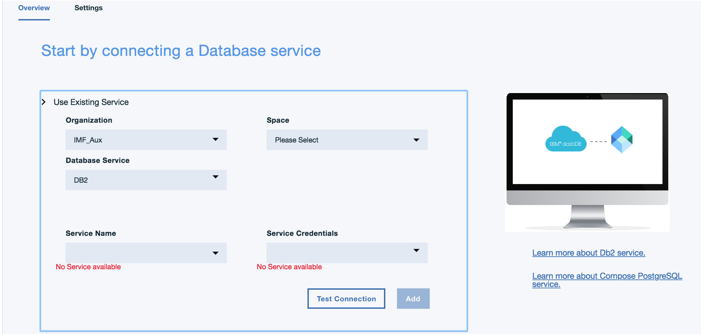
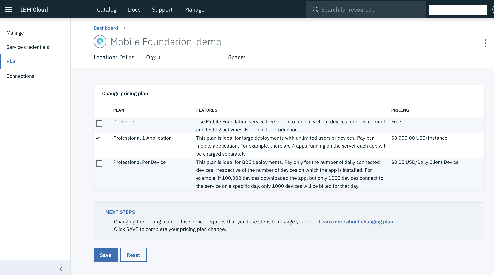

<!-- NLS_CHARSET=UTF-8 -->
## 概説
{: #overview }
このチュートリアルでは、{{ site.data.keys.mf_bm_full }} (**{{ site.data.keys.mf_bm_short }}**) サービスを使用して IBM Cloud 上で {{ site.data.keys.mfound_server }} インスタンスをセットアップするための手順を段階的に説明します。  
{{ site.data.keys.mf_bm_short }} は、 **Liberty for Java ランタイム** 上で Mobile Foundation v8.0 のスケーラブルな開発者環境または実稼働環境を素早く容易に稼働できるようにする、IBM Cloud サービスの 1 つです。

{{ site.data.keys.mf_bm_short }} サービスには、以下のプラン・オプションがあります。

1. **開発者**: このプランでは、{{ site.data.keys.mfound_server }} が Liberty for Java ランタイム上で Cloud Foundry アプリケーションとしてプロビジョンされます。 Liberty for Java の料金は別に請求され、このプランには含まれていません。 このプランでは外部データベースの使用がサポートされておらず、開発とテストに制限されています。 Mobile Analytics は追加料金なしで提供され、イベントは 6 カ月間保持されます。 {{ site.data.keys.mf_bm_short }} サーバーの*開発者プラン*のインスタンスでは、開発およびテスト用に任意の数のモバイル・アプリケーションを登録できます。ただし、接続デバイスの数は 1 日当たり 10 台に制限されます。<!--This plan also includes {{ site.data.keys.mf_analytics_service }} service instance. If your usage exceeds the Mobile Analytics free tier entitlements, then charges apply as per Mobile Analytics basic plan.-->

    > **注:** 「開発者」プランでは、永続的なデータベースは提供されません。したがって、[トラブルシューティング・セクション](#troubleshooting)にある説明のとおりに、必ず構成をバックアップしてください。

2. **デバイスごとの商用**: このプランを使用すると、ユーザーは、Mobile Foundation モバイル・アプリケーション上で最大 5 つのモバイル・アプリケーションを実稼働で作成、テスト、実行できます。 Mobile Analytics は追加料金なしで提供され、イベントは 6 カ月間保持されます。 このプランは、大規模なデプロイメントと高可用性をサポートします。 このプランでは、別途作成および請求される、IBM DB2 (**ライト**・プラン以外のプラン) のインスタンスまたは Compose for PostgreSQL サービスが必要です。 このプランでは、最小 1 GB の 2 ノードから開始して、Mobile Foundation サーバーが *Liberty for Java* 上でプロビジョンされます。 *Liberty for Java* の料金は別途請求され、このプランの一部には含まれません。<!--Optionally, you can add  Mobile Analytics service instance. The Mobile Analytics service is billed separately.-->

3. **1 つの商用アプリケーション**: このプランを使用すると、ユーザーは、Mobile Foundation 上でモバイル・アプリケーションを実稼働で作成、テスト、実行できます。 Mobile Analytics は追加料金なしで提供され、イベントは 6 カ月間保持されます。 課金は、日々の接続されたクライアント・デバイスの数に基づきます。 このプランは、大規模なデプロイメントと高可用性をサポートします。 このプランでは、別途作成および請求される、IBM DB2 (**ライト**・プラン以外のプラン) のインスタンスまたは Compose for PostgreSQL サービスが必要です。 このプランでは、最小 1 GB の 2 ノードから開始して、*Liberty for Java* 上に Mobile Foundation サーバーが作成されます。 *Liberty for Java* の料金は別途請求され、このプランの一部には含まれません。<!--Optionally, you can add {{ site.data.keys.mf_analytics_service }} service instance by clicking the **Add Analytics** button. The Mobile Analytics service is billed separately.-->

4. **開発者商用**: このプランでは {{ site.data.keys.mfound_server }} が Liberty for Java ランタイム上で Cloud Foundry アプリケーションとしてプロビジョンされます。ユーザーは、このプランを使用することで任意の数のモバイル・アプリケーションを開発およびテストできます。 このプランでは、別途作成および請求される、**DB2** (**ライト**・プラン以外のプラン) サービス・インスタンスが必要です。 DB2 サービス・インスタンスは、別途作成および請求されます。 このプランはサイズ制限があり、実動ではなく、チーム・ベースの開発アクティビティーとテスト・アクティビティーに使用することを目的としています。 料金は、ご使用の環境の合計サイズによって異なります。<!--Optionally, you can add a {{ site.data.keys.mf_analytics_service }} service by clicking the **Add Analytics** button.-->
>_**開発者商用** プランは、非推奨になりました。_

5. **容量ごとの商用:** このプランにより、ユーザーはモバイル・ユーザーやデバイスの数に関係なく、任意の数のモバイル・アプリケーションを実動で作成、テスト、および実行できます。 大規模のデプロイメントと高可用性がサポートされます。 このプランでは、別途作成および請求される、**DB2** (**ライト**・プラン以外のプラン) サービス・インスタンスが必要です。 DB2 サービス・インスタンスは、別途作成および請求されます。 料金は、ご使用の環境の合計サイズによって異なります。<!--Optionally, you can add a {{ site.data.keys.mf_analytics_service }} service by clicking the **Add Analytics** button.-->
>_**容量ごとの商用**プランは、現在非推奨になりました。_

> 使用可能なプランとそれぞれの請求について詳しくは、[サービスの詳細](https://console.bluemix.net/catalog/services/mobile-foundation/)を参照してください。

#### ジャンプ先:
{: #jump-to}
- [Mobile Foundation サービスのセットアップ](#setting-up-the-mobile-foundation-service)
  - [*開発者* プランのセットアップ](#setting-up-the-developer-plan)
  - [*1 つの商用アプリケーション* および*デバイスごとの商用* プランのセットアップ](#setting-up-the-professional-1-application-and-professional-per-device-plan)
- [Mobile Foundation サービスの使用](#using-the-mobile-foundation-service)
  - [サーバー構成](#server-configuration)
  - [拡張サーバー構成](#advanced-server-configuration)
- [Mobile Foundation サービス・プランのマイグレーション](#migrating-mobile-foundation-service-plan)  
- [Mobile Foundation サーバーのフィックスの適用](#applying-mobile-foundation-server-fixes)
- [サーバー・ログへのアクセス](#accessing-server-logs)
    - [トレース](#tracing)
- [トラブルシューティング](#troubleshooting)
- [発展的なチュートリアル](#further-reading)

## {{ site.data.keys.mf_bm_short }} サービスのセットアップ
{: #setting-up-the-mobile-foundation-service }
使用可能なプランをセットアップするには、まず最初に以下のステップに従います。

1. [bluemix.net](http://bluemix.net) にアクセスし、ログインして**「カタログ」**をクリックします。
2. **「Mobile Foundation」**を検索し、表示されたタイル・オプションをクリックします。
3. *オプション*。 サービス・インスタンスに付けるカスタム名を入力するか、またはデフォルトで示された名前を使用します。
4. 目的の価格設定プランを選択し、**「作成」**をクリックします。

    

### *開発者* プランのセットアップ
{: #setting-up-the-developer-plan }

{{ site.data.keys.mf_bm_short }} サービスを作成すると、{{ site.data.keys.mfound_server }} が作成されます。
  * {{ site.data.keys.mfound_server }} に即座にアクセスして操作することができます。
  * CLI を使用して {{ site.data.keys.mfound_server }} にアクセスするには資格情報が必要です。これは、IBM Cloud コンソールの左側のナビゲーション・パネルにある**「サービス資格情報」**をクリックすると表示されます。

  

### *1 つの商用アプリケーション*および*デバイスごとの商用*プランのセットアップ
{: #setting-up-the-professional-1-application-n-professional-per-device-plan }
1. これらのプランでは、外部 [DB2 (**ライト**・プラン以外のプラン) データベース・インスタンス](https://console.bluemix.net/catalog/services/db2/)が必要です。

    * 既存の DB2 サービス・インスタンスがある場合は、**「既存のサービスの使用」**オプションを選択して、次のように資格情報を入力します。

        

    * 既存の Compose for PostgreSQL サービス・インスタンスがある場合は、**「既存のサービスの使用」**オプションを選択して、次のように資格情報を入力します。

        


    * 現在まだ DB2 サービス・インスタンスも Compose for PostgreSQL サービス・インスタンスもない場合は、次のように**「新規サービスの作成」**オプションを選択して、画面に表示される指示に従います。

       

2. {{ site.data.keys.mfound_server }} を始動します。
    - サーバー構成については、基本レベルをそのまま保持して **「基本サーバーの始動」**をクリックするか、または
    - [「設定」タブ](#advanced-server-configuration)でサーバー構成を更新して、**「拡張サーバーの始動」**をクリックします。

    このステップの間に、{{ site.data.keys.mf_bm_short }} サービス用として Cloud Foundry アプリケーションが生成され、Mobile Foundation 環境が初期化されます。 このステップは 5 分から 10 分かかることがあります。

3. インスタンスの準備ができれば、[サービスを使用](#using-the-mobile-foundation-service)できます。

    

## Mobile Foundation サービスの使用
{: #using-the-mobile-foundation-service }

今、{{ site.data.keys.mfound_server }} は実行中です。次のようなダッシュボードが示されます。


<!--Click on **Add Analytics** to add {{ site.data.keys.mf_analytics_service }} support to your server instance.
Learn more in the [Adding Analytics support](#adding-analytics-support) section.-->

* **「コンソールの起動」**をクリックして {{ site.data.keys.mf_console }} を開きます。 デフォルトのユーザー名は*「admin」*で、パスワード・フィールドの「目」アイコンをクリックすることでパスワードを明らかにすることができます。

  

* {{ site.data.keys.mf_console }} から**「Analytics コンソール」**をクリックして Mobile Analytics コンソールを開き、次に示すような分析データを表示します。

  


### サーバー構成
{: #server-configuration }
基本のサーバー・インスタンスは、次のもので構成されます。

* 1 つのノード (サーバー・サイズ: 「小」)
* 1GB のメモリー
* 2GB のストレージ容量

### 拡張サーバー構成
{: #advanced-server-configuration }
**「設定」**タブでは、次のような要素を使用して、さらにサーバー・インスタンスをカスタマイズできます。

* ノード、メモリー、ストレージのさまざまな組み合わせ
* {{ site.data.keys.mf_console }} admin のパスワード
* LTPA 鍵
* JNDI 構成
* ユーザー・レジストリー
* トラストストア

  *Mobile Foundation サービスのトラストストア証明書の作成*

  * IBM Java または Oracle Java の Java 8 JDK の最新のフィックスパックから、*cacerts* を取得します。

  * 次のコマンドを使用して、トラストストアに追加の証明書をインポートします。
    ```
    keytool -import -file firstCA.cert -alias firstCA -keystore truststore.jks
    ```

  >**注:** 独自のトラストストアを作成することもできますが、デフォルトの証明書は、Mobile Foundation サービスが正常に機能するために使用できるようにする必要があります。

<!--* {{ site.data.keys.mf_analytics_service }} configuration-->
* VPN


<!--
## Adding {{ site.data.keys.mf_analytics_service }} support
{: #adding-analytics-support }
You can add {{ site.data.keys.mf_analytics_service }} support to your {{ site.data.keys.mf_bm_short }} service instance by clicking on **Add Analytics** from the service's Dashboard page. This action provisions a {{ site.data.keys.mf_analytics_service }} service instance.

>When you create or recreate the **Developer** plan instance of {{ site.data.keys.mf_bm_short }} service, the {{ site.data.keys.mf_analytics_service }} service instance is added by default.
-->
<!--* When using the **Developer** plan this action will also automatically hook the {{ site.data.keys.mf_analytics_service }} service instance to your {{ site.data.keys.mf_server }} instance.  
* When using the **Developer Pro**, **Professional Per Capacity** or **Professional 1 Application** plans, this action will require additional input from you to select: amount of available Nodes, available Memory and a storage volume. -->
<!--
Once the operation finishes, reload the {{ site.data.keys.mf_console }} page in your browser to access the {{ site.data.keys.mf_analytics_service_console }}.  

> Learn more about {{ site.data.keys.mf_analytics_service }} in the [{{ site.data.keys.mf_analytics_service }} category](../../analytics).

##  Removing {{ site.data.keys.mf_analytics_service }} support
{: #removing-analytics-support}

You can remove the {{ site.data.keys.mf_analytics_service }} support for your {{ site.data.keys.mf_bm_short }} service instance by clicking on **Delete Analytics**  from the service’s Dashboard page. This action deletes the {{ site.data.keys.mf_analytics_service }} service instance.

Once the operation finishes, reload the {{ site.data.keys.mf_console }} page in your browser.
-->
<!--
##  Switching from Analytics deployed with IBM Containers to Analytics service
{: #switching-from-analytics-container-to-analytics-service}

>**Note**: Deleting {{ site.data.keys.mf_analytics_service }} will remove all available analytics data. This data will not be available in the new {{ site.data.keys.mf_analytics_service }} instance.

User can delete current container by clicking on **Delete Analytics** button from service dashboard. This will remove the analytics instance and enable the **Add Analytics** button, which the user can click to add a new {{ site.data.keys.mf_analytics_service }} service instance.
-->

## Mobile Foundation サービス・プランのマイグレーション
{: #migrating-mobile-foundation-service-plan }

非推奨プランを使用して作成された Mobile Foundation インスタンスは、新しいプランに更新する必要があります。 インスタンスの使用状況に応じて、プランの更新が必要になる場合もあります。

### シナリオ例: 「デバイスごとの商用」プランから「1 つの商用アプリケーション」プランへのマイグレーション

1. IBM Cloud ダッシュボードで、マイグレーションする IBM Mobile Foundation インスタンスを選択します。
2. 左側のナビゲーションで**「プラン」**を選択します。
   
3. リストされた料金プランから、「1 つの商用アプリケーション」を選択します。
   
4. **「保存」**ボタンをクリックし、プランのマイグレーションを確認します。
     これで、「1 つの商用アプリケーション」へのマイグレーションが完了し、既存のデータはすべて保持されます。 請求は変更され、ダウン時間はありません。
5. プランのマイグレーション後、正しい構成を有効にするため、サービス・ダッシュボードから Mobile Foundation インスタンスを再作成する必要があります。 この更新は短いダウン時間を必要とします。 このダウン時間の計画を立てる必要があります。 左側のナビゲーションで**「管理」**を選択し、**「再作成」**をクリックします。

>**注:** いずれかの非推奨プランを使用している場合、新しいプランにマイグレーションする必要があります。

### サポートされるプラン・マイグレーション

* 「*開発者*」(非推奨) プランは、新しい「*開発者*」プランにのみ更新できます。
* 「*開発者商用*」(非推奨) プランは、「*デバイスごとの商用*」プランまたは「*1 つの商用アプリケーション*」プランにのみ更新できます。
* 「*容量ごとの商用*」(非推奨) プランは、「*デバイスごとの商用*」プランまたは「*1 つの商用アプリケーション*」プランにのみ更新できます。
* 「*デバイスごとの商用*」プランは、「*1 つの商用アプリケーション*」プランにのみ更新できます。
* 「*1 つの商用アプリケーション*」プランは、「*デバイスごとの商用*」プランにのみ更新できます。
* 新しい「*開発者*」プランでは、プランの更新はサポートされていません。

## Mobile Foundation サーバーのフィックスの適用
{: #applying-mobile-foundation-server-fixes }
{{ site.data.keys.mf_bm }} サービスの更新は、人的介入を必要とせず自動的に適用されます。ただし、更新を実行するための同意だけはユーザーが行います。 更新が使用可能になると、指示とアクション・ボタンが含まれたバナーが、サービスの「ダッシュボード」ページに表示されます。

## サーバー・ログへのアクセス
{: #accessing-server-logs }
サーバー・ログにアクセスするには、以下で説明する手順に従います。

**シナリオ 1:**

1. ホスト・マシンをセットアップします。<br/>
   IBM Cloud Cloud Foundry アプリケーションを管理するには、Cloud Foundry CLI をインストールする必要があります。<br/>
   [Cloud Foundry CLI](https://github.com/cloudfoundry/cli/releases) をインストールします。
2. 端末を開き、*組織*および*スペース*に `cf login` を使用してログインします。
3. CLI で次のコマンドを実行します。
```bash
  cf ssh <mfp_Appname> -c "/bin/cat logs/messages.log" > messages.log
```
4. トレースが使用可能な場合に限り、次のコマンドを実行します。
```bash
cf ssh <mfp_Appname> -c "/bin/cat logs/trace.log" > trace.log
 ```

**シナリオ 2:**      

* サーバー・ログにアクセスするには、サイドバー・ナビゲーションを開き、**「アプリケーション」→「ダッシュボード」→「Cloud Foundry アプリケーション」**をクリックします。
* アプリケーションを選択して、**「ログ」→「Kibana で表示」**をクリックします。
* ログ・メッセージを選択してコピーします。


#### トレース
{: #tracing }
トレースを有効にするには、DEBUG レベルのメッセージが **trace.log** ファイルに表示されるようにするため、次のようにします。

1. **「ランタイム」 → 「SSH」**で、コンボ・ボックスからサービス・インスタンス (インスタンス ID が **0** で始まる) を選択します。
2. コンソールの各インスタンスに移動し、vi エディターを使用してファイル `/home/vcap/app/wlp/usr/servers/mfp/configDropins/overrides/tracespec.xml` を開きます。
3. トレース・ステートメント `traceSpecification="=info:com.ibm.mfp.*=all"` を更新して、ファイルを保存します。

これで、上記で指定した場所で **trace.log** ファイルを使用できるようになりました。


## トラブルシューティング
{: #troubleshooting }
開発者プランでは永続的なデータベースが提供されず、これがデータ喪失につながる可能性があります。 このような場合に素早く正常動作に戻せるように、以下のベスト・プラクティスに従ってください。

* 次のようなサーバー・サイド・アクションを行うたび:
    * アダプターのデプロイや、アダプターの何らかの構成またはプロパティー値の更新
    * スコープ・マッピングのような、何らかのセキュリティー構成の実行

    コマンド・ラインから次のコマンドを実行して、構成を .zip ファイルとしてダウンロードします。

  ```bash
  $curl -X GET -u admin:admin -o export.zip http://<App Name>.mybluemix.net/mfpadmin/management-apis/2.0/runtimes/mfp/export/all
  ```

* サーバーを再作成した場合や、構成を失った場合は、コマンド・ラインから次のコマンドを実行して、構成をサーバーにインポートします。

  ```bash
  $curl -X POST -u admin:admin -F file=@./export.zip http://<App Name>.mybluemix.net/mfpadmin/management-apis/2.0/runtimes/mfp/deploy/multi
  ```

## 発展的なチュートリアル
{: #further-reading }
{{ site.data.keys.mfound_server }} インスタンスが稼働中になりました。

* [{{ site.data.keys.mf_console }}](../../product-overview/components/console)について十分把握しておきます。
* これらの[クイック・スタート・チュートリアル](../../quick-start)で Mobile Foundation を体験します。
* [使用可能なチュートリアル](../../all-tutorials/)すべてに目をとおします。
