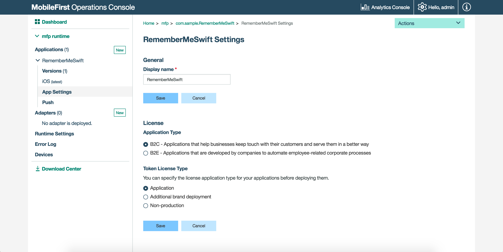
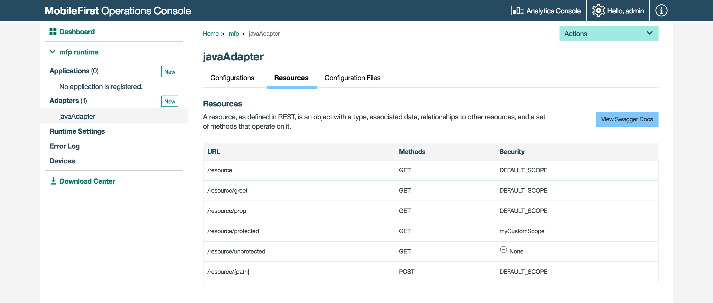

<!-- NLS_CHARSET=UTF-8 -->
## 概説
{: #overview }
{{ site.data.keys.mf_console_full }} は、開発者と管理者のどちらにとっても、単純化されたワークフローでアプリケーションとアダプターの作成、モニター、保護、および管理を行える、Web ベースの UI です。

#### 開発者として
{: #as-a-developer }
* 任意の環境用のアプリケーションを開発し、{{ site.data.keys.mf_server }} に登録する。
* デプロイ済みのすべてのアプリケーションとアダプターを一目で確認する。 『ダッシュボード』を参照してください。
* ダイレクト・アップデート、リモート無効化、アプリケーション認証性とユーザー認証のセキュリティー・パラメーターなど、登録済みアプリケーションを管理および構成する。
* 証明書をデプロイし、通知タグを作成し、通知を送信することでプッシュ通知をセットアップする。
* アダプターを作成してデプロイする。
* サンプルをダウンロードする。

#### IT 管理者として
{: #as-an-it-administrator }
* 各種サービスをモニターする。
* {{ site.data.keys.mf_server }} にアクセスするデバイスを検索し、そのアクセス権限を管理する。
* アダプター構成を動的に更新する。
* ログ・プロファイルを使用してクライアント・ロガー構成を調整する。
* 製品ライセンスがどのように使用されているのかを追跡する。

#### ジャンプ先:
{: #jump-to }
* [コンソールへのアクセス](#accessing-the-console)
* [コンソールのナビゲート](#navigating-the-console)

## コンソールへのアクセス
{: #accessing-the-console }
{{ site.data.keys.mf_console }} には、以下の方法でアクセスできます。

### ローカル側にインストールされている {{ site.data.keys.mf_server }} から
{: #from-a-locally-installed-mobilefirst-server }
#### デスクトップ・ブラウザー
{: #desktop-browser }
任意のブラウザーから、URL [http://localhost:9080/mfpconsole](http://localhost:9080/mfpconsole) をロードします。 ユーザー名/パスワードは、*admin/admin* です。

#### コマンド・ライン
{: #command-line }
「**コマンド・ライン**」ウィンドウで ({{ site.data.keys.mf_cli }} がインストールされている)、コマンド `mfpdev server console` を実行します。

### リモート側にインストールされている {{ site.data.keys.mf_server }} から
{: #from-a-remotely-installed-mobilefirst-server }
#### デスクトップ・ブラウザー
{: #desktop-browser-remote }
任意のブラウザーから、URL `http://the-server-host:server-port-number/mfpconsole` をロードします。  
ホスト・サーバーは、お客様所有のサーバーでも、IBM Cloud サービス (IBM [Mobile Foundation](../../../bluemix/)) でもかまいません。

#### コマンド・ライン
{: #command-line-remote }
「**コマンド・ライン**」ウィンドウで ({{ site.data.keys.mf_cli }} がインストールされている)、以下の手順に従います。

1. 以下の手順で、リモート・サーバー定義を追加します。

    *対話モード*  
    コマンド `mfpdev server add` を実行し、画面に表示される指示に従います。

    *ダイレクト・モード*  
    `mfpdev server add [server-name] --URL [remote-server-URL] --login [admin-username] --password [admin-password] --contextroot [admin-service-name]` という構造でコマンドを実行します。 例:

   ```bash
   mfpdev server add MyRemoteServer http://my-remote-host:9080/ --login TheAdmin --password ThePassword --contextroot mfpadmin
   ```

2. コマンド `mfpdev server console MyRemoteServer` を実行します。

> 各種 CLI コマンドについては、 [CLI を使用した {{ site.data.keys.product_adj }} 成果物の管理](../../../application-development/using-mobilefirst-cli-to-manage-mobilefirst-artifacts/)チュートリアルで学習してください。

## コンソールのナビゲート
{: #navigating-the-console }
### ダッシュボード
{: #dashboard }
ダッシュボードには、デプロイされたプロジェクトの概要ビューが表示されます。


#### 「アクション」ドロップダウン
{: #actions-dropdown }
このドロップダウンを使用して、さまざまなコンソール・アクションに素早くアクセスできます。


### ランタイム設定
{: #runtime-settings }
ランタイム・プロパティー、グローバル・セキュリティー変数、サーバー鍵ストア、および機密クライアントを編集します。


### エラー・ログ
{: #error-log }
エラー・ログには、現在のランタイム環境の {{ site.data.keys.mf_console }} またはコマンド・ラインから開始された管理操作のうち、失敗した管理操作がリストされます。 ログを使用して、サーバーの障害の影響を確認してください。

> 詳しくは、ユーザー文書で、ランタイム環境での操作のエラー・ログに関するトピックを参照してください。


### デバイス
{: #devices }
管理者は、{{ site.data.keys.mf_server }} にアクセスするデバイスを検索すること、およびアクセス権を管理することができます。  
デバイスは、ユーザー ID や分かりやすい名前を使用して検索できます。 ユーザー ID は、ログインに使用した ID です。  
分かりやすい名前は、デバイスをユーザー ID を共有する他のデバイスと区別するための、そのデバイスに関連した名前です。

> 詳しくは、ユーザー文書で、デバイス・アクセス管理に関するトピックを参照してください。


### アプリケーション
{: #applications }
#### アプリケーションの登録
{: #registering-applications }
基本的なアプリケーションの値を指定し、スターター・コードをダウンロードします。


#### アプリケーションの管理
{: #managing-applications }
[ダイレクト・アップデート](../../../application-development/direct-update/)、リモート無効化、[アプリケーション認証性](../../../authentication-and-security/application-authenticity/)、および[セキュリティー・パラメーターの設定](../../../authentication-and-security/)を使用して、登録されたアプリケーションの管理および構成を行います。


#### 認証とセキュリティー
{: #authentication-and-security }
デフォルトのトークンの有効期限値などのアプリケーション・セキュリティー・パラメーターを構成し、スコープ・エレメントをセキュリティー検査にマップし、必須アプリケーション・スコープを定義し、セキュリティー検査のオプションを構成します。

> {{ site.data.keys.product_adj }} セキュリティー・フレームワークについて[説明します](../../../authentication-and-security/)。


#### アプリケーション設定
{: #application-settings }
コンソールでのアプリケーションの表示名、アプリケーション・タイプ、およびライセンスを構成します。



#### 通知
{: #notifications }
[プッシュ通知](../../../notifications/)および関連パラメーター (証明書と GCM の詳細など) をセットアップし、タグを定義し、デバイスに通知を送信します。


### アダプター
{: #adapters }
#### アダプターの作成
{: #creating-adapters }
[アダプターを登録し](../../../adapters/)、スターター・コードをダウンロードします。また、処理中のアダプターを更新しますが、これはアダプターのプロパティーを更新することで行い、アダプター成果物の再ビルドと再デプロイを必要としません。


#### アダプター・プロパティー
{: #adapter-properties }
アダプターがデプロイされると、アダプターをコンソールで構成できます。



### クライアント・ログ
{: #client-logs }
管理者は、ログ・プロファイルを使用して、クライアント・ロガー構成 (ログ・レベルや、オペレーティング・システム、オペレーティング・システム・バージョン、アプリケーション、アプリケーション・バージョン、およびデバイス・モデルの組み合わせについてのログ・パッケージ・フィルターなど) を調整できます。

管理者が構成プロファイルを作成すると、ログ構成は、`WLResourceRequest` などの API 呼び出しへの応答と連結され、自動的に適用されます。

> 詳しくは、ユーザー文書で、クライアント・サイド・ログ・キャプチャーの構成に関するトピックを参照してください。


### ライセンス・トラッキング
{: #license-tracking }
上部の「設定」ボタンからアクセスできます。

ライセンス条項は、{{ site.data.keys.product }} のどのエディション (Enterprise または Consumer) を使用するかにより異なります。   ライセンス追跡は、デフォルトでは有効になっており、アクティブ・クライアント・デバイス、インストールされているアプリケーションなど、ライセンス・ポリシーに関連するメトリックが追跡されます。 この情報は、{{ site.data.keys.product }} の現在の使用がライセンス資格レベル内に収まっているかどうかを判別するのに役立ち、ライセンス違反を防止できます。

管理者は、クライアント・デバイスの使用を追跡し、デバイスがアクティブかどうか判別することで、サービスに今後アクセスしないデバイスを廃棄できます。 例えば、従業員が退社した場合にこの状態が発生することがあります。

> 詳しくは、ユーザー文書でライセンス追跡に関するトピックを参照してください。


### ダウンロード
{: #downloads }
インターネット接続を使用できない場合、{{ site.data.keys.mf_console }} のダウンロード・センターから、{{ site.data.keys.product }} のさまざまな開発作成物のスナップショットをダウンロードできます。


