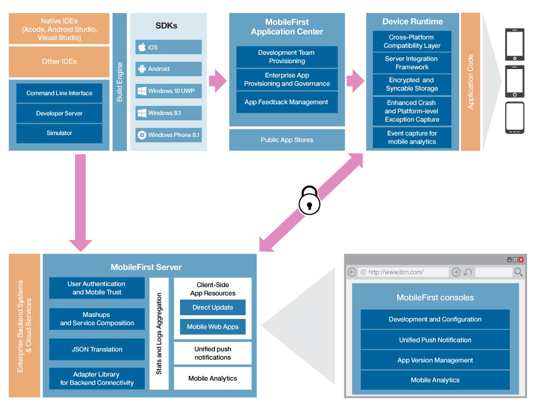

<!-- NLS_CHARSET=UTF-8 -->
## 概説
{: #overview }
{{site.data.keys.product_full }} は、{{site.data.keys.mf_cli }}、{{site.data.keys.mf_server }}、クライアント・サイドのランタイム・コンポーネント、{{site.data.keys.mf_console }}、{{site.data.keys.mf_app_center }}、および {{site.data.keys.mf_system_pattern }} のコンポーネントで構成されています。

次の図は、{{site.data.keys.product }} のコンポーネントを示しています。

### {{site.data.keys.mf_cli }}
{: #mobilefirst-cli }
アプリケーションを開発および管理するために、{{site.data.keys.mf_console }} に加えて {{site.data.keys.mf_cli_full }} を使用できます。{{site.data.keys.product_adj }} 開発プロセスのいくつかの側面は、CLI を使用して実行する必要があります。

接頭部が **mfpdev** のすべてのコマンドでは、以下のタイプのタスクがサポートされます。

* {{site.data.keys.mf_server }} へのアプリケーションの登録
* アプリケーションの構成
* アダプターの作成、ビルド、およびデプロイ
* Cordova アプリケーションのプレビューおよび更新
* 詳しくは、[CLI を使用した {{site.data.keys.product_adj }} 成果物の管理](../../application-development/using-mobilefirst-cli-to-manage-mobilefirst-artifacts/)チュートリアルを参照してください。

### {{site.data.keys.mf_server }}
{: #mobilefirst-server }
{{site.data.keys.mf_server }} は、保護されたバックエンド接続、アプリケーション管理、プッシュ通知サポート、および分析機能とモニター機能を、{{site.data.keys.product_adj }} アプリケーションに提供します。Java Platform, Enterprise Edition (Java EE) の意味でのアプリケーション・サーバーではありません。{{site.data.keys.product }} アプリケーション・パッケージのコンテナーとして機能し、実際には、従来のアプリケーション・サーバーの上で実行され、オプションで EAR (エンタープライズ・アーカイブ) ファイルとしてパッケージされる Web アプリケーションの集合です。

{{site.data.keys.mf_server }} は、エンタープライズ環境に統合され、既存のリソースとインフラストラクチャーを使用します。この統合は、バックエンド・エンタープライズ・システムとクラウド・ベースのサービスを、ユーザー・デバイスに向けた通信路に送る、サーバー・サイドのソフトウェア・コンポーネントであるアダプターをベースとしています。アダプターを使用して、情報源からデータを取得および更新したり、トランザクションの実行と他のサービスおよびアプリケーションの開始をユーザーに許可したりすることができます。

[{{site.data.keys.mf_server }} について説明します](server)。

### クライアント・サイドのランタイム・コンポーネント
{: #client-side-runtime-components }
{{site.data.keys.product }} では、デプロイされたアプリケーションのターゲット環境内でサーバー機能を組み込むクライアント・サイド・ランタイム・コードが用意されています。これらのランタイム・クライアント API は、ローカルに保管されているアプリケーション・コードに統合されているライブラリーです。それらを使用して、{{site.data.keys.product_adj }} 機能をクライアント・アプリケーションに追加します。API およびライブラリーは、{{site.data.keys.mf_dev_kit_full }} を使用してインストールするか、ご使用の開発プラットフォーム用のリポジトリーからダウンロードすることができます。

### {{site.data.keys.mf_console }}
{: #mobilefirst-operations-console }
{{site.data.keys.mf_console }} は、モバイル・アプリケーションの制御と管理に使用されます。{{site.data.keys.mf_console }} は、{{site.data.keys.product }} 開発について学習するためのエントリー・ポイントでもあります。コンソールから、コード例、ツール、および SDK をダウンロードできます。

以下のタスクには、{{site.data.keys.mf_console }} を使用できます。

* デプロイされたアプリケーション、アダプター、およびプッシュ通知規則のすべてを、一元的な Web ベースのコンソールからモニターおよび構成する。
* アプリケーション・バージョンおよびデバイス・タイプの事前構成された規則を使用して、{{site.data.keys.mf_server }} への接続機能をリモート側から無効にする。
* アプリケーション起動時にユーザーに送信されるメッセージをカスタマイズする。
* すべての実行中のアプリケーションからユーザー統計を収集する。
* ユーザー関与および使用量 (アプリケーションを通じてサーバーに関わるユーザーの数および頻度) について、組み込みの事前構成されたレポートを生成する。
* アプリケーション固有のイベントのデータ収集規則を構成する。
* [{{site.data.keys.mf_console }} について説明する](console)。

### {{site.data.keys.mf_analytics }}
{: #mobilefirst-analytics }
{{site.data.keys.product }} には、{{site.data.keys.mf_console }} からアクセスできるスケーラブルな操作{{site.data.keys.mf_analytics_short }}機能が含まれます。企業はこの{{site.data.keys.mf_analytics_short }}フィーチャーを使用して、デバイス、アプリケーション、およびサーバーから収集された各種ログおよびイベント全体を検索することで、パターン、問題、およびプラットフォーム使用量統計を検討できます。

{{site.data.keys.mf_analytics }}のデータには、以下のソースが含まれます。

* iOS デバイスと Android デバイスのアプリケーションの破損イベント (ネイティブ・コード・エラーおよび JavaScript エラーの破損イベント)。
* アプリケーションとサーバー間のアクティビティーの対話 (プッシュ通知を含む、{{site.data.keys.mf_cli }} クライアント/サーバー・プロトコルでサポートされるものすべて)。
* 従来の {{site.data.keys.product_adj }} ログ・ファイルに取り込まれたサーバー・サイド・ログ。

[{{site.data.keys.mf_analytics }} について説明します](../../analytics)。

### Application Center
{: #application-center }
Application Center を使用すると、組織内で開発中のモバイル・アプリケーションを、モバイル・アプリケーションの単一リポジトリーで共有できます。開発チーム・メンバーは、Application Center を使用して、チームのメンバーとアプリケーションを共有できます。このプロセスは、アプリケーションの開発に関わるすべての担当者間のコラボレーションを容易にします。

企業では、一般に、以下のように Application Center を使用できます。

1. 開発チームは、アプリケーションの 1 つのバージョンを作成します。
2. 開発チームは、アプリケーションを Application Center にアップロードし、その説明を入力し、拡張チームに対して、それをレビューしてテストするように依頼します。
3. アプリケーションの新バージョンが使用可能になると、テスト担当者は、モバイル・クライアントである Application Center インストーラー・アプリケーションを実行します。次に、テスト担当者は、この新バージョンのアプリケーションを見つけ、自分のモバイル・デバイスにインストールし、テストします。
4. テスト後に、テスト担当者はアプリケーションを評価し、フィードバックを送信します。開発者は Application Center コンソールからそのフィードバックを見ることができます。

Application Center は、企業内部のみでの使用を目的としたもので、一部のモバイル・アプリケーションのターゲットを特定のユーザー・グループにすることができます。Application Center はエンタープライズ・アプリケーション・ストアとして使用できます。

### {{site.data.keys.mf_system_pattern }}
{: #mobilefirst-system-pattern }
{{site.data.keys.mf_system_pattern_full }} により、{{site.data.keys.mf_server }} を IBM PureApplication System または IBM PureApplication Service on SoftLayer にデプロイできます。これらのパターンにより、管理者および企業は、オンプレミス・クラウド・テクノロジーを活用して、ビジネス環境の変化に素早く対応することができます。このアプローチにより、デプロイメント・プロセスが簡素化され、増大するモバイルの需要に対処する業務効率が向上します。その需要により、従来の需要サイクルを超えてソリューションの反復が加速されます。{{site.data.keys.mf_server }} Pattern を使用すると、組み込みスケーリング・ポリシーなどの組み込みのノウハウやベスト・プラクティスも利用できるようになります。

#### PureApplication System
{: #pureapplication-system }
IBM PureApplication System は、IBM X- アーキテクチャーを基盤とした極めてスケーラブルな統合システムで、クラウド環境においてアプリケーション中心のコンピューティング・モデルを実現します。

アプリケーション中心システムは、複雑なアプリケーションの管理、およびアプリケーションによって呼び出されるタスクおよびプロセスの管理に効果的な方法です。このシステム全体は、さまざまなリソース構成がさまざまなアプリケーション・ワークロードに合わせて自動的に調整される、多様な仮想コンピューティング環境を実装します。IBM PureApplication System プラットフォームのアプリケーション管理機能により、ミドルウェアおよびその他のアプリケーション・コンポーネントのデプロイメントが素早く、容易に、反復可能になります。

IBM PureApplication System は、仮想化ワークロードおよびスケーラブル・インフラストラクチャーを、1 つの統合システム内に収容して提供します。

#### 仮想システム・パターン
{: #virtual-system-patterns }
仮想システム・パターンは、デプロイメント要件のセットに対応した、繰り返し使用されるトポロジーの論理表現です。

仮想システム・パターンは、1 つ以上の仮想マシン・インスタンスおよびそれらの仮想マシン・インスタンスで実行されるアプリケーションを含むシステムの効率的で反復可能なデプロイメントを可能にします。デプロイメントを完全に自動化し、時間のかかる手動タスクを何度も実行する必要性を排除できます。そのようなデプロイメントにより、特にサーバー・ファームなどの複雑な実動トポロジーでの、エラーを起こしやすい、手動の構成プロセスによって引き起こされる問題が排除され、ソリューション・デプロイメントが加速されます。
