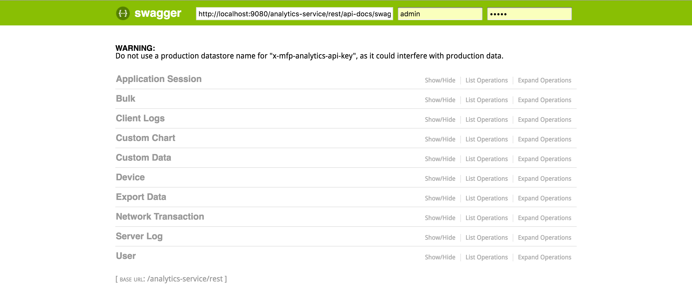

<!-- NLS_CHARSET=UTF-8 -->
## 개요
{: #overview }

{{ site.data.keys.mf_analytics_full }}는 개발자가 Analytics 데이터를 가져오고(POST) 내보내는(GET) 데 도움이 되는 REST API를 제공합니다.

## 다음으로 이동:
{: #jump-to }

* [Analytics REST API](#analytics-rest-api)
* [Swagger 문서에서 사용해 보기](#try-it-out-on-swagger-docs)

## Analytics REST API
{: #analytics-rest-api }

Analytics REST API를 사용하려는 경우:

**기본 URL**

`/analytics-service/rest`

**예**

`https://example.com:9080/analytics-service/v3/applogs`

REST API 메소드 |엔드포인트 |설명
--- | --- | ---
Application Logs(POST) |/v3/applogs |새 애플리케이션 로그를 작성합니다.
Application Session(POST) |/v3/appsession |동일한 appSessionID를 사용하여 보고할 때 애플리케이션 세션을 작성하거나 기존 애플리케이션 세션을 업데이트합니다.
Bulk(POST) |/v3/bulk |벌크로 이벤트를 보고합니다.
Custom Chart(GET)|/v3/customchart |모든 사용자 정의 차트 정의를 내보냅니다.
Custom Chart(POST) |/v3/customchart/import |사용자 정의 차트의 목록을 가져옵니다.
Custom Data(POST) |/v3/customdata |새 사용자 정의 데이터를 작성합니다.
Device(POST) |/v3/device |디바이스를 작성하거나 업데이트합니다.
Export Data(GET) |/v3/export |데이터를 지정된 데이터 형식으로 내보냅니다.
Network Transaction(POST) |/v3/networktransaction |새 네트워크 트랜잭션을 작성합니다.
Server Log(POST) |/v3/serverlog |새 서버 로그를 작성합니다.
User(POST) |/v3/user |새 서버를 작성합니다.

## Swagger 문서에서 사용해 보기
{: #try-it-out-on-swagger-docs }

Swagger 문서에서 Analytics REST API를 사용해 보십시오.  
Analytics가 사용으로 설정된 {{ site.data.keys.mf_server }} 구성에서는 다음을 방문하십시오. `<ipaddress>:<port>/analytics-service`

**조작 펼치기**를 클릭하여 각 메소드에 대한 구현 시 참고사항, 매개변수 및 응답 메시지를 확인할 수 있습니다.

> 경고: **사용해 보기**를 사용하여 전송하는 데이터는 데이터 저장소에 이미 있는 데이터를 간섭할 수 있습니다. 프로덕션 환경에 데이터 전송을 명시적으로 시도하는 경우가 아니면 `x-mfp-analytics-api-key`에 대해 테스트 이름을 사용하십시오.

