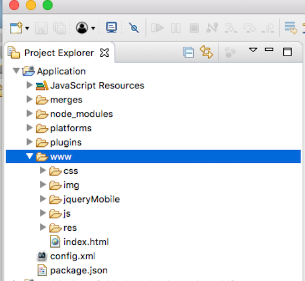

<!-- NLS_CHARSET=UTF-8 -->
## 개요
{: #overview }
애플리케이션의 UI를 디자인하고 구현하는 작업은 개발 프로세스에서 중요한 부분입니다. {{ site.data.keys.product_adj }} Thym 플러그인과 함께 Eclipse 플러그인은 Cordova 애플리케이션의 개발을 지원합니다.
각 컴포넌트의 사용자 정의 CSS 스타일을 처음부터 새로 쓰면 상위 레벨의 사용자 정의가 가능하지만 많은 양의 자원도 필요합니다.
경우에 따라 기존 JavaScript UI 프레임워크를 사용하는 것이 더 좋습니다.
이 주제에서는 두 개의 UI 프레임워크, {{ site.data.keys.product_adj }} Studio의 Eclipse에서 제공되는 WYSIWYG 편집기와 JQuery Mobile을 사용하여 {{ site.data.keys.product_adj }} 애플리케이션을 개발하는 방법을 설명합니다.

MobileFirst Eclipse 플러그인을 사용하여 Cordova 애플리케이션의 UI를 개발하려면 다음을 수행하십시오.

1. Eclipse를 다운로드하십시오.
2. Eclipse 마켓플레이스에서 [Thym](http://marketplace.eclipse.org/content/eclipse-thym) 플러그인을 설치하십시오.
3. Eclipse 마켓플레이스에서 [MobileFirst 플랫폼 플러그인](http://marketplace.eclipse.org/content/ibm-mobilefirst-foundation-studio)을 설치하십시오.


## WYSIWYG 편집기
{: #wysiwyg-editor }
WYSIWYG 편집기는 개발자의 편의를 위해 HTML UI 위젯용 MobileFirst 플랫폼 Eclipse 플러그인과 함께 제공됩니다.
이 편집기에서는 단추 또는 텍스트 상자와 같은 UI 위젯과 기타 HTML 위젯을 끌어서 놓을 수 있는 기본 팔레트를 제공합니다. 이 도구는 사용자가 Cordova 애플리케이션을 신속하게 개발하는 데 사용할 수 있는 Rapid Mobile Application Development 도구입니다.


## jQuery Mobile
{: #jquery-mobile }
jQuery는 신속한 웹 개발을 위해 HTML 문서 플로우, 이벤트 처리, 애니메이션 및 Ajax 상호작용을 단순화한 빠르고 간결한 JavaScript 프레임워크입니다. jQuery Mobile은 스마트폰 및 태블릿을 위한 터치에 최적화된 웹 프레임워크입니다. jQuery Mobile이 실행되려면 jQuery가 있어야 합니다.

애플리케이션에 jQuery Mobile을 추가하려면 다음을 수행하십시오.

1. **파일 -> 새로 작성 -> 새 Hybrid Mobile(Cordova) 애플리케이션 프로젝트**를 클릭하여 Eclipse에서 Thym 프로젝트를 작성하십시오.
2. [jQuery Mobile 패키지를 다운로드](http://jquerymobile.com/download/)하십시오.
3. 다운로드한 jQuery Mobile 패키지를 아래 이미지에 표시된 대로 하이브리드 애플리케이션의 `www` 디렉토리에 복사하십시오.
  
4. 스크린샷에 표시된 대로 기본 `index.html`을 열고 jQuery 참조(스니펫에 표시됨)를 프로젝트에 추가하십시오.
    

    ```html
      <!DOCTYPE HTML>
      <html>
          	<head>
          		<meta charset="UTF-8">
          		<title>appName</title>
          		<meta name="viewport" content="width=device-width, initial-scale=1.0, maximum-scale=1.0, minimum-scale=1.0, user-scalable=0">
          		<!--
          			<link rel="shortcut icon" href="images/favicon.png">
          			<link rel="apple-touch-icon" href="images/apple-touch-icon.png">
          		-->
          		<link href="jqueryMobile/jquery.mobile.structure-1.4.5.min.css" rel="stylesheet">
          		<link href="jqueryMobile/demos/css/jquery.mobile.structure-1.4.5.min.css" rel="stylesheet">
          		<link href="jqueryMobile/jquery.mobile-1.4.5.min.css" rel="stylesheet">
          		<link href="jqueryMobile/jquery.mobile.theme-1.4.5.css" rel="stylesheet">
          		<link href="jqueryMobile/jquery.mobile.theme-1.4.5.min.css" rel="stylesheet">
          		<link href="jqueryMobile/jquery.mobile.external-png-1.4.5.min.css" rel="stylesheet">
          		<link href="jqueryMobile/jquery.mobile.inline-png-1.4.5.css" rel="stylesheet">
          		<link href="jqueryMobile/demos/css/jquery.mobile.inline-svg-1.4.5.min.css" rel="stylesheet">
          		<link href="jqueryMobile/jquery.mobile-1.4.5.css" rel="stylesheet">
          		<link href="jqueryMobile/jquery.mobile.inline-png-1.4.5.min.css" rel="stylesheet">
          		<link href="jqueryMobile/jquery.mobile.external-png-1.4.5.css" rel="stylesheet">
          		<link href="jqueryMobile/demos/css/jquery.mobile.inline-png-1.4.5.min.css" rel="stylesheet">
          		<link href="jqueryMobile/demos/theme-classic.css" rel="stylesheet">
          		<link href="jqueryMobile/jquery.mobile.inline-svg-1.4.5.css" rel="stylesheet">
          		<link href="jqueryMobile/jquery.mobile.structure-1.4.5.css" rel="stylesheet">
          		<link href="jqueryMobile/demos/css/jquery.mobile-1.4.5.min.css" rel="stylesheet">
          		<link href="jqueryMobile/jquery.mobile.inline-svg-1.4.5.min.css" rel="stylesheet">
          		<link href="jqueryMobile/demos/css/jquery.mobile.theme-1.4.5.min.css" rel="stylesheet">
          		<link href="jqueryMobile/demos/css/jquery.mobile.external-png-1.4.5.min.css" rel="stylesheet">
          		<link rel="stylesheet" href="css/main.css">
          		<script>window.$ = window.jQuery = WLJQ;</script>
          		<script src="jqueryMobile/demos/jquery.js"></script>
          		<script src="jqueryMobile/demos/jquery.mobile-1.4.5.js"></script>
          	</head>
          	<body style="display: none;">
          		<div data-role="page" id="page">
          			<div data-role="content" style="padding: 15px">
          				<!--application UI goes here-->
          				Hello MobileFirst
          			</div>
          		</div>
          		<script src="js/initOptions.js"></script>
          		<script src="js/main.js"></script>
          		<script src="js/messages.js"></script>
          	</body>
      </html>
    ```
HTML 파일에서 jQuery Mobile에 대한 참조를 추가한 후에는 Eclipse에서 파일을 닫고 다시 여십시오. 그러면 HTML 캔버스에 끌어서 놓을 수 있는 팔레트 보기에 jQuery Mobile 위젯이 표시됩니다. 
