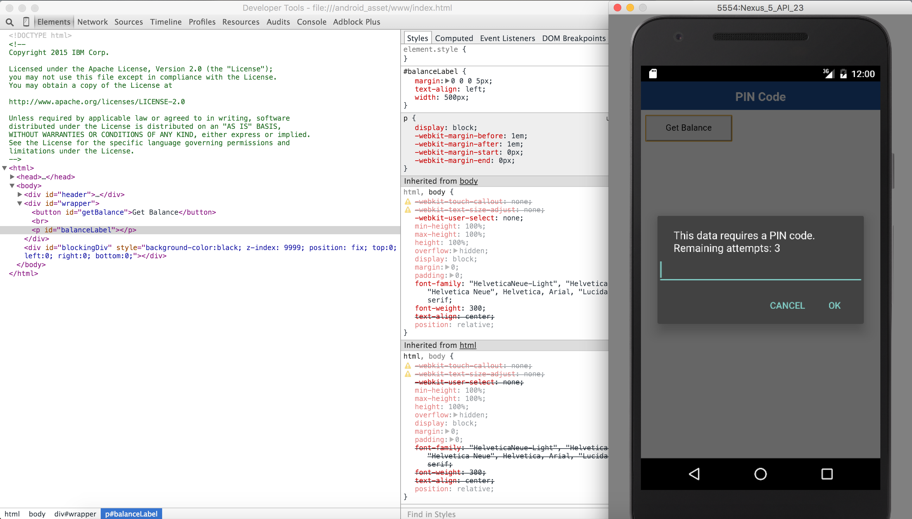

<!-- NLS_CHARSET=UTF-8 -->
## 개요
{: #overview }
디버깅은 애플리케이션 코드 및 애플리케이션 사용자 인터페이스에서 결함의 원인을 찾는 것으로 구성된 프로세스입니다.

* JavaScript(Cordova, 웹) 애플리케이션은 HTML, JavaScript 및 CSS와 같은 웹 기반 자원으로 구성되어 있습니다. 또한 Cordova 애플리케이션에는 Java, Objective-C, Swift, C# 등으로 작성된 선택적 네이티브 코드도 포함될 수 있습니다.
* 플랫폼 SDK에서 제공하는 표준 도구(예: XCode, Android 또는 Microsoft Visual Studio)를 사용하여 네이티브 코드를 디버깅할 수 있습니다.

이 학습서에서는 에뮬레이터, 시뮬레이터, 물리적 디바이스를 통해 로컬로 실행되는지, 또는 웹 브라우저에서 실행되는지 여부에 관계 없이 JavaScript 기반 애플리케이션을 디버깅하는 여러 가지 접근 방식을 탐색합니다.

> Cordova 웹 사이트 [애플리케이션 디버깅](https://cordova.apache.org/docs/en/latest/guide/next/index.html#link-testing-on-a-simulator-vs-on-a-real-device)에서 Cordova 디버깅 및 테스트에 대해 자세히 알아보십시오.

#### 다음으로 이동:
{: #jump-to }

* [{{ site.data.keys.mf_mbs }}를 사용하는 디버깅](#debugging-with-the-mobile-browser-simulator)
* [Ripple을 사용하는 디버깅](#debugging-with-ripple)
* [iOS Remote Web Inspector를 사용하는 디버깅](#debugging-with-ios-remote-web-inspector)
* [Chrome Remote Web Inspector를 사용하는 디버깅](#debugging-with-chrome-remote-web-inspector)
* [{{ site.data.keys.product_adj }} 로거를 사용하는 디버깅](#debugging-with-mobilefirst-logger)
* [WireShark를 사용하는 디버깅](#debugging-with-wireshark)

## {{ site.data.keys.mf_mbs }}를 사용하는 디버깅
{: #debugging-with-the-mobile-browser-simulator }
{{ site.data.keys.product_full }} MBS({{ site.data.keys.mf_mbs }})를 사용하여 {{ site.data.keys.product_adj }} 애플리케이션을 미리 보고 디버깅할 수 있습니다.  
MBS를 사용하려면 **명령행** 창을 열고 다음 명령을 입력하십시오.

```bash
mfpdev app preview
```

애플리케이션이 여러 개의 플랫폼으로 구성된 경우 미리 볼 플랫폼을 다음과 같이 지정하십시오.

```bash
mfpdev app preview -p <platform>
```

> <span class="glyphicon glyphicon-exclamation-sign" aria-hidden="true"></span> **중요:** 미리보기 기능에는 여러 가지 알려진 제한사항이 있습니다. 미리보기 중에 애플리케이션이 예상대로 작동하지 않을 수 있습니다. 예를 들어 애플리케이션에서 기밀 클라이언트를 사용하는 보안 기능을 우회하여 인증 확인 핸들러가 트리거되지 않습니다. 

### {{ site.data.keys.mf_mbs }}
{: #mobile-browser-simulator}


### 단순 미리보기
{: #simple-preview }


> [{{ site.data.keys.mf_cli }}를 사용하여 {{ site.data.keys.product_adj }} 아티팩트 관리](../using-mobilefirst-cli-to-manage-mobilefirst-artifacts) 학습서에서 {{ site.data.keys.mf_cli }}에 대해 자세히 알아보십시오.

## Ripple을 사용하는 디버깅
{: #debugging-with-ripple }
Apache Ripple™은 모바일 웹 애플리케이션의 디버깅에 사용되는 웹 기반 모바일 환경 시뮬레이터입니다.  
이를 사용하여 브라우저에서 Cordova 애플리케이션을 실행하고 여러 Cordova 기능을 시뮬레이션해 볼 수 있습니다. 예를 들어 컴퓨터에서 로컬로 사진을 선택할 수 있게 하여 카메라 API를 시뮬레이션해 볼 수 있습니다.  

### Ripple 설치
{: #installing-ripple }

1. 최신 버전의 [Node.js](https://nodejs.org/en/)를 다운로드하고 설치하십시오.
터미널에 `npm -v`를 입력하여 Node.js 설치를 확인하십시오.
2. 터미널을 열고 다음을 입력하십시오.

   ```bash
   npm install -g ripple-emulator
   ```

### Ripple을 사용하여 애플리케이션 실행
{: #running-application-using-ripple }
Ripple이 설치된 후에 Cordova 프로젝트 위치에서 터미널을 열고 다음을 입력하십시오.

```bash
ripple 에뮬레이트
```


> Apache Ripple™에 대한 자세한 정보는 [Apache Ripple 페이지](http://ripple.incubator.apache.org/) 또는 [npm ripple-emulator 페이지](https://www.npmjs.com/package/ripple-emulator)에 있습니다.

## iOS Remote Web Inspector를 사용하는 디버깅
{: #debugging-with-ios-remote-web-inspector }
Apple에서는 iOS 6부터 iOS 디바이스의 웹 애플리케이션 디버깅에 사용되는 원격 [Web Inspector](https://developer.apple.com/safari/tools/)를 도입했습니다. 디버깅하려면 디바이스 또는 iOS 시뮬레이터의 **사생활 보호** 옵션이 꺼져 있는지 확인하십시오.  

1. 디바이스에서 Web Inspector를 사용하도록 설정하려면 **설정 > Safari > 고급 > Web Inspector**를 누르십시오.
2. 디버깅을 시작하려면 Mac에 iOS 디바이스를 연결하거나 시뮬레이터를 시작하십시오.
3. Safari에서 **환경 설정 > 고급**으로 이동하고 **메뉴 표시줄에 개발 메뉴 표시** 선택란을 선택하십시오.
4. Safari에서 **개발 > [디바이스 ID] > [애플리케이션 HTML 파일]**을 선택하십시오.


## Chrome Remote Web Inspector를 사용하는 디버깅
{: #debugging-with-chrome-remote-web-inspector }
Google Chrome을 사용하여 Android 디바이스 또는 Android 에뮬레이터의 웹 애플리케이션을 원격으로 검사할 수 있습니다.  
이 조치를 수행하려면 Android 4.4 이상, Chrome 32 이상이 필요합니다. 또한 `AndroidManifest.xml` 파일에는 `targetSdkVersion = 19` 이상이 필요합니다. `project.properties` 파일에는 `target = 19` 이상이 필요합니다.

1. Android 에뮬레이터 또는 연결된 디바이스에서 애플리케이션을 시작하십시오.
2. Chrome에서는 주소 표시줄에 `chrome://inspect` URL을 입력하십시오.
3. 관련 애플리케이션에 대해 **검사**를 누르십시오.



### {{ site.data.keys.product_adj }} 로거를 사용하는 디버깅
{: #debugging-with-mobilefirst-logger }
{{ site.data.keys.product }}은 로그 메시지를 인쇄하는 데 사용할 수 있는 `WL.Logger` 오브젝트를 제공합니다.  
`WL.Logger`에는 여러 로깅 레벨(`WL.Logger.info`, `WL.Logger.debug`, `WL.Logger.error`)이 포함되어 있습니다.

> 자세한 정보는 사용자 문서의 API 참조 파트에서 `WL.Logger`에 대한 문서를 참조하십시오.

**로그 검사:**

* 시뮬레이터 또는 에뮬레이터를 사용하여 플랫폼을 미리 보는 경우 **개발자 콘솔**
* Android 디바이스에서 실행되는 경우 **LogCat**
* iOS에서 실행되는 경우 **XCode 콘솔**
* Windows 디바이스에서 실행되는 경우 **Visual Studio 출력**

### WireShark를 사용하는 디버깅
{: #debugging-with-wireshark }
**Wireshark는 네트워크 프로토콜 분석기**로, 이를 사용하여 네트워크에서 발생하는 사항을 확인할 수 있습니다.  
필터를 사용하여 필요한 사항만 수행할 수 있습니다.  

> 자세한 정보는 [WireShark](http://www.wireshark.org) 웹 사이트를 참조하십시오.


