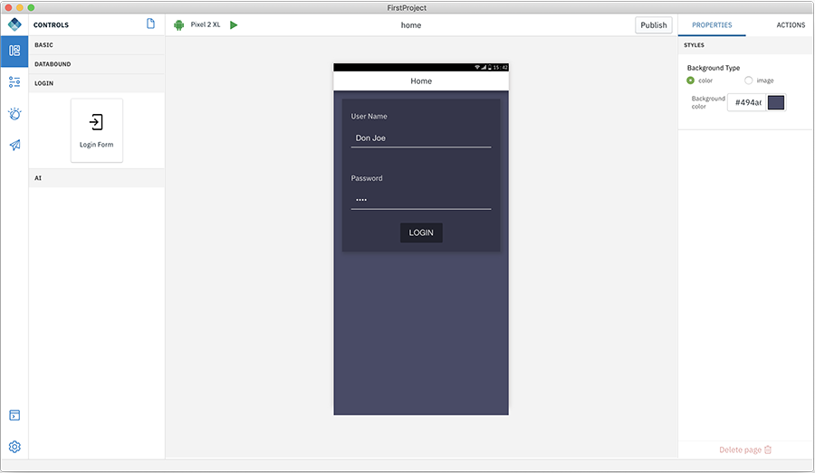
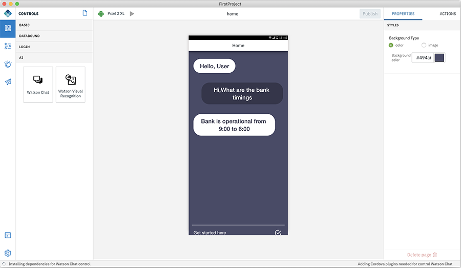

<!-- NLS_CHARSET=UTF-8 -->
## Digital App Builder 인터페이스
{: #digital-app-builder-interface }

선택된 모드(디자인/코드)를 기반으로 Digital App Builder 인터페이스가 표시됩니다.

### 디자인 모드의 Digital App Builder 인터페이스

Digital App Builder 인터페이스는 왼쪽 탐색 패널에서 다음으로 구성됩니다.

* **워크벤치** - 페이지 세부사항을 표시하거나 숨깁니다.
* **데이터** - OpenAPI doc을 사용하여 마이크로서비스의 데이터 소스를 작성하거나 기존 데이터 소스에 연결하여 데이터 세트를 추가하도록 돕습니다. 
* **Watson** - 새 인스턴스를 작성하거나 기존 인스턴스를 구성하기 위한 이미지 인식 및 챗봇(Watson Assistant) 구성요소로 구성됩니다. 
* **참여** - 푸시 알림 서비스를 추가하여 앱에서 사용자 참여를 늘릴 수 있으며, 라이브 업데이트 기능을 사용하여 제어 및 페이지의 표시/숨기기를 수행하거나 앱이 라이브 상태일 때 해당 특성의 변경을 수행할 수 있습니다.
* **콘솔**: 활동을 보기 위한 콘솔을 표시합니다. 
* **설정**: 앱 세부사항, 서버 정보, 플러그인, 프로젝트 복구(예: 종속 항목 다시 빌드, 플랫폼 다시 빌드, IBM Cloud 인증 정보 재설정), 분석 사용 또는 사용 안함을 표시합니다.

#### 워크벤치
{: #workbench }

워크벤치는 페이지를 디자인하도록 돕습니다. 워크벤치는 세 개의 작업 영역으로 구성됩니다.

1. **페이지/제어**: 이 영역은 기본적으로 작성된 페이지의 이름을 표시합니다. **+** 부호를 사용하여 새 페이지를 작성하십시오. **제어** 아이콘을 클릭하면 앱의 페이지에 기능 추가를 돕는 제어를 표시합니다. 각 제어 팔레트에서 페이지의 캔버스로 제어를 끌어서 놓기할 수 있습니다. 각 제어에는 일련의 특성 및 조치가 있습니다. 선택된 각 제어의 특성을 수정할 수 있습니다.

    다음은 사용 가능한 제어 목록입니다.
    * **기본**: 캔버스에 해당 기본 제어(단추, 표제, 이미지, 레이블)를 끌어서 놓기하여 특성 및 조치를 구성할 수 있습니다.

        

        * **단추** - 단추에는 레이블할 특성이 있습니다. 조치 탭에서 단추 클릭 시 이동할 페이지를 지정할 수 있습니다.
        * **표제 텍스트** - 페이지 제목과 같은 애플리케이션의 표제 텍스트를 추가하도록 돕습니다.
        * **이미지** - 로컬 이미지를 업로드하거나 이미지의 URL을 제공하도록 돕습니다.
        * **레이블** - 정적 텍스트를 페이지 본문에 추가하도록 돕습니다. 
    * **데이터 바운드** - 데이터 세트와 연결하고 데이터 세트의 엔티티에서 작동하도록 돕습니다. 데이터 바운드는 **목록** 및 **연결된 레이블**, 두 컴포넌트로 구성됩니다.

        

        * **목록** - 새 페이지를 작성하고 목록 컴포넌트를 끌어서 놓기합니다. **제목 나열**을 추가하고 작업할 목록 유형을 선택하고 작업할 컨텐츠를 추가하고 사용할 데이터 세트를 선택하십시오.

        **데이터 세트**의 추가 방법에 대한 자세한 정보는 [여기](../how-to-add-dataset/)를 참조하십시오.

    * **로그인** - 로그인은 **로그인 양식** 제어로 구성됩니다. 
 
        로그인 양식 제어는 애플리케이션의 로그인 페이지를 작성하여 Mobile Foundation 서버에 사용자를 연결하도록 돕습니다. Mobile Foundation 서버는 사용자를 인증하고 데이터에 액세스하기 위해 해당 보안 컨텍스트를 제공하는 보안 프레임워크를 제공합니다. 자세한 정보는 [여기](https://mobilefirstplatform.ibmcloud.com/tutorials/en/foundation/8.0/authentication-and-security/creating-a-security-check/)를 읽으십시오.

        

        **로그인 양식** 제어의 추가 방법에 대한 자세한 정보는 [여기](../how-to-login/)를 참조하십시오.

    * **AI** - AI 제어는 앱에 Watson AI 기능을 추가하도록 허용합니다.

        * **Watson Chat** - 이 제어는 IBM Cloud에서 Watson Assistant 서비스를 작동할 수 있는 완전한 대화 인터페이스를 제공합니다. 

            

            * 특성 섹션에서 구성된 Watson Assistant 서비스를 선택하고 연결하려는 작업공간을 선택하십시오. 대화(Chat) 대화를 정의하고 훈련하려면 Watson 아래의 [챗봇](../how-to-chatbot/)을 참조하십시오.

        * **Watson Visual Recognition** - 이 제어는 사진을 찍고 Watson Visual Recognition 서비스가 이를 식별할 수 있는 기능을 제공합니다.
         
            
 
            *  특성 섹션에서 구성된 Visual Recognition 서비스 및 분류 모델을 선택하십시오. 고유한 이미지 사용을 정의 및 훈련하려면 Watson 아래의 [이미지 인식](../how-to-image-recognition/)을 참조하십시오.

2. **캔버스** 섹션 - 이 영역은 선택된 현재 채널, 현재 페이지 이름, 공개 및 캔버스로 구성됩니다.

    * **채널** 아이콘 - 선택된 현재 채널을 표시합니다. **설정 > 앱 > 앱 세부사항** 아래의 플랫폼 섹션에서 필요한 채널을 선택하여 채널을 추가할 수 있습니다.
    * 현재 페이지 이름 - 캔버스 페이지 이름을 표시합니다. 페이지 간에서 전환할 때 현재 페이지 이름은 선택된 페이지로 업데이트됩니다.
    * **앱 빌드/검토** - 이 단추에는 두 개의 옵션이 있습니다. a. 개발 중인 앱의 검토를 지원합니다. b. 앱을 빌드합니다.
    * **공개** - 이 옵션은 Android/iOS용 앱을 빌드하고 이를 App Center에 공개하거나 새로 고친 웹 리소스를 사용하여 앱 “over-the-air”의 직접 업데이트를 공개할 수 있도록 지원합니다.
    * **캔버스** - 이 섹션의 가운데에는 디자인 또는 코드를 표시하는 캔버스가 있습니다. 제어를 끌어서 놓기하고 앱을 작성할 수 있습니다.

3. **특성/조치** 탭 - 오른쪽에는 특성 및 조치 탭이 있습니다. 제어가 캔버스에 있는 경우 제어의 특성을 편집 및 수정하고 수행할 관련 조치와 제어를 연결할 수 있습니다.

#### 데이터
{: #dataset-integration}

마이크로서비스에 대한 데이터 세트를 작성할 수 있으며, 데이터 세트를 작성한 후 앱에서 데이터 바운드 제어를 연결할 수 있습니다.

**데이터 세트**의 추가 방법에 대한 자세한 정보는 [여기](../how-to-add-dataset/)를 참조하십시오.

#### Watson
{: #integrating-with-watson-services}

Digital App Builder는 IBM Cloud에서 프로비저닝된 다양한 Watson 서비스에 연결하도록 앱을 구성하는 기능을 제공합니다.

#### 참여
{: #engagement}

푸시 알림을 앱에 추가하고 사용자 참여를 늘리거나 라이브 업데이트 기능을 사용하여 제어 및 페이지 표시/숨기기 또는 앱 라이브 시에 해당 특성 변경을 수행할 수 있습니다.

#### 콘솔
{: #console }

각 컴포넌트의 코드를 보도록 돕습니다. 또한 다양한 활동 및 오류에 대한 정보를 표시합니다.

#### 설정
{: #settings}

설정은 앱 설정을 관리하고 빌드 프로세스 중에 오류를 수정하도록 돕습니다. 설정은 **앱 세부사항**, **서버**, **플러그인**, **프로젝트 복구** 탭으로 구성됩니다.

### 코드 모드의 Digital App Builder 인터페이스

코드 모드의 Digital App Builder 인터페이스는 왼쪽 탐색 패널에서 다음으로 구성됩니다.

* **워크벤치** - 파일을 표시하거나 숨깁니다.
* **Watson** - 새 인스턴스를 작성하거나 기존 인스턴스를 구성하기 위한 이미지 인식 및 챗봇(Watson Assistant) 구성요소로 구성됩니다. 
* **참여** - 푸시 알림 서비스를 추가하여 앱에서 사용자 참여를 늘릴 수 있으며, 라이브 업데이트 기능을 사용하여 제어 및 페이지의 표시/숨기기를 수행하거나 앱이 라이브 상태일 때 해당 특성의 변경을 수행할 수 있습니다.
* **API** - 개발 중에 단순히 JSON 데이터를 제공하여 서버 Mocking을 지원합니다.
* **콘솔**: 활동을 보기 위한 콘솔을 표시합니다. 
* **설정**: 앱 세부사항, 서버 정보, 플러그인, 프로젝트 복구(예: 종속 항목 다시 빌드, 플랫폼 다시 빌드, IBM Cloud 인증 정보 재설정), 분석 사용 또는 사용 안함을 표시합니다.

#### 워크벤치(코드 모드)
{: #workbench }

워크벤치는 페이지를 디자인하도록 돕습니다. 워크벤치는 두 개의 작업 영역으로 구성됩니다.

1. **프로젝트 파일**: 이 영역은 기본적으로 작성된 이 앱과 연관된 파일의 목록을 표시합니다. **+** 부호를 사용하여 새 페이지를 작성하십시오. **제어** 아이콘(**</>**)을 클릭하면 **코드 스니펫** 패널이 표시됩니다. 이러한 코드 스니펫을 자신의 코드로 끌어서 놓은 후에 선택된 각 제어의 특성을 수정하십시오.

#### 코드 스니펫(코드 모드 전용)
{: #code-snippets}

일반적으로 사용되는 코드 스니펫 중 일부는 사전 정의되어 있으며, 코드 스니펫 섹션에서 단순한 끌어서 놓기를 통해 소스 파일에 추가될 수 있습니다. 이 섹션은 다음 카테고리의 코드 스니펫으로 구성되어 있습니다.

* **모바일 코어** - IBM Mobile Foundation Server에서 기본 오퍼레이션을 수행하기 위한 코드 스니펫
* **분석** - 사용자 정의 분석 및 사용자 피드백을 위한 코드 스니펫
* **아이콘** - 단순 Ionic 컴포넌트를 위한 코드 스니펫
* **푸시** - 푸시 알림 관련 작업을 위한 코드 스니펫
* **라이브 업데이트** - 기능 토글의 라이브 업데이트 관련 작업을 위한 코드 스니펫

