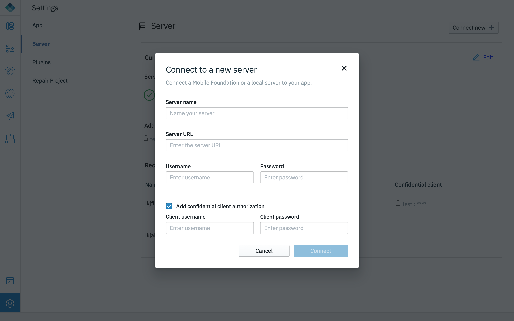
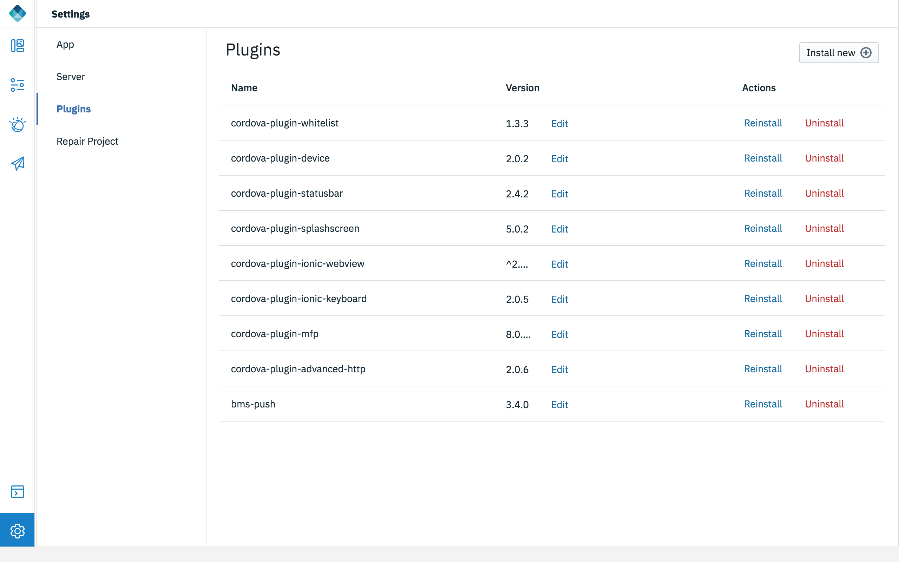
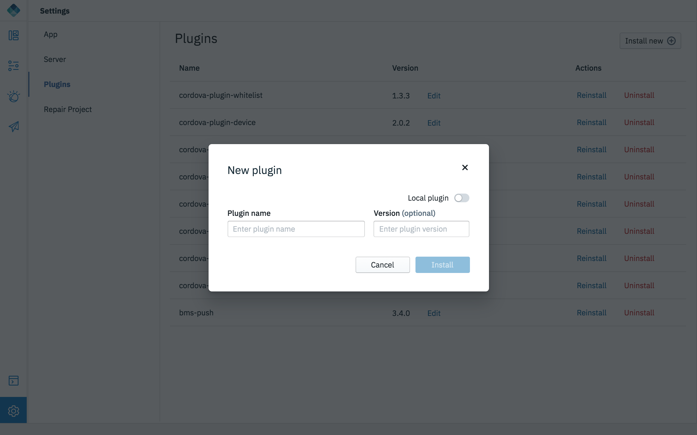

<!-- NLS_CHARSET=UTF-8 -->
## 개요
{: #digital-app-builder-interface }

Digital App Builder 인터페이스는 왼쪽 탐색 패널에서 다음으로 구성됩니다.

* **워크벤치** - 페이지 세부사항을 표시하거나 숨깁니다.
* **데이터** - OpenAPI doc을 사용하여 마이크로서비스의 데이터 소스를 작성하거나 기존 데이터 소스에 연결하여 데이터 세트를 추가하도록 돕습니다. 
* **Watson** - 새 인스턴스를 작성하거나 기존 인스턴스를 구성하기 위한 이미지 인식 및 챗봇(Watson Assistant) 구성요소로 구성됩니다. 
* **참여** - 푸시 알림 서비스를 추가하여 앱으로 사용자 참여를 늘릴 수 있습니다.
* **콘솔**: 각 컴포넌트의 코드 및 활동을 보기 위한 콘솔을 표시합니다. 
* **설정**: 앱 세부사항, 서버 정보, 플러그인, 프로젝트 복구(예: 종속 항목 다시 빌드, 플랫폼 다시 빌드, IBM Cloud 인증 정보 재설정)를 표시합니다.

### 워크벤치
{: #workbench }

워크벤치는 페이지를 디자인하도록 돕습니다. 워크벤치는 세 개의 작업 영역으로 구성됩니다.

1. **페이지/제어**: 이 영역은 기본적으로 작성된 페이지의 이름을 표시합니다. **+** 부호를 사용하여 새 페이지를 작성하십시오. **제어** 아이콘을 클릭하면 앱의 페이지에 기능 추가를 돕는 제어를 표시합니다. 각 제어 팔레트에서 페이지의 캔버스로 제어를 끌어서 놓기할 수 있습니다.각 제어에는 일련의 특성 및 조치가 있습니다.

    다음은 사용 가능한 제어 목록입니다.
    * **기본**: 캔버스에 해당 기본 제어(단추, 표제, 이미지, 레이블)를 끌어서 놓기하여 특성 및 조치를 구성할 수 있습니다.

        

        * **단추** - 단추에는 레이블할 특성이 있습니다. 조치 탭에서 단추 클릭 시 이동할 페이지를 지정할 수 있습니다.
        * **표제 텍스트** - 페이지 제목과 같은 애플리케이션의 표제 텍스트를 추가하도록 돕습니다. 
        * **이미지** - 로컬 이미지를 업로드하거나 이미지의 URL을 제공하도록 돕습니다.
        * **레이블** - 정적 텍스트를 페이지 본문에 추가하도록 돕습니다. 
    * **데이터 바운드** - 데이터 세트와 연결하고 데이터 세트의 엔티티에서 작동하도록 돕습니다. 데이터 바운드는 **목록** 및 **연결된 레이블**, 두 컴포넌트로 구성됩니다.

        

        * **목록** - 새 페이지를 작성하고 목록 컴포넌트를 끌어서 놓기합니다. **제목 나열**을 추가하고 작업할 목록 유형을 선택하고 작업할 컨텐츠를 추가하고 사용할 데이터 세트를 선택하십시오.

    * **로그인** - 로그인은 **로그인 양식** 제어로 구성됩니다. 페이지에 로그인 양식을 끌어서 놓기하십시오.
 
        로그인 양식 제어는 애플리케이션의 로그인 페이지를 작성하여 Mobile Foundation 서버에 사용자를 연결하도록 돕습니다. Mobile Foundation 서버는 사용자를 인증하고 데이터에 액세스하기 위해 해당 보안 컨텍스트를 제공하는 보안 프레임워크를 제공합니다. 자세한 정보는 [여기](https://mobilefirstplatform.ibmcloud.com/tutorials/en/foundation/8.0/authentication-and-security/creating-a-security-check/)를 읽으십시오.

        

        로그인 양식을 사용으로 설정하려면 다음 단계를 수행하십시오.

        1. Mobile Foundation 서버에서 다음 변경사항을 작성하십시오.
            * 사용자 이름 및 비밀번호를 입력하도록 하는 보안 검사 어댑터를 배치하십시오. [여기](https://github.com/MobileFirst-Platform-Developer-Center/SecurityCheckAdapters/tree/release80)에서 샘플 어댑터를 사용할 수 있습니다.
            * mfpconsole에서 앱의 보안 탭으로 이동하고 필수 애플리케이션 범위 아래에서 위의 작성된 보안 정의를 범위 요소로 추가하십시오.
        2. 빌더를 사용하여 애플리케이션에서 다음 구성을 작성하십시오.
            * 캔버스에서 페이지에 **로그인 양식** 제어를 추가하십시오.
            * **특성** 탭에서 **보안 검사 이름** 및 페이지를 제공하여 **로그인 성공 시**로 이동하십시오.
            * 앱을 실행하십시오.
    * **AI** - AI 제어는 앱에 Watson AI 기능을 추가하도록 허용합니다.

        * **Watson Chat** - 이 제어는 IBM Cloud에서 Watson Assistant 서비스를 작동할 수 있는 완전한 대화 인터페이스를 제공합니다. 

            

            * 특성 섹션에서 구성된 Watson Assistant 서비스를 선택하고 연결하려는 작업공간을 선택하십시오. 대화(Chat) 대화를 정의하고 훈련하려면 Watson 아래의 [챗봇](#chatbot)을 참조하십시오.

        * **Watson Visual Recognition** - 이 제어는 사진을 찍고 Watson Visual Recognition 서비스가 이를 식별할 수 있는 기능을 제공합니다.
         
            
 
            *  특성 섹션에서 구성된 Visual Recognition 서비스 및 분류 모델을 선택하십시오. 고유한 이미지 사용을 정의 및 훈련하려면 Watson 아래의 [이미지 인식](#image-recognition)을 참조하십시오.

2. **캔버스** 섹션 - 이 영역은 선택된 현재 채널, 현재 페이지 이름, 디자인/코드 토글, 캔버스로 구성됩니다.

    * **채널** 아이콘 - 선택된 현재 채널을 표시합니다. **설정 > 앱 > 앱 세부사항** 아래의 플랫폼 섹션에서 필요한 채널을 선택하여 채널을 추가할 수 있습니다.
    * 현재 페이지 이름 - 캔버스 페이지 이름을 표시합니다. 페이지 간에서 전환할 때 현재 페이지 이름은 선택된 페이지로 업데이트됩니다.
    * **디자인/코드** - 이 옵션은 코드 편집기 보기를 가져와 코드를 편집한 후 디자인을 다시 보고 오류를 디버깅하도록 합니다. 캔버스에서는 디자인에서 코드로 전환하여 프로젝트 편집기의 특정 파일 코드를 보십시오. 디자인에서 코드로 전환하면 다음 팝업 화면이 표시됩니다.

        

        **경고** - **작성**을 클릭하면 편집 가능한 애플리케이션 버전이 로컬로 작성됩니다. 편집 가능한 버전에서 작성된 변경사항은 원래 앱에 반영되지 않으며 반대의 경우도 마찬가지입니다. 이는 애플리케이션의 모든 프로젝트 파일이 있는 프로젝트 탐색기를 표시합니다.

    * **캔버스** - 이 섹션의 가운데에는 디자인 또는 코드를 표시하는 캔버스가 있습니다. 제어를 끌어서 놓기하고 앱을 작성할 수 있습니다.

3. **특성/조치** 탭 - 오른쪽에는 특성 및 조치 탭이 있습니다. 제어가 캔버스에 있는 경우 제어의 특성을 편집 및 수정하고 수행할 관련 조치와 제어를 연결할 수 있습니다.

### 데이터
{: #dataset-integration}

마이크로서비스의 데이터 세트 작성은 다음 단계를 포함합니다. 데이터 세트를 작성한 후 앱에서 데이터 바운드 제어를 연결할 수 있습니다.

#### 새 데이터 세트 작성

1. Digital App Builder의 랜딩 페이지에서 기존 앱을 열거나 새로 작성하십시오.
2. 왼쪽 패널에서 **데이터**를 클릭하십시오.

    

3. **새 데이터 세트 추가**를 클릭하십시오. 데이터 세트 추가 창이 표시됩니다.

    

4. 데이터 세트를 작성하십시오. 기존 소스에서 작성하거나(기본값) OpenAPI doc을 사용하여 마이크로서비스의 데이터 소스를 작성할 수 있습니다.
    * **기존 데이터 소스에서 작성**(기본값) - 구성된 Mobile Foundation 서버 인스턴스에서 모든 데이터 소스(어댑터)로 드롭 다운을 채웁니다. 
    * **OpenAPI doc을 사용하여 마이크로서비스의 데이터 소스 작성** - 이 옵션은 Open API 스펙 문서(Swagger json/yml) 파일에서 데이터 소스를 작성하도록 하고 해당 파일에서 데이터 세트를 작성하도록 합니다.

#### 기존 데이터 소스에서 데이터 세트 작성

1. 데이터 세트를 작성하려는 데이터 소스를 선택하십시오.
2. 데이터 소스에서 사용 가능한 엔티티를 채웁니다. 작성할 엔티티를 선택하십시오.
3. 데이터 세트에 이름을 지정하고 **추가** 단추를 클릭하십시오. 이는 데이터 세트를 추가하고 해당 데이터 세트와 연관된 속성 및 조치를 볼 수 있게 됩니다.

    

4. 데이터 세트로 수행하려는 사항을 기반으로 일부 속성 및 조치를 숨길 수 있습니다.
5. 속성에 대해 **레이블 표시**를 편집할 수도 있습니다.
6. 필요한 속성을 제공하고 조치의 일부인 **이 조치 실행**을 클릭하여 가져오기 조치를 테스트할 수도 있습니다. 이를 작동시키려면 **설정** 탭에 기밀 클라이언트 이름 및 비밀번호가 지정되어 있어야 함을 기억하십시오.

#### Swagger 파일을 사용하여 마이크로서비스의 데이터 소스 작성

1. 데이터 소스를 작성하려는 **json/yml** 파일을 선택하고 **생성**을 클릭하십시오.
2. 그러면 MF 서버의 구성 아티팩트인 어댑터를 생성하여 재사용하고 Mobile Foundation 서버 인스턴스에 배치할 수 있습니다.
3. 데이터 소스를 정의하려는 엔티티를 선택하십시오.
4. 데이터 세트에 이름을 지정하고 **추가** 단추를 클릭하십시오.
5. 이는 데이터 세트를 추가하고 해당 데이터 세트와 연관된 속성 및 조치를 볼 수 있게 됩니다.

이제 이 데이터 세트를 데이터 바운드 제어로 바인드할 수 있습니다.

### Watson
{: #integrating-with-watson-services}

Digital App Builder는 IBM Cloud에서 프로비저닝된 다양한 Watson 서비스에 연결하도록 앱을 구성하는 기능을 제공합니다.

#### 챗봇
{: #chatbot }

챗봇은 IBM Cloud에서 Watson Assistant 서비스에 의해 작동됩니다. IBM Cloud에서 Watson Assistant 인스턴스를 작성하십시오. 자세한 정보는 [여기](https://cloud.ibm.com/catalog/services/watson-assistant-formerly-conversation)를 참조하십시오.

구성된 후에는 새 **작업공간**을 작성할 수 있습니다. 작업공간은 챗봇을 구성하는 대화 세트입니다. 작업공간을 작성한 후 대화 상자 작성을 시작하십시오. 의도에 대한 질문 세트 및 해당 의도에 대한 응답 세트를 제공하십시오. Watson Assistant는 사용자가 제공한 샘플 질문을 기반으로 의도를 해석하기 위해 자연어 이해(Natural Language Understand)를 사용합니다. 그런 다음 사용자가 다양한 스타일로 하는 질문을 해석하고 의도에 맵핑되도록 할 수 있습니다.

앱에서 챗봇을 사용으로 설정하려면 다음 단계를 수행하십시오.

1. **Watson**을 클릭한 후 **챗봇**을 클릭하십시오. **Watson Assistant로 작업** 화면이 표시됩니다.

    

2. Watson Assistance 인스턴스에 **연결**을 클릭하십시오.

    

3. **API 키** 세부사항을 입력하고 Watson Assistance 인스턴스의 **URL**을 지정하십시오. 
4. 챗봇에 **이름**을 제공하고 **연결**을 클릭하십시오. 지정된 **이름**의 대화 서비스 대시보드가 표시됩니다.

    

5. **새 모델 작성** 팝업을 표시하는 **작업공간 추가**를 클릭하여 작업공간을 추가하십시오.

    

6. **작업공간 이름** 및 **작업공간 설명**을 입력하고 **작성**을 클릭하십시오. 이는 세 **대화** 작업공간(시작, 일치를 찾을 수 없음, 새 대화)을 작성합니다.

    

7. 새 챗봇 모델을 교육하려면 **새 대화**를 클릭하십시오. 

    

8. csv 파일로 또는 개별 질문 및 응답으로 응답 및 질문을 추가하십시오. 예를 들어, 사용자가 요청하는 경우에 대해 **사용자 설명을 추가**한 후 **봇에서 다음과 같이 응답해야 합니다.**에 대해 **봇 응답을 추가**하십시오. 또는 봇이 응답할 수 있는 질문 및 응답을 업로드할 수 있습니다.
9. **저장**을 클릭하십시오.
10. 챗봇을 테스트하려면 오른쪽 옆에 있는 단추의 챗봇 아이콘을 클릭하십시오.

    

#### 이미지 인식 
{: #image-recognition }

이미지 인식 기능은 IBM Cloud에서 Watson Visual Recognition 서비스에 의해 작동됩니다. IBM Cloud에서 Watson Visual Recognition 인스턴스를 작성하십시오. 자세한 정보는 [여기](https://cloud.ibm.com/catalog/services/visual-recognition)를 참조하십시오.

구성된 후에는 새 모델을 작성하고 여기에 클래스를 추가할 수 있습니다. 빌더에 이미지를 끌어서 놓기한 후 해당 이미지에서 모델을 훈련할 수 있습니다. 훈련이 완료되면 CoreML 모델을 다운로드하거나 앱에 있는 AI 제어의 모델을 사용할 수 있습니다.

앱에서 Visual Recognition을 사용으로 설정하려면 다음 단계를 수행하십시오.

1. **Watson**을 클릭한 후 **이미지 인식**을 클릭하십시오. **Watson Visual Recognition으로 작업** 화면이 표시됩니다.

    

2. Watson Visual Recognition 인스턴스에 **연결**을 클릭하십시오.

    

3. **API 키** 세부사항을 입력하고 Watson Visual Recognition 인스턴스의 **URL**을 지정하십시오. 
4. 앱에서 이미지 인식 인스턴스에 **이름**을 제공하고 **연결**을 클릭하십시오. 모델의 대시보드가 표시됩니다.

    

5. 새 모델을 작성하려면 **새 모델 추가**를 클릭하십시오. **새 모델 작성** 팝업이 표시됩니다.

    

6. **모델 이름**을 입력하고 **작성**을 클릭하십시오. 해당 모델의 클래스 및 **음수** 클래스가 표시됩니다.

    

7. **새 클래스 추가**를 클릭하십시오. 새 클래스의 이름을 지정하기 위한 팝업이 표시됩니다.

    

8. 새 클래스의 **클래스 이름**을 입력하고 **작성**을 클릭하십시오. 모델을 훈련하도록 이미지를 추가하기 위한 작업공간이 표시됩니다.

    

9. 작업공간으로 이미지를 끌어서 놓기하거나 찾아보기를 통해 이미지에 액세스하여 이미지를 모델에 추가하십시오.

10. 이미지를 추가한 후 작업공간으로 되돌아가 **모델 테스트**를 클릭하여 테스트할 수 있습니다.

    

11. **모델 시도** 섹션에서 이미지를 추가하면 결과가 표시됩니다.

### 참여
{: #engagement}

앱에 푸시 알림을 추가하고 사용자 참여를 늘릴 수 있습니다.

앱에 푸시 알림을 추가하려면 다음을 수행하십시오.

1. **참여**를 선택하십시오. 사용 가능한 서비스의 목록이 표시됩니다. 현재 푸시 알림 서비스만 사용 가능합니다.

    

2. **푸시 알림**에서 **연결**을 클릭하십시오. **푸시 알림 인스턴스에 연결** 대화 상자가 표시됩니다.

    

3. **이름**, **API 키**, **앱 GUID**, **클라이언트 비밀 키**를 입력하고 **지역**을 선택한 후 **연결**을 클릭하십시오.
4. 위에 입력된 이름은 참여 아래의 페이지에 추가됩니다.
5. **API 비밀 키** 및 **발신인 ID**를 제공하여 Android용 푸시 알림을 구성하고 **구성 저장**을 클릭하십시오.

    

6. iOS 탭으로 이동하고 푸시 구성 세부사항을 제공하십시오. **환경**을 선택하고 경로가 있는 .p12 파일을 제공한 후 **비밀번호**를 입력하고 **구성 저장**을 클릭하십시오.

    

7.  
    a. Android의 경우 `google-services.json`(firebase 프로젝트에서 다운로드)을 `<path_to_app>/ionic/platforms/android/app` 폴더에 복사하십시오.
    b. iOS의 경우 xcode 프로젝트 `<path_to_app>/ionic/platforms/ios/<app>.xcodeproj`를 열고 푸시 알림 기능을 사용으로 설정하십시오. 세부사항은 [https://help.apple.com/xcode/mac/current/#/devdfd3d04a1](https://help.apple.com/xcode/mac/current/#/devdfd3d04a1)을 참조하십시오.

### 콘솔
{: #console }

각 컴포넌트의 코드를 보도록 돕습니다. 또한 다양한 활동 및 오류에 대한 정보를 표시합니다.

### 설정
{: #settings}

설정은 앱 설정을 관리하고 빌드 프로세스 중에 오류를 수정하도록 돕습니다. 설정은 **앱 세부사항**, **서버**, **플러그인**, **프로젝트 복구** 탭으로 구성됩니다.

#### 앱 세부사항
{: #app-details}

앱 세부사항은 앱에 대한 정보를 표시합니다. **앱 아이콘**, **이름**, 파일이 저장되는 **위치**, 앱 작성 시 제공된 **프로젝트/번들 ID**, 선택된 **플랫폼**(채널), 사용으로 설정된 **서비스**.

아이콘을 클릭하고 새 아이콘을 업로드하여 **앱 아이콘**을 변경할 수 있습니다.

근처의 선택란을 선택/선택 해제하여 추가 플랫폼을 추가/제거할 수 있습니다.

**저장**을 클릭하여 변경사항을 업데이트하십시오.

#### 서버
{: #server }

서버 정보는 사용자가 현재 작업 중인 **서버 세부사항**을 표시합니다. **편집** 링크를 클릭하여 정보를 편집할 수 있습니다. 기밀 클라이언트 권한을 추가하거나 수정할 수 있습니다.

서버 탭은 또한 **최근 서버**를 표시합니다.

또한 **새로 연결 +** 단추를 클릭하여 새 서버를 추가하고 **새 서버에 연결** 팝업에서 세부사항을 제공하고 **연결**을 클릭할 수 있습니다.

#### 플러그인
{: #plugins}

플러그인은 Digital App Builder에서 사용할 수 있는 플러그인의 목록을 표시합니다. 다음 조치를 수행할 수 있습니다.

* **새로 설치** - 이 단추를 클릭하여 새 플러그인을 설치할 수 있습니다. 이는 **새 플러그인** 대화 상자를 표시합니다. **플러그인 이름**, **버전**(선택사항)을 입력하고 **로컬 플러그인**인 경우 동일한 스위치를 사용으로 설정하고 위치를 지정한 후 **설치**를 클릭하십시오.

* 이미 설치된 플러그인 목록에서 버전을 편집하고 플러그인을 재설치하거나 각 플러그인의 링크를 선택하여 플러그인을 설치 제거할 수 있습니다.

#### 프로젝트 복구
{: #repair-project}

프로젝트 복구 탭은 각 옵션을 클릭하여 문제를 수정하도록 돕습니다.

* **종속 항목 다시 빌드** - 프로젝트가 불안정한 경우 종속 항목 다시 빌드를 시도할 수 있습니다.
* **플랫폼 다시 빌드** - 콘솔에서 플랫폼 관련 오류가 표시되는 경우 플랫폼 다시 빌드를 시도하십시오. 채널에 대해 변경사항을 작성했거나 채널을 추가한 경우 이 옵션을 사용하십시오.
* **Playground 서버에 대해 IBM Cloud 인증 정보 재설정** - Playground 서버에 로그인하는 데 사용되는 IBM Cloud 인증 정보를 재설정할 수 있습니다. 인증 정보 캐시를 재설정하면 Playground 서버에서 모든 앱을 지웁니다. **이 오퍼레이션은 되돌릴 수 없습니다.**

 
