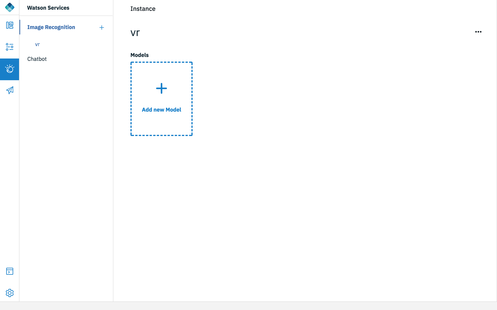

<!-- NLS_CHARSET=UTF-8 -->
## Watson Visual Recognition
{: #dab-watson-vr }

이미지 인식 기능은 IBM Cloud에서 Watson Visual Recognition 서비스에 의해 작동됩니다. IBM Cloud에서 Watson Visual Recognition 인스턴스를 작성하십시오. 자세한 정보는 [여기](https://cloud.ibm.com/catalog/services/visual-recognition)를 참조하십시오.

구성된 후에는 새 모델을 작성하고 여기에 클래스를 추가할 수 있습니다. 빌더에 이미지를 끌어서 놓기한 후 해당 이미지에서 모델을 훈련할 수 있습니다. 훈련이 완료되면 CoreML 모델을 다운로드하거나 앱에 있는 AI 제어의 모델을 사용할 수 있습니다.

앱에서 Visual Recognition을 사용으로 설정하려면 다음 단계를 수행하십시오.

1. **Watson**을 클릭한 후 **이미지 인식**을 클릭하십시오. **Watson Visual Recognition으로 작업** 화면이 표시됩니다.

    

2. Watson Visual Recognition 인스턴스에 **연결**을 클릭하십시오.

    

3. **API 키** 세부사항을 입력하고 Watson Visual Recognition 인스턴스의 **URL**을 지정하십시오. 
4. 앱에서 이미지 인식 인스턴스에 **이름**을 제공하고 **연결**을 클릭하십시오. 모델의 대시보드가 표시됩니다.

    

5. 새 모델을 작성하려면 **새 모델 추가**를 클릭하십시오. **새 모델 작성** 팝업이 표시됩니다.

    

6. **모델 이름**을 입력하고 **작성**을 클릭하십시오. 해당 모델의 클래스 및 **음수** 클래스가 표시됩니다.

    

7. **새 클래스 추가**를 클릭하십시오. 새 클래스의 이름을 지정하기 위한 팝업이 표시됩니다.

    

8. 새 클래스의 **클래스 이름**을 입력하고 **작성**을 클릭하십시오. 모델을 훈련하도록 이미지를 추가하기 위한 작업공간이 표시됩니다.

    

9. 작업공간으로 이미지를 끌어서 놓기하거나 찾아보기를 통해 이미지에 액세스하여 이미지를 모델에 추가하십시오.

10. 이미지를 추가한 후 작업공간으로 되돌아가 **모델 테스트**를 클릭하여 테스트할 수 있습니다.

    

11. **모델 시도** 섹션에서 이미지를 추가하면 결과가 표시됩니다.

