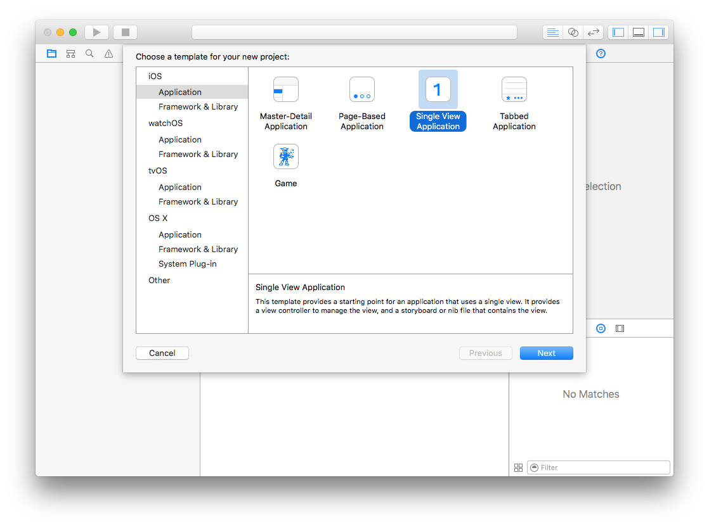

<!-- NLS_CHARSET=UTF-8 -->
## 개요
{: #overview }
이 튜토리얼에는 개발자가 iOS 애플리케이션을 개발하고 테스트하기 위해 수행해야 하는 단계가 설명되어 있습니다. 이 단계에는 Apple 개발자에서 등록하고 Xcode를 설치하는 것이 포함됩니다.

#### 지원 레벨
{: #support-level }

* Xcode 7.1 이상
* iOS 8 이상

**전제조건:** iOS 개발 환경을 설정할 때는 [{{ site.data.keys.product }} 개발 환경 설정](../mobilefirst/) 튜토리얼도 읽어야 합니다.

### 등록
{: #registration }
1. iOS 개발자로 등록
 - 조직/팀 관리자가 사용할 [Apple ID를 작성](https://appleid.apple.com/account)하십시오.
 - Apple ID를 사용하여 [Apple Developer Member Center](https://developer.apple.com/)에 로그인하십시오.
2. Member Center > 프로그램 및 추가 기능 섹션에서 조직에 적합한 프로그램 등록

> 자세히 살펴보려면 [Apple 개발자 지원 웹 사이트를 방문](https://developer.apple.com/support/)하십시오.

### 개발
{: #development }
Cordova 또는 네이티브 iOS 애플리케이션을 개발하려면 [Xcode](https://developer.apple.com/xcode/)가 설치된 상태로 [Mac](https://www.apple.com/mac/) 워크스테이션을 사용해야 합니다.

Xcode는 Objective-C 또는 Swift 프로그래밍 언어를 사용하여 iOS 플랫폼을 위한 애플리케이션을 개발하는 데 필요한 도구 및 API를 제공합니다.

Xcode는 다음을 수행하기 위해 사용할 수 있는 IDE입니다.

- 테스트 디바이스 관리
- iOS 시뮬레이터 사용
- iOS 디바이스에 앱 설치
- 개발, 디버그, 성능 테스트 등

> 자세히 살펴보려면 [iOS 개발자 라이브러리 웹 사이트를 방문](https://developer.apple.com/library/ios/navigation/)하십시오.

#### iOS 시뮬레이터
{: #ios-simulator }
Xcode는 애플리케이션을 테스트하는 데 필요한 iOS 시뮬레이터를 제공합니다. 사용 가능한 모든 옵션에 대한 자세한 설명은 Apple 개발자 웹 사이트에서 [시뮬레이터 정보 문서 주제](https://developer.apple.com/library/ios/documentation/IDEs/Conceptual/iOS_Simulator_Guide/Introduction/Introduction.html)를 참조하십시오.

## 다음 내용
{: #whats-next }
{{ site.data.keys.product_adj }} 및 iOS 개발 환경이 설정되었으니 계속해서 [빠른 시작](../../../quick-start/ios/) 카테고리로 이동하여 {{ site.data.keys.product }}을 경험하거나 [모든 튜토리얼](../../../all-tutorials)로 이동하여 {{ site.data.keys.product }} 개발의 특정 측면을 학습하십시오.

