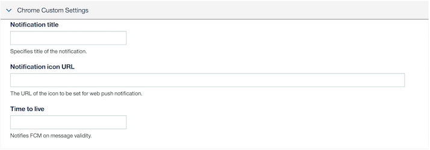

<!-- NLS_CHARSET=UTF-8 -->

웹 플랫폼에 알림을 전송하는 것은 모바일 플랫폼에 알림을 전송하는 것과 유사합니다. 자세한 정보는 [여기]({{ site.baseurl }}/tutorials/en/foundation/8.0/notifications/sending-notifications/)를 참조하십시오.

* **알림 전송** 탭에 **플랫폼** 선택과 관련된 새 옵션이 있습니다.
* *모바일* 또는 *웹*을 선택할 수 있습니다.

**전송 대상** 드롭 다운 메뉴에는 구성된 플랫폼에 따라 **Chrome**, **Firefox** 및 **Safari**가 있습니다. 각 플랫폼은 플랫폼에 필요한 대로 연관된 사용자 정의 설정 섹션과 함께 제공됩니다. 알림의 대상을 **모든** 플랫폼, **태그별 디바이스**, **사용자 ID별 디바이스** 또는 **단일 디바이스**로 지정할 수도 있습니다.

### Chrome 사용자 정의 설정

다음은 Chrome에 특정한 일부 설정입니다.

- **알림 제목**: 알림의 제목을 지정합니다.
- **알림 아이콘 URL**: 웹 푸시 알림에 대해 설정될 아이콘의 URL입니다.
- **TTL(Time to Live)**: FCM에 메시지 유효기간에 대해 알립니다.

### Firefox 사용자 정의 설정

다음은 Firefox에 특정한 일부 설정입니다.
- **알림 제목**: 알림의 제목을 지정합니다.
- **알림 아이콘 URL**: 웹 푸시 알림에 대해 설정될 아이콘의 URL입니다.

### Safari 사용자 정의 설정

다음은 Safari에 특정한 일부 설정입니다.
- **알림 제목**: 알림의 제목을 지정합니다.
- **조치**: 조치 단추의 레이블입니다.
- **URL 인수**: 이 알림에 사용되어야 하는 URL 인수입니다. 형식은 JSON 배열입니다.
- **본문**: 알림 본문입니다.

*태그* 기반 알림, *디바이스 ID* 및 *사용자 ID* 기반 알림 전송은 모바일 플랫폼에 대해 수행하는 작업과 유사합니다.
