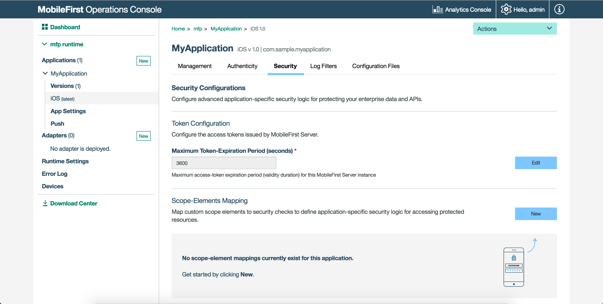
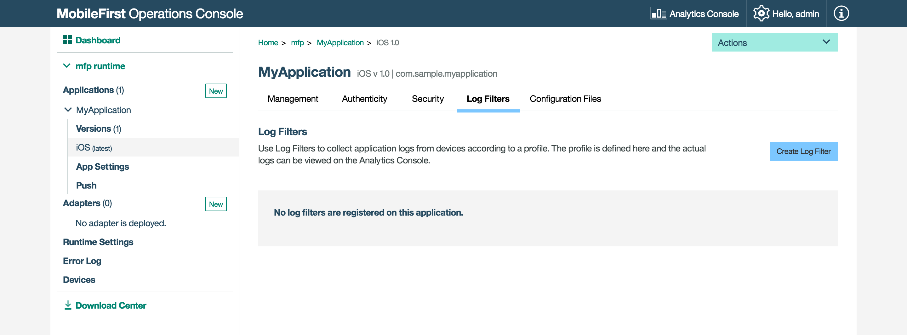

<!-- NLS_CHARSET=UTF-8 -->
## 개요
{: #overview }
{{ site.data.keys.mf_console_full }}는 개발자와 관리자가 모두 애플리케이션 및 어댑터를 작성, 모니터, 보안 및 관리하기 위해 간소화된 작업을 가능하게 하는 웹 기반 UI입니다.

#### 개발자의 경우
{: #as-a-developer }
* 환경에 맞는 애플리케이션을 개발하여 {{ site.data.keys.mf_server }}에 등록합니다.
* 배치된 애플리케이션과 어댑터를 한 눈에 확인합니다. 대시보드를 참조하십시오.
* 직접 업데이트, 원격 디스에이블먼트, 애플리케이션 인증 및 사용자 인증을 위한 보안 매개변수를 포함하여 등록된 애플리케이션을 관리하고 구성합니다.
* 인증을 배치하고, 알림 태그를 작성하고, 알림을 전송하여 푸시 알림을 설정합니다.
* 어댑터를 작성하고 배치합니다.
* 샘플을 다운로드합니다.

#### IT 관리자의 경우
{: #as-an-it-administrator }
* 다양한 서비스를 모니터링합니다.
* {{ site.data.keys.mf_server }}에 액세스하고 해당 액세스 권한을 관리하는 디바이스를 검색합니다.
* 어댑터 구성을 동적으로 업데이트합니다.
* 로그 프로파일을 통해 클라이언트 로거 구성을 조정합니다.
* 제품 라이센스의 사용을 추적합니다.

#### 다음으로 이동:
{: #jump-to }
* [콘솔 액세스](#accessing-the-console)
* [콘솔 탐색](#navigating-the-console)

## 콘솔 액세스
{: #accessing-the-console }
다음 방법으로 {{ site.data.keys.mf_console }}에 액세스할 수 있습니다.

### 로컬로 설치된 {{ site.data.keys.mf_server }}에서
{: #from-a-locally-installed-mobilefirst-server }
#### 데스크탑 브라우저
{: #desktop-browser }
선택한 브라우저에서 URL [http://localhost:9080/mfpconsole](http://localhost:9080/mfpconsole)을 로드하십시오. username/password는 *admin/admin*입니다.

#### 명령행
{: #command-line }
**명령행** 창에서 설치된 {{ site.data.keys.mf_cli }}를 사용하여 `mfpdev server console` 명령을 실행하십시오.

### 원격으로 설치된 {{ site.data.keys.mf_server }}에서
{: #from-a-remotely-installed-mobilefirst-server }
#### 데스크탑 브라우저
{: #desktop-browser-remote }
선택한 브라우저에서 URL `http://the-server-host:server-port-number/mfpconsole`을 로드하십시오.  
호스트 서버는 고객 소유 서버 또는 IBM Cloud 서비스, IBM [Mobile Foundation](../../../ibmcloud/) 중 하나일 수 있습니다.

#### 명령행
{: #command-line-remote }
**명령행** 창에서 설치된 {{ site.data.keys.mf_cli }}를 사용하여 다음을 수행하십시오.

1. 원격 서버 정의를 추가하십시오.

    *대화식 모드*  
    `mfpdev server add` 명령을 실행하고 화면 지시사항을 따르십시오.

    *직접 모드*  
    다음 구조로 명령을 실행하십시오. `mfpdev server add [server-name] --URL [remote-server-URL] --login [admin-username] --password [admin-password] --contextroot [admin-service-name]`. 예:

   ```bash
   mfpdev server add MyRemoteServer http://my-remote-host:9080/ --login TheAdmin --password ThePassword --contextroot mfpadmin
   ```

2. `mfpdev server console MyRemoteServer` 명령을 실행하십시오.

> [CLI를 사용하여 {{ site.data.keys.product_adj }} 아티팩트 관리](../../../application-development/using-mobilefirst-cli-to-manage-mobilefirst-artifacts/) 튜토리얼의 다양한 CLI 명령에 대해 자세히 알아보십시오.

## 콘솔 탐색
{: #navigating-the-console }
### 대시보드
{: #dashboard }
대시보드는 배치된 프로젝트의 둘러보기를 제공합니다.


#### 조치 드롭 다운
{: #actions-dropdown }
드롭 다운은 다양한 콘솔 조치에 대한 빠른 액세스를 제공합니다.


### 런타임 설정
{: #runtime-settings }
런타임 특성, 글로벌 보안 변수, 서버 키 저장소 및 기밀 클라이언트를 편집하십시오.


### 오류 로그
{: #error-log }
오류 로그는 현재 런타임 환경에서 {{ site.data.keys.mf_console }} 또는 명령행으로부터 초기화된 실패한 관리 조작의 목록을 표시합니다. 서버에 대한 실패의 영향을 보려면 로그를 사용하십시오.

> 자세한 정보는 사용자 문서의 런타임 환경의 조작에 대한 오류 로그 관련 주제를 참조하십시오.


### 디바이스
{: #devices }
관리자는 {{ site.data.keys.mf_server }}에 액세스하고 액세스 권한을 관리하는 디바이스를 검색할 수 있습니다.  
디바이스는 익숙한 이름을 사용하거나 사용자 ID를 사용하여 검색할 수 있습니다. 사용자 ID는 로그인에 사용된 ID입니다.  
익숙한 이름은 사용자 ID를 공유하는 기타 디바이스에서 이를 구분하기 위해 디바이스와 연관된 이름입니다.

> 자세한 정보는 사용자 문서의 디바이스 액세스 관리에 대한 주제를 참조하십시오.


### 애플리케이션
{: #applications }
#### 애플리케이션 등록
{: #registering-applications }
기본 애플리케이션 값 및 다운로드 시작 코드를 제공하십시오.


#### 애플리케이션 관리
{: #managing-applications }
[직접 업데이트](../../../application-development/direct-update/), 원격 디스에이블먼트, [애플리케이션 인증](../../../authentication-and-security/application-authenticity/) 및 [보안 매개변수 설정](../../../authentication-and-security/) 사용에 의해 등록된 애플리케이션을 관리 및 구성하십시오.


#### 인증 및 보안
{: #authentication-and-security }
기본 토큰 만기 값 같은 애플리케이션 보안 매개변수를 구성하고 범위 요소를 보안 검사에 맵핑하고 필수 애플리케이션 범위를 정의하고 보안 검사 옵션을 구성하십시오.

> {{ site.data.keys.product_adj }} 보안 프레임워크에 대해 [자세히 알아보십시오](../../../authentication-and-security/).



#### 애플리케이션 설정
{: #application-settings }
애플리케이션 유형 및 라이센싱뿐 아니라 콘솔에서 애플리케이션의 표시 이름을 구성하십시오.


#### 알림
{: #notifications }
인증서 및 GCM 세부사항 같은 [푸시 알림](../../../notifications/) 및 관련 매개변수 설정은 알림을 디바이스에 보낼 뿐 아니라 태그를 정의합니다.


### 어댑터
{: #adapters }
#### 어댑터 작성
{: #creating-adapters }
어댑터 아티팩트를 다시 빌드하고 다시 배치할 필요 없이 해당 특성을 업데이트함으로써 즉시 어댑터를 업데이트할 뿐만 아니라 [어댑터를 등록](../../../adapters/)하고 시작 코드를 다운로드하십시오.


#### 어댑터 특성
{: #adapter-properties }
어댑터를 배치하고 나면 콘솔에서 구성될 수 있습니다.


### 클라이언트 로그
{: #client-logs }
관리자는 운영 체제, 운영 체제 버전, 애플리케이션, 애플리케이션 버전 및 디바이스 모델의 조합을 위해 로그 레벨과 로그 패키지 필터와 같은 클라이언트 로거 구성을 조정하기 위해 로그 프로파일을 사용할 수 있습니다.

관리자가 구성 프로파일을 작성할 경우 로그 구성이 `WLResourceRequest` 같은 응답 API 호출과 연결되고 자동으로 적용됩니다.

> 자세한 정보는 사용자 문서의 클라이언트 측 로그 캡처 구성에 대한 주제를 참조하십시오.



### 라이센스 추적
{: #license-tracking }
맨 위 설정 단추에서 액세스 가능합니다.

라이센스 조항은 사용되는 {{ site.data.keys.product }}의 에디션(Enterprise 또는 Consumer)에 따라 달라집니다.   라이센스 추적은 기본적으로 사용으로 설정되어 있으며 활성 클라이언트 디바이스 및 설치된 애플리케이션 같은 라이센싱 정책과 관련된 메트릭을 추적합니다. 이 정보는 {{ site.data.keys.product }}의 현재 사용이 라이센스 부여 레벨 내에 있고 잠재적 라이센스 위반을 방지할 수 있는지 판별하는 데 도움이 됩니다.

클라이언트 디바이스의 사용을 추적하고 디바이스가 활성인지 여부를 판별함으로써 관리자는 서비스에 더 이상 액세스하면 안 되는 디바이스를 해제할 수 있습니다. 이러한 상황은 직원이 퇴사하는 경우에 발생할 수 있습니다. 예를 들어 다음과 같습니다.

> 자세한 정보는 사용자 문서에서 라이센스 추적에 대한 주제를 참조하십시오.


### 다운로드
{: #downloads }
인터넷 연결성이 사용 가능하지 않은 상황에서는 {{ site.data.keys.mf_console }}의 다운로드 센터에서 {{ site.data.keys.product }}의 다양한 개발 아티팩트의 스냅샷을 다운로드할 수 있습니다.


