<!-- NLS_CHARSET=UTF-8 -->
## Visão Geral
{: #digital-app-builder-interface }

A interface do Digital App Builder consiste no seguinte no painel de navegação esquerdo:

* **Ambiente de trabalho** - exibe ou oculta os detalhes da página
* **Dados** - ajuda a incluir um conjunto de dados conectando-se a uma origem de dados existente ou criar uma origem de dados para um microsserviço usando o doc OpenAPI. 
* **Watson** - consiste em componentes de Reconhecimento de Imagem e Robô de Bate-papo (Watson Assistant) para configurar uma instância existente ou criar uma nova instância. 
* **Engajamento** - é possível aumentar seu engajamento de usuário com o aplicativo, incluindo serviços de notificações Push
* **Console**: exibe o console para ver as atividades e o código para cada componente. 
* **Configurações**: exibe os detalhes do aplicativo, informações do servidor, plug-ins e Reparar Projeto (como a Reconstrução de dependências, a Reconstrução de plataformas, a Reconfiguração de credenciais do IBM Cloud).

### Ambiente de trabalho
{: #workbench }

O ambiente de trabalho ajuda você a projetar as páginas. O ambiente de trabalho consiste em três áreas de trabalho:

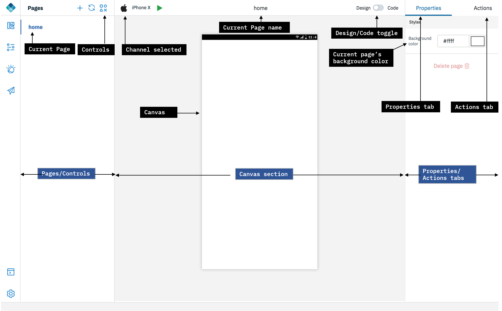

1. **Páginas/Controles**: essa área exibe o nome das páginas criadas por padrão. Use o sinal **+** para criar uma nova página. Clicar no ícone **Controles**, exibe controles que ajudam a incluir funcionalidade em uma página em um aplicativo. É possível arrastar e soltar os controles da respectiva paleta de Controles para uma tela da página. Cada controle possui um conjunto de propriedades e ações.

    A seguir está a lista de controles fornecidos disponíveis:
    * **Básico**: É possível arrastar e soltar estes controles básicos (Botão, Cabeçalho, Imagem e Rótulo) para a tela e configurar as propriedades e ações.

        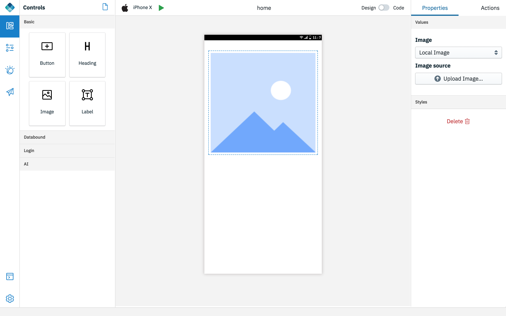

        * **Botão**-Os botões têm uma propriedade para rotular. Na guia Ação, é possível especificar a página para navegar para o botão direito do mouse no Botão.
        * **Texto de Título**-Ajuda você a incluir um texto de título para o aplicativo, como Título da Página.
        * **Imagem**-Ajuda a fazer upload de uma imagem local ou fornecer uma url de uma imagem.
        * **Rótulo**-Ajuda você a incluir texto estático em seu corpo da página. 
    * **Databound** - ajuda você a se conectar com um conjunto de dados e a operar as entidades no conjunto de dados. O databound consiste em dois componentes: **Listar**e **Rótulos Conectados**

        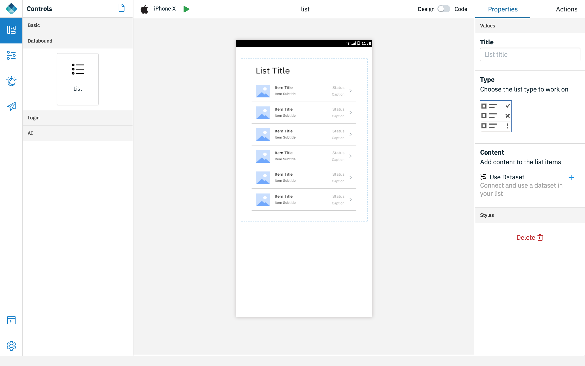

        * **Listar**-Criar uma nova página e arrastar e soltar o componente Lista. Inclua o **Título da Lista**, Escolha o tipo de lista para trabalhar em, Incluir conteúdo no trabalho e selecione o conjunto de dados a ser usado.

    * **Login** - Login consiste no controle de **Formulário de Login**. Arraste e solte o formulário de login na página.
 
        O controle de Formulário de Login ajuda você a criar uma página de login para seu aplicativo para conectar o usuário ao servidor Mobile Foundation. O servidor Mobile Foundation fornece uma estrutura de segurança para autenticar usuários e fornecer esse contexto de segurança para acessar os conjuntos de dados. Para obter mais informações, leia [aqui](https://mobilefirstplatform.ibmcloud.com/tutorials/en/foundation/8.0/authentication-and-security/creating-a-security-check/).

        

        Para ativar o Formulário de login, execute as etapas a seguir:

        1. Faça as seguintes mudanças no Mobile Foundation Server
            * Implemente um adaptador de verificação de segurança que aceitaria o nome de usuário e a senha como entrada. É possível usar o adaptador de amostra [aqui](https://github.com/MobileFirst-Platform-Developer-Center/SecurityCheckAdapters/tree/release80).
            * No mfpconsole, acesse a guia de segurança do aplicativo e sob o Escopo do Aplicativo Obrigatório, inclua a definição de segurança criada acima como elemento do escopo.
        2. Faça a configuração a seguir em seu Aplicativo usando o Builder.
            * Inclua o controle **Formulário de Login** em uma página na tela.
            * Na guia **Propriedades**, forneça o **Nome da verificação de segurança** e a página para navegar em **Com êxito no login**.
            * Execute o aplicativo.
    * **IA** - os controles de IA permitem que você inclua recursos do Watson AI em seu aplicativo.

        * **Watson Chat** - Este controle fornece uma interface de bate-papo completa que pode ser desenvolvida com o serviço do Watson Assistant no IBM Cloud. 

            

            * Na seção de propriedades, selecione o serviço do Watson Assistant configurado e selecione a Área de Trabalho à qual deseja se conectar. Para definir e treinar uma conversa de Bate-papo, consulte [Robô de bate-papo](#chatbot) sob Watson.

        * **Watson Visual Recognition** - Este controle fornece a capacidade de tirar uma foto e permitir que o serviço de reconhecimento visual do Watson identifique-a para você.
         
            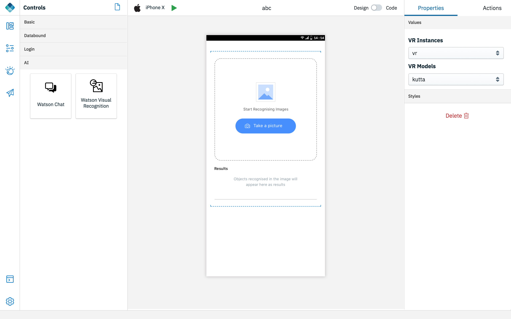
 
            *  Na seção de propriedades, selecione o serviço Reconhecimento Visual configurado e o modelo de classificação. Para definir e treinar usando suas próprias imagens, consulte [Reconhecimento de imagem](#image-recognition) sob Watson.

2. Seção **Tela** - Essa área consiste no Canal Atual selecionado, no Nome da Página Atual, na Alternância de Design/Código e na Tela.

    * Ícone **Canal** - Isso exibe o canal atual selecionado. É possível incluir canais adicionais, selecionando os canais necessários na seção Plataformas em **Configurações >Aplicativo >Detalhes do aplicativo**.
    * Nome da página atual - Exibe o nome da página da tela. Quando alternado entre páginas, o nome da página atual é atualizado para a página selecionada.
    * **Design/Código** - Essa opção traz a visualização do Editor de Código para editar o código e permite visualizar o design e depurar quaisquer erros. Na tela, alterne de Design para Código, para visualizar o código do arquivo específico no editor de projeto. A alternância de Design para Código exibirá a tela pop-up a seguir:

        

        **AVISO** - Quando você clica em **Criar**, uma versão editável de seu aplicativo é criada localmente. Quaisquer mudanças feitas na versão editável não serão refletidas no aplicativo original e vice-versa. Isso exibirá o explorador de projetos com todos os arquivos de projeto para o aplicativo.

    * **Tela** - No centro dessa seção está a tela que exibe o design ou o código. É possível arrastar e soltar os controles e criar o aplicativo.

3. Guia **Propriedades/Ações** - No lado direito, está a guia Propriedades e ação. Quando um controle é colocado na tela, é possível editar e modificar as propriedades do controle e conectar um controle com uma ação relacionada a ser executada.

### Dados
{: #dataset-integration}

A criação de um conjunto de dados para um microsserviço envolve as etapas a seguir. Depois de criar o conjunto de dados, é possível conectar os controles de limite de dados em seu app.

#### Criando um Novo Conjunto de Dados

1. Na página de entrada do Digital App Builder, abra qualquer Aplicativo existente ou crie um.
2. Clique em **Dados** no painel à esquerda.

    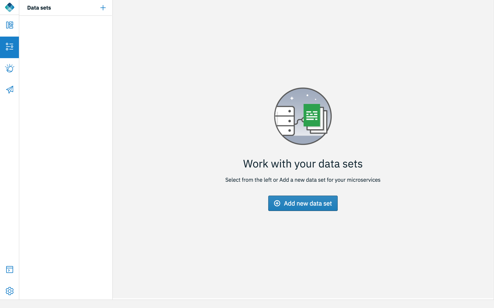

3. Clique em **Incluir novo conjunto de dados**. Isso exibe a janela Incluir um conjunto de dados.

    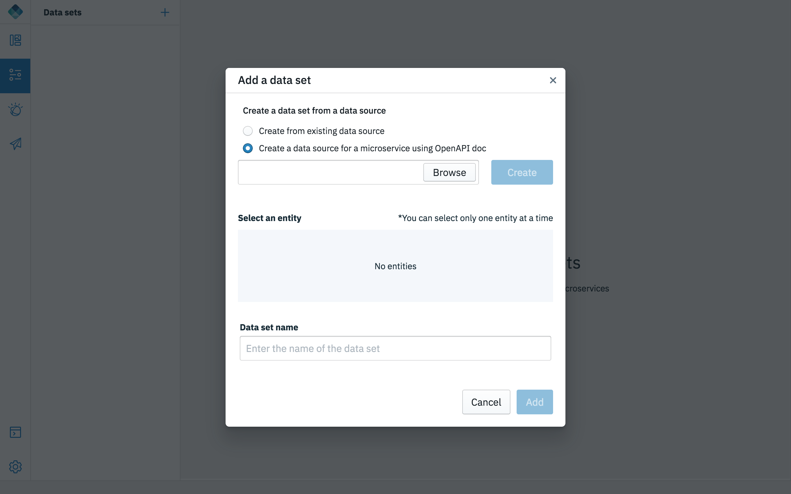

4. Criar um conjunto de dados. É possível criar a partir de uma origem existente (padrão) ou criar uma origem de dados para um microsserviço usando um doc OpenAPI.
    * **Criar a partir da origem de dados existente** (padrão) - Isso irá preencher a lista suspensa com todas as Origens de dados (adaptadores) da instância do servidor Mobile Foundation configurada. 
    * **Criar origem de dados para um microsserviço usando o doc OpenAPI** - Essa opção permite criar uma Origem de Dados a partir de um arquivo do documento de especificação Open API (json/yml swagger) e um Conjunto de Dados a partir dele.

#### Criar um conjunto de dados a partir de uma Origem de Dados existente

1. Selecione a Origem de Dados para a qual você deseja criar o Conjunto de Dados.
2. Isso preencherá as entidades disponíveis na Origem de Dados. Selecione a entidade a ser criada.
3. Forneça um nome para o conjunto de dados e clique no botão **Incluir**. Isso incluirá o Conjunto de Dados e será possível ver os Atributos e Ações associados a esse conjunto de dados.

    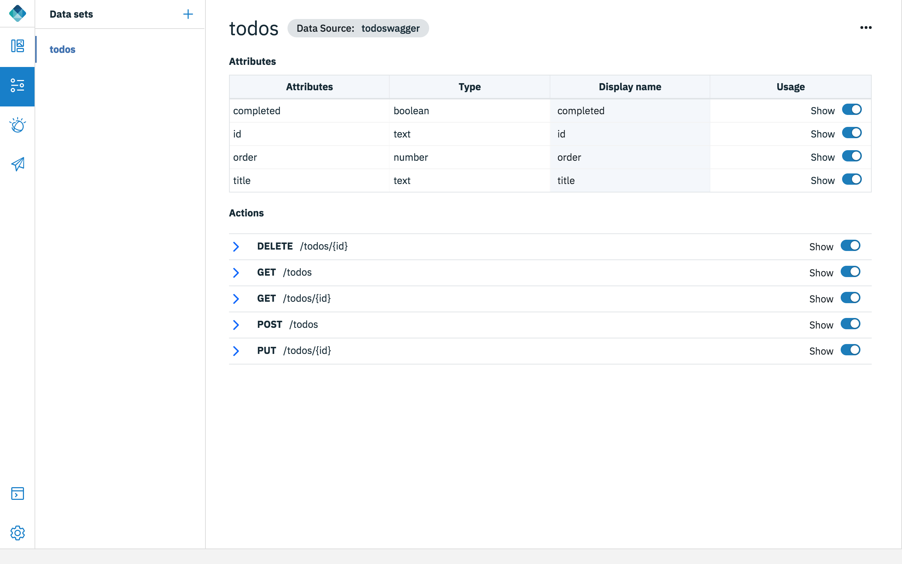

4. É possível Ocultar alguns dos atributos e Ações com base no que você deseja fazer com o conjunto de dados.
5. Também é possível editar os **Rótulos de exibição** para os atributos
6. Também é possível Testar qualquer uma das Ações GET fornecendo os atributos necessários e clicando em **Executar esta ação**, que faz parte da Ação. Lembre-se que, para que isso funcione, é necessário ter especificado o nome do cliente Confidencial e a senha na guia **Configurações**.

#### Criar uma origem de dados para um microsserviço usando um arquivo swagger

1. Selecione o arquivo **json/yml** para o qual você deseja criar uma origem de dados e clique em **Gerar**.
2. Isso gerará um Adaptador, que é um artefato de configuração no servidor MF que você pode reutilizar e implementá-lo para a instância do servidor Mobile Foundation.
3. Selecione a entidade para a qual você deseja definir a origem de dados.
4. Forneça um nome para o conjunto de dados e clique no botão **Incluir**.
5. Isso incluirá o Conjunto de Dados e será possível ver os Atributos e Ações associados a esse conjunto de dados.

Agora é possível ligar esse conjunto de dados a qualquer um dos controles de limite de dados.

### Watson
{: #integrating-with-watson-services}

O Digital App Builder fornece a capacidade de configurar o aplicativo para se conectar aos vários serviços do Watson provisionados no IBM Cloud.

#### Robô de bate-papo
{: #chatbot }

Os robôs de bate-papo são desenvolvidos com o serviço do Watson Assistant no IBM Cloud. Crie uma instância do Watson Assistant no IBM Cloud. Para obter informações adicionais, consulte [aqui](https://cloud.ibm.com/catalog/services/watson-assistant-formerly-conversation).

Depois de configurado, é possível criar uma nova **Área de Trabalho**. A área de trabalho é um conjunto de conversas que formam um robô de bate-papo. Depois de criar uma Área de Trabalho, inicie a criação dos diálogos. Forneça um conjunto de perguntas para uma intenção e um conjunto de respostas para essa intenção. O Watson Assistant usa o Entendimento de Língua Natural para interpretar a intenção com base nas perguntas de amostra que você forneceu. Em seguida, ele pode tentar interpretar a pergunta que um usuário pergunta em vários estilos e mapeia-a para a intenção.

Para ativar um robô de bate-papo em seu aplicativo, execute as etapas a seguir:

1. Clique em **Watson** e, em seguida, clique em **Robô de bate-papo**. Isso exibe a tela **Trabalhar com o Watson Assistant** .

    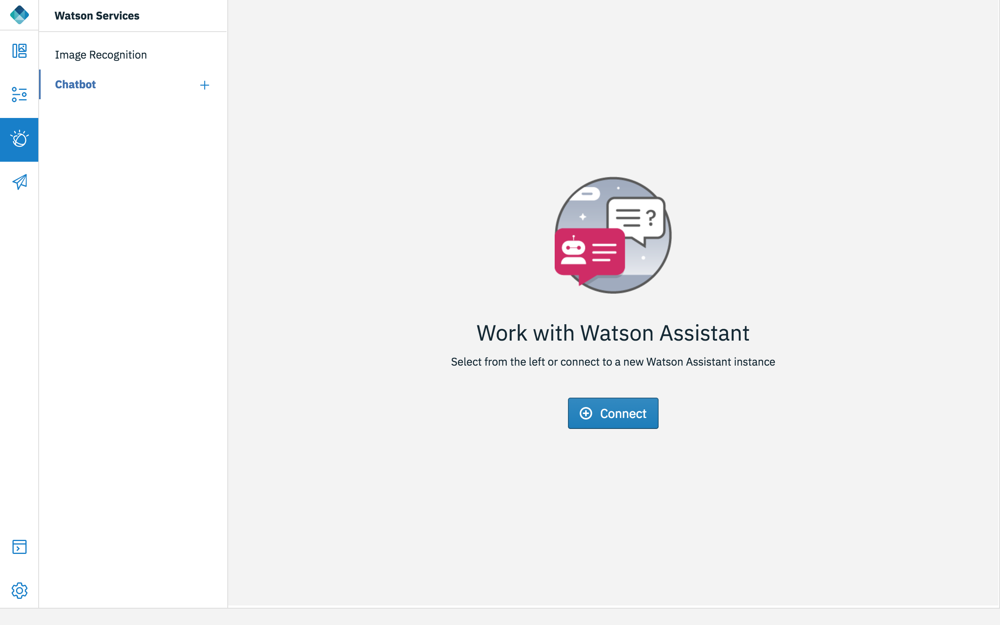

2. Clique em **Conectar** em sua instância do Watson Assistant.

    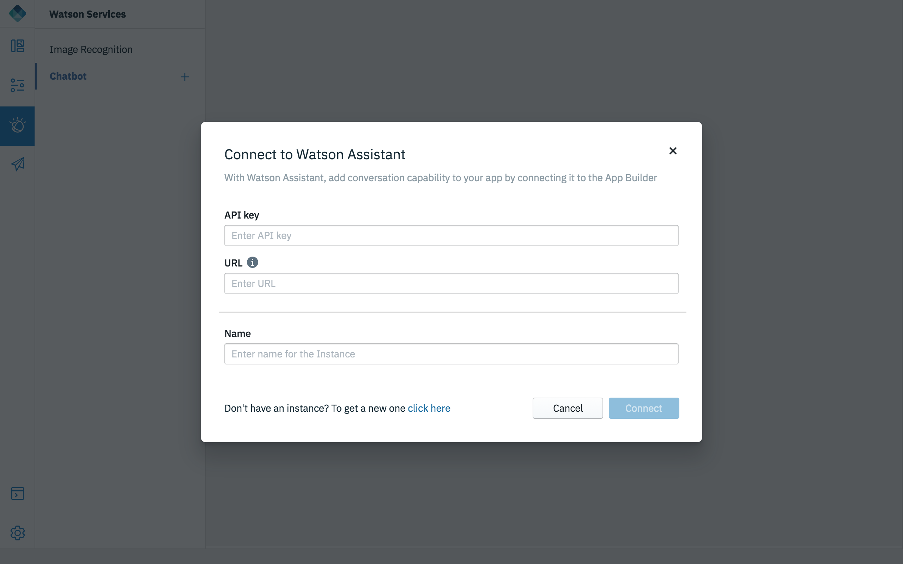

3. Insira os detalhes da **chave de API** e especifique a **URL** de sua instância do Watson Assistance. 
4. Forneça um **Nome** para seu robô de bate-papo e clique em **Conectar**. Isso exibe o painel do serviço de bate-papo do **Nome**fornecido.

    

5. Inclua uma área de trabalho clicando em **Incluir uma área de trabalho** que exibe o pop-up **Criar um novo modelo**.

    

6. Insira o **Nome da área de trabalho** e a **Descrição da área de trabalho** e clique em **Criar**. Isso cria três áreas de trabalho **Conversa** (Bem-vindo, Nenhuma correspondência localizada e Nova conversa).

    

7. Clique em **Nova conversa** para educar o novo modelo de robô de bate-papo. 

    

8. Inclua perguntas e respostas como um arquivo csv ou como uma pergunta e resposta individuais. Por exemplo, **Incluir uma instrução do usuário** para Se o usuário pretende perguntar e, em seguida, **Incluir uma resposta do robô** para **Em seguida, o robô deve responder com**. Ou, é possível fazer upload de perguntas e respostas para que o robô responda.
9. Clique em **Salvar**.
10. Clique no ícone Robô de bate-papo no lado inferior direito para testar o robô de bate-papo.

    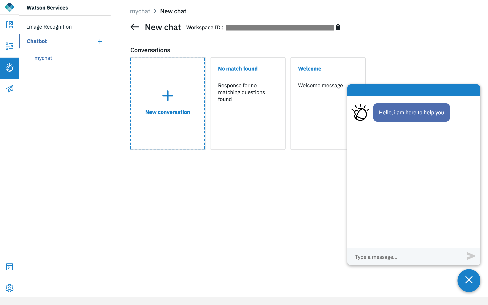

#### Reconhecimento de imagem 
{: #image-recognition }

O recurso de reconhecimento de imagem é desenvolvido com o serviço do Watson Visual Recognition no IBM Cloud. Crie uma instância do Watson Visual Recognition no IBM Cloud. Para obter informações adicionais, consulte [aqui](https://cloud.ibm.com/catalog/services/visual-recognition).

Depois de configurado, agora é possível criar um novo Modelo e incluir classes nele. É possível arrastar e soltar imagens no Builder e, em seguida, treinar seu Modelo nessas imagens. Quando o treinamento estiver concluído, será possível fazer download do modelo CoreML ou usar o Modelo em um controle de IA em seu aplicativo.

Para ativar um Reconhecimento Visual em seu aplicativo, execute as etapas a seguir:

1. Clique em **Watson** e, em seguida, clique em **Reconhecimento de imagem**. Isso exibe a tela **Trabalhar com o Watson Visual Recognition**.

    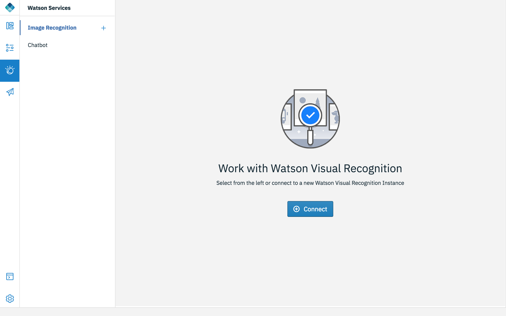

2. Clique em **Conectar** em sua instância do Watson Visual Recognition.

    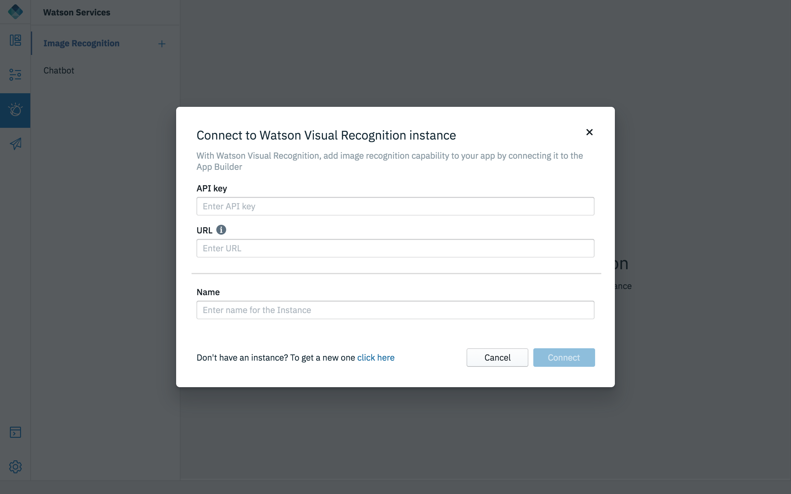

3. Insira os detalhes da **Chave de API** e especifique a **URL** de sua instância do Watson Visual Recognition. 
4. Forneça um **Nome** para a instância de Reconhecimento de Imagem no aplicativo e clique em **Conectar**. Isso exibe o painel para seu modelo.

    

5. Clique em **Incluir novo modelo** para criar um novo modelo. Isso exibirá o pop-up **Criar um novo modelo**.

    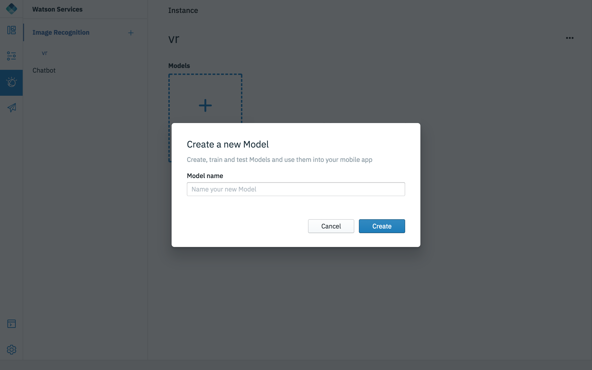

6. Insira o **Nome do modelo** e clique em **Criar**. Isso exibirá as classes para esse modelo e uma classe **Negativa**.

    

7. Clique em **Incluir nova classe**. Isso exibirá um pop-up para especificar um nome para a nova classe.

    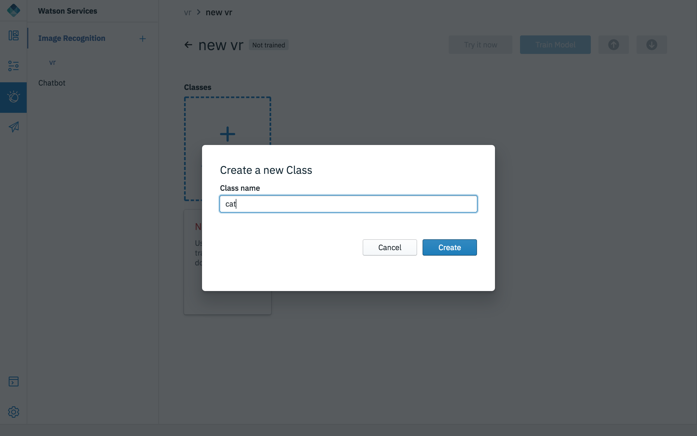

8. Insira o **Nome da Classe**para a nova classe e clique em **Criar**. Isso exibirá a área de trabalho para incluir suas imagens para treinamento do modelo.

    

9. Inclua as imagens no modelo, arraste e solte-as na área de trabalho ou use Procurar para acessar as imagens.

10. É possível voltar para sua área de trabalho após a inclusão das imagens e testar clicando em **Testar modelo**.

    

11. Na seção **Testar seu modelo**, inclua uma imagem e, em seguida, o resultado é exibido.

### Engajamento
{: #engagement}

É possível incluir notificações Push em seu aplicativo e aumentar o engajamento do usuário.

Para incluir notificações Push em seu aplicativo:

1. Selecione **Engajamento**. Isso exibirá a lista de serviços disponíveis. Atualmente, somente serviços de Notificações Push estão disponíveis.

    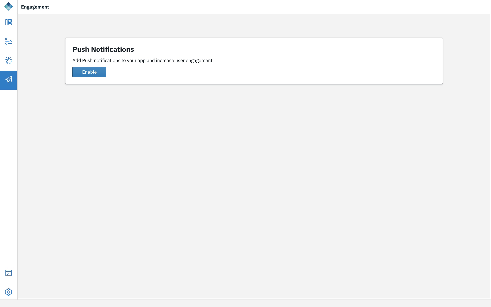

2. Em **Notificações push**, clique em **Ativar**. Isso exibe a página de configuração Notificações push.

3. Configure a notificação push para Android fornecendo **Chave secreta da API** e **ID do emissor** e clique em **Salvar configuração**.

    

4. Navegue até a guia iOS e forneça detalhes de configuração de push: selecione o **Ambiente**, forneça um caminho ao arquivo .p12, insira a **Senha** e clique em **Salvar configuração**.

    

5. Executar as etapas a seguir:
    a. Para o aplicativo Android, copie `google-services.json` (faça download de seu projeto firebase) para a pasta `<path_to_app>/ionic/platforms/android/app`. 
    b. Para o aplicativo iOS, abra o projeto xcode `<path_to_app>/ionic/platforms/ios/<app>.xcodeproj` e permita o recurso de notificação push. Para obter mais detalhes, consulte [https://help.apple.com/xcode/mac/current/#/devdfd3d04a1](https://help.apple.com/xcode/mac/current/#/devdfd3d04a1).

6. No lado do servidor,
 
    * Siga [http://mobilefirstplatform.ibmcloud.com/tutorials/en/foundation/8.0/notifications/sending-notifications/#setting-up-notifications](http://mobilefirstplatform.ibmcloud.com/tutorials/en/foundation/8.0/notifications/sending-notifications/#setting-up-notifications) para ativar as notificações push no lado do servidor.

    * Siga [http://mobilefirstplatform.ibmcloud.com/tutorials/en/foundation/8.0/notifications/sending-notifications/#sending-notifications](http://mobilefirstplatform.ibmcloud.com/tutorials/en/foundation/8.0/notifications/sending-notifications/#sending-notifications) para enviar notificações do servidor

**Nota**:
As notificações push do servidor MFP são usadas para ativar o serviço de notificação. Portanto, se o serviço de notificação push do IBM Cloud foi usado antes, siga o link para configurar notificações no servidor MFP [http://mobilefirstplatform.ibmcloud.com/tutorials/en/foundation/8.0/notifications/sending-notifications/#setting-up-notifications](http://mobilefirstplatform.ibmcloud.com/tutorials/en/foundation/8.0/notifications/sending-notifications/#setting-up-notifications).

### Console
{: #console }

Ajuda a visualizar o código para cada um dos componentes. Além disso, exibe as informações sobre várias atividades e erros.

### Configurações
{: #settings}

As configurações ajudam você a gerenciar as configurações do aplicativo e a retificar quaisquer erros durante o processo de construção. As configurações consistem nas guias **Detalhes do app**, **Servidor**, **Plug-ins** e **Reparar projeto**.

#### **Detalhes do aplicativo**
{: #app-details}

Os detalhes do aplicativo exibem informações sobre seu aplicativo: **Ícone do aplicativo**, **Nome**, **Local** em que os arquivos são armazenados, **ID do projeto/pacote configurável** fornecido no momento da criação do aplicativo, **Plataformas** (canais) selecionados, **Serviço** ativado.

É possível mudar o **ícone do aplicativo** clicando no ícone e fazendo upload de um novo ícone.

É possível incluir/remover Plataformas adicionais marcando/desmarcando a caixa de seleção perto delas.

Clique em **Salvar** para atualizar as alterações.

#### **Servidor**
{: #server }

As informações do Servidor exibem os **Detalhes do servidor** no qual você está trabalhando atualmente. É possível editar as informações clicando no link **Editar**. É possível incluir ou modificar a autorização do cliente confidencial.

A guia Servidor também exibe **Servidores recentes**.

>**Nota**: somente será possível excluir um servidor incluído anteriormente no momento da criação de um aplicativo por meio do Digital App Builder e se ele não for usado por qualquer um de seus aplicativos criados pelo Digital App Studio.

Também é possível incluir um novo servidor clicando no botão **Conectar novo +**, fornecendo os detalhes no pop-up **Conectar-se a um novo servidor** e clicando em **Conectar**.

#### Plug-ins
{: #plugins}

Plug-ins exibe a lista de plug-ins disponíveis no Digital App Builder. As ações a seguir podem ser executadas:

* **Instalar novo** - É possível instalar novos plug-ins clicando nesse botão. Isso exibe o diálogo **Novo plug-in**. Insira o **Nome do plug-in**, a **Versão** (opcional) e, se for um **Plug-in local**, ative o comutador para ele, indique o local e clique em **Instalar**.

* Na lista de Plug-ins já instalados, é possível editar a versão e reinstalar o plug-in ou desinstalar um plug-in selecionando o link para o respectivo plug-in.

#### Reparar projeto
{: #repair-project}

A guia Reparar projeto ajuda você a corrigir problemas clicando nas respectivas opções.

* **Reconstruir dependências** - Se o projeto estiver instável, é possível tentar recriar dependências.
* **Reconstruir plataformas** - Se você vir quaisquer erros relacionados à plataforma no console, tente reconstruir as plataformas. Se você tiver feito qualquer mudança nos canais ou incluído canais adicionais, use essa opção.
* **Reconfigurar as credenciais do IBM Cloud para o servidor Playground** - É possível reconfigurar as Credenciais do IBM Cloud usadas para efetuar login no Playground Server. A reconfiguração do cache de Credenciais também limpa todos os seus apps no servidor Playground. **ESTA OPERAÇÃO NÃO PODE SER REVERTIDA.**

 
