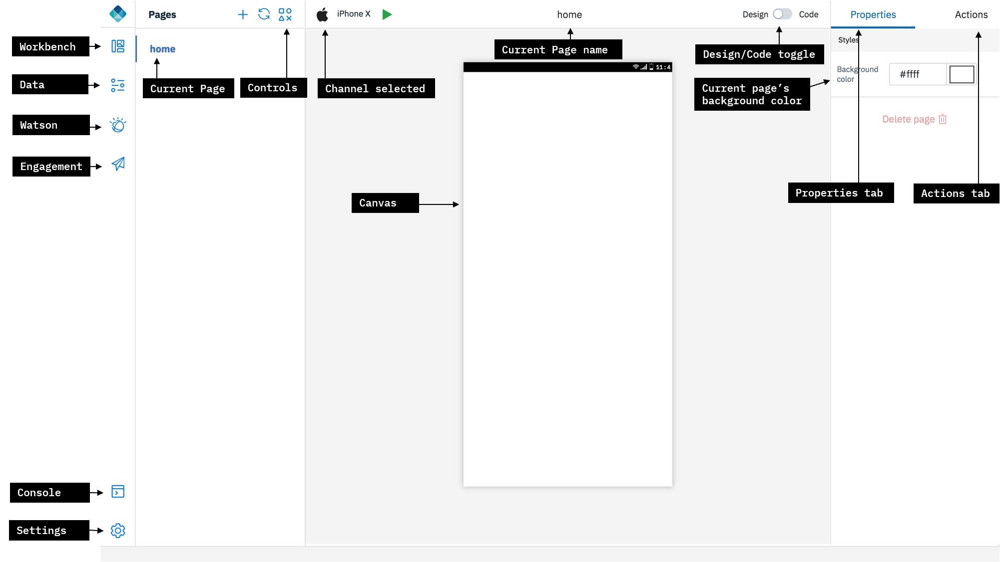
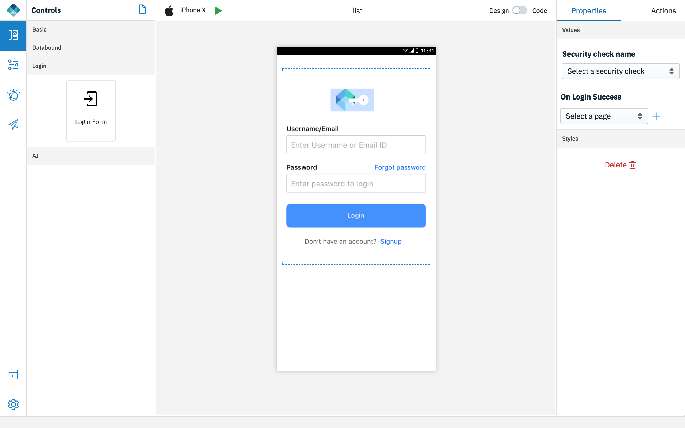
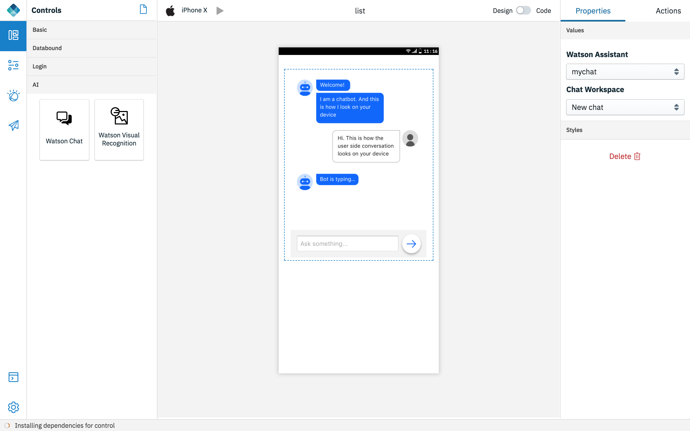

<!-- NLS_CHARSET=UTF-8 -->
## Interface do Digital App Builder
{: #digital-app-builder-interface }

Com base no modo (Design/Código) selecionado, a interface do Digital App Builder é exibida.

### Interface do Digital App Builder no modo de Design

A interface do Digital App Builder consiste no seguinte no painel de navegação esquerdo:

* **Ambiente de trabalho** - exibe ou oculta os detalhes da página
* **Dados** - ajuda a incluir um conjunto de dados conectando-se a uma origem de dados existente ou criar uma origem de dados para um microsserviço usando o doc OpenAPI. 
* **Watson** - consiste em componentes de Reconhecimento de Imagem e Robô de Bate-papo (Watson Assistant) para configurar uma instância existente ou criar uma nova instância. 
* **Engajamento** - É possível aumentar o engajamento do usuário com o aplicativo, incluindo serviços de notificações de Push e usar o recurso Atualização Dinâmica para mostrar/ocultar controles e páginas ou mudar suas propriedades quando seu aplicativo estiver ativo.
* **Console**: Exibe o console para ver as atividades. 
* **Configurações**: Exibe os detalhes do aplicativo, informações do servidor, plug-ins e Projeto de reparo (como Reconstrução de dependências, Reconstrução de plataformas, Reconfiguração de credenciais do IBM Cloud), ativação ou desativação de analítica.

#### Ambiente de trabalho
{: #workbench }

O ambiente de trabalho ajuda você a projetar as páginas. O ambiente de trabalho consiste em três áreas de trabalho:

1. **Páginas/Controles**: essa área exibe o nome das páginas criadas por padrão. Use o sinal **+** para criar uma nova página. Clicar no ícone **Controles**, exibe controles que ajudam a incluir funcionalidade em uma página em um aplicativo. É possível arrastar e soltar os controles da respectiva paleta de Controles para uma tela da página. Cada controle possui um conjunto de propriedades e ações. É possível modificar as propriedades de cada um dos controles selecionados.

    A seguir está a lista de controles fornecidos disponíveis:
    * **Básico**: É possível arrastar e soltar estes controles básicos (Botão, Cabeçalho, Imagem e Rótulo) para a tela e configurar as propriedades e ações.

        

        * **Botão**-Os botões têm uma propriedade para rotular. Na guia Ação, é possível especificar a página para navegar para o botão direito do mouse no Botão.
        * **Texto de Título**-Ajuda você a incluir um texto de título para o aplicativo, como Título da Página.
        * **Imagem**-Ajuda a fazer upload de uma imagem local ou fornecer uma url de uma imagem.
        * **Rótulo**-Ajuda você a incluir texto estático em seu corpo da página. 
    * **Databound** - ajuda você a se conectar com um conjunto de dados e a operar as entidades no conjunto de dados. O databound consiste em dois componentes: **Listar**e **Rótulos Conectados**

        

        * **Listar**-Criar uma nova página e arrastar e soltar o componente Lista. Inclua o **Título da Lista**, Escolha o tipo de lista para trabalhar em, Incluir conteúdo no trabalho e selecione o conjunto de dados a ser usado.

        Para obter informações adicionais sobre como incluir o **Conjunto de dados**, consulte [aqui](../how-to-add-dataset/).

    * **Login** - Login consiste no controle de **Formulário de Login**. 
 
        O controle de Formulário de Login ajuda você a criar uma página de login para seu aplicativo para conectar o usuário ao servidor Mobile Foundation. O servidor Mobile Foundation fornece uma estrutura de segurança para autenticar usuários e fornecer esse contexto de segurança para acessar os conjuntos de dados. Para obter mais informações, leia [aqui](https://mobilefirstplatform.ibmcloud.com/tutorials/en/foundation/8.0/authentication-and-security/creating-a-security-check/).

        

        Para obter informações adicionais sobre como inclui o controle de **Formulário de login**, consulte [aqui](../how-to-login/).

    * **IA** - os controles de IA permitem que você inclua recursos do Watson AI em seu aplicativo.

        * **Watson Chat** - Este controle fornece uma interface de bate-papo completa que pode ser desenvolvida com o serviço do Watson Assistant no IBM Cloud. 

            

            * Na seção de propriedades, selecione o serviço do Watson Assistant configurado e selecione a Área de Trabalho à qual deseja se conectar. Para definir e treinar uma conversa de Bate-papo, consulte [Robô de bate-papo](../how-to-chatbot/) sob Watson.

        * **Watson Visual Recognition** - Este controle fornece a capacidade de tirar uma foto e permitir que o serviço de reconhecimento visual do Watson identifique-a para você.
         
            
 
            *  Na seção de propriedades, selecione o serviço Reconhecimento Visual configurado e o modelo de classificação. Para definir e treinar usando suas próprias imagens, consulte [Reconhecimento de imagem](../how-to-image-recognition/) sob Watson.

2. Seção **Tela** - Esta área consiste no Canal atual selecionado, no nome da Página atual, na Publicação e na Tela.

    * Ícone **Canal** - Isso exibe o canal atual selecionado. É possível incluir canais adicionais, selecionando os canais necessários na seção Plataformas em **Configurações >Aplicativo >Detalhes do aplicativo**.
    * Nome da página atual - Exibe o nome da página da tela. Quando alternado entre páginas, o nome da página atual é atualizado para a página selecionada.
    * **Construir/Visualizar o aplicativo** - Este botão tem duas opções: a. ajuda a visualizar o aplicativo que está sendo desenvolvido; b. construir o aplicativo.
    * **Publicar** - Esta opção ajuda você a construir e publicar seu aplicativo para Android/iOS no App Center ou Publicar atualizações diretas de seu aplicativo “over-the-air” com recursos da web atualizados.
    * **Tela** - No centro dessa seção está a tela que exibe o design ou o código. É possível arrastar e soltar os controles e criar o aplicativo.

3. Guia **Propriedades/Ações** - No lado direito, está a guia Propriedades e ação. Quando um controle é colocado na tela, é possível editar e modificar as propriedades do controle e conectar um controle com uma ação relacionada a ser executada.

#### Dados
{: #dataset-integration}

É possível criar um conjunto de dados para um microsserviço e depois de criar o conjunto de dados, é possível conectar os controles de limite de dados em seu aplicativo.

Para obter informações adicionais sobre como incluir o **Conjunto de dados**, consulte [aqui](../how-to-add-dataset/).

#### Watson
{: #integrating-with-watson-services}

O Digital App Builder fornece a capacidade de configurar o aplicativo para se conectar aos vários serviços do Watson provisionados no IBM Cloud.

#### Engajamento
{: #engagement}

É possível incluir notificações de Push em seu aplicativo e aumentar o engajamento do usuário ou usar o recurso Atualização Dinâmica para mostrar/ocultar controles e páginas ou mudar suas propriedades quando seu aplicativo estiver ativo.

#### Console
{: #console }

Ajuda a visualizar o código para cada um dos componentes. Além disso, exibe as informações sobre várias atividades e erros.

#### Configurações
{: #settings}

As configurações ajudam você a gerenciar as configurações do aplicativo e a retificar quaisquer erros durante o processo de construção. As configurações consistem nas guias **Detalhes do app**, **Servidor**, **Plug-ins** e **Reparar projeto**.

### Interface do Digital App Builder no modo de Código

A interface do Digital App Builder no modo de Código consiste no seguinte no painel de navegação esquerdo:

* **Ambiente de trabalho** - Exibe ou oculta os arquivos
* **Watson** - consiste em componentes de Reconhecimento de Imagem e Robô de Bate-papo (Watson Assistant) para configurar uma instância existente ou criar uma nova instância. 
* **Engajamento** - É possível aumentar o engajamento do usuário com o aplicativo, incluindo serviços de notificações de Push e usar o recurso Atualização Dinâmica para mostrar/ocultar controles e páginas ou mudar suas propriedades quando seu aplicativo estiver ativo.
* **API** - Ajuda a simular o servidor apenas fornecendo dados JSON durante o desenvolvimento.
* **Console**: Exibe o console para ver as atividades. 
* **Configurações**: Exibe os detalhes do aplicativo, informações do servidor, plug-ins e Projeto de reparo (como Reconstrução de dependências, Reconstrução de plataformas, Reconfiguração de credenciais do IBM Cloud), ativação ou desativação de analítica.

#### Ambiente de trabalho (Modo de Código)
{: #workbench }

O ambiente de trabalho ajuda você a projetar as páginas. O Ambiente de trabalho consiste em duas áreas de trabalho:

1. **Arquivos do Projeto**: esta área exibe a lista de arquivos associados a este aplicativo criado por padrão. Use o sinal **+** para criar uma nova página. Ao clicar no ícone **Controles** (**</>**), exibe o painel **Fragmentos de código**. É possível arrastar e soltar esses fragmentos de código para seu código e modificar as propriedades de cada um dos controles selecionados.

#### Fragmentos de código (Somente modo de Código)
{: #code-snippets}

Alguns dos fragmentos de código comumente usados são predefinidos e podem ser incluídos nos arquivos de origem por simples arrastar e soltar da seção Fragmentos de código. Esta seção consiste em fragmentos de código nas seguintes categorias:

* **Núcleo móvel** - Fragmentos de código para executar operações básicas com o IBM Mobile Foundation Server
* **Analítica** - Fragmentos de código para Analítica customizada e Feedback do usuário.
* **Ionic** - Fragmentos de código para componentes Ionic.
* **Push** - Fragmentos de código para trabalhar com notificações de Push.
* **Atualização dinâmica** - Fragmentos de código para trabalhar com Atualização dinâmica para alternância de Recurso.

