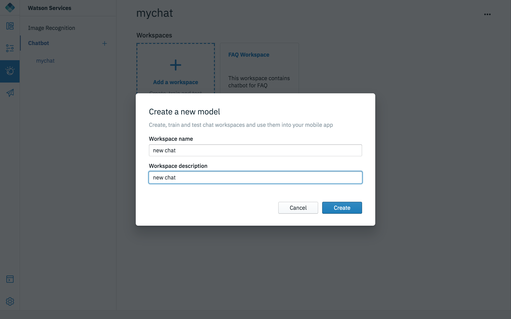

<!-- NLS_CHARSET=UTF-8 -->
## Robô de bate-papo do Watson
{: #dab-chatbot }

Os robôs de bate-papo são desenvolvidos com o serviço do Watson Assistant no IBM Cloud. Crie uma instância do Watson Assistant no IBM Cloud. Para obter informações adicionais, consulte [aqui](https://cloud.ibm.com/catalog/services/watson-assistant-formerly-conversation).

Depois de configurado, é possível criar uma nova **Área de Trabalho**. A área de trabalho é um conjunto de conversas que formam um robô de bate-papo. Depois de criar uma Área de Trabalho, inicie a criação dos diálogos. Forneça um conjunto de perguntas para uma intenção e um conjunto de respostas para essa intenção. O Watson Assistant usa o Entendimento de Língua Natural para interpretar a intenção com base nas perguntas de amostra que você forneceu. Em seguida, ele pode tentar interpretar a pergunta que um usuário pergunta em vários estilos e mapeia-a para a intenção.

Para ativar um robô de bate-papo em seu aplicativo, execute as etapas a seguir:

1. Clique em **Watson** e, em seguida, clique em **Robô de bate-papo**. Isso exibe a tela **Trabalhar com o Watson Assistant** .

    

2. Clique em **Conectar** em sua instância do Watson Assistant.

    

3. Insira os detalhes da **chave de API** e especifique a **URL** de sua instância do Watson Assistance. 
4. Forneça um **Nome** para seu robô de bate-papo e clique em **Conectar**. Isso exibe o painel do serviço de bate-papo do **Nome**fornecido.

    

5. Inclua uma área de trabalho clicando em **Incluir uma área de trabalho** que exibe o pop-up **Criar um novo modelo**.

    

6. Insira o **Nome da área de trabalho** e a **Descrição da área de trabalho** e clique em **Criar**. Isso cria três áreas de trabalho **Conversa** (Bem-vindo, Nenhuma correspondência localizada e Nova conversa).

    

7. Clique em **Nova conversa** para educar o novo modelo de robô de bate-papo. 

    

8. Inclua perguntas e respostas como um arquivo csv ou como uma pergunta e resposta individuais. Por exemplo, **Incluir uma instrução do usuário** para Se o usuário pretende perguntar e, em seguida, **Incluir uma resposta do robô** para **Em seguida, o robô deve responder com**. Ou, é possível fazer upload de perguntas e respostas para que o robô responda.
9. Clique em **Salvar**.
10. Clique no ícone Robô de bate-papo no lado inferior direito para testar o robô de bate-papo.

    
