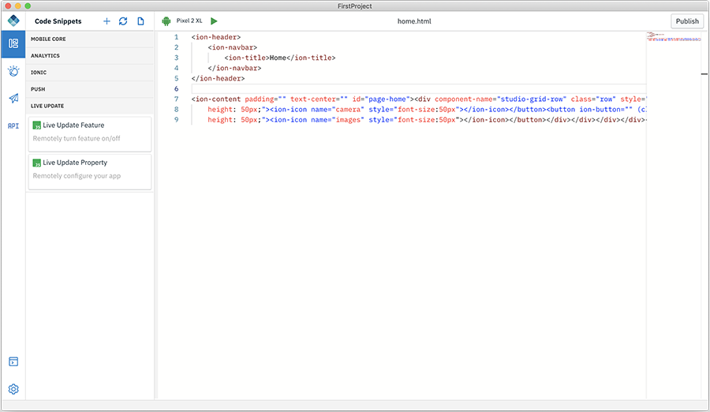

<!-- NLS_CHARSET=UTF-8 -->
## Alternância de recurso usando a Atualização Dinâmica
{: #dab-feature-toggle-live-update }

Use a Atualização Dinâmica para tornar configuráveis os diferentes aspectos de seu aplicativo, para ativar ou desativar recursos remotamente. Controle também dinamicamente as propriedades do aplicativo, mudando os valores de variáveis diretamente do MobileFirst Operations Console.

Recurso é um valor binário de ativação/desativação que é usado para ativar ou desativar o recurso de um aplicativo.

Propriedades são pares nome-valor que podem ser usados para controlar o comportamento do aplicativo.

>**Nota**: A Atualização Dinâmica estará disponível somente quando o aplicativo estiver pronto.

### Incluindo a Atualização Dinâmica no modo de Design

Para incluir a Atualização Dinâmica em seu aplicativo:

1. Selecione **Engajamento**. Isso exibirá a lista de serviços disponíveis.

    

2. Selecione **Atualização Dinâmica** e clique em **Ativar**. Isso configurará a atualização dinâmica no servidor Mobile Foundation. Na ativação bem-sucedida da atualização dinâmica, um pop-up será exibido.

    

3. Clique em **+ Novo recurso** para definir um novo recurso no servidor Mobile Foundation. Isso exibe a tela a seguir.

    

4. Insira o **ID do recurso** e o **Nome do recurso** e configure a **Visibilidade** padrão.

    * **ID do recurso** - Um identificador exclusivo para seu recurso.
    * **Nome do recurso** - Dê um nome para descrever seu recurso

    

5. Clique em **Criar**.

6. De forma semelhante, defina uma propriedade de Atualização Dinâmica fornecendo os seguintes detalhes:

    * **PropertyID**
    * **Nome da Propriedade
**
    * **Valor da Propriedade
**

### Incluindo a Atualização Dinâmica no modo de Código

Para incluir a Atualização Dinâmica em seu aplicativo:

**Método
1**

1. Abra o aplicativo no modo de código
2. Navegue para `projectname/ionic/src/app/app.component.ts`

    

3. Acesse para inicializar o método de atualização dinâmica.
4. Edite o código para mostrar/ocultar um controle e propriedade para configurar a propriedade do controle.

**Método 2**

1. Abra o aplicativo no modo de código.
2. Acesse e clique no fragmento de código **</>**.
3. em Atualização Dinâmica > Configuração de Atualização Dinâmica.

    

4. Arraste e solte o fragmento de código **Configuração de Atualização Dinâmica**.
5. Edite o código para mostrar/ocultar um controle e propriedade para configurar a propriedade do controle.

