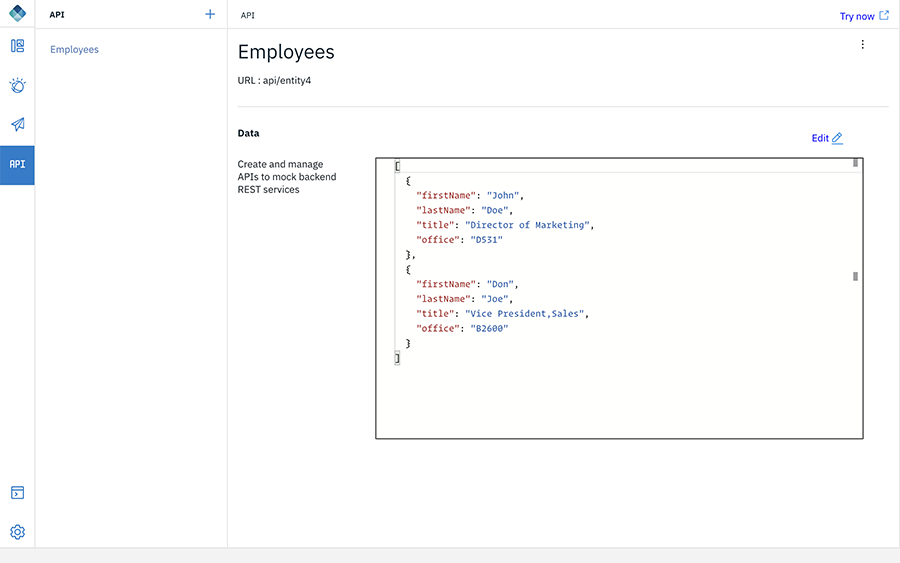

<!-- NLS_CHARSET=UTF-8 -->

## API de Mock
{: #dab-mock-api }

Ao desenvolver um aplicativo móvel, geralmente o back-end real de onde os dados precisam ser buscados não estaria prontamente disponível para os desenvolvedores móveis. Nesses casos, seria útil se estivesse disponível um servidor mock que retorna os mesmos dados que o back-end real. O recurso API de Mock no Digital App Builder ajuda nessa situação. O desenvolvedor de aplicativo móvel pode facilmente simular o servidor apenas fornecendo dados JSON.

>**Nota**: Este recurso está disponível somente no modo de Código.

Para criar e gerenciar APIs para simular serviços REST de back-end:

1. Abra seu projeto de aplicativo no modo de Código 
2. Selecione **API**. Clique em **Incluir um API**.
    

3. Na janela que se abre, insira um nome para sua API e clique em **Incluir**.
    

4. Isso mostrará a API criada com a URL gerada automaticamente.
    

5. Clique em **Editar**. Forneça os dados que você deseja retornar na chamada dessa API e clique em **Salvar**. Por exemplo, 

    ```
    [
      {
        "firstName": "John",
        "lastName": "Doe",
        "title": "Director of Marketing",
        "office": "D531"
      },
      {
        "firstName": "Don",
        "lastName": "Joe",
        "title": "Vice President,Sales",
        "office": "B2600"
      }
    ]
    ```

    

>**Nota**: Para testar rapidamente a API, clique em **Tentar agora** e será aberta a documentação de swagger em seu navegador padrão, onde é possível testar suas APIs.

### Consumindo as APIs de Mock no aplicativo
{: #dab-mock-api-consuming }

1. No modo de código, arraste e solte o fragmento de código **Chamada da API** da seção **NÚCLEO MÓVEL**.
2. Edite o código para modificar a URL e apontar para o terminal da API de Mock. Por exemplo,

    ```
     var resourceRequest = new WLResourceRequest(
         "/adapters/APIProject/api/entity4",
         WLResourceRequest.GET,
         { "useAPIProxy": false }
     );
     resourceRequest.send().then(
         function(response) {
             alert("Success: " + response.responseText);
         },
         function(response) {
             alert("Failure: " + JSON.stringify(response));
         }
     );
    ```
 
