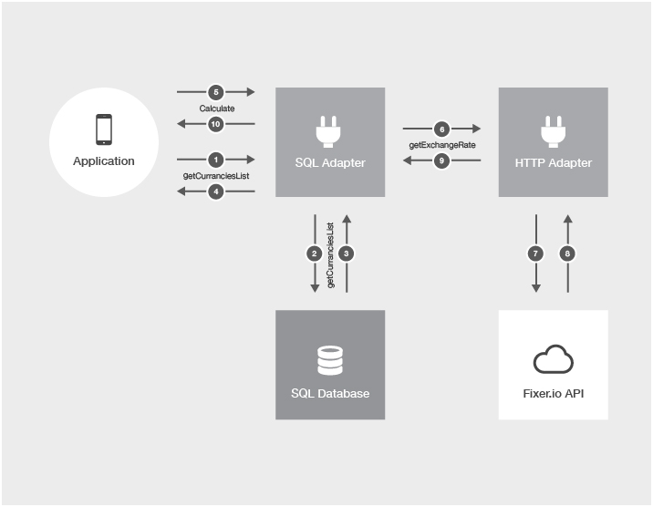

<!-- NLS_CHARSET=UTF-8 -->
## 概述
{: #overview }
现在已经介绍了不同类型的适配器的基本用法，重要的是要记住，可以组合适配器来生成一个过程，以使用不同的适配器来生成一个处理结果。 您可以组合多个源（不同 HTTP 服务器和 SQL 等等）。

理论上，您可以从客户机端连续发出多个请求，一个请求依赖于另一个请求。
但是，在服务器端编写此逻辑可能更加快速和简洁。

#### 跳转至
{: #jump-to}
* [JavaScript 适配器 API](#javascript-adapter-api)
* [Java 适配器 API](#java-adapter-api)
* [数据聚合示例](#data-mashup-example)
* [样本应用程序](#sample-application)

## JavaScript 适配器 API
{: #javascript-adapter-api }

### 从 JavaScript 适配器调用 JavaScript 适配器过程
{: #calling-a-javascript-adapter-procedure-from-a-javascript-adapter }

在从其他 JavaScript 适配器调用 JavaScript 适配器过程时，请使用 `MFP.Server.invokeProcedure(invocationData)` API。 此 API 会调用任何 JavaScript 适配器上的过程。 `MFP.Server.invokeProcedure(invocationData)` 返回从被调用过程检索到的结果对象。

`invocationData` 函数特征符是：  
`MFP.Server.invokeProcedure({adapter: [Adapter Name], procedure: [Procedure Name], parameters: [Parameters seperated by a comma]})`

例如：

```javascript
MFP.Server.invokeProcedure({ adapter : "AcmeBank", procedure : " getTransactions", parameters : [accountId, fromDate, toDate]});
```

> 不支持从 JavaScript 适配器调用 Java 适配器

## Java 适配器 API
{: #java-adapter-api }

在调用其他适配器之前 - 必须将 AdaptersAPI 分配给变量：

```java
@Context
AdaptersAPI adaptersAPI;
```

### 从 Java 适配器调用 Java 适配器
{: #calling-a-java-adapter-from-a-java-adapter }

在从 Java 适配器调用适配器过程时，请使用 `executeAdapterRequest` API。
此调用返回 `HttpResponse` 对象。

```java
HttpUriRequest req = new HttpGet(JavaAdapterProcedureURL);
HttpResponse response = adaptersAPI.executeAdapterRequest(req);
JSONObject jsonObj = adaptersAPI.getResponseAsJSON(response);
```

### 从 Java 适配器调用 JavaScript 适配器过程
{: calling-a-javascript-adapter-procedure-from-a-java-adapter }
 
在从 Java 适配器调用 JavaScript 适配器过程时，请使用 `executeAdapterRequest` API
和创建 `HttpUriRequest` 的 `createJavascriptAdapterRequest` API，
以作为参数传递到 `executeAdapterRequest` 调用。

```java
HttpUriRequest req = adaptersAPI.createJavascriptAdapterRequest(AdapterName, ProcedureName, [parameters]);
org.apache.http.HttpResponse response = adaptersAPI.executeAdapterRequest(req);
JSONObject jsonObj = adaptersAPI.getResponseAsJSON(response);
```

## 数据聚合示例
{: #data-mashup-example }

以下示例显示如何从 2 个数据源，即*数据库表*和 *Fixer.io（汇率和货币转换服务）*聚合数据，并将数据流作为单个对象返回到应用程序。

在此示例中将使用 2 适配器：

* SQL 适配器：
  * 从货币数据库表中抽取货币列表。
  * 结果包含货币列表。 每个货币都有标识、符号以及名称。 例如：{3、EUR、欧元}
  * 此适配器还将拥有一个过程，该过程调用 HTTP 适配器并传递 2 个参数（基本货币和目标货币）以检索更新的汇率。
* HTTP 适配器：
  * 连接到 Fixer.io 服务。
  * 针对通过 SQL 适配器作为参数检索的所请求货币抽取更新汇率。

然后，会将聚合数据返回给应用程序以进行显示。



本教程中提供的样本演示了使用 3 种不同聚合类型实施此场景。  
其中，适配器名称略有不同。  
下面列示了聚合类型和相应的适配器名称：

| 场景                                         |      SQL 适配器名称        |  HTTP 适配器名称    |  
|--------------------------------------------------|------------------------------|-----------------------|
| **JavaScript** 适配器 → **JavaScript** 适配器  | SQLAdapterJS                 | HTTPAdapterJS         |  
| **Java** 适配器 → **JavaScript** 适配器        | SQLAdapterJava               | HTTPAdapterJS         |  
| **Java** 适配器 → **Java** 适配器              | SQLAdapterJava               | HTTPAdapterJava       |


### 聚合样本流程
{: #mashup sample flow }

**1. 创建过程/适配器调用，该调用针对所请求的货币创建后端端点请求，并检索相应的数据：**  

（HTTPAdapterJS 适配器）XML：

```xml
<connectivity>
  <connectionPolicy xsi:type="http:HTTPConnectionPolicyType">
    <protocol>http</protocol>
    <domain>api.fixer.io</domain>
    <port>80</port>
    ...
  </connectionPolicy>
</connectivity>
```

（HTTPAdapterJS 适配器）JavaScript:

```javascript
function getExchangeRate(fromCurrencySymbol, toCurrencySymbol) {
  var input = {
    method: 'get',
    returnedContentType: 'json',
    path: getPath(fromCurrencySymbol, toCurrencySymbol)
  };

  return MFP.Server.invokeHttp(input);
}

function getPath(from, to) {
  return "/latest?base=" + from + "&symbols=" + to;
}
```

（HTTPAdapterJava 适配器）

```java
@GET
@Produces("application/json")
public Response get(@QueryParam("fromCurrency") String fromCurrency, @QueryParam("toCurrency") String toCurrency) throws IOException, IllegalStateException, SAXException {
  String path = "/latest?base="+ fromCurrency +"&symbols="+ toCurrency;
  return execute(new HttpGet(path));
}

private Response execute(HttpUriRequest req) throws IOException, IllegalStateException, SAXException {
  HttpResponse RSSResponse = client.execute(host, req);

  InputStream content = RSSResponse.getEntity().getContent();
  if (RSSResponse.getStatusLine().getStatusCode() == HttpStatus.SC_OK){
    responseAsText = IOUtils.toString(content, "UTF-8");
    content.close();
    return Response.ok().entity(responseAsText).build();
  }else{
    content.close();
    return Response.status(RSSResponse.getStatusLine().getStatusCode()).entity(RSSResponse.getStatusLine().getReasonPhrase()).build();
  }
}
```

**2. 创建过程，该过程可以从数据库访存货币记录并将结果集/JSONArray 返回给应用程序：**

（SQLAdapterJS 适配器）

```javascript
var getCurrenciesListStatement = "SELECT id, symbol, name FROM currencies;";

function getCurrenciesList() {
  var list = MFP.Server.invokeSQLStatement({
    preparedStatement: getCurrenciesListStatement,
    parameters: []
  });
  return list.resultSet;
}
```

（SQLAdapterJava 适配器）

```java
@GET
@Produces(MediaType.APPLICATION_JSON)
@Path("/getCurrenciesList")
public JSONArray getCurrenciesList() throws SQLException, IOException {
  JSONArray jsonArr = new JSONArray();

  Connection conn = getSQLConnection();
  PreparedStatement getAllCities = conn.prepareStatement("select id, symbol, name from currencies");
  ResultSet rs = getAllCities.executeQuery();
  while (rs.next()) {
    JSONObject jsonObj = new JSONObject();
    jsonObj.put("id", rs.getString("id"));
    jsonObj.put("symbol", rs.getString("symbol"));
    jsonObj.put("name", rs.getString("name"));

    jsonArr.add(jsonObj);
  }
  rs.close();
  conn.close();
  return jsonArr;
}
```

**3. 创建过程，该过程调用 HTTPAdapter 过程（步骤 1 中所创建）并传递基本货币以及目标货币：**

（SQLAdapterJS 适配器）

```javascript
function getExchangeRate(fromId, toId) {
  var base = getCurrencySymbol(fromId);
  var exchangeTo = getCurrencySymbol(toId);
  var ExchangeRate = null;

  if (base == exchangeTo) {
    ExchangeRate = 1;
  } else {
    var fixerExchangeRateJSON = MFP.Server.invokeProcedure({
      adapter: 'HTTPAdapterJS',
      procedure: 'getExchangeRate',
      parameters: [base, exchangeTo]
    });
    ExchangeRate = fixerExchangeRateJSON.rates[exchangeTo];
  }

  return {
    "base": base,
    "target": exchangeTo,
    "exchangeRate": ExchangeRate
  };
}
```

（SQLAdapterJava 适配器 - 与其他 Java 适配器聚合）

```java
@GET
@Produces(MediaType.APPLICATION_JSON)
@Path("/getExchangeRate_JavaToJava")
public JSONObject getExchangeRate_JavaToJava(@QueryParam("fromCurrencyId") Integer fromCurrencyId, @QueryParam("toCurrencyId") Integer toCurrencyId) throws SQLException, IOException{
  String base = getCurrencySymbol(fromCurrencyId);
  String exchangeTo = getCurrencySymbol(toCurrencyId);
  Double ExchangeRate = null;

  if(base.equals(exchangeTo)){
    ExchangeRate = 1.0;
  }
  else{
    String getFixerIOInfoProcedureURL = "/HTTPAdapterJava?fromCurrency="+ URLEncoder.encode(base, "UTF-8") +"&toCurrency="+ URLEncoder.encode(exchangeTo, "UTF-8");
    HttpUriRequest req = new HttpGet(getFixerIOInfoProcedureURL);
    HttpResponse response = adaptersAPI.executeAdapterRequest(req);
    JSONObject jsonExchangeRate = adaptersAPI.getResponseAsJSON(response);
    JSONObject rates = (JSONObject)jsonExchangeRate.get("rates");
    ExchangeRate = (Double) rates.get(exchangeTo);
  }

  JSONObject jsonObj = new JSONObject();
  jsonObj.put("base", base);
  jsonObj.put("target", exchangeTo);
  jsonObj.put("exchangeRate", ExchangeRate);

  return jsonObj;
}
```

（SQLAdapterJava 适配器 - 与 JavaScript 适配器聚合）

```java
@GET
@Produces(MediaType.APPLICATION_JSON)
@Path("/getExchangeRate_JavaToJS")
public JSONObject getExchangeRate_JavaToJS(@QueryParam("fromCurrencyId") Integer fromCurrencyId, @QueryParam("toCurrencyId") Integer toCurrencyId) throws SQLException, IOException{
  String base = getCurrencySymbol(fromCurrencyId);
  String exchangeTo = getCurrencySymbol(toCurrencyId);
  Double ExchangeRate = null;

  if(base.equals(exchangeTo)){
    ExchangeRate = 1.0;
  }
  else{
    HttpUriRequest req = adaptersAPI.createJavascriptAdapterRequest("HTTPAdapterJS", "getExchangeRate", URLEncoder.encode(base, "UTF-8"), URLEncoder.encode(exchangeTo, "UTF-8"));
    org.apache.http.HttpResponse response = adaptersAPI.executeAdapterRequest(req);
    JSONObject jsonExchangeRate = adaptersAPI.getResponseAsJSON(response);
    JSONObject rates = (JSONObject)jsonExchangeRate.get("rates");
    ExchangeRate = (Double) rates.get(exchangeTo);
  }

  JSONObject jsonObj = new JSONObject();
  jsonObj.put("base", base);
  jsonObj.put("target", exchangeTo);
  jsonObj.put("exchangeRate", ExchangeRate);

  return jsonObj;
}
```


## 样本应用程序
{: #sample-application }
[单击以下载](https://github.com/MobileFirst-Platform-Developer-Center/AdaptersMashup/tree/release80) Cordova 项目。

**注：**样本应用程序的客户机端适用于 Cordova 应用程序，但是适配器中的服务器端代码适用于所有平台。

### 样本用法
{: #sample-usage }

#### 适配器设置
{: #adapter-setup }

在提供的适配器 maven 项目（位于 Cordova 项目内）的 `Utils/mobilefirstTraining.sql` 下，提供了 SQL 形式的货币列表示例。

1. 运行关系型数据库中的 .sql 脚本。
2. 使用 Maven、{{ site.data.keys.mf_cli }} 或您选择的 IDE 来[构建和部署适配器](../../adapters/creating-adapters/)。
3. 打开 {{ site.data.keys.mf_console }}
    - 单击 **SQLAdapterJS** 适配器并更新数据库连接属性。
    - 单击 **SQLAdapterJava** 适配器并更新数据库连接属性。

#### 应用程序设置
{: #application-setup }

1. 从命令行导航至 **CordovaApp** 项目的根文件夹。
2. 通过运行 `cordova platform add` 命令添加平台。
3. 通过运行命令 `mfpdev app register` 注册应用程序。
4. 通过运行 `cordova run` 命令运行 Cordova 应用程序。
