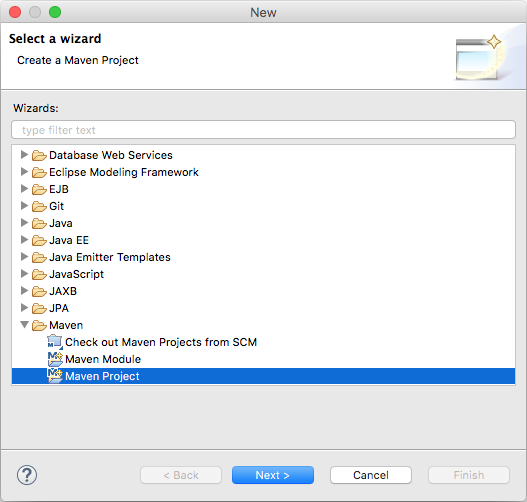
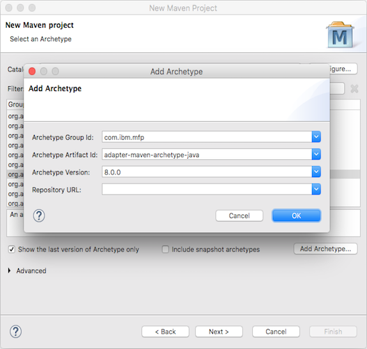

<!-- NLS_CHARSET=UTF-8 -->
## 概述
{: #overview }

如先前[适配器教程](../)中所讨论，适配器是通过直接使用 Maven 或通过 {{ site.data.keys.mf_cli }} 创建的 Maven 项目。之后可在任何 IDE 中编辑适配器代码，以后使用 Maven 或 {{ site.data.keys.mf_cli }} 进行构建和部署。开发人员也可选择在支持的 IDE（如 Eclipse 或 IntelliJ）内创建、开发、构建和部署所有适配器。在本教程中，从 Eclipse IDE 创建和构建适配器。

> 有关如何使用 IntelliJ 的指示信息，请参阅[使用 IntelliJ 开发 MobileFirst Java 适配器]({{site.baseurl}}/blog/2016/03/31/using-intellij-to-develop-adapters)博客帖子。
**先决条件：**

* 先通过阅读[适配器教程](../)来熟悉适配器。
* Eclipse 中的 Maven 集成。从 Eclipse Kepler (v4.3) 开始，Maven 支持内置于 Eclipse 中。如果您的 Eclipse 实例不支持 Maven，那么请遵循[ m2e 指示信息](http://www.eclipse.org/m2e/)以添加 Maven 支持。

#### 跳转至
{: #jump-to }

* [新建一个适配器 Maven 项目](#creating-a-new-adapter-maven-project)
* [导入现有适配器 Maven 项目](#importing-an-existing-adapter-maven-project)
* [构建和部署适配器 Maven 项目](#building-and-deploying-an-adapter-maven-project)
* [其他阅读材料](#further-reading)

## 创建或导入适配器 Maven 项目
{: #create-or-import-an-adapter-maven-project }

遵循以下指示信息，新建适配器 Maven 项目或导入现有适配器 Maven 项目。

### 新建一个适配器 Maven 项目
{: #creating-a-new-adapter-maven-project }

1. 要新建一个适配器 Maven 项目，选择：**文件 → 新建 → 其他... → Maven → Maven 项目**，然后单击**下一步**。

    

2. 提供项目名称和位置。  
    - 确保将创建简单项目的选项标记为**关闭**，然后单击**下一步**。

    

3. 选择或添加适配器 Archetype。
    - 如果[在本地安装了 archetype](../creating-adapters/#install-maven)，但它们并没有出现在 archetype 列表中，请选择**配置 → 添加本地目录 → 浏览到主目录中的 /.m2/repository/archetype-catalog.xml**。
    - 单击**添加 Archetype** 并提供以下详细信息：
        - **Archetype 组标识**：`com.ibm.mfp`
        - **Archetype 工件标识**： `adapter-maven-archetype-java`、`adapter-maven-archetype-http` 或 `adapter-maven-archetype-sql`
        - **Archetype 版本**：您可以在 [Maven Central](http://search.maven.org/#search%7Cga%7C1%7Ccom.ibm.mfp) 中找到最新的可用版本

    

4. 指定 Maven 项目参数。  
    - 指定所需的**组标识**、**工件标识**、**版本**和**包**参数，然后单击**完成**。

    

### 导入现有适配器 Maven 项目
{: #importing-an-existing-adapter-maven-project }

要导入适配器 Maven 项目，选择**文件 → 导入... → Maven → 现有 Maven 项目**。

## 构建并部署适配器 Maven 项目
{: #building-and-deploying-an-adapter-maven-project }

可使用 Maven 命令行命令、{{ site.data.keys.mf_cli }} 或从 Eclipse 构建并部署适配器项目。  
[了解如何构建并部署适配器](../creating-adapters/#build-and-deploy-adapters)。

>  **提示：**也可通过使用插件集成**命令行**窗口，创建一致的开发环境来增强 Eclipse，从而简化开发步骤。可从此窗口运行 Maven 或 {{ site.data.keys.mf_cli }} 命令。
### 构建适配器
{: #building-an-adapter }

要构建适配器，请右键单击适配器文件夹，然后选择**运行方式 → Maven 安装**。  

### 部署适配器
{: #deploying-an-adapter }

要部署适配器，请先添加部署 Maven 命令：

1. 选择**运行 → 运行配置...**，右键单击 **Maven 构建**，然后选择**新建**。
2. 提供一个名称：“Maven 部署”。
2. 设置为目标：“适配器：部署”。
3. 单击**应用**，然后单击**运行**以进行初始部署。

您现在可以右键单击适配器文件夹，然后选择**运行方式 → Maven 部署**

### 构建并部署适配器
{: #building-and-deploying-an-adapter }

您也可以将“构建”和“部署”Maven 目标合并为单个“构建并部署”目标：“清除安装适配器：部署”。

## 更多参考资料
{: #further-reading }

在[测试和调试适配器](../testing-and-debugging-adapters)教程中了解如何调试适配器中的 Java 代码。
