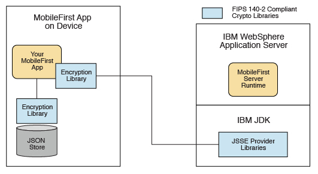

<!-- NLS_CHARSET=UTF-8 -->
## 概述
{: #overview }
{{ site.data.keys.product_full }} 支持联邦桌面核心配置 (FDCC) 和美国政府配置基准 (USGCB) 规范。{{ site.data.keys.product }} 还支持联邦信息处理标准 (FIPS) 140-2，这是用于对加密模块进行授权的安全标准。

#### 跳转至
{: #jump-to }

* [FDCC 和 USGCB 支持](#fdcc-and-usgcb-support)
* [FIPS-140-2-support](#fips-140-2-support)
* [启用 FIPS 140-2](#enabling-fips-140-2)
* [针对 HTTPS 和 JSONStore 加密配置 FIPS 140-2 方式](#configure-fips-140-2-mode-for-https-and-jsonstore-encryption)
* [为现有应用程序配置 FIPS 140-2](#configuring-fips-140-2-for-existing-applications)

## FDCC 和 USGCB 支持
{: #fdcc-and-usgcb-support }
美国联邦政府要求在 Microsoft Windows 平台上运行的联邦机构桌面采用联邦桌面核心配置计划 (FDCC) 或者更新的美国政府配置基线 (USGCB) 安全设置。

IBM Worklight V5.0.6 已通过自我认证流程使用 USGCB 和 FDCC 安全设置进行了测试。测试包括合理级别的测试，以确保安装与核心功能在此配置上可正常运行。

#### 参考资料
{: #references }
有关更多信息，请参阅 [USGCB](http://usgcb.nist.gov/)。

## FIPS 140-2 支持
{: #fips-140-2-support }
联邦信息处理标准 (FIPS) 是美国国家标准技术学会 (NIST) 为联邦政府计算机系统发布的标准和准则。FIPS Publication 140-2 是用于对加密模块进行授权的安全标准。{{ site.data.keys.product }} 为 Android 和 iOS Cordova 应用程序提供 FIPS 140-2 支持。

### {{ site.data.keys.mf_server }} 上的 FIPS 140-2 以及与 {{ site.data.keys.mf_server }} 的 SSL 通信
{: #fips-140-2-on-the-mobilefirst-server-and-ssl-communications-with-the-mobilefirst-server }
{{ site.data.keys.mf_server }} 在诸如 WebSphere Application Server 的应用程序服务器中运行。WebSphere Application Server 可配置为针对入站和出站安全套接字层 (SSL) 连接强制使用经 FIPS 140-2 验证的加密模块。此外，针对应用程序通过使用 Java Cryptography Extension (JCE) 执行的加密操作，也可使用加密模块来完成。由于 {{ site.data.keys.mf_server }} 是在应用程序服务器上运行的应用程序，因此它针对入站和出站 SSL 连接使用经 FIPS 140-2 验证的加密模块。


当 {{ site.data.keys.product_adj }} 客户机建立与 {{ site.data.keys.mf_server }}（在使用 FIPS 140-2 方式的应用程序服务器上运行）的安全套接字层 (SSL) 连接时，结果是成功使用经 FIPS 140-2 核准的密码套件。如果客户机平台不支持某个经 FIPS 140-2 核准的密码套件，那么 SSL 事务将失败，并且客户机无法建立与服务器的 SSL 连接。如果成功，那么客户机会使用经 FIPS 140-2 核准的密码套件。

> **注：**在客户机上使用的加密模块实例不一定是经 FIPS 140-2 验证的。有关在客户机设备上使用 FIPS 140-2 验证的库的选项，请参阅下文。

具体举例来说，当客户机和服务器正在使用相同的密码套件（如 SSL_RSA_WITH_AES_128_CBC_SHA），但是客户机加密模块可能未经过 FIPS 140-2 验证流程，而服务器端正在使用经 FIPS
140-2 认证的模块时，尤其如此。

### {{ site.data.keys.product_adj }} 客户机设备上的 FIPS 140-2，用于保护 JSONStore 中的静态数据和使用 HTTPS 通信时的动态数据
{: #fips-140-2-on-the-mobilefirst-client-device-for-protection-of-data-at-rest-in-jsonstore-and-data-in-motion-when-using-https-communications }
由 {{ site.data.keys.product }} 的 JSONStore 功能提供对客户机设备上的静态数据的保护。
通过在 {{ site.data.keys.product_adj }} 客户机和 {{ site.data.keys.mf_server }} 之间使用 HTTPS 通信来提供对动态数据的保护。


在 iOS 设备上，缺省情况下已针对静态数据和动态数据启用了 FIPS 140-2 支持。

缺省情况下，Android 设备使用未经 FIPS 140-2 验证的库。可以选择将经 FIPS 140-2 验证的库用于保护（加密和解密）JSONStore 存储的本地数据以及与 {{ site.data.keys.mf_server }} 的 HPPTS 通信。可通过使用实现了 FIPS 140-2 验证（证书 #1747）的 OpenSSL 库来实现此支持。要在 {{ site.data.keys.product_adj }} 客户机项目中启用此选项，请添加可选的 Android FIPS 140-2 插件。

**注：**有一些限制需要注意：

* 这一经 FIPS 140-2 验证的方式仅适用于保护（加密）由 JSONStore 功能存储的本地数据以及保护 {{ site.data.keys.product_adj }} 客户端和 {{ site.data.keys.mf_server }} 之间的 HTTPS 通信。
* 该功能仅在 iOS 和 Android 平台上受支持。
    * 在 Android 上，该功能仅在使用 x86 或 armeabi 体系结构的设备或模拟器上受支持。在使用 armv5 或 armv6 体系结构的 Android 上不受支持。原因在于使用的 OpenSSL 库未获取针对 Android 上的 armv5 或 armv6 的 FIPS 140-2 验证。即使 {{ site.data.keys.product_adj }} 库支持 64 位体系结构，FIPS 140-2 在 64 位体系结构上也不受支持。如果项目仅包含 32 位本机 NDK 库，那么 FIPS 140-2 可以在 64 位设备上运行。
    * 在 iOS 上，该功能在 i386、x86_64、armv7、armv7s 和 arm64 体系结构上受支持。
* 此功能只能与混合应用程序一起使用，而不能与本机应用程序一起使用。
* 对于本机 iOS，可通过 iOS FIPS 库启用 FIPS，并且缺省情况下已启用 FIPS。无需执行任何操作来启用 FIPS 140-2。
* 对于 HTTPS 通信：
    * 对于 Android 设备，只有 {{ site.data.keys.product_adj }} 客户机和 {{ site.data.keys.mf_server }} 之间的通信才会使用客户机上的 FIPS 140-2 库。直接连接到其他服务器或服务时不使用 FIPS 140-2 库。
    * {{ site.data.keys.product_adj }} 客户机仅能与运行在受支持环境中的 {{ site.data.keys.mf_server }} 通信，这些都已列入[系统需求](http://www-01.ibm.com/support/docview.wss?uid=swg27024838)中。如果 {{ site.data.keys.mf_server }} 运行在不受支持的环境中，HTTPS 连接可能失败，并出现“密钥尺寸过小”错误。此错误不会发生在 HTTP 通信中。
* {{ site.data.keys.mf_app_center_full }}
客户机不支持 FIPS 140-2 功能。

如果之前做过该教程中描述的更改，那么必须先保存任何其他特定于环境的更改，再删除并重新创建 Android 或 iOS 环境。



> 有关 JSONStore 的更多信息，请参阅 [JSONStore 概述](../../application-development/jsonstore)。

## 参考资料
{: #references-1 }
有关在 WebSphere Application Server 中如何启用 FIPS 140-2 方式的信息，请参阅[联邦信息处理标准支持](http://ibm.biz/knowctr#SSAW57_8.5.5/com.ibm.websphere.nd.multiplatform.doc/ae/rovr_fips.html)。

对于 WebSphere Application Server Liberty Profile，管理控制台中未提供任何选项来启用 FIPS 140-2 方式。但是，可通过将 Java™ 运行时环境配置为使用经 FIPS 140-2 验证的模块来启用 FIPS 140-2。有关更多信息，请参阅 Java Secure Socket Extension (JSSE) IBMJSSE2 Provider Reference Guide。

## 启用 FIPS 140-2
{: #enabling-fips-140-2 }
在 iOS 设备上，缺省情况下已针对静态数据和动态数据启用了 FIPS 140-2 支持。  
对于 Android 设备，请添加 `cordova-plugin-mfp-fips` Corodva 插件。

添加之后，此功能适用于 HTTPS 和 JSONStore 数据加密。

**注：** 

* FIPS 140-2 仅在 Android 和 iOS 上受支持。支持 FIPS 140-2 的 iOS 体系结构为 i386、armv7、armv7s、x86_64 和 arm64。支持 FIPS 140-2 的 Android 体系结构为 x86 和 armeambi。
* 在 Android 上，即使 {{ site.data.keys.product_adj }} 库支持 64 位体系结构，FIPS 140-2 在 64 位体系结构上也不受支持。在 64 位设备上使用 FIPS 140-2 时，您可能看到以下错误：
 
        
```bash
java.lang.UnsatisfiedLinkError: dlopen failed: "..." is 32-bit instead of 64-bit
```

该错误表示在 Android 项目中有 64 位本机库，目前使用这些库时 FIPS 140-2 未工作。要确认，请转至 Android 项目下的 src/main/libs 或 src/main/jniLibs，检查是否有 x86_64 或 arm64-v8a 文件夹。如果有这些文件夹，请将其删除，然后 FIPS 140-2 就可以重新工作了。

## 针对 HTTPS 和 JSONStore 加密配置 FIPS 140-2 方式
{: #configure-fips-140-2-mode-for-https-and-jsonstore-encryption }
对于 iOS 应用程序，通过 iOS FIPS 库启用 FIPS 140-2。缺省情况下已启用此功能，因此无需执行任何操作来将其启用或对其进行配置。

以下代码片段将填入针对 Android 操作系统的 index.js 内 initOptions 对象中的新 {{ site.data.keys.product_adj }} 应用程序中，以用于配置 FIPS 140-2：

```javascript
var wlInitOptions = {
  ...
  // # Enable FIPS 140-2 for data-in-motion (network) and data-at-rest (JSONStore) on Android.
//   Requires the FIPS 140-2 optional feature to be enabled also.
// enableFIPS : false
  ...
};
```

对于 Android 操作系统，**enableFIPS** 的缺省值为 `false`。要针对 HTTPS 和 JSONStore 数据加密启用 FIPS 140-2，请取消注释并将该选项设置为 `true`。将 **enableFIPS** 的值设置为 `true` 之后，应该通过创建类似如下样本的侦听事件来侦听 FIPS 就绪型 JavaScript 事件：

```javascript
document.addEventListener('WL/FIPS/READY', 
    this.onFipsReady, false);

onFipsReady: function() {
// FIPS SDK is loaded and ready
}
```

设置 **enableFIPS** 属性的值之后，重新构建 Android 平台。

**注：**必须在将 enableFIPS 属性值设置为 true 之前安装 FIPS Cordova 插件。否则，将记录一条警告消息，表明已设置 initOption 值但未找到该可选功能。在 Android 操作系统上，FIPS 140-2 和 JSONStore 功能都是可选的。仅在同时启用 JSONStore  可选功能的情况下，FIPS 140-2 才会影响 JSONStore 数据加密。
如果未启用 JSONStore，那么 FIPS 140-2 不会影响 JSONStore。
在 iOS 中，JSONStore FIPS 140-2（静态数据）或 HTTPS 加密（动态数据）都不需要 FIPS 140-2 可选功能，因为这些数据均由 iOS 处理。在 Android 中，如果要使用 JSONStore FIPS 140-2 或 HTTPS 加密，那么必须启用 FIPS 140-2 可选功能。

```bash
[WARN] FIPSHttp feature not found, but initOptions enables it on startup
```

## 为现有应用程序配置 FIPS 140-2
{: #configuring-fips-140-2-for-existing-applications }
缺省情况下，在针对任何 Android 操作系统版本创建的应用程序以及低于 V8.0 的 {{ site.data.keys.product_full }} 版本中的 iOS 应用程序上，未启用 FIPS 140-2 可选功能。要针对 Android 操作系统启用 FIPS 140-2 可选功能，请参阅“启用 FIPS 140-2”。启用该可选功能之后，您可配置 FIPS 140-2。

完成“启用 FIPS 140-2”中所述的步骤之后，您必须通过在 index.js 文件中修改 initOptions 对象以添加 FIPS 配置属性，来配置 FIPS 140-2。

**注：**FIPS 140-2 功能（与 JSONStore 功能组合在一起）可对 JSONStore 启用 FIPS 140-2 支持。该组合取代在教程“JSONStore - 使用 FIPS 140-2 加密敏感数据”中指出的内容，该教程可用于 IBM Worklight V6.0 或更早版本。如果您之前通过遵循该教程中的指示信息修改过应用程序，请删除并重新创建其 iPhone、iPad 和 Android 环境。因为当删除环境时先前任何特定于环境的更改将会丢失，所以请确保在删除任何环境之前对此类更改进行备份。重新创建环境之后，您可将这些更改重新应用到新环境中。

将以下属性添加到 index.js 文件中的 initOptions 对象中。

```javascript
enableFIPS : true
```

重新构建 Android 平台。
