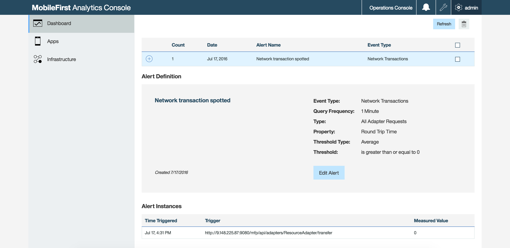

<!-- NLS_CHARSET=UTF-8 -->
## 概述
{: #overview }

警报提供一种主动方式来监控移动应用程序的运行状况，无需定期检查 {{ site.data.keys.mf_analytics_console_full }}。  
您可以在 {{ site.data.keys.mf_analytics_console }} 中设置响应式阈值，以在满足特定条件时触发警报。

您可以在广泛级别（特定应用程序）或在详细级别（特定应用程序实例或设备）设置阈值。警报通知可配置为显示在 {{ site.data.keys.mf_analytics_console_short }} 中，并且也可以发送至预配置的 REST 端点或定制 webhook。

在触发警报后，**警报**图标（位于 {{ site.data.keys.mf_analytics_console_short }} 的标题栏中）将用红色显示警报计数 ()。单击**警报**图标以查看警报。

提供了用户分发警报的备选方法。

**先决条件：**确保 {{ site.data.keys.mf_analytics_server }} 已启动并准备好接收客户机日志。

## 警报管理
{: #alert-management }

### 创建警报
{: #creating-an-alert }

在 {{ site.data.keys.mf_analytics_console }} 中：

1. 选择**仪表板→警报管理**选项卡。单击**创建警报**按钮。


   

2. 提供下列值：警报名称、消息、查询频率和事件类型。根据事件类型，使用相应的值填充显示的其他文本框。
3. 在输入所有值之后，单击**下一步**。将显示**分发方法**选项卡。

### “分发方法”选项卡
{: #distribution-method-tab }

缺省情况下，警报将显示在 {{ site.data.keys.mf_analytics_console_short }} 中。

您还可以通过选择 **Analytics Console 和网络发布**选项，将 POST 消息和 JSON 有效内容一起发送到 {{ site.data.keys.mf_analytics_console_short }} 和定制 URL。

如果选择此选项，那么以下字段可用：


* 网络发布 URL（*必需*）
* 标题（*可选*）
* 认证类型（*必需*）


## 定制 web hook
{: #custom-web-hook }

您可以设置用于警报的定制分发方法。例如：定义触发警报阈值后将有效内容发送至的 web hook。

示例有效内容：

```json
{
  "timestamp": 1442848504431,
  "condition": {"value":5.0,"operator":"GTE"},
  "value": "CRASH",
  "offenders": [
    { "XXX 1.0": 5.0 },
    { "XXX 2.0": 1.0 }
  ],
  "property":"closedBy",
  "eventType":"MfpAppSession",
  "title":" Crash Count Alert for Application ABC",
  "message": "The crash count for a application ABC exceeded XYZ.
    View the Crash Summary table in the Crashes tab in the Apps
    section of the MobileFirst Analytics Console
    to see a detailed stacktrace of this crash instance."
}
```

POST 请求包含以下属性：

* **timestamp** - 创建警报通知的时间。
* **condition** - 用户设置的阈值（例如，大于或等于 5）。
* **eventType** - 查询的 eventType。
* **property** - 查询的 eventType 的属性。
* **value** - 查询的属性的值。
* **offenders** - 触发警报的应用程序或设备列表。
* **title** - 用户定义的标题。
* **message** - 用户定义的消息。

## 查看警报详细信息
{: #viewing-alert-details }

可以从 {{ site.data.keys.mf_analytics_console }} 中的**仪表板→警报日志**查看警报详细信息。


单击 **+** 图标以获取任何可用的入局警报。该操作会显示**警报定义**和**警报实例**部分。下图显示了“警报定义”和“警报实例”部分：


