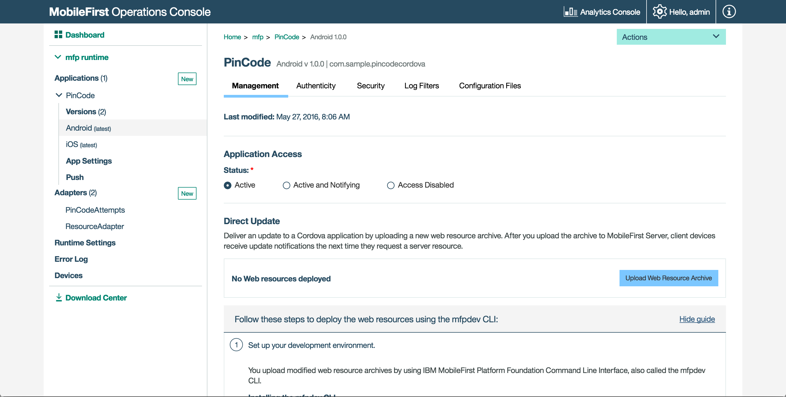

<!-- NLS_CHARSET=UTF-8 -->
## 概述
{: #overview }
通过直接更新，可利用刷新的 Web 资源（例如，已更改、已修订或新的应用逻辑 (JavaScript)、HTML、CSS 或图像）无线更新 Cordova 应用程序。 因此，组织能够确保最终用户总是使用最新版本的应用程序。

为了更新应用程序，需要打包更新后的应用程序 Web 资源并使用 {{ site.data.keys.mf_cli }} 或者通过部署生成的归档文件上载到 {{ site.data.keys.mf_server }}。 然后将自动激活直接更新。激活后，将在受保护资源的每个请求上实施。

**受支持的 Cordova 平台**  
在 Cordova iOS 和 Cordova Android 平台中支持直接更新。

**开发、测试和生产中的直接更新**  
对于开发和测试之目的，开发人员通常通过简单将归档上载到开发服务器来使用直接更新。 虽然此过程易于实施，但是并不十分安全。 对于此阶段，将使用从嵌入式 {{ site.data.keys.product_adj }} 自签名证书抽取的内部 RSA 密钥对。

但是，对于实际生产甚或预生产测试阶段，强烈建议先实施安全直接更新，然后再将应用程序发布到应用商店。 安全直接更新需要从实际 CA 签名服务器证书抽取的 RSA 密钥对。

**注：**请注意，不要在发布应用程序后修改密钥库配置，如果未使用新的公用密钥重新配置应用程序和重新发布应用程序，那么将不再对下载的更新进行认证。 如果不执行这两个步骤，客户机上的直接更新将失败。

> 在[安全直接更新](#secure-direct-update)中了解更多信息。

**直接更新数据传输速率**  
在最佳情况下，单个 {{ site.data.keys.mf_server }} 可按 250 MB/秒的速率将数据推送到客户机。 如果需要更高的速率，请考虑集群或 CDN 服务。  

> 在[从 CDN 处理直接更新请求](cdn-support)中了解更多信息

### 注意
{: #notes }

* 直接更新仅更新应用程序的 Web 资源。 要更新本机资源，必须向各自的应用商店提交新的应用程序版本。
* 在使用直接更新功能且启用了 [Web 资源校验和](../cordova-apps/securing-apps/#enabling-the-web-resources-checksum-feature)功能时，将随每个直接更新建立一个新的校验和基准。
* 如果已使用修订包升级 {{ site.data.keys.mf_server }}，那么它继续正确地处理直接更新。 但是，如果上载了最近构建的直接更新归档（.zip 文件），那么可能停止对较旧客户机的更新。 原因是归档包含 cordova-plugin-mfp 插件版本。 在向移动客户机提供此归档之前，服务器将客户机版本与插件版本进行比较。 如果两个版本足够接近（意味着三个最高位数字相同），那么直接更新照常进行。 否则，{{ site.data.keys.mf_server }} 以静默方式跳过更新。 版本不匹配的一个解决方案是下载版本与原始 Cordova 项目中的版本相同的 cordova-plugin-mfp，并重新生成直接更新归档。

#### 跳转至：
{: #jump-to}

- [直接更新的运作方式](#how-direct-update-works)
- [创建和部署更新的 Web 资源](#creating-and-deploying-updated-web-resources)
- [用户体验](#user-experience)
- [定制直接更新 UI](#customizing-the-direct-update-ui)
- [增量和完全直接更新](#delta-and-full-direct-update)
- [安全直接更新](#secure-direct-update)
- [样本应用程序](#sample-application)

## 直接更新的运作方式
{: #how-direct-update-works }
应用程序 Web 资源最初与应用程序打包在一起，确保第一个脱机可用性。 之后，应用程序检查 {{ site.data.keys.mf_server }} 的每个请求上的更新。

> <span class="glyphicon glyphicon-exclamation-sign" aria-hidden="true"></span> **注：**在执行直接更新后，将在 60 分钟后再次进行检查。

在直接更新后，应用程序不再使用预先打包的 Web 资源。 而是使用从应用程序沙箱下载的 Web 资源。 如果将清除设备上的应用程序高速缓存，那么将再次使用原始打包的 Web 资源。


### 版本控制
{: #versioning }
直接更新仅应用于特定版本。 换句话说，针对 V2.0 的应用程序生成的更新无法应用于不同版本的相同应用程序。

## 创建和部署更新的 Web 资源
{: #creating-and-deploying-updated-web-resources }
在完成新 Web 资源工作（例如，错误修复或细微更改等）后，需要打包更新的 Web 资源并上载到 {{ site.data.keys.mf_server }}。

1. 打开**命令行**窗口并浏览至 Cordova 项目的根文件夹。
2. 运行命令：`mfpdev app webupdate`。

`mfpdev app webupdate` 命令将更新的 Web 资源打包为一个 .zip 文件并将其上载到在开发人员工作站中运行的缺省 {{ site.data.keys.mf_server }}。 可在 **[cordova-project-root-folder]/mobilefirst/** 文件夹中找到打包的 Web 资源。

备用：

* 构建 .zip 文件并将其上载到不同的 {{ site.data.keys.mf_server }}：`mfpdev app webupdate [server-name] [runtime-name]`。 例如：

  ```bash
  mfpdev app webupdate myQAServer MyBankApps
  ```

* 上载先前生成的 .zip 文件：`mfpdev app webupdate [server-name] [runtime-name] --file [path-to-packaged-web-resources]`。 例如：

  ```bash
  mfpdev app webupdate myQAServer MyBankApps --file mobilefirst/ios/com.mfp.myBankApp-1.0.1.zip
  ```

* 手动将打包的 Web 资源上载到 {{ site.data.keys.mf_server }}：
 1. 构建 .zip 文件而不上载：

    ```bash
    mfpdev app webupdate --build
    ```
 2. 装入 {{ site.data.keys.mf_console }}，然后单击应用程序条目。
 3. 单击**上载 Web 资源文件**以上载打包的 Web 资源。

    

> 运行命令 `mfpdev help app webupdate` 以了解更多信息。

## 用户体验
{: #user-experience }
缺省情况下，在收到直接更新后，将显示一个对话框并询问用户是否开始更新过程。 在用户核准后，将显示一个进度条对话框，并下载 Web 资源。 在更新完成后将自动重新装入应用程序。


## 定制直接更新 UI
{: #customizing-the-direct-update-ui }
可定制向最终用户显示的缺省直接更新 UI。  
在 **index.js** 的 `wlCommonInit()` 函数中添加以下代码：

```javascript
wl_DirectUpdateChallengeHandler.handleDirectUpdate = function(directUpdateData, directUpdateContext) {
    // Implement custom Direct Update logic
};
```

- `directUpdateData` - 包含 `downloadSize` 属性的 JSON 对象，其表示要从 {{ site.data.keys.mf_server }} 下载的更新软件包的文件大小（字节）。
- `directUpdateContext` - 公开 `.start()` 和 `.stop()` 函数的 JavaScript 对象，用于启动和停止直接更新流程。

如果 {{ site.data.keys.mf_server }} 上的 Web 资源比应用程序中的 Web 资源新，那么会将直接更新验证问题数据添加到服务器响应。 在 {{ site.data.keys.product_adj }} 客户机端框架检测到此直接更新验证问题时，任何时候它都会调用 `wl_directUpdateChallengeHandler.handleDirectUpdate` 函数。

此函数提供缺省直接更新设计：在直接更新可用时显示的缺省消息对话框和初始化直接更新过程时显示的缺省进度屏幕。 您可以通过覆盖此函数并实施自己的逻辑来实施定制直接更新用户界面行为或定制直接更新对话框。


在以下示例代码中，`handleDirectUpdate` 函数在直接更新对话框中实施定制消息。 将此代码添加到 Cordova 项目的 **www/js/index.js** 文件。  
定制的直接更新 UI 的其他示例：

- 使用第三方 JavaScript 框架创建的对话框（例如，Dojo、jQuery Mobile 或 Ionic ...）
- 通过执行 Cordova 插件的完全本机 UI
- 向用户提供选项的备用 HTML
- 等等...

```javascript
wl_directUpdateChallengeHandler.handleDirectUpdate = function(directUpdateData, directUpdateContext){        
    navigator.notification.confirm(  // Creates a dialog.
        'Custom dialog body text',
        // Handle dialog buttons.
          directUpdateContext.start();
        },
        'Custom dialog title text',
        ['Update']
    );
};
```

任何时候用户单击对话框按钮，都可通过运行 `directUpdateContext.start()` 方法来启动直接更新过程。 此时将显示与先前版本的 {{ site.data.keys.mf_server }} 类似的缺省进度屏幕。

此方法支持以下类型的调用：

* 在不指定任何参数时，{{ site.data.keys.mf_server }} 使用缺省进度屏幕。
* 如果提供侦听器函数（例如，`directUpdateContext.start(directUpdateCustomListener)`），那么在进程向侦听器发送生命周期事件时，直接更新进程将在后台运行。 定制侦听器必须实现以下方法：

```javascript
var  directUpdateCustomListener  = {
    onStart : function ( totalSize ){ },
    onProgress : function ( status , totalSize , completedSize ){ },
    onFinish : function ( status ){ }
};
```

在直接更新进程期间，根据以下规则启动侦听器方法：
* 使用包含更新文件大小的 `totalSize` 参数调用 `onStart`。
* 多次调用 `onProgress`，状态为 `DOWNLOAD_IN_PROGRESS`、`totalSize` 和 `completedSize`（迄今为止下载的卷）。
* 调用 `onProgress`，状态为 `UNZIP_IN_PROGRESS`。
* 调用 `onFinish`，具有以下最终状态码之一：

| 状态码 | 描述 |
|-------------|-------------|
| `SUCCESS` | 完成直接更新，不含任何错误。 |
| `CANCELED` | 已取消直接更新（例如，因为已调用 `stop()` 方法）。 |
| `FAILURE_NETWORK_PROBLEM` | 更新期间网络连接存在问题。 |
| `FAILURE_DOWNLOADING` | 未完整下载该文件。 |
| `FAILURE_NOT_ENOUGH_SPACE` | 设备上没有足够的空间用于下载并解压缩更新文件。 |
| `FAILURE_UNZIPPING` | 解压缩更新文件期间出现问题。 |
| `FAILURE_ALREADY_IN_PROGRESS` | 已运行直接更新时，调用了 start 方法。 |
| `FAILURE_INTEGRITY` | 无法验证更新文件的真实性。 |
| `FAILURE_UNKNOWN` | 发生意外的内部错误。 |

如果实现定制的直接更新侦听器，必须确保当直接更新进程已完成并且已调用 `onFinish()` 方法时，将重新装入该应用程序。 如果直接更新进程未能成功完成，那么还必须调用 `wl_directUpdateChalengeHandler.submitFailure()`。

以下示例显示定制的直接更新侦听器的实现：

```javascript
var directUpdateCustomListener = {
  onStart: function(totalSize){
    //show custom progress dialog
  },
  onProgress: function(status,totalSize,completedSize){
    //update custom progress dialog
  },
  onFinish: function(status){

    if (status == 'SUCCESS'){
      //show success message
      WL.Client.reloadApp();
    }
    else {
      //show custom error message

      //submitFailure must be called is case of error
      wl_directUpdateChallengeHandler.submitFailure();
    }
  }
};

wl_directUpdateChallengeHandler.handleDirectUpdate = function(directUpdateData, directUpdateContext){

  WL.SimpleDialog.show('Update Avalible', 'Press update button to download version 2.0', [{
    text : 'update',
    handler : function() {
      directUpdateContext.start(directUpdateCustomListener);
    }
  }]);
};
```

### 场景：运行无 UI 的直接更新
{: #scenario-running-ui-less-direct-updates }
{{ site.data.keys.product_full }} 支持在前台运行应用程序时进行无 UI 的直接更新。

要运行无 UI 的直接更新，请实施 `directUpdateCustomListener`。 向 `onStart` 和 `onProgress` 方法提供空的函数实现。 空的实现会导致在后台运行直接更新进程。

要完成直接更新进程，必须重新装入该应用程序。 提供了以下选项：
* `onFinish` 方法也可以为空。 在此情况下，重新启动应用程序后将应用直接更新。
* 您可以实现定制对话框，通知或要求用户重新启动该应用程序。 （请参阅以下示例。）
* `onFinish` 方法可通过调用 `WL.Client.reloadApp()` 来强制重新装入该应用程序。

以下是 `directUpdateCustomListener` 的实现示例：

```javascript
var directUpdateCustomListener = {
  onStart: function(totalSize){
  },
  onProgress: function(status,totalSize,completeSize){
  },
  onFinish: function(status){
    WL.SimpleDialog.show('New Update Available', 'Press reload button to update to new version', [ {
      text : WL.ClientMessages.reload,
      handler : WL.Client.reloadApp
    }]);
  }
};
```

实现 `wl_directUpdateChallengeHandler.handleDirectUpdate` 函数。 将您已创建的 `directUpdateCustomListener` 实现作为参数传递至该函数。 确保已调用 `directUpdateContext.start(directUpdateCustomListener`)。 以下是 `wl_directUpdateChallengeHandler.handleDirectUpdate` 实现示例：

```javascript
wl_directUpdateChallengeHandler.handleDirectUpdate = function(directUpdateData, directUpdateContext){

  directUpdateContext.start(directUpdateCustomListener);
};
```

**注：**在将应用程序发送到后台时，将暂挂直接更新过程。

### 场景：处理直接更新失败情况
{: #scenario-handling-a-direct-update-failure }
此场景显示了如何处理由连接中断等问题可能导致的直接更新失败情况。 在此场景中，会阻止用户使用应用程序，甚至是在脱机方式下。 显示了一个对话框，为用户提供重试选项。

创建一个全局变量以存储直接更新上下文，以便稍后在直接更新进程失败时可使用该上下文。 例如：

```javascript
var savedDirectUpdateContext;
```

实现直接更新验证问题处理程序。 在此处保存直接更新上下文。 例如：

```javascript
wl_directUpdateChallengeHandler.handleDirectUpdate = function(directUpdateData, directUpdateContext){

  savedDirectUpdateContext = directUpdateContext; // save direct update context

  var downloadSizeInMB = (directUpdateData.downloadSize / 1048576).toFixed(1).replace(".", WL.App.getDecimalSeparator());
  var directUpdateMsg = WL.Utils.formatString(WL.ClientMessages.directUpdateNotificationMessage, downloadSizeInMB);

  WL.SimpleDialog.show(WL.ClientMessages.directUpdateNotificationTitle, directUpdateMsg, [{
    text : WL.ClientMessages.update,
    handler : function() {
      directUpdateContext.start(directUpdateCustomListener);
    }
  }]);
};
```

创建一个函数，此函数使用直接更新上下文来启动直接更新进程。 例如：

```javascript
restartDirectUpdate = function () {
  savedDirectUpdateContext.start(directUpdateCustomListener); // use saved direct update context to restart direct update
};
```

实现 `directUpdateCustomListener`。 在 `onFinish` 方法中添加状态检查。 如果状态以“FAILURE”开头，请使用选项“重试”打开仅模态对话框。 例如：

```javascript
var directUpdateCustomListener = {
  onStart: function(totalSize){
    alert('onStart: totalSize = ' + totalSize + 'Byte');
  },
  onProgress: function(status,totalSize,completeSize){
    alert('onProgress: status = ' + status + ' completeSize = ' + completeSize + 'Byte');
  },
  onFinish: function(status){
    alert('onFinish: status = ' + status);
    var pos = status.indexOf("FAILURE");
    if (pos > -1) {
      WL.SimpleDialog.show('Update Failed', 'Press try again button', [ {
        text : "Try Again",
        handler : restartDirectUpdate // restart direct update
      }]);
    }
  }
};
```

当用户单击**重试**按钮时，该应用程序将重新启动直接更新进程。

## 增量和完全直接更新
{: #delta-and-full-direct-update }
增量直接更新支持应用程序仅下载自上次更新以来更改的文件，而不是应用程序的整个 Web 资源。 这可减少下载时间、节约带宽并提高整体用户体验。

> <span class="glyphicon glyphicon-exclamation-sign" aria-hidden="true"></span> **重要信息：**仅在客户机应用程序的 Web 资源是当前在服务器上部署的应用程序之后的一个版本时，**增量更新**才可用。 在当前已部署的应用程序之后有多个版本（意味着自更新客户机应用程序以后至少将应用程序部署到服务器两次）的客户机应用程序接收**完全更新**（意外着将下载和更新整个 Web 资源）。

## 安全直接更新
{: #secure-direct-update }
缺省情况下禁用安全直接更新，此类直接更新将阻止第三方攻击者更改从 {{ site.data.keys.mf_server }}（或来自内容交付网络 (CDN))）传输到客户机应用程序的 Web 资源。

**要启用直接更新真实性：**  
使用首选工具，从 {{ site.data.keys.mf_server }} 密钥库抽取公用密钥并将其转换为 base64。  
然后，应按如下所示使用生成的值：

1. 打开**命令行**窗口并浏览至 Cordova 项目的根文件夹。
2. 运行命令 `mfpdev app config` 并选择“直接更新真实性公用密钥”选项。
3. 提供公用密钥并确认。

直接更新真实性将保护未来到客户机应用程序的任何直接更新交付。

> 要使用更新的密钥库文件配置应用程序服务器，请参阅[实施安全直接更新](secure-direct-update)

## 示例应用程序
{: #sample-application }
[单击以下载](https://github.com/MobileFirst-Platform-Developer-Center/CustomDirectUpdate/tree/release80) Cordova 项目。  

### 样本用法
{: #sample-usage }
遵循样本的 README.md 文件以获取指示信息。
