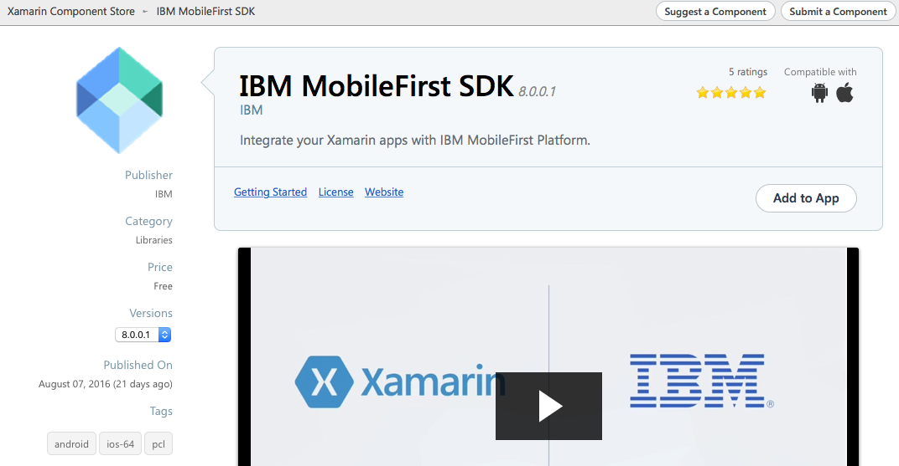

<!-- NLS_CHARSET=UTF-8 -->
## 概述
{: #overview }
{{ site.data.keys.product }} SDK 包含通过 [Xamarin 组件库](https://components.xamarin.com/)提供并且可添加到 Xamarin 项目的依赖项集合。  
pod 与核心函数和其他函数对应：

* **MobileFirst.Xamarin** - 实现客户机到服务器连接，并处理认证和安全方面、资源请求和其他必需的核心函数。
* **MobileFirst.JSONStore** - 包含 JSONStore 框架。  
* **MobileFirst.Push** - 包含推送通知框架。有关更多信息，请查看[通知教程](../../../notifications/)。

在此教程中，了解如何使用 Xamarin 组件库将 {{ site.data.keys.product_adj }} 本机 SDK 添加到新的或现有的 Xamarin Android 或 iOS 应用程序。您还可以了解如何配置 {{ site.data.keys.mf_server }} 以识别应用程序。

**先决条件：**

- Xamarin Studio 已安装在开发人员工作站上。  
- {{ site.data.keys.mf_server }} 的本地或远程实例正在运行。
- 阅读[设置您的 {{ site.data.keys.product_adj }} 开发环境](../../../installation-configuration/development/)和[设置您的 Xamarin 开发环境](../../../installation-configuration/development/xamarin/)教程。

#### 跳转至：
{: #jump-to }
- [添加 {{ site.data.keys.product_adj }} 本机 SDK](#adding-the-mobilefirst-native-sdk)
- [更新 {{ site.data.keys.product_adj }} 本机 SDK](#updating-the-mobilefirst-native-sdk)
- [接下来要学习的教程](#tutorials-to-follow-next)

## 添加 {{ site.data.keys.product_adj }} 本机 SDK
{: #adding-the-mobilefirst-native-sdk }
遵循下面的指示信息将 {{ site.data.keys.product_adj }} 本机 SDK 添加到新的或现有的 Xcode 项目，以将应用程序注册到 {{ site.data.keys.mf_server }}。

在您开始之前，确保 {{ site.data.keys.mf_server }} 正在运行。  
如果使用本地安装的服务器：从**命令行**窗口，浏览至服务器的文件夹，然后运行命令：`./run.sh`。

### 创建应用程序
{: #creating-an-application }
使用 Xamarin Studio 或 Visual Studio 创建 Xamarin 解决方案，或者使用现有的 Xamarin 解决方案。

### 添加 SDK
{: #adding-the-sdk }
1. 通过 Xamarin 组件库提供 {{ site.data.keys.product_adj }} 本机 SDK。
2. 展开 Android 或 iOS 项目。
3. 在 Android 或 iOS 项目中，右键单击**组件**。
4. 选择**获取更多组件**。
5. 搜索 **IBM MobileFirst SDK**。选择并执行**添加到应用程序**操作。
6. 右键单击**软件包**，然后选择**添加软件包**。搜索并添加 **Json.NET**。这将从 Nuget 中提取 Newtonsoft 依赖关系。需要对 Android 和 iOS 项目单独执行此操作。
7. 右键单击**引用**并选择**编辑引用**。转至 **.Net 组合件**选项卡，然后单击“浏览”。从项目文件夹的根目录转至`组件 -> ibm-worklight-8.0.0.1 -> lib -> pcl`。选择 **Worklight.Core.dll**。

### 注册应用程序
{: #registering-the-application }
1. 装入 {{ site.data.keys.mf_console }}。
2. 单击“应用程序”旁边的“新建”按钮以注册新应用程序并遵循屏幕上的指示信息。
3. 必须分别注册 Android 和 iOS 应用程序。这将确保 Android 应用程序和 iOS 应用程序都可以成功连接到服务器。可以分别在 `AndroidManifest.xml` 和 `Info.plist` 中找到 Android 和 iOS 应用程序的注册详细信息。
3. 注册应用程序之后，浏览至应用程序的“配置文件”选项卡，然后复制或下载 mfpclient.plist 和 mfpclient.properties 文件。遵循屏幕上指示信息将此文件添加到您的项目。

### 完成设置过程
{: #completing-the-setup-process }
#### mfpclient.plist
{: #complete-setup-mfpclientplist }
1. 右键单击 Xamarin iOS 项目并选择**添加文件...**。浏览并找到项目根目录的 `mfpclient.plist`。在提示时选择**将文件复制到项目**。
2. 右键单击 `mfpclient.plist` 文件并选择**构建操作**。选择**内容**。

#### mfpclient.properties
{: #mfpclientproperties }
1. 右键单击 Xamarin Android 项目的*资产*文件夹并选择**添加文件...**。浏览并找到文件夹中的 `mfpclient.properties`。在提示时选择**将文件复制到项目**。
2. 右键单击 `mfpclient.properties` 文件并选择**构建操作**。选择 **Android 资产**。

### 参考 SDK
{: #referencing-the-sdk }
无论何时您想要使用 {{ site.data.keys.product_adj }} 本机 SDK，都请确保导入 {{ site.data.keys.product }} 框架：

CommonProject：

```csharp
using Worklight;
```

iOS：

```csharp
using MobileFirst.Xamarin.iOS;
```

Android：

```csharp
using Worklight.Xamarin.Android;
```

## 更新 {{ site.data.keys.product_adj }} 本机 SDK
{: #updating-the-mobilefirst-native-sdk }
要使用最新发行版更新 {{ site.data.keys.product_adj }} 本机 SDK，请通过 Xamarin 组件库更新 SDK 的版本。

## 已生成 {{ site.data.keys.product_adj }} 本机 SDK 工件
{: #generated-mobilefirst-native-sdk-artifacts }
### mfpclient.plist
{: #mfpclientplist }
此文件定义用于在 {{ site.data.keys.mf_server }} 上注册 iOS 应用程序的客户机端属性。

| 属性            | 描述                                                         | 示例值 |
|---------------------|---------------------------------------------------------------------|----------------|
| protocol    | 与
{{ site.data.keys.mf_server }}
的通信协议。             | http 或 https  |
| host        | {{ site.data.keys.mf_server }} 的主机名。                            | 192.168.1.63   |
| port        | {{ site.data.keys.mf_server }} 的端口。
                                 | 9080           |
| wlServerContext     | {{ site.data.keys.mf_server }} 上应用程序的上下文根路径。 | /mfp/          |
| languagePreferences | 为客户机 sdk 系统消息设置缺省语言。           | zh             |

## 接下来要学习的教程
{: #tutorials-to-follow-next }
集成 {{ site.data.keys.product_adj }} 本机 SDK 之后，您现在可以：

- 查看[适配器开发教程](../../../adapters/)
- 查看[认证和安全教程](../../../authentication-and-security/)
- 查看[通知教程](../../../notifications/)
- 查看[所有教程](../../../all-tutorials)
