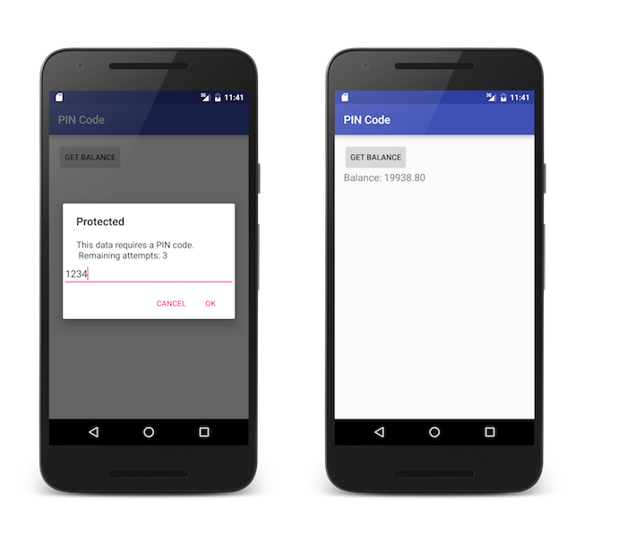

<!-- NLS_CHARSET=UTF-8 -->
## 概述
{: #overview }
在尝试访问受保护资源时，服务器（安全性检查）会向客户机发回一个列表，其中包含一个或多个**验证问题**，供客户机处理。  
该列表会作为 `JSON` 对象接收，列出安全性检查名称以及其他数据的可选 `JSON`：

```json
{
  "challenges": {
    "SomeSecurityCheck1":null,
    "SomeSecurityCheck2":{
      "some property": "some value"
    }
  }
}
```

然后，客户机必须为每项安全性检查注册**验证问题处理程序**。  
验证问题处理程序可定义特定于安全性检查的客户机端行为。

## 创建验证问题处理程序
{: #creating-the-challenge-handler }
验证问题处理程序是可处理 {{ site.data.keys.mf_server }} 发送的验证问题的类，如显示登录屏幕、收集凭证和将其提交回安全性检查。

在此示例中，安全性检查为 `PinCodeAttempts`，在[实现 CredentialsValidationSecurityCheck](../security-check) 中定义。 此安全性检查发送的验证问题包含剩余登录尝试次数 (`remainingAttempts`) 以及可选 `errorMsg`。

创建可扩展 `SecurityCheckChallengeHandler` 的 Java 类：

```java
public class PinCodeChallengeHandler extends SecurityCheckChallengeHandler {

}
```

## 处理验证问题
{: #handling-the-challenge }
`SecurityCheckChallengeHandler` 协议的最低要求是实现构造方法和 `handleChallenge` 方法，这会提示用户提供凭证。 `handleChallenge` 方法会接收作为 `JSONObject` 的验证问题。

添加构造方法：

```java
public PinCodeChallengeHandler(String securityCheck) {
    super(securityCheck);
}
```

在此 `handleChallenge` 示例中，警报会提示用户输入 PIN 码：

```java
@Override
public void handleChallenge(JSONObject jsonObject) {
    Log.d("Handle Challenge", jsonObject.toString());
    Log.d("Failure", jsonObject.toString());
    Intent intent = new Intent();
    intent.setAction(Constants.ACTION_ALERT_MSG);
    try{
        if (jsonObject.isNull("errorMsg")){
            intent.putExtra("msg", "This data requires a PIN code.\n Remaining attempts: " + jsonObject.getString("remainingAttempts"));
            broadcastManager.sendBroadcast(intent);
        } else {
            intent.putExtra("msg", jsonObject.getString("errorMsg") + "\nRemaining attempts: " + jsonObject.getString("remainingAttempts"));
            broadcastManager.sendBroadcast(intent);
        }
    } catch (JSONException e) {
        e.printStackTrace();
    }
}

```

> 样本应用程序中包含 `alertMsg` 的实现。

如果凭证不正确，那么预计框架会再次调用 `handleChallenge`。

## 提交验证问题的答案
{: #submitting-the-challenges-answer }
一旦从 UI 收集了凭证，便使用 `SecurityCheckChallengeHandler` 的 `submitChallengeAnswer(JSONObject answer)` 方法将答案发送回安全性检查。 在此示例中，`PinCodeAttempts` 预期有一个名为 `pin` 且包含提交的 PIN 码的属性：

```java
submitChallengeAnswer(new JSONObject().put("pin", pinCodeTxt.getText()));
```

## 取消验证问题
{: #cancelling-the-challenge }
在某些情况下（如单击 UI 中的**取消**按钮），您想要通知框架完全丢弃此验证问题。

为此，请使用 `SecurityCheckChallengeHandler` 的 `cancel()` 方法。

## 处理故障
{: #handling-failures }
某些场景可能会触发故障（如达到最大尝试次数）。 要处理这些场景，请实现 `SecurityCheckChallengeHandler` 的 `handleFailure` 方法。  
作为参数传递的 `JSONObject` 的结构很大程度上取决于故障性质。

```java
@Override
public void handleFailure(JSONObject jsonObject) {
    Log.d("Failure", jsonObject.toString());
    Intent intent = new Intent();
    intent.setAction(Constants.ACTION_ALERT_ERROR);
    try {
        if (!jsonObject.isNull("failure")) {
            intent.putExtra("errorMsg", jsonObject.getString("failure"));
            broadcastManager.sendBroadcast(intent);
        } else {
            intent.putExtra("errorMsg", "Unknown error");
            broadcastManager.sendBroadcast(intent);
        }
    } catch (JSONException e) {
        e.printStackTrace();
    }
}
```

> 样本应用程序中包含 `alertError` 的实现。

## 处理成功
{: #handling-successes }
通常，该框架会自动处理成功情况，以支持应用程序的其余部分继续运作。

您还可以通过实现 `SecurityCheckChallengeHandler` 的 `handleSuccess` 方法，选择在框架关闭验证问题处理程序流之前执行某些操作。 同样，作为参数传递的 `JSONObject` 的内容和结构取决于安全性检查发送的内容。

在 `PinCodeAttempts` 样本应用程序中，`JSONObject` 不包含任何其他数据，因此不会实现 `handleSuccess`。

## 注册验证问题处理程序
{: #registering-the-challenge-handler }
为了使验证问题处理程序侦听正确的验证问题，您必须通知框架将验证问题处理程序与特定的安全性检查名称相关联。

为此，请使用安全性检查初始化验证问题处理程序，如下所述：

```java
PinCodeChallengeHandler pinCodeChallengeHandler = new PinCodeChallengeHandler("PinCodeAttempts", this);
```

然后，您必须**注册**验证问题处理程序实例：

```java
WLClient client = WLClient.createInstance(this);
client.registerChallengeHandler(pinCodeChallengeHandler);
```

**注：**在整个应用程序生命周期内，创建 `WLClient` 实例和注册验证问题处理程序应当只进行一次。 建议使用 Android 应用程序类来执行此操作。

## 样本应用程序
{: #sample-application }
样本 **PinCodeAndroid** 是一款使用 `WLResourceRequest` 获取银行存款余额的 Android 应用程序。  
该方法通过 PIN 码受到保护，最多有 3 次尝试机会。

[单击以下载](https://github.com/MobileFirst-Platform-Developer-Center/SecurityCheckAdapters/tree/release80) SecurityAdapters Maven 项目。  
[单击以下载](https://github.com/MobileFirst-Platform-Developer-Center/PinCodeAndroid/tree/release80) Android 项目。

### 样本用法
{: #sample-usage }
请遵循样本的 README.md 文件获取指示信息。


