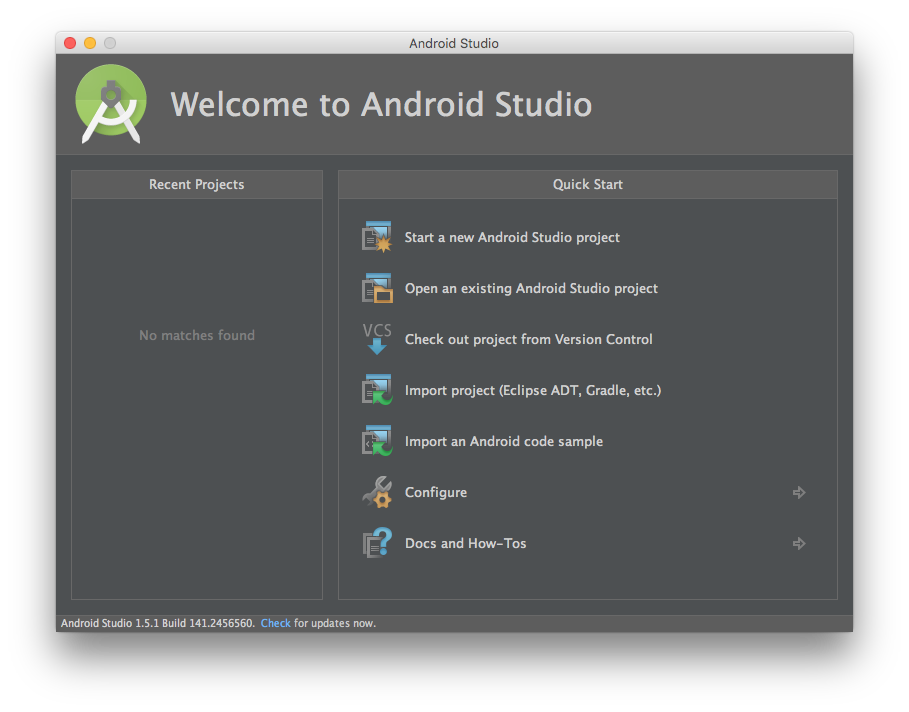

<!-- NLS_CHARSET=UTF-8 -->
## 概述
{: #overview }
本教程说明了开发人员开发和测试 Android 应用程序所需执行的步骤。 这些步骤包括安装 Android Studio 和设置 Android SDK。

**先决条件：**设置 iOS 开发环境时，请确保您还阅读了[设置 {{ site.data.keys.product_adj }} 开发环境](../mobilefirst/)教程。

#### 支持级别
{: #support-level }
{{ site.data.keys.product_adj }} SDK 与 Android 版的 Ice Cream Sandwich（API 级别 14）及更高版本兼容。

### Android Studio
按照 [Android Developers Web 站点](http://developer.android.com/develop/index.html)中提供的步骤来下载和安装 Android Studio。

### Android SDK
Android SDK 提供了一些工具和 API，这些工具和 API 可用于通过 Java 编程语言在 Android 平台上开发应用程序。

在打开 Android Studio 后，您就可以使用 SDK Manager 来配置 Android SDK。

在 SDK Manager 中，您可以安装必需的软件包。有关更多信息，请[访问 Android Developers Web 站点](http://developer.android.com/sdk/index.html)。

#### Android 虚拟设备
{: #android-virtual-devices }
您可以使用 AVD 来测试应用程序。有关所有可用选项的详细说明，请参阅 Android Developers Web 站点中的[“管理虚拟设备”文档主题](http://developer.android.com/tools/devices/index.html)。

## 后续操作
{: #whats-next }
现在，您已经设置了 {{ site.data.keys.product_adj }} 和 Android 开发环境，接下来，您将转至[快速入门](../../../quick-start/android/)类别来体验 {{ site.data.keys.product_adj }}，或转至[全部教程](../../../all-tutorials)来了解 {{ site.data.keys.product_adj }} 开发的特定方面。
